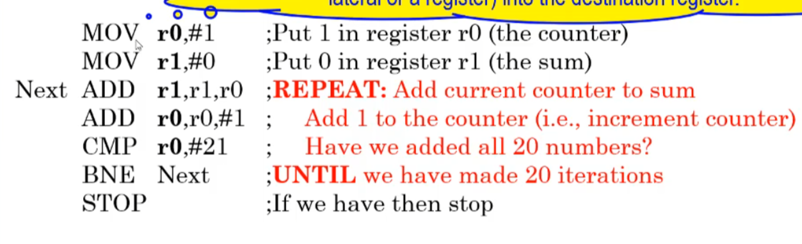
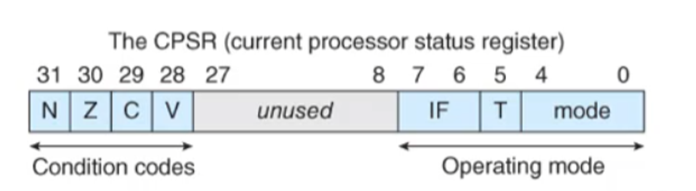

# Assembly

# What is an instruction?

To explain this, let’s assume we have a very simple stored program computer that we will perform instructions on


The format of instructions defines their anatomy, which consists of

- The number of operands
- The number of bits that define each operation
- The format of each operand

For example, here’s some hypothetical instructions (with result destinations in bold)

LDR **r1**,1234 (load memory address 1234 in register 1)
STR r3,**2000** (store register 3 into memory address 2000)
ADD **r1**,r2,r3 (add r2 and r3 and store in r1)
SUB **r3**,r3,r1 (subtract r1 from r3 and store in r3)

To execute instructions, the computer will go through a two-stage process

1. Fetch (read from memory and decode)
2. Execute (interpret and execute by the CPU’s logic)

The program counter then points to the next instruction, where the process repeats ad nauseum

- Modern computers overlap these two processes through a process called **pipelining**

The program counter (PC) is a type of register, along with the...

- instruction register (IR / stores the current instruction)
- memory aggress register (MAR / stores the address currently being used)
- memory bigger register (MBR / stores data that was just read)
- general purpose registers (r0,r1,...,ri / i is typically 8, 16 or 32)

To make this a little more clear, here’s an example of a hypothetical computer


Sometimes (like ADD), the operands will be read from the register before being transferred to the ALU and then sent back to the destination register (this is called a register-to-register operation)

Other times, we need to access the MAR to read/write to memory, but how do we deal with the conflict with the PC?

We do this through a multiplex, which acts like a traffic light for the signal

As an example, let’s cover the execution process in RTL:

Fetch

[MAR] ← [PC]

[PC] ← [PC] + 4

[MBR] ← [[MAR]]

[IR] ← [MAR]

Execute LDR

[MAR] ← [IR(address)]

[MBR] ← [[MAR]]

[r1] ← [MBR]

How do we do flow control? We just have to modify the incrementor’s path

Before the incrementor can increment the PC, we have the CU check it to make sure it doesn’t have to be changed

We also have some status bits stored in the condition code register (CCR) after an operation is performed, going as follows


On RISC processors like ARM, we have to manually request status flags to be updated, while they are automatically updated on newer CISC processors

- We do this in Assembly by adding an S to the operation (ex. SUBS)

## Assembly

We’ve seen Assembly instructions before, but let’s look at them again

For whitespace (space or tab), we need at least 1 after the operation name, but all other whitespace is up to the programmer

- Ex. LDR **r0**,address

To branch (do a conditional) we can use BPL

- Ex. BPL target (if the previous instruction was plus (positive or zero), we branch to the instruction at address target)
- Use BEQ if you want the result to be 0 and B to branch unconditionally (use this as an else statement)

Let’s look at a more complex example

```c
SUBS r5,r5,#1 ;Subtract 1 from r5 and store in r5
BEQ onZero ;IF zero THEN go to onZero
notZero ADD r1,r2,r3 ;ELSE continue
...
onZero SUB r1,r2,r3 ;Here's where the branch ends up if SUBS gave 0
```

We can also define variables to do something like this

$$
P \geq Q \rightarrow X=P+5 \\ ELSE \rightarrow X=P+20
$$

First, we need to define these variables, which we can do with DCD

```c
P DCD 12 ;This reserves a space in memory for the decimal number 12 and labels it P
Q DCD 9 ;This does the same thing but for Q and 9
X DCD 0 ;The memory locations are 36, 40 and 44 (we'll learn how we got this later)
```

Then we can do our ARM magic

```c
LDR r0,P ;Load P into r0
LDR r1,Q ;We do this so that we can do arithmetic on the number
SUBS r2,r0,r1 ;It's easier to check if P-Q >= 0 since we can just do BPL
BPL THEN ;If P-Q>=0 then execute THEN
ADD r0,r0,#20 ;ELSE add 20 to r0 and store it in r0
B EXIT ;Skip to EXIT
THEN ADD r0,r0,#5 ;Add 5 to r0 and store in r0
EXIT STR r0,X ;Whatever's in r0 is stored in X (which branch we took doesn't matter)
STOP ;Program is done
P DCD 12 ;It sounds weird but we declare variables after our instructions
Q DCD 9
X DCD 0
```

Since we set P to 12 and Q to 9, we can see that P ≥ Q, so P-Q≥0

In this case, we go to the branch and skip to THEN, where we execute X=P+5 and halt (B EXIT and ADD 20 are ignored)


This is how we got the address for our vars btw

To do a loop, we can just branch to a previous instruction

Below is an example where we calculate 1+2+3+...+20



- Note that
    - MOV copies the value of operand 2 (register or literal) into operand 1
    - CMP compares the values of operand 2 and operand 1, updating the condition flags but not the result (like subtract but without a value update)
    - BNE branches if the result of the previous isn’t zero (branching checks the status flags, not the actual value)

## More on Registers

Registers usually have the same width as the word of the computer (if the word is 32 bits, the registers will be 32 bits as well)

- ARM processors usually have two special purpose registers and a lot of general purpose registers

Let’s say you have 32 bits and you don’t use all of them (ex. 16 bits of data); where do the rest of the bits go?

This depends entirely on the processor, which might

- leave them unchanged
- set them to 0
- sign-extend the halfword to 32 bits (two’s complement)

Something to note is that if you want to do data processing on ARM processors, you have to put the data in registers first

- There are ways around this (ex. pseudo instructions, which we cover later)
- This isn’t the case for CISC processors, which can do processing on memory addresses

In CISC, processors usually have two-address instructions (one memory and one register)

RISC on the other hand has three-address instructions where all three operands are register (this doesn’t include LDR and STR, which are special cases)

- Ex. ADD r1,r2,r3

## Addressing Modes

There are three fundamental addressing modes

- Literal (i.e. the actual value)
- Direction (give the memory address itself)
    - Note that this isn’t directly supported in ARM
- Register indirect (register contains the address of the operand)
    - AKA pointer based or indexed
    - This is similar to pointers in C

## ARM Assembly

For ARM processors specifically, the registers are 32-bits and there’s 16 of them r0-r15

- r0-r12 are general purpose
- r13 is reserved as a stack pointer by the programmer (it isn’t necessary, it’s just convention)
- r14 is the link register which holds subroutine return addresses
- r15 is the program counter

Because there’s 16 registers, we require a 4-bit address for each in the instruction before its decoded

The ARM also has a current program status register (CPSR) which has

- The condition codes (N for negative, Z for zero, C for carry and V for overflow) in bits 31-28
- Operating mode in bits 0-7 (more on that later...maybe)



They also have a large instruction set including the following


Generally, instructions in ARM go by the following

```c
{label} op-code operand1,operand2,operand3 {;comment}
```

Below is an example of an ARM assembly program fragment


And here’s another example which generates the sum of the cubes of numbers


- MLA means multiply and accumulate (multiply r2 by r1, add r0 and store in r0)

Note that these are fragments and not full programs since we need to specify the environment first

- The setup is called assembler directives while the fragments are executable instructions


###  Program Structure

We mentioned before that we need ARM directives and instructions in order to make a full program, but what do these directives look like?

To start, let’s look at an example from last week


These include

- AREA (names a region of code (ex. Cubes))
- ENTRY (determines the start point)
- END (ends the program)
- name EQU value (equate a name to a value)
- {label} DCD v, expr {, v, expr} (create a 32-bit constant in memory starting at a multiple of 4 address location)
- {label} DCW v, expr {, v, expr} (create a 16-bit constant in memory starting at an even address location)
- {label} DCB v, expr {, v, expr} (create an 8-bit constant in memory starting anywhere)
- {label} SPACE size expr (reserves a zeroed block in memory)
- ALIGN (ensures the next data item is correctly aligned on 32-bit boundaries i.e. multiple of 4)
    - Useful for DCD

The DCD, DCW and DCB directives tell the assembler to

- Reserve one or more blocks of appropriate size in memory
- Load whatever value(s) to the right of the directives into these locations
- Advance the location-counter by one of four, two or one bytes, respectively
    - This is a variable inside the assembler itself to keep track of memory locations during the program; it’s not a register like the program counter
    - ALIGN moves the location counter manually to ensure 32-bit alignment

Below is an example of these directives in action


- Note that the greyed out lines are how you stop your program on the ARM processor, but in the simulator we do an infinite loop instead like so

```c
loop b loop
```

There’s also synonyms here, so let’s look at them

- & in the op-code is for DCD
    - Not to be confused with & in front of a constant, which signifies a hex code like 0x
- = in the op-code means DCB

In the disassembly, these directives look like gibberish at first, so let’s look at it


Everything in the orange block is the memory locations used in the directives

- We store 0x12345678, so that’s the first word
- We then store 25 in decimal, which is 0x19 in hex as we can see on the second line
- After that, we store ‘A’ which is 0x41 in hex as we can see next to 19
- This keeps going after that as well, which will be left below


### Pseudo Instructions

We mentioned pseudos before, but what exactly are they?

Pseudos are operations for which there are no direct machine language equivalent

To execute these, the assembler has tricks it can use instead

For example, you can’t execute MOV r0,#0x12345678 to load r0 with 0x12345678 since the instructions are only 32-bits long

As an alternative, we can use LDR r0, = 0x12345678 as our pseudo instead

With this, the assembler

- Stores the constant 0x12345678 in the literal pool (aka constant pool) somewhere in memory after the program
- Generates code to load the constant into r0

Another example is ADR r0,label (address to register) which loads the 32-bit address of the line ‘label’ into r0

Below is an example of ADR in action


All of the pseudo translation is done automatically by the assembler, utilizing program counter relative addressing

### Relative Addressing

Relatives addressing allows us to specify the location of an operand with respect to a register value

- Ex. LDR r0,[r1,#16] (the operand is 16 bytes onward from the address stored in r1

The cool part comes in when we use r15 (PC) in the relative addressing)

- Ex. LDR r0,[PC,#16] (operand is 16 bytes onward from the address stored in the PC)

In most cases the ARM’s PC is 8 bytes from the current instruction to be executed due to pipelining (where the next instruction is fetched before the current one has been executed)

- Note that this is relative to the program counter, so the program’s location in memory doesn’t impact anything

To go more in-depth into how this works, let’s look at this in action in a real program


The top right shows how we calculate the offsets (goal address - address of the current instruction + 0x08 for pipelining = offset)

- Note that we add PC and the offset in ADR translations instead of loading through relative addressing
- Note that the difference between LDR r4,P3 and ADR r4,P3 is that LDR loads the value while ADR stores the address
    - LDR r4, = P3 will do the same thing as ADR r4,P3, only it will be implemented by storing the address in the literal pool and loading it through relative addressing

## Data-Processing Instructions

Each instruction listed here will have a version ending in S, which will update the status flags (remember what we have to do this to update status flags because it’s not automatic)

We’ve covered a few of these already so let’s go over the ones we haven’t

### Add

ADC performs a 32-bit ADD while also added the carry-over, which is useful for adding 64-bit numbers

We can do so using a double-precision strategy, like so


- Note that r1 and r0 make up one 64-bit number together, along with r3 and r2

### Subtract

RSB is the same as SUB, except that RSB reverses the two operands

- SUB r1,r2,r3 ;[r1]←[r2]-[r3]
RSB r1,r2,r3 ;[r1]←[r3]-[r2]

This is useful when you want to subtract a register value from a constant, since you can’t list constants first

- SUB r1,#10,r2 is wrong, but RSB r1,r2,#10 is right
- Note that RSB r1,#5 means the same thing as RSB r1,r1,#5
    - The same applies to ADD r1,#5 but for ADD

### Negation

Negation subtracts a number from zero, which has the effect of making it negative by two’s complement

ARM doesn’t give this as a instruction, rather as a pseudo called NEG

- NEG r1,r2 often gets translated as RSB r1,r2,#0
- NEG r1,r1 can also mean RSB r1,r1,#0 or just RSB r1,#0

### Move

We’ve covered MOV already, but we also have MVN, which flips the bits of the source operand before storing it in the register

- Ex. if r1 = 0x00000000, MVN r0,r1 turns r0 into 0xFFFFFFFF

### Multiply

The multiply instruction MUL Rd,Rm,Rs 

- Takes the 32-bit signed numbers Rm and Rs
- Forms their 64 bit product
- Stores the lower-order (aka right-most) 32 bits of the 64 bit product (i.e. truncates it) into Rd

Note that Rd can’t be the same as Rm because of how ARM implements MUL

- It also doesn’t allow for multiplying by constants

MLA exists as well, but we’ve already covered that

With MLA, we can also find dot products of vectors


- We’ll talk about the cyan parts later
- Vector1 is 4 words, one for each value (multiple operands means multiple words stored)

We have multiplication for other types of numbers as well

- UMLL unsigned long MUL (Rm x Rd gives a 64-bit product in two registers)
- UMLAL unsigned long MLA
- SMULL signed long MUL
- SMLAL signed long MLA

Note that ARM does not have division, but that can be implemented by the programmer if they wish

### Bitwise

These will just be listed off since they’re self-explanatory


- The long list of ones on MVN is because they’re taken out of 11001010 for representation purposes; they’re still there

We can use these bitwise operations for more complicated bit manipulations as well


### Compare

We’ve covered CMP already, but we have other compare instructions that we can use as well


### Shifts

Shifts move bites one or more places to the right or left, with its replacement depending on the instruction used


These shift can either be static (determined by a number representing the number of bits to shift by) or dynamic


Dynamic shifts can be any one of the following


- These means that you left shift r3 by r2 bits (if r2=#5, you left shift 5 or multiply by 2^5)

The following shifts are in ARM itself


- Note that ASL is the same as LSL, so it’s trivial
- ROL by n bits is the same as ROR by 32-n bits
- Rotate left through carry can be done with ADCS r0,r0,r0 (add r0 to r0 with carry and set the flags)