# Branching, Decoding and Addressing Modes

## Branching

We’ve covered conditionals already, so let’s go into more depth

In total ARM instructions has 4 bits dedicated to 16 conditions 

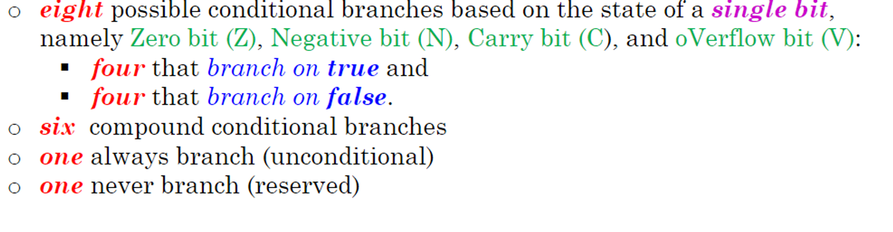

Below is the meaning and encoding of each

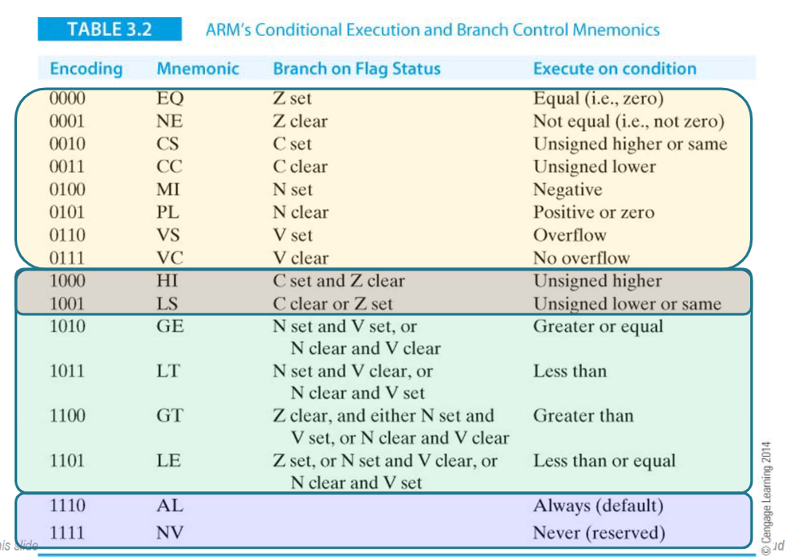

# Decoding

Branch instructions are encoded as such

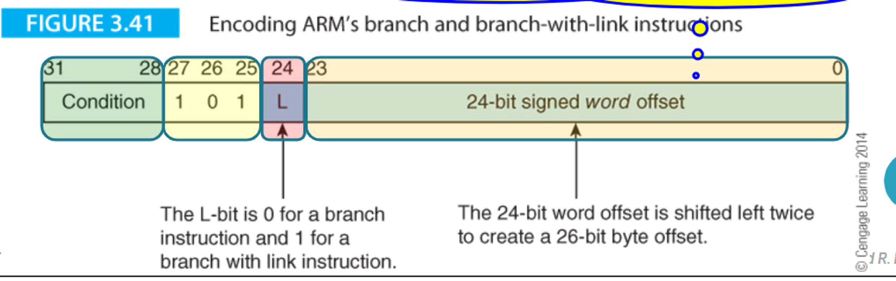

- 101 signified that it’s a branch instruction while the word offset determines how many instructions we want to go forward by
- Negative offsets mean we go backwards

For example, let’s say we want to decode the following instruction (signifying the end of a program)

```java
loop B loop
```

First, since the branch has no condition, bits 28-31 will be 1110

Secondly, since there is no link, we need to set bit 24 to 0

Lastly, let’s look at the word offset; this offset signifies how many instructions we want to move forward by (or backwards with negative numbers)

- Since ARM processors use pipelining to load two instructions ahead, we need to take this into account

Since we want to go back to the same instruction, we want to have an offset of 2

Translating this into two’s compliment, we get 1111 1111 1111 1111 1111 1110

Overall, our instruction is 1110 1010 1111 1111 1111 1111 1111 1110, or 0xEAFFFFFE in hex

For the reverse, let’s look at the instruction 0x1AFFFFFD

Translating into binary gives us 0001 1010 1111 1111 1111 1111 1111 1101, which we can then use for the rest of our encoding

Since bits 27-24 are 1010, we know this is a branching instruction with no link

Bits 31-28 are 0001, so we know the op-code is BNE

The offset is -3, which means we go 1 instruction backwards (taking into account pipelining)

So overall this is a BNE one step backwards, which would look something like this

```java
marker ADDS r1,r1,r2
       BNE marker
```

## Data Processing

For data processing instructions, they go as such

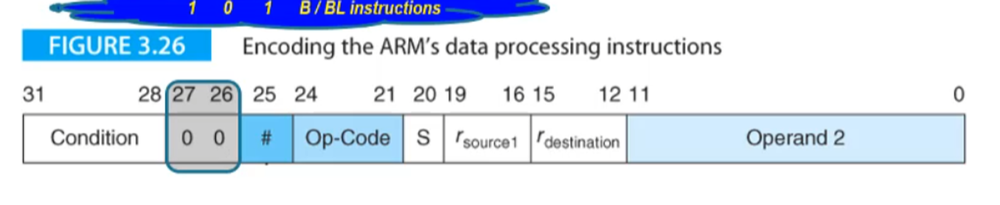

- 00 means that it’s data processing
- Op-Codes are encoded as such

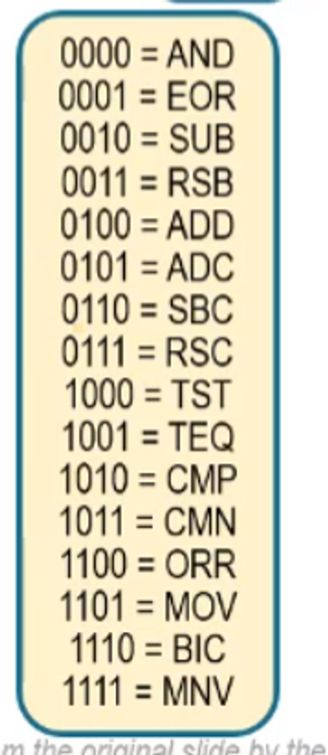

- S is 1 is there’s an S and 0 otherwise
- Source1 and destination are the register numbers encoded in binary (0000 to 1111 for 0 to 15)

For shift operations, we have some extra divisions 

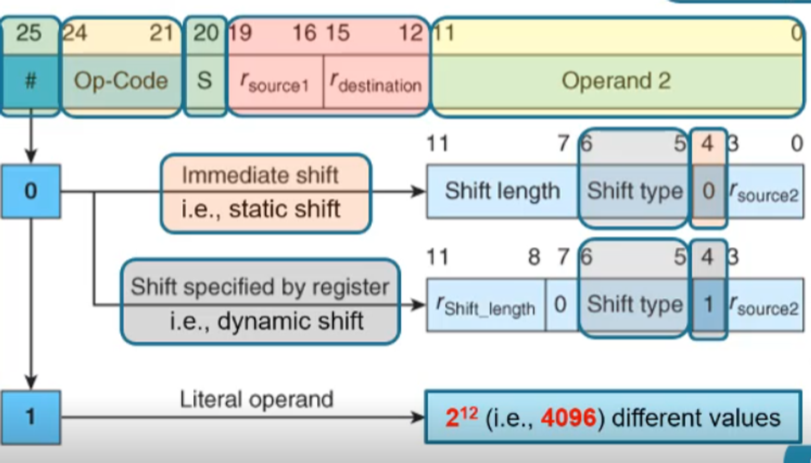

- Bit 25=0 means that it’s a shift operand
    - If this is the case, bit 4=0 means it’s static while 1 means dynamic
- If bit 25=1 it’s a literal

The condition is still here because all instructions can be conditionally executed

For example, let’s encode the following instruction

```java
ADD r0,r1,r2,LSR r3
```

Firstly, the condition is always, so bits 31-28 are 1110

Bit 25 indicates whether source 2 is a shift or a literal (it’s a shift, so we put 0)

- We can also just have a register with no shift by setting the shift length to 0

Bits 24-21 are the op-code, for which ADD is 0100

Bit 20 indicates if there’s an S added to the op-code (there isn’t, so we put 0)

Bits 19-16 and 15-12 are the source 1 and destination registers, respectively, so we get 0001 0000

Bits 11-8 indicate the register that we will take for the shift length (it’s r3, so 0011), while bit 7 will be 0 since it’s a register-specified shift)

Bits 6-5 indicate the shift type (it’s a logical right, for which the code is 01)

Bit 4 will dictate if the shift is register-based (it is, so we put 1)

Finally, bits 3-0 indicate the second source (r2 = 0010)

Putting this all together, we get 1110 0000 1000 0001 0000 0011 0010 0011 (in hex, this is 0xE0A10332)

# Comparisons

For comparison operations (ex. CMP, CMN, TST and TEQ), the destination is always r0 and S is always 1)

Let’s see this in action with an example

```java
CMPGT r3,r5
```

- The condition is GT: 1100
- Data processing instruction: 00
- Shift: 0
- Op-code of CMP: 1010
- Update flags: 1
    - Comparison operations have flags by default, so S is always 1
- Source 1 is r3: 0011
- Destination: 0000
    - There’s no destination
- Shift length of 0: 00000
- Shift type default (default is LSL): 00
- Immediate shift (this is the default): 0
- Source 2 is r5: 0101

In total, the instruction in binary is 1100 0001 0101 0011 0000 0000 0000 0101 (or 0xC1530005)

# Moving

For MOV and MVN, source 1 is always 0

For example, let’s look at the following instruction

```java
MOV PC,LR
```

- Unconditional: 1110
- Data-processing: 00
- Op2 is a register: 0
- Op-code is MOV: 1101
- Not MOVS: 0
- No source 1: 0000
    - This is always the case for MOV and MVN
- Destination of PC aka r15: 1111
- No actual shift: 00000 for shift length, 00 for shift type and 0 for static/dynamic
- Source 2 is LR aka link register aka r14: 1110

Overall, the instruction is 1110 0001 1010 0000 1111 0000 0000 1110 (or 0xE1A0F00E in hex)

## Handling Literals

Bits 11-0 can also be a literal, with bits 11-8 being an alignment representing half the desired rotations right and 7-0 being an 8-bit literal

For example, let’s look at the encoded operand 1110 1111 1111

- 1110 = 14, 14x2 = 28, so we want 28 shifts right (aka 4 shifts left)
- 1111 1111 = 0xFF

So in total, the operand would be 1111 1111 0000, or 0xFF0 in hex

- Note that this has the limitation of not being able to represent numbers for which the distance between the furthest two 1s is greater than 8, inclusive and counting bit 0 to bit 31 as one bit (ex. there’s no way to represent 0xFFF)

## Addressing Modes

There are three addressing modes that we already know for getting info into registers:

1. Literal (ex. [r0] ← [r1] + 2)
2. Direct from memory, which isn’t supported by ARM (ex. [r0] ← [Mem])
3. Register indirect, or loading a register with the content of a location in memory pointed to by another (ex. [r0] ← [[r1]] or LDR r0,[r1] in ARM assembly)

Since direct is impossible in ARM, register indirect with LDR and STR is the only way to actually access memory in ARM programs

The register with the address is indicated by square brackets, as seen in LDR r0,[r1]

We can use this for data structures such as arrays, which makes it vital for ARM programs

But how do we go backwards/forwards in an array like this? What we can do is subtract/add the register by 4 (i.e. one word), respectively

- Ex. ADD r0,r0,#4

We can also do these types of offsets inside the brackets itself, like in the case of LDR r0,[r1,#4], which grabs the element one location ahead of what’s pointed to by r1

- Note that this does not update the register itself by default
- The offset if a 12-bit literal (0-4095) with its direction determined elsewhere in the instruction

We can see this in action with the following program

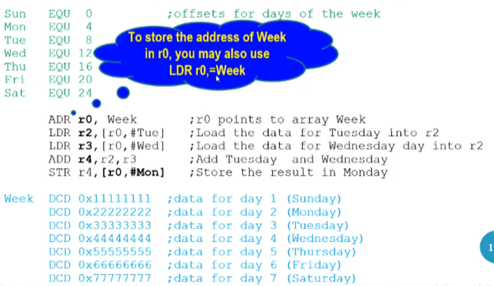

Just like other registers, we can use the program counter (r15) as a pointer register as well

- This is usually used for relative addressing in pseudo-instructions

We can also set dynamic offsets as well, such as in LDR r0,[r1,r2]

- This implies that we can do shifted offsets, such as in LDR r0,[r1,r2,LSL#2]

Something else useful we can do is automatically update the pointer itself, either by updating and then using (++r0) or using and then updating (r0++)

- The equivalent of (++r0) is an exclamation mark, such as LDR r0,[r1,#8]!
- The equivalent of (r0++) is having the offset outside the square brackets, such as LDR r0,[r1],#8


To summerize:

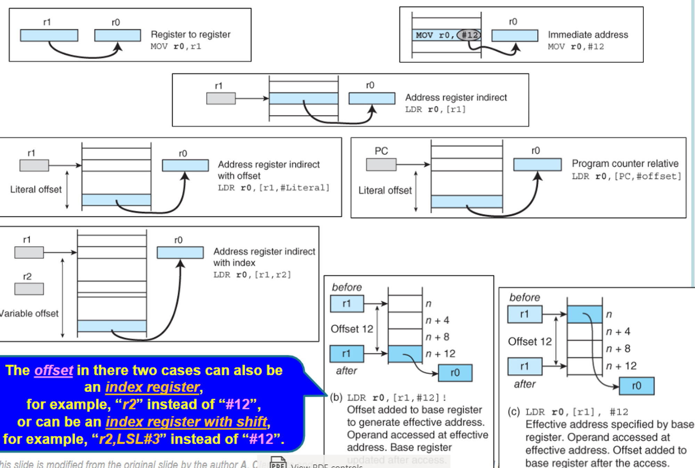


## LDR/STR and Stacks

# LDR/STR

So far, we’ve covered how to encode every instruction except for LDR and STR

The basic format goes at so

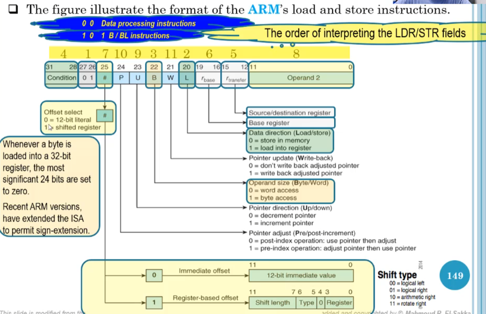

- Note that the 12-bit immediate value is a true unsigned 12-bit literal (0-4096), NOT an 8 bit literal w/ rotation
- When P=0, W is redundant and is always 0

As an example, let’s try to encode 0x57224106

- 0x57224106 = 2_0101 0111 0010 0010 0100 0001 0000 0110
- Bits 31-28 indicate PL (positive or 0)
- Bits 27-26 are 01, indicating a load/store instruction
- Bit 25 is 1, meaning we have a register-based offset
- Bit 24 is 1, meaning we have a pre-index operation
- Bit 23 is 0, meaning we decrement the pointer (i.e. -r6 instead of r6)
- Bit 22 is 0, meaning we want word access (STR and not STRB)
- Bit 21 is 1, meaning we want to write back the pointer
- Bit 20 is 0, meaning we have a store function
- Bits 19-16 are the base register (aka the register storing the pointer to the location in memory), 0010 = r2
- Bits 15-12 are the source/destination register, 0100 = r4
- Bits 11-7 are the shift length, which is 00010 = 2
- Bits 6-5 are the shift type, 00 = LSL
- Bit 4 is always 0 in this case
- Bits 3-0 are the register storing the offset, 0110 = r6

Compiling all this together, we get the following

```java
STRPL r4,[r2,-r6,LSL#2]!
```

For an encoding example, let’s look at the following instruction

```java
STRGT r1,[r2,#-0xFFF]
```

- The condition is GT: 1100
- This is a load/store instruction: 01
- We have an immediate offset: 0
- The pointer is adjusted before use: 1
- We decrement the pointer: 0
- We want word access: 0
- We don’t write back the pointer: 0
- We are using STR: 0
- Base register r2: 0010
- Source register r1: 0001
- Immediate offset 0xFFF: 1111 1111 1111

Overall, we get 1100 0101 0000 0010 0001 1111 1111 1111 (or 0xC5021FFF in hex)

# Stacks

Knowing these load and store instructions, we can not only implement arrays but stacks as well

As a refresher, stacks are a last in first out (LIFO) data structure in which items enter at one end and leave from the same end in reverse order

This type of data structure requires something called a stack pointer, which keeps track of the top of the stack and updates according to changes (moving forward on a push and backward on a pop)

There are four ways of forming a stack

1. Growing up and pointing to the top of the stack (TOS)
    
    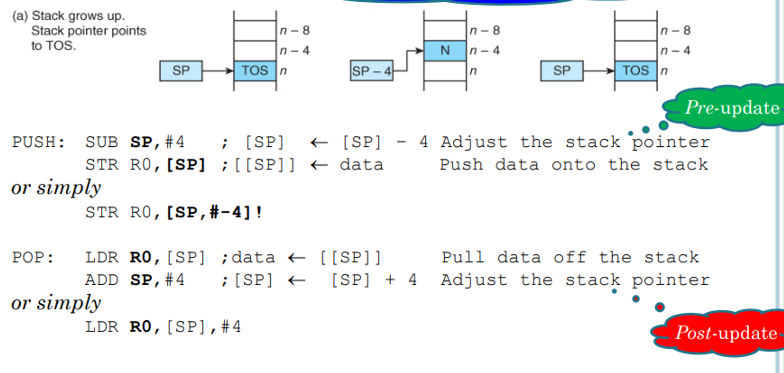
    
2. Growing up and pointing one word above the TOS
    
    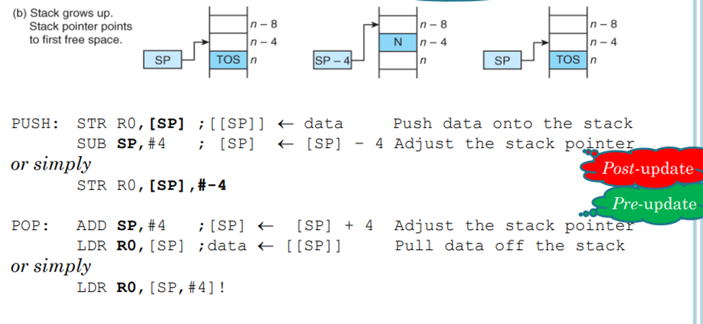
    
3. Growing down and pointing to the TOS
    
    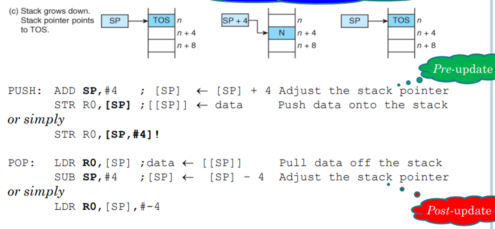
    
4. Growing down and pointing one word below TOS
    
    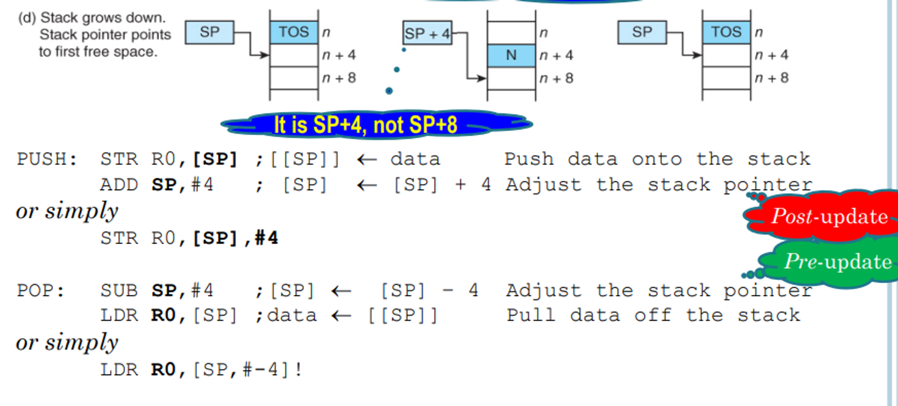
    
- CISC processors maintain this automatically, but on RISC ones such as ARM we have to maintain them ourselves

## Block Moves and Subroutines

# Block Moves

The last instructions we will cover are the block move instructions, LDM and STM

Assume we want to load a set of consecutive words from memory

Normally, we would have to add each word separately like so

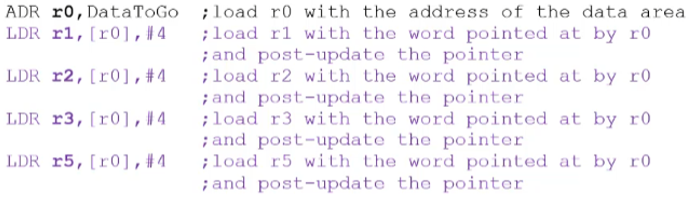

But with block move, we can combine all 4 instructions into 1

To make this easier to understand, you can think of STM as pushing a group of register content to memory and LDM as popping values from memory and loading them into register

For example, assume you have instructions like this

```java
ADR r0,DataToGo
STMIA r0!,{r1-r3,r5}
```

Starting at the address pointed to by r0, the STM instruction will load words in order into the register r1, r2, r3 and r5

Note that the ! is important since it tells the computer to update r0

- This does not mean pre-update necessarily, it just means update

The two letters beside STM will tell you how the pointer will update

- IA = Increment After
- IB = Increment Before
- DA = Decrement After
- DB = Decrement Before

Usually for a stack we will have to leave some amount of space, which we can do pretty easily using SPACE

```java
LDR r1,=0x11111111
LDR r1,=0x22222222
LDR r1,=0x33333333
LDR r1,=0x55555555
ADR r0,Stack
STMIA r0!,{r1-r3,r5}
Loop B Loop
SPACE 20 ;on exams we will be given both spaces, which one to use is up to you
Stack SPACE 20 ;we make space for each word needed + one buffer word = 16 + 4 = 20
```

Since these block move instructions implement stacks, we have special addons to simulate each type of stack

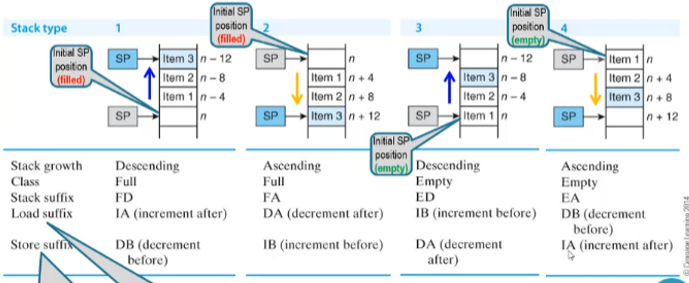

- Note that these are pseudo notations, they are translated into IA, IB, DA and DB in the assembler

Note that block move ≠ stack application, they just provide a means of moving memory content more efficiently

For example, if we want to move 256 words from one table to another in memory, we would have to load the memory into registers and load it back into memory at the specified location

Block move instructions can’t do all 256 words at the same time, but they can make the process much faster

```java
ADR r0,Table1
ADR r1,Table2
MOV r2,#32
Loop LDMFD r0!,{r3-r10}
STMFD r1!,{r3-r10}
SUBS r2,r2,#1
BNE Loop
```

## Encoding/Decoding

Encoding/decoding in block move works much like memory move, except the destination and second operand are replaced with a register list

The register list of each register, with its corresponding bit being 1 is the corresponding register is included in the range

- Note that S (bit 22) will always be 0 for the purposes of this class, so don’t worry about it

For an example, let’s look at the following instruction

```java
STMFD r13!,{r0-r4,r10}
```

- The condition is always, so we put 1110
- This is a block move, so the next three bits are 100
- Since this is a full descending stack, we need to decrement the pointer before storing in the stack (DB), so the next bit will be 1 to indicate pre operation
- The next bit will be 0 since we’re decrementing
- The next bit is 0 (this will always be 0 for this course)
- The next bit is 1 because we write back the pointer (that’s the purpose of the exclamation mark)
- The next bit is 0 since we’re storing into memory
- The next four bits are r13 = 1101
- The remaining bits signify r0-r4 and r10, making our register list 0000 0100 0001 1111

Overall, the instruction is encoded as 1110 1001 0010 1101 0000 0100 0001 1111 (or 0xE92D041F in hex)

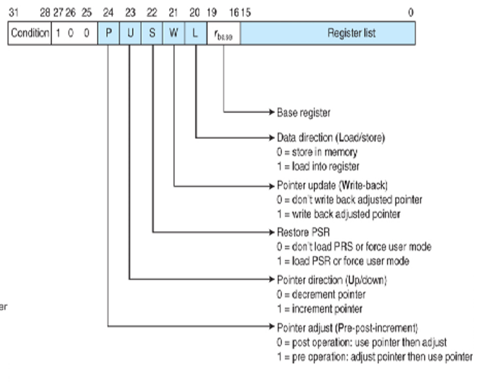

For a decoding instruction, lets look at the instruction 0x08855555

Translating to binary, we get 0000 1000 1000 0101 0101 0101 0101 0101

- The condition is 0000, making it EQ
- We then have 100, signifying a block move instruction
- The next bit is 0, meaning we have a post operation
- The next bit is 1, meaning we increment
    - In total, this is IA
- The next bit is 0 for aforementioned reasons
- The next bit is 0, meaning we don’t write back the adjusted pointer
- The next bit is 0, signifying a store operation (LDM)
- The next four bits are 0101, which mean the base register (r5)
- The register list is 0101 0101 0101 0101, which are r14,r12,r10,r8,r6,r4,r2,r0

Overall, this is the instruction that we get

```java
STMEQIA r5,{r14,r12,r10,r8,r6,r4,r2}
;OR
STMEQEA r5,{r14,r12,r10,r8,r6,r4,r2}
```

# Subroutines

In a program, oftentimes we need to execute some code multiple times throughout

Obviously we can just put in the code multiple times, but this gets messy and complicated fast

Instead of this, we can put the code into a **subroutine**

- Think of these like functions or methods in other languages

To understand subroutines and how they work, we need to understand its characteristics

1. It can be called from anywhere in the program
2. It should return to the instruction directly after the subroutine calling location

How this is done in ARM is that the processor will save the address of the next instruction in a safe place and then load the PC with the address of the first instruction in the subroutine

After the subroutine is complete, we have a return to subroutine instruction (RTS) which will cause the processor to return to the address immediately after the subroutine call

The flow control looks something like this

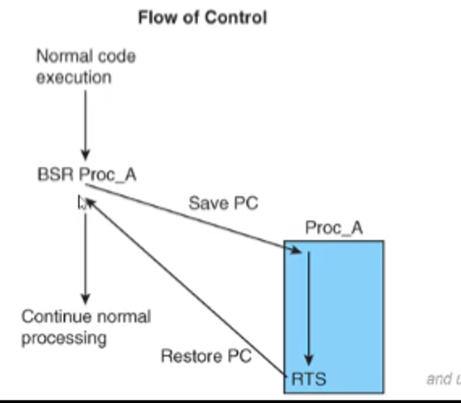

CISC processors have fully automatic subroutine mechanisms, but in ARM it’s a bit more complicated

## Subroutines in ARM

### With BL

ARM’s branch with link instruction (BL) acts as a subroutine call, saving the return address in register r14

For example, let’s say we want to execute a subroutine Sub_A like so

```java
BL Sub_A
```

At the end of Sub_A, we already have the return address in r14, so we can simply move r14 into r15

```java
MOV r15,r14
;OR
MOV pc,lr
```

- ARM will handle the pipelining effect for us, so no need to worry about it

As a reminder of how these are encoded, we just take the old method and make bit 24 1

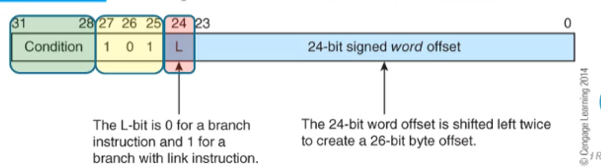

### With Stacks

We can also emulate a CISC processor and push the return address onto the stack before branching to the target address

Once the subroutine is finished, we can then pop the return address from the stack and copy it to the PC

For example, we can do something like this (assuming we have a Full Ascending stack)

```java
...
...
...
STR r15,[r13,#-4]! ;pre-decrement the stack pointer AND
                   ;push the return address on the stack (DB)
B Target           ;NOT BL
...
...
```

Something we have to note is that usually the pipelining effect will have the PC be 8 bytes ahead of the current instruction, **with the exceptions being STR and STM**

STR and STM have a pipelining effect of +12, meaning the PC will be 3 instructions ahead instead of 2

How do we deal with this? Just load the top of the stack and add 4

```java
...
...
LDR r12,[r13],#+4 ;get the PC and post-increment the stack pointer
                  ;r12 is just a general use register
SUB r15,r12,#4    ;fill the PC one instruction back from the return address
```

- Note that we have to load the top of the stack into another register so that we don’t get sent to the wrong address

### Nested Subroutines

The reason why knowing the stack method is important is that it’s the only way to implement nested subroutines

The way you have to handle nested routines is to save the link register in the stack before you call another subroutine

For example, take a look at the following program

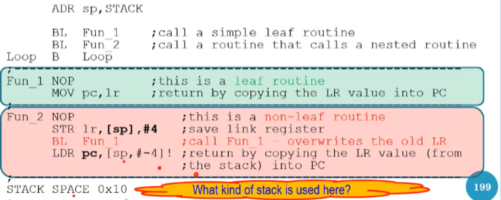

Since we call Fun_1 within Fun_2, we have to push the link register on the stack before we branch with link to Fun_1

From there, since Fun_1 is a leaf routine (a routine with no nested call inside of it), we just have to move the link register into the PC

At the end of Fun_2, we must then pop the original link register and load it into the PC (we don’t have to modify the link register value since pipelining is handled for us in branch with link)

- Keep in mind that you have to leave enough space in the stack to hold every link register you need

### Subroutines and Block Move

Assume that a program uses R1 to store a value, after which the program calls a function and R1 is used again to store a different value

This presents a problem because R1 will be overwritten, which will cause bugs

To avoid this, we should push all registers that will be used onto a stack at the beginning of a function and pop all of them into the same registers before returning from the function

For example:

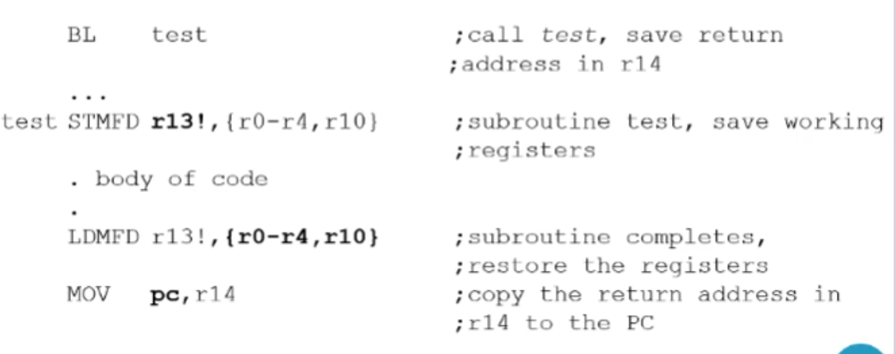

- Note that if we’re using this approach, we can include the program counter and link register as well to save ourselves an instruction
    
    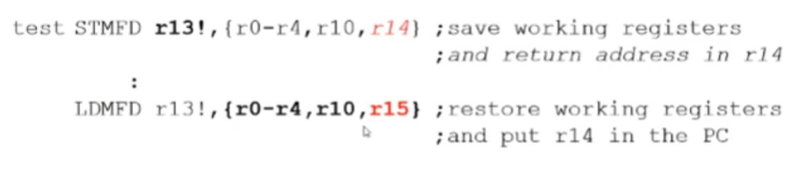