# Computer Architecture


Formally, a computer is characterized by its instruction set architecture, which is an abstract entity (meaning the implementation and design of the computer itself is irrelevant) that defines the computer from a programmer’s POV

This ISA consists of three parts: the register set, instruction set and addressing modes

The ISA is also embodied by Assembly, a programming language at the heart of the computer

## Computer Organization

Since ISA is the abstraction of the computer, the organization is how that ISA is implemented

You can think of the ISA as an initial plan for a building and the organization as the blueprint, so even if the blueprint changes slightly, the idea (ISA) stays the same

- Today, organization is called microarchitecture

Theoretically, architecture and organization are independent

## Computer Structure

The structure of a computer is how the individual components of a computer connect with one another

The computer structure almost always consists of a CPU, which reads and executes command, but some modern computers will also include a cache memory on the CPU chip to speed it up

Below is an example of a computer structure

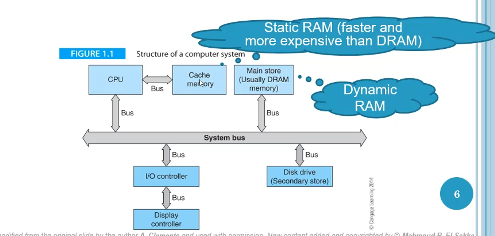 disk drive, DRAM and cache memory

The busses act as roads that move information across components in a sort of data highway system

## Process Register

A process register is a memory element that holds a single unit (word) of data

These registers are specified in the number of bits it holds, which is almost always 2^something

- Nowadays, this is mainly 32 bit and 64 bit

Each processor has a specified number of registers, which only differ from words in memory in their speed, since registers are in the CPU itself

## Computer Type

Two types of computer exists: dedicated and general-purpose

Dedicated computers only solve one problem, such as a dedicated bitcoin mining rig

A general-purpose computer, however, can be programmed to solve any problem, which applies to most home PCs

The main difference comes with being able to change the program of a general-purpose computer, which dedicated computers don’t have

## Programs

Typically, how you’d write a program in Java is you’d do something like this

```java
int z = x + y;
```

However, in Assembly, which the CPU actually uses, this would have to be split up a bit like this

```java
LOAD X
LOAD Y
Z = X + Y
STORE Z
STOP
```

- Note that this isn’t actual Assembly

The start of each of these lines (called events) is dictated by the CPUs clock (a stream of pulses sequencing all operation in a computer)

- This clock makes sure that processes run in sequences

The clock is measured in Hz and also the width of the pulse, which is $1/T$

For example, 1 MHz is 1 microsecond (10^-6) and 1 GHz is 1 nanosecond (10^-9)

Below is an example of what’s happening behind the scenes

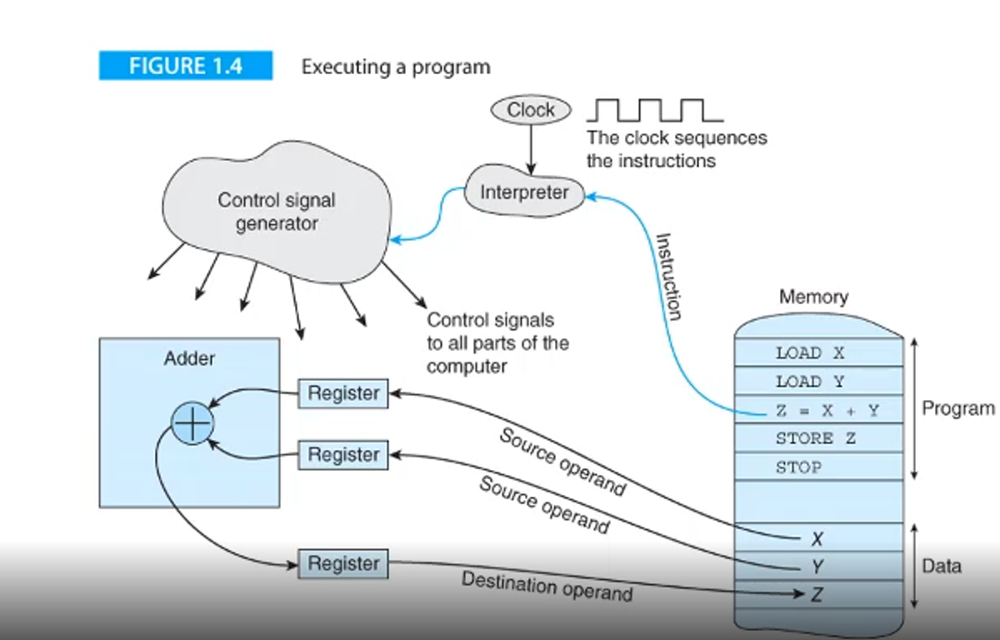 control signal generator

Then, the signal is sent off to the adder, which pulls x and y into the register from memory

Finally, the output z is placed into a register and sent off to z in memory

All in all, this program takes up 8 words in memory, which is important since memory is the bottleneck for any program in this computer structure

### Intro to the Computer

To introduce the computer, we should talk about a problem

This problem is fairly simple; find the longest sequence of consecutive digits in a string, like so

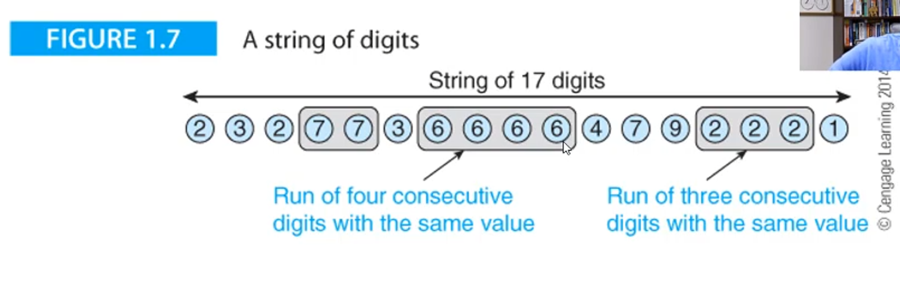 consecutive digits or not in a run of consecutive digits

From here, we will transition between these two states, which we can examine using what’s called a state diagram 

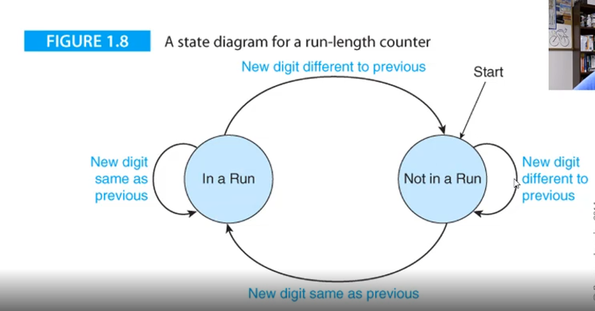 go back to NR for the second, third and fourth digits

At the fifth digit, we recognize that the digit is the same, so we change the state to in a run (R), but then go back to NR by the sixth digit

This process continues until we hit the end of the sequence of strings

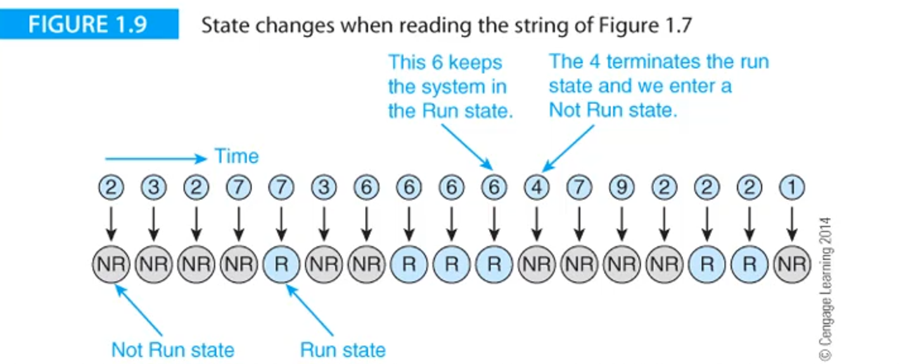

We also need to keep track of which run is the longest, so we’ll do that as well

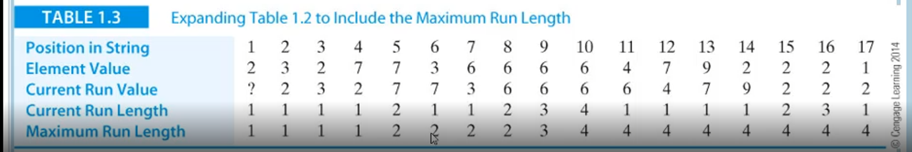

Now that we have an algorithm, we can write it out, first by making some variables

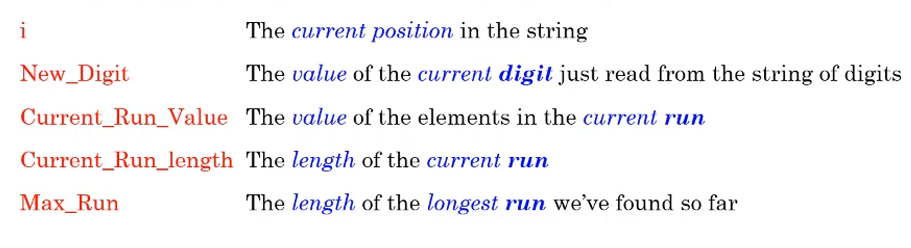

From here we can develop some simple pseudocode to solve the problem

```java
Read the first digit in the string and call it New_Digit
Set the Current_Run_Value to New_Digit
Set the Current_Run_Length to 1
Set the Max_Run to 1
REPEAT
	Read the next digit in the sequence (i.e., read a New_Digit)
	IF its value is the same as Current_Run_Value
		THEN Current_Run_Length = Current_Run_Length + 1
		ELSE {Current_Run_Length = 1
					Current_Run_Value = New_Digit}
	IF Current_Run_Length > Max_Run
		THEN Max_Run = Current_Run_Length
UNTIL The last digit is read
```

From here, we will introduce a flowchart, which is basically a diagram of pseudocode

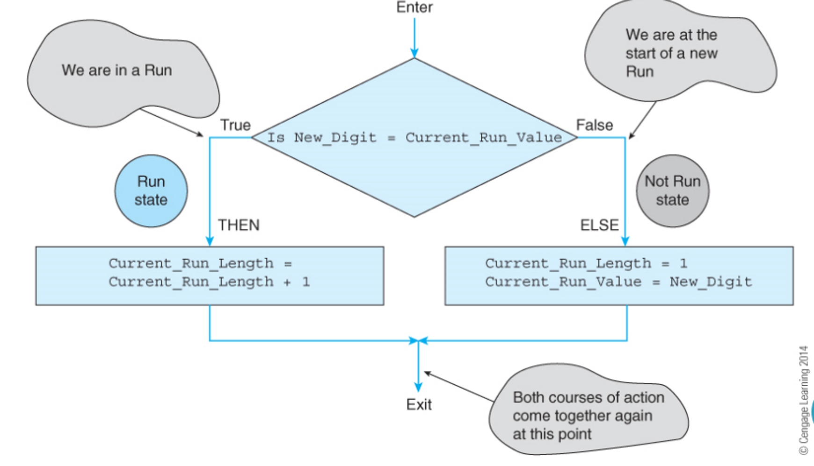

From here, we store everything we need in memory, with all information being turn into machine code (0s and 1s), where the CPU can’t differentiate between a value and an instruction

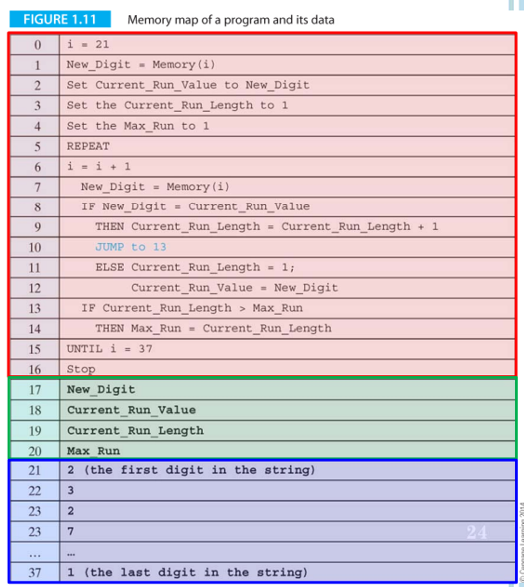

In this program, we have constants (values that don’t change), variables (values that do change) and symbolic names (names given to constants/variables to make them easier to use)

All of these pieces of information have a value and a location in memory, called the address

Now, let’s say we want to increment Max_Run; in this case, we can’t just say Max_Run = Max_Run + 1, because the computer only sees the address, so you’d end up with 20 + 1 = 21

- This distinction becomes important when we talk about pointers (variables with addresses as values)

### Register Transfer Language

Register Transfer Language (RTL) is a way we can deal with these registers in an easy to interpret manner

In this notation, square brackets indicate the contents of a location in memory

- For example, [15] = Max_Run means that the content of memory location 15 is equal to the value of Max_Run, i.e. an initialization

The left arrow ← is a memory transfer

- Ex. [15] ← [15] + 1 means add 1 to the content of memory location 15 and place it in memory location 15

We can use pseudocode to express this fundamental action

```java
Stored_program_machine
	Point to the first instruction in memory
	REPEAT
		Read the instruction at the memory location pointed at
		Point to the next instruction
		Decode the instruction just read from memory
		Execute the instruction
	FOREVER
End
```

For each instruction, we have to read from memory, so it’s best for us to minimize that by using less instructions

We also might need to read and write to memory, so we can expand our pseudocode as such

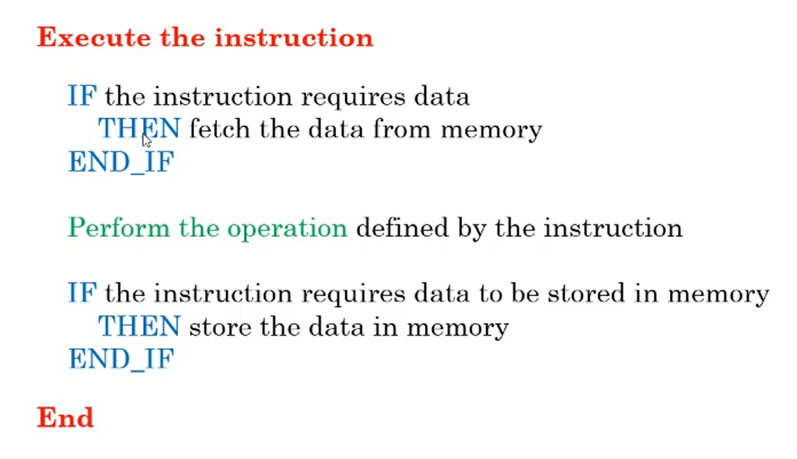

All in all, we have 3 situations of memory access

The address port will give an address and the control port will be either read or write, where memory will either be sent towards or away from memory

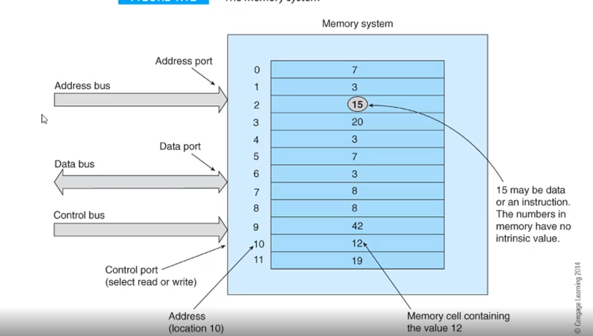

### Assembly

In Assembly, the language used to interact with the memory directly, there is a three-address format

This format goes *Operation **Address1** Address2 Address3*, where Operation is the instruction and the address are locations of the three operands in memory

- In common use, we use bold font to indicate the destination address

For example, ***ADD P**, Q, R* will add Q and R and store it in P

- This can also be done in RTL notation: [***Address1] ←** Operation [Address2] [Address3]*

The command interpretation looks something like this

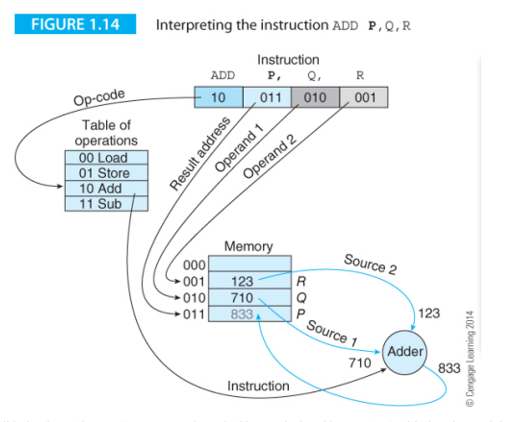

We also have two-address format, *Operation **Address1** Address2*, where address1 is a source and destination

The problem with this, however, is that one of the operands is overwritten, which you might not want, but you also gain the benefit of needing less memory reads

#### Bus

The bus, as we’ve mentioned before, is the highway system connecting all the functional parts of a computer, as well as external peripherals such as keyboards

Without a bus, the connections are all over the place and are hard to manage, while the bus makes the structure orderly in nature

You can also have more than one bus, which will allow for parallel operations since the two busses would be independent

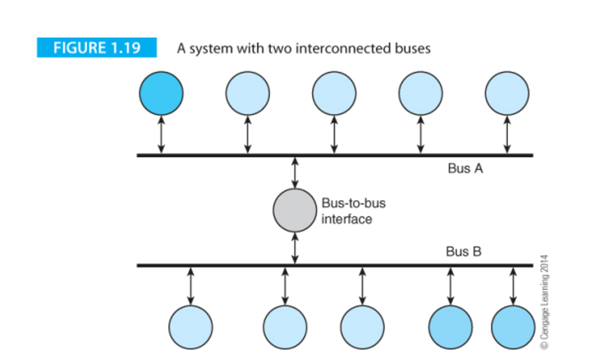

The bus has three ways of being described: the width (number of parallel data paths, ex. 64-bit bus carries 64 bits at once), the bandwidth (rate of information transportation, bytes/second) and the latency (time between data transfer request and data transmission completion)

### Computer Arithmetic

As you may know, computer data is based on bits (0s and 1s) that represent low and high voltage in wires

- Ex. 0010 means 3

A convention we used is calling a unit of 8 bits a byte

Every time you introduce a bit to a sequence, you double the number of possibilities, so 2 bits has 4 values, 3 bits has 8 values, etc.

Binary and decimal notation uses Hindu-Arabic positional notation, meaning an n=digit number N is represented as such

$$
N = a_{n-1}a_{n-2}...a_i...a_1a_0
$$

The value of N in this case would also depend on the base b, so the true value of N would be as follows

$$
N=a_{n-1}b^{n-1} + a_{n-2}b^{n-2} + ... + a_1b^1 + a_0b^0 
$$

Since binary is base 2, we will have b = 2

For example, with the number 0100 in binary, we say $0 + 2^3 + 0 + 0$

But what about fractions? In that case, we can extend our definition by saying there’s n digits to the left of the radix point (a.k.a. decimal point) and m digits to the left

From there, we can expand our general definition

$$
N = a_{n-1}a_{n-2}...a_1a_0a_{-1}...a_{-m}
$$

Representing the true value goes the same way

This approach gives a good approximation, but it can lead to problems converting between bases, which are referred to as floating point errors

#### Operations

Basic operations in base 2 work similarly to the way they do in base 10

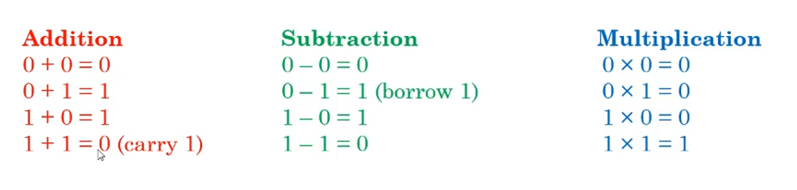

This makes adding larger numbers easy too, since you just use the same elementary school methods

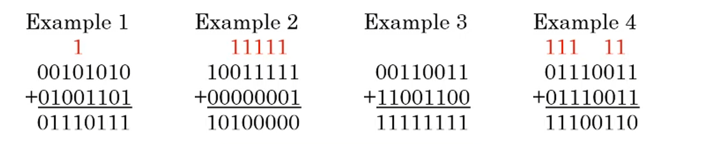

- Same logic applies to subtraction and multiplication, just do what you did in elementary school

The slight difference comes from multiplication, where we add partial products onto the final product as we go to save on memory

- Division is a little more complicated, but we will get into that later

#### Describers

With numbers, we have some ways of describing them

Range is the variation between the largest and the smallest value (for 8 bits, this would be 0-255)

Precision is a measure of how precise we can represent a number (pi can’t be represented in full in a finite space, so we can use a number of significant figures to represent it)

Accuracy is the difference between the representation and its actual value (if you say you’re 6’0 (183cm) when you’re actually 5’7 (170cm), this is an error of 5 inches (13cm))

- Note that this is different from accuracy

This is good and all, but how do we actually interpret these? Well, that would entirely depend on what the data is

## ASCII

If the data is characters, we can use ASCII (American Standard Code for Information Interchange) which represents 128 characters from both the Latin alphabets and Arabic numeral system, as well as special characters like NULL

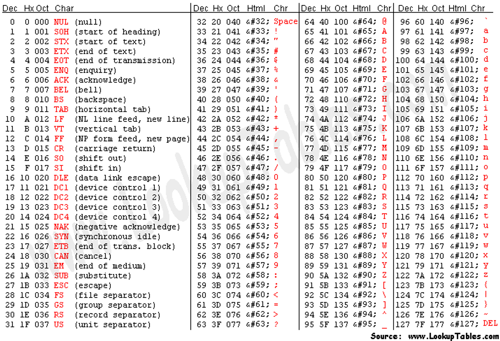

- There’s also UTF-8 and other standards for more complicated characters, but this is outside the scope of this course

This table also includes hex (hexadecimal) values, which is base 16 and is represented as 0-F

This behaves the same way as base-2 and base-10 as previously described

### Flow Control and Encoding

## Encoding of Branch Instructions

Branch instructions, like other instructions, are stored in a 32 bit address with the following division

- Bits 31-28 are the branch condition
- 27-25 are 101 in that order
- 24 is the L-bit which determines link (0 for a regular branch and 1 for a branch w/ link)
- The rest are a signed word offset (converted to a real byte address by left shifting twice)