# Stack Frame and Passing Parameters

# Stack Frames

Normally in a function we will have a **local space** for temporary variables within the function which are private to the rest of the program

These variables are never accessed outside the function and are destroyed after the function is complete

- If the function is recursive, this locality is to be confined to each call of the function as well

Conversely, variables also have **scopes** for which they can be global or local

- Global variables are created at compile time and are statically allocated
- Local variables are created at runtime and are dynamically allocated

We’ve covered static memory allocation, but how do we do dynamic allocation in ARM?

Usually, when a function is called, there is an activation record created alongside it, which includes the parameters, local variables, return address and a link to other records

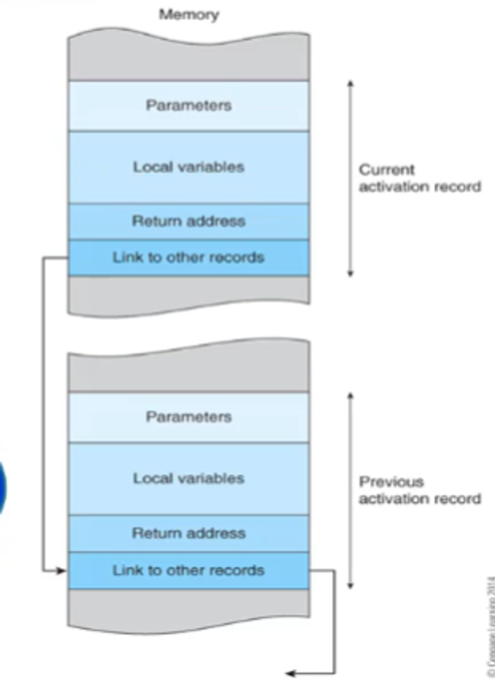

- These records are also called **stack frames**

## Handling in ARM

After we use each activation record, it must be deallocated, which is our responsibility in ARM (In CISC, this is taken care of for us)

Since we know about stacks already, we can use those to implement dynamic memory allocation

For each stack frame:

- We push it into the stack at the start of the subroutine and
- Pop it from the stack at the end of the subroutine

The best part about this is that we only need two pointers to do this: the **stack pointer (SP) (r13)** and the **frame pointer (FP) (r11)**

- In ARM, we need to maintain both the stack pointer and the frame pointer (this is handled for us in CISC)

For the frame pointer, we will always point at the base of the current stack frame and the stack pointer will always point to the top of the stack

Since the stack pointer can change during execution of the procedure, it’s best practice to access stack frame data from the frame pointer since it’s static throughout the procedure

For example, assume we have an FD stack and we want to store variable XYZ at 12 bytes below the frame pointer

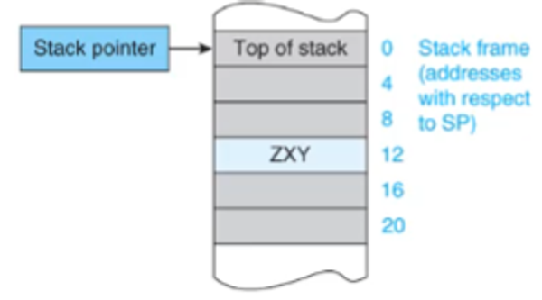

If we add anything to the stack after this, we have to manually recalculate the location of XYZ which is a pain

What we can do instead is have a frame pointer sit at the base of the stack frame

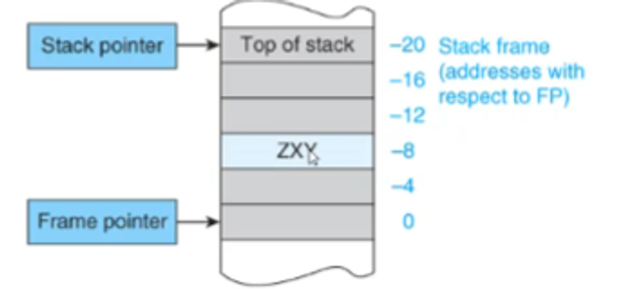

Now when we want XYZ, we know exactly where it is no matter what happens to the stack

To create these stack frame, we must

1. Push the old frame pointer onto the stack
2. Make the frame pointer point to the bottom of the stack frame

In ARM, this looks something like this

1. Move up the stack pointer by d bytes (d being the number of bytes we want to allocate for the routine)

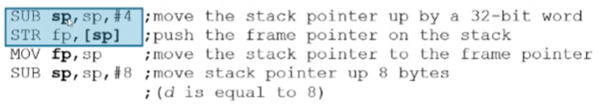

- Note that the highlighted instructions can be optimized with either of the following
    
    ```java
    STR fp, [sp,#-4]!
    STMFD sp!,{fp}
    ```
    

For the collapse, we do something like this

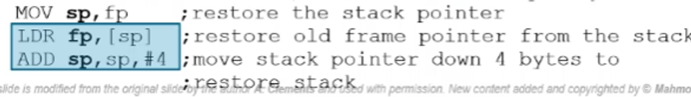

- The highlighted instructions can also be combined with one of the following
    
    ```java
    LDR fp,[sp],#4
    LDMFD sp!,{fp}
    ```
    

Visually, the process looks like this

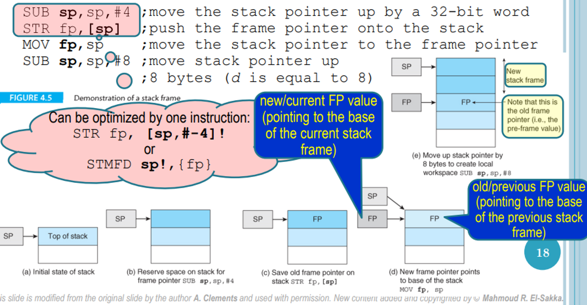

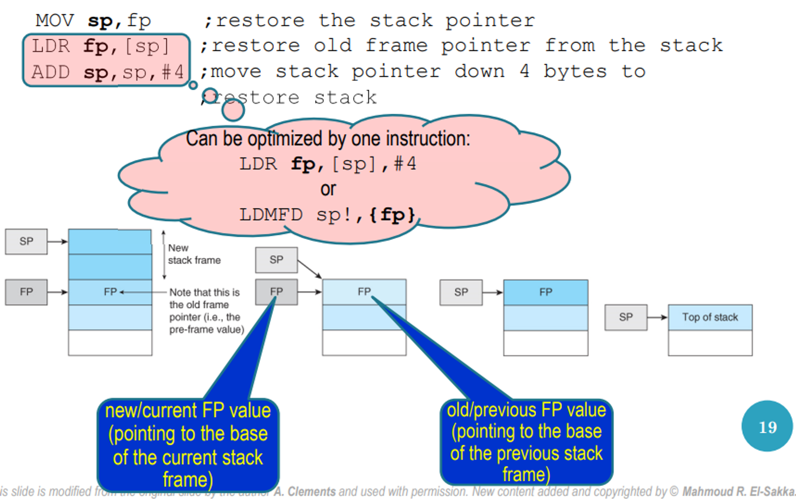

As a review, here’s the entire process of calling a subroutine

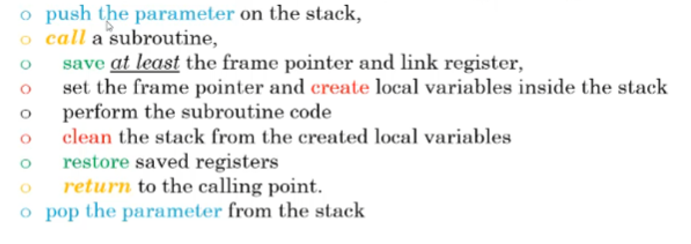

In ARM, it looks something like this

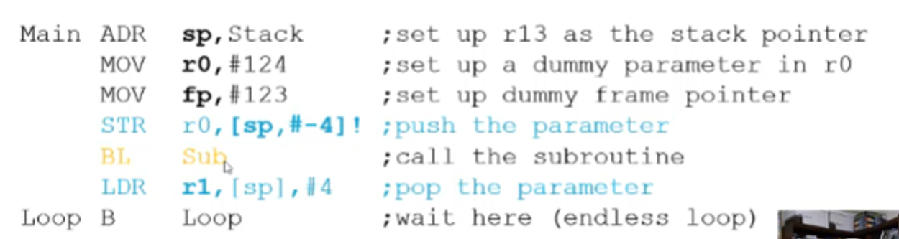

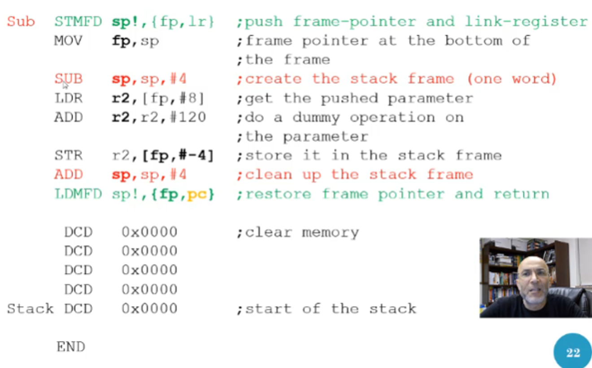

- Note that we modified r2 and did not return it back to what it was originally (this was most likely the point of the subroutine, but just be careful when you do this)
- Setting the fp as #123 doesn’t mean anything, we just want to clear what might already be there

Visually, it looks something like this

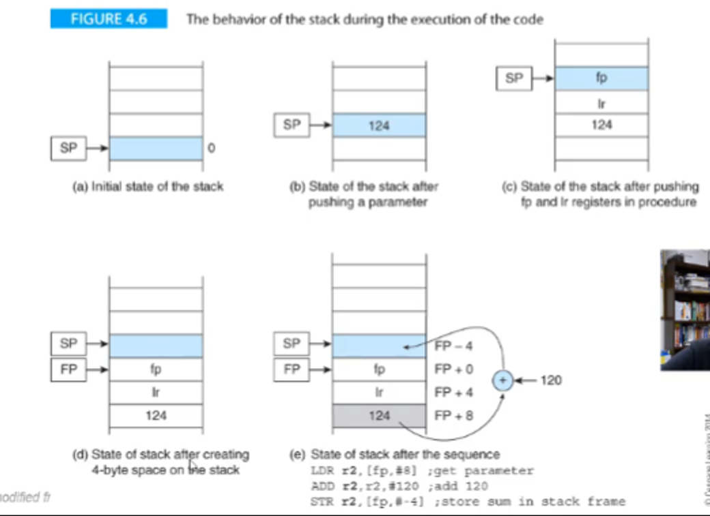

- To collapse and return to the main program, we do the reverse

For the parameter, notice how there’s two steps, one before and one after the subroutine

1. Push the parameter(s) on the stack
2. Pop the parameter(s) from the stack

More about parameters is below


The provided code examples demonstrate the differences between passing parameters by value and passing parameters by reference in ARM assembly language. Let's break down each approach in more detail.

### Passing by Value

In passing by value, the values of the parameters are copied to the stack, and the subroutine operates on these copies. Here’s the main function setup and the swap function for passing by value:

#### Main Function
```assembly
main
    SUB sp,sp,#4          ; move the stack pointer up
    STR fp,[sp]           ; push the frame pointer onto the stack
    MOV fp,sp             ; the frame pointer points at the base

    ; int x = 2, y = 3;
    SUB sp,sp,#8          ; move sp up 8 bytes for 2 integers
    MOV r0,#2             ; x = 2
    STR r0,[fp,#-4]       ; put x in stack frame
    MOV r0,#3             ; y = 3
    STR r0,[fp,#-8]       ; put y in stack frame

    ; swap(x, y);
    LDR r0,[fp,#-8]       ; get y from stack frame
    STR r0,[sp,#-4]!      ; push y on stack
    LDR r0,[fp,#-4]       ; get x from stack frame
    STR r0,[sp,#-4]!      ; push x on stack
    BL swap               ; call swap, save return address in LR
    ADD sp,sp,#8          ; clean the stack from the parameters

    MOV sp,fp             ; restore the stack pointer
    LDR fp,[sp]           ; restore old frame pointer from stack
    ADD sp,sp,#4          ; move stack pointer down 4 bytes
    Loop B Loop           ; stop
    END
```

#### Swap Function
```assembly
swap
    SUB sp,sp,#4          ; Create stack frame: decrement sp
    STR fp,[sp]           ; push the frame pointer onto the stack
    MOV fp,sp             ; frame pointer points at the base

    ; int temp;
    SUB sp,sp,#4          ; move sp up 4 bytes for temp

    ; temp = a;
    LDR r0,[fp,#4]        ; get parameter a from the stack
    STR r0,[fp,#-4]       ; copy a to temp onto the stack frame

    ; a = b;
    LDR r0,[fp,#8]        ; get parameter b from the stack
    STR r0,[fp,#4]        ; copy b to a

    ; b = temp;
    LDR r0,[fp,#-4]       ; get temp from the stack frame
    STR r0,[fp,#8]        ; copy temp to b

    ; Collapse stack frame created for swap
    MOV sp,fp             ; restore the stack pointer
    LDR fp,[sp]           ; restore old frame pointer from stack
    ADD sp,sp,#4          ; move stack pointer down 4 bytes
    MOV pc,lr             ; return by loading LR into PC
```

### Passing by Reference

In passing by reference, the addresses of the parameters are passed to the subroutine, which then operates directly on the original variables. Here’s the main function setup and the swap function for passing by reference:

#### Main Function
```assembly
main
    SUB sp,sp,#4          ; move the stack pointer up
    STR fp,[sp]           ; push the frame pointer onto the stack
    MOV fp,sp             ; the frame pointer points at the base

    ; int x = 2, y = 3;
    SUB sp,sp,#8          ; move sp up 8 bytes for 2 integers
    MOV r0,#2             ; x = 2
    STR r0,[fp,#-4]       ; put x in stack frame
    MOV r0,#3             ; y = 3
    STR r0,[fp,#-8]       ; put y in stack frame

    ; swap(&x, &y);
    SUB r0,fp,#8          ; get address of y in stack frame
    STR r0,[sp,#-4]!      ; push address of y on stack
    SUB r0,fp,#4          ; get address of x in stack frame
    STR r0,[sp,#-4]!      ; push address of x on stack
    BL swap               ; call swap, save return address in LR
    ADD sp,sp,#8          ; clean the stack from the parameters

    MOV sp,fp             ; restore the stack pointer
    LDR fp,[sp]           ; restore old frame pointer from stack
    ADD sp,sp,#4          ; move stack pointer down 4 bytes
    Loop B Loop           ; stop
    END
```

#### Swap Function
```assembly
swap
    SUB sp,sp,#4          ; Create stack frame: decrement sp
    STR fp,[sp]           ; push the frame pointer onto the stack
    MOV fp,sp             ; frame pointer points at the base

    ; int temp;
    SUB sp,sp,#4          ; move sp up 4 bytes for temp

    ; temp = *a;
    LDR r1,[fp,#4]        ; get address of parameter a
    LDR r2,[r1]           ; get value of parameter a (i.e., *a)
    STR r2,[fp,#-4]       ; store *a in temp in stack frame

    ; *a = *b;
    LDR r0,[fp,#8]        ; get address of parameter b
    LDR r3,[r0]           ; get value of parameter b (i.e., *b)
    STR r3,[r1]           ; store *b in *a

    ; *b = temp;
    LDR r3,[fp,#-4]       ; get temp
    STR r3,[r0]           ; store temp in *b

    ; Collapse stack frame created for swap
    MOV sp,fp             ; restore the stack pointer
    LDR fp,[sp]           ; restore old frame pointer from stack
    ADD sp,sp,#4          ; move stack pointer down 4 bytes
    MOV pc,lr             ; return by loading LR into PC
```

