# Intro to 3D


## Affine Transforms

Transforms are handled just about the same way they were in 2D, except we obviously add a third dimension to our matrices

$$
\begin{bmatrix} 
s_x & 0 & 0 \\
0 & s_y & 0 \\
0 & 0 & s_z
\end{bmatrix}
$$

For homogenous coordinates, we add onto that as well

$$
\begin{bmatrix} 
s_x & 0 & 0 & 0\\
0 & s_y & 0 & 0\\
0 & 0 & s_z & 0\\
0 & 0 & 0 & 1
\end{bmatrix}
$$

For translations, we add a third coordinate for our z axis to translate our point by a 3D vector

$$
\begin{bmatrix} 
1 & 0 & 0 & t_x\\
0 & 1 & 0 & t_y\\
0 & 0 & 1 & t_z\\
0 & 0 & 0 & 1
\end{bmatrix}
$$

For rotations, things get very different, since we now have 3 degrees of freedom that we have to grapple with: roll, yaw and pitch

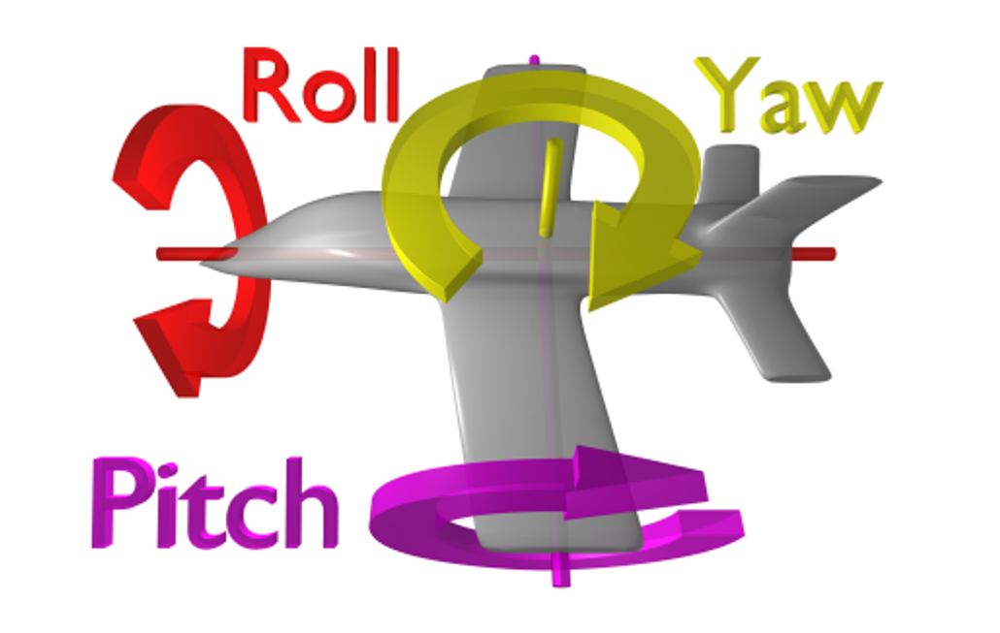

How do we actually handle this? In two dimensions, we can recontextualize our original rotation as spinning the x-y plane around the z axis, much like a spinning top

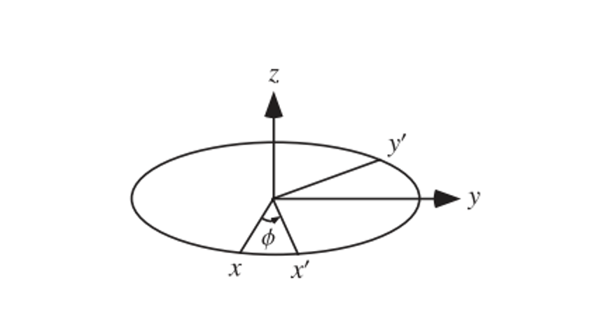

This defines a 3D matrix with z unchanged

$$
R_z(\theta) = \begin{bmatrix}
\cos(\theta) & -\sin(\theta) & 0 \\
\sin(\theta) & \cos(\theta) & 0 \\
0 & 0 & 1
\end{bmatrix}
$$

Now we can modify this slightly for the rest of our directions

$$
R_x(\theta) = \begin{bmatrix}
1 & 0 & 0 \\
0 & \cos(\theta) & -\sin(\theta) \\
0 & \sin(\theta) & \cos(\theta)
\end{bmatrix}
$$

$$
R_y(\theta) = \begin{bmatrix}
\cos(\theta) & 0 & \sin(\theta) \\
0 & 1 & 0 \\
-\sin(\theta) & 0 & \cos(\theta)
\end{bmatrix}
$$


To combine these in cool ways, the most common method is z first, then x, then y

$$
R_yR_xR_zv = v^\prime
$$

In real world programming this combination will simply be one matrix called “Euler Angles” or some variation thereof, describing a 3D rotation is certain angles around the 3 axes

EulerAngles(a,b,c) will rotate a degrees around the x axis, b degrees around the y axis and c degrees around the z axis

- Unity does this in the order z, x, y

### Euler’s Rotation Theorem

This theorem is an alternative to euler angles, which says that any 3D rotation can be described by some axis of rotation and an angle around the axis

- Elementary rotations would be special cases around i,j,k

Finding the axis is the hardest part, but all we really have to do is, given a general rotation matrix $R$, find a vector $\vec{u}$ s.t. $R\vec{u} = \vec{u}$

The details aren’t important, but knowing what you’re doing is

- We can just use glRotatef(theta, x, y, z) instead, which uses axis-angle

## Camera

The camera is one of the most important parts of any graphics library, being something from which we view a scene from

We can think of this as existing at a point and looking at another point

Much like we translate from local to world coordinates with a matrix $M$, we can implement the camera with a viewport matrix $V$ to go from world to camera coordinates

$$
VMv_{local} = v_{camera}
$$

This is referred to as camera space, where the camera exists at the origin and looks down the negative z axis

So, in order the move the camera up to (0,0,3), we move the world down by (0,0,-3)

$$
V = \begin{bmatrix}
1 & 0 & 0 & 0 \\
0 & 1 & 0 & 0 \\
0 & 0 & 1 & -3 \\
0 & 0 & 0 & 1
\end{bmatrix}
$$


## Perspective Projection

If we want to recreate realistic scenes, we want to recreate our sight, for which we must implement perspective, or making objects smaller and closer as they get further away

Really, we want a perspective projection, as opposed to an orthographic projection

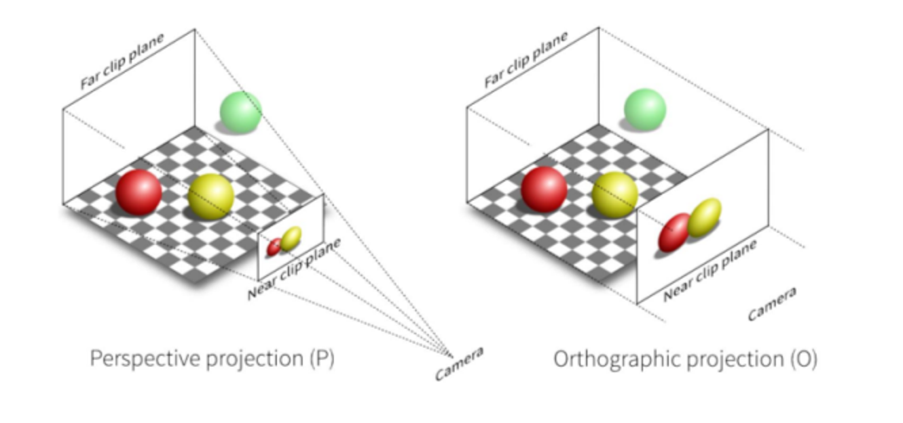

The main difference between these two projections is that, whole orthographic projection is a rectangular prism, perspective projection is a square frustrum

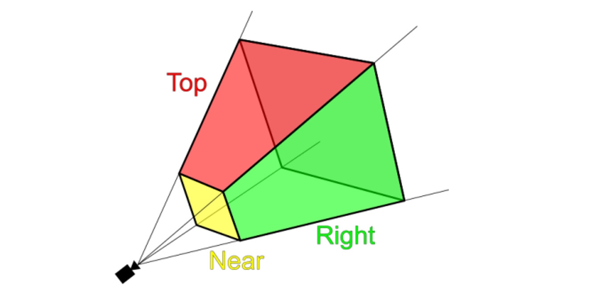

We then take this and translate it to NDC, forming a cube using a projection matrix P

$$
PVMv_{local} = v_{NDC}
$$

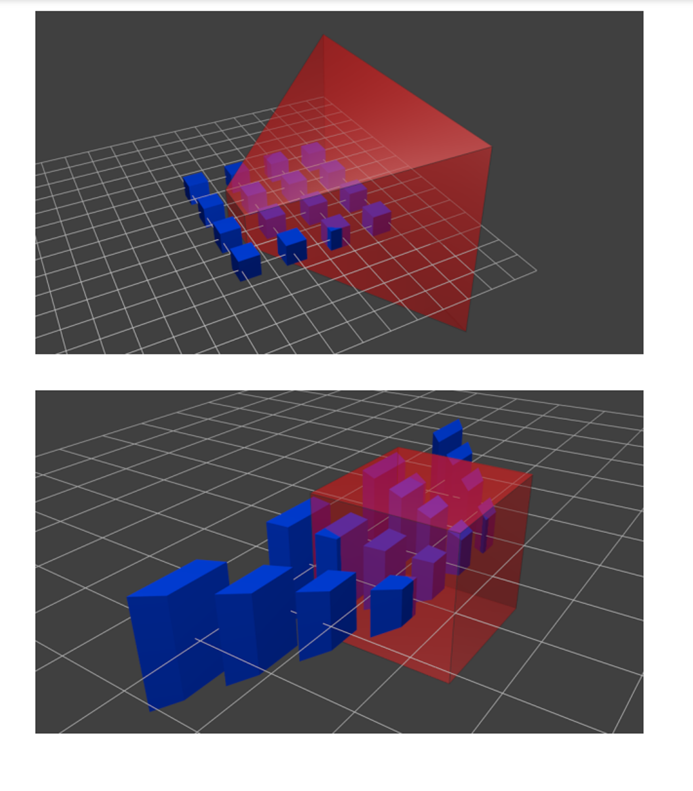

To further specify this frustrum, we need a few parameters

- **Near clipping plane**: the plane perpendicular to the x-y plane at $ z = \text{near} $ which defines the front of the frustum.
- **Far clipping plane**: the plane perpendicular to the x-y plane at $ z = \text{far} $ which defines the back of the frustum.
- **Field of view**: The angle between the lines of projection. Typically this is measured in the vertical direction. 45° is a reasonable number.
- **Aspect ratio**: This defines the square/rectangle shape of the near and far ends of the frustum. Since we have a vertical field of view, this specifies what fraction the vertical view is compared to the horizontal view.

This is a lot to take in, but luckily, glm (opengl’s math library) does this for us

```cpp
glm::mat4 P = glPerspective(fovy, aspect, near, far)
```

- Near and far are negative z coordinates, but we specify these to have positive values

## Amending Some Lies

Before we go further, we need to make some corrections to our knowledge of NDC

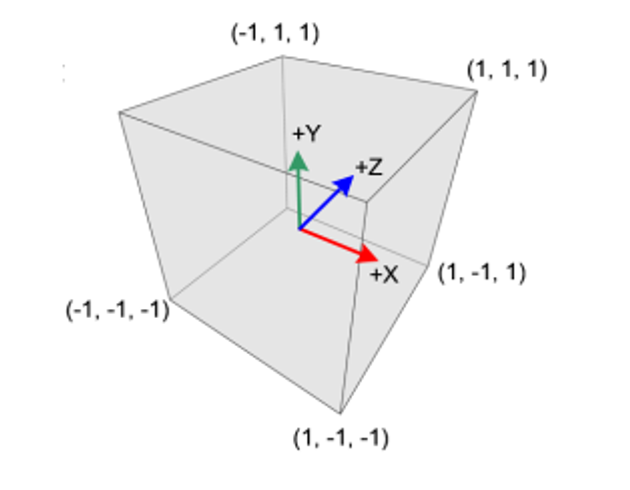

I told you that the camera is at z=0, so this would me z=-1 is behind the camera, right?

That was the lie…

The truth is, the x and y coordinates are how we described in earlier notes, but z=-1 is the near plane and z=1 is the far plane, so all objects that are at z>-1 are behind objects at z=-1

- This is only true if we have depth testing on, otherwise z is ignored

So, in reality, z=-1 is closer than z=0

If we think of the camera this way, it’s really at (0,0,-1) in the NDC, but it’s also at the origin in another way??? Why?????

The reason comes down to clip space

The real truth is that $PVMv_{local}=v_{clip}$, which refers to the clip space, not $v_{NDC}$

For a symmetric frustrum, the perspective projection matrix is defined as such

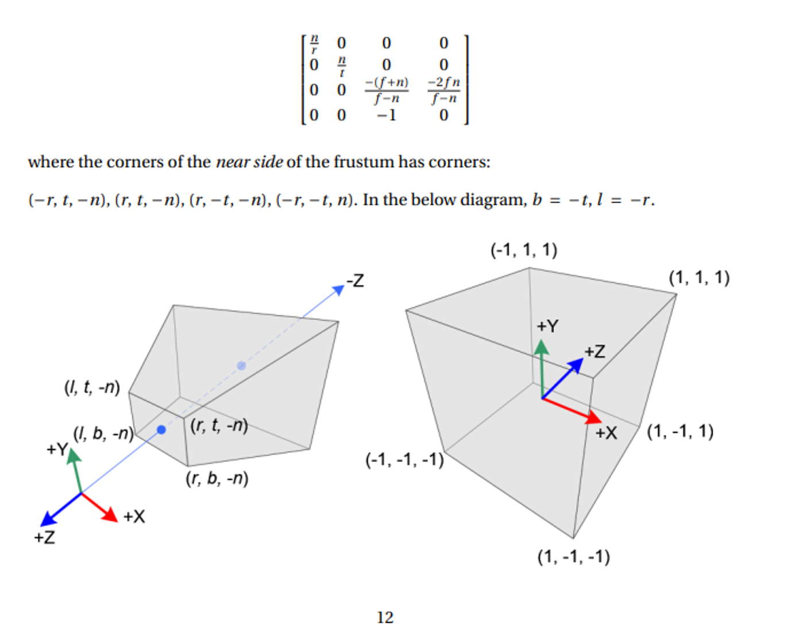

The clue for our conundrum comes from the fact that our projection matrix modifies the 4th homogenous coordinate, w

So, within this clip space, we can clip out any vertices that would be outside NDC with perspective division

Given a vertex (x,y,z,1) in clip space, we can get our NDC point like so

$$
\begin{bmatrix}
X_{NDC} \\
Y_{NDC} \\
Z_{NDC}
\end{bmatrix}
=
\begin{bmatrix}
x_{clip} / w_{clip} \\
y_{clip} / w_{clip} \\
z_{clip} / w_{clip}
\end{bmatrix}
$$

Since the NDC is defined to be [-1,1], testing which vertices to keep is very easy: just make sure we have all three of the following

$$
-w_{clip} < x_{clip} < w_{clip}
$$
$$
-w_{clip} < y_{clip} < w_{clip}
$$
$$
-w_{clip} < z_{clip} < w_{clip}
$$

If we have a primitive that’s partly outside and partly inside, OpenGL flips the primitive so that its new vertex fits directly in the NDC

- As a special node, since the w value of the projection matrix varies, each vertex can be said to inhabit its own clip space, so we must translate each vertex individually

## More on Cameras

One important note is that we CAN think of the camera has a single object, but we have to do a bit of translation work to make this viable

- If you think this isn’t useful, try out Blender and come back to me

Translating the camera is easy enough, given a desired position (e_x, e_y, e_z)

$$
V_{trans} = \begin{bmatrix}
1 & 0 & 0 & -e_x \\
0 & 1 & 0 & -e_y \\
0 & 0 & 1 & -e_z \\
0 & 0 & 0 & 1
\end{bmatrix}
$$


As for direction, we can define this as a vector, given d is the direction and t is the target

$$
\vec{d} = \vec{e} - \vec{t} = \begin{bmatrix}
e_x - t_x \\
e_y - t_y \\
e_z - t_z
\end{bmatrix}
$$

- We, of course, will normalize d

Once we have a vector, we still have one more degree of freedom, so now we need to angle part of the axis-angle paradigm


One way to specify this angle is to specify the proper $ x $ and $ y $ axes of the camera coordinate system. We do so with a simple trick. Look at your point on the wall again. This time, put the crown of your head facing toward the ceiling. Call this "upwards". Now, to look at your point you may have to move your eyes a little bit up or down in their sockets. That's okay, as long as we keep the crown of your head pointing upwards. If your head is the camera, your eyes are looking in the look direction and your right ear is facing in the direction of the positive $ x $ axis. Your ear points out to the right.

Now, we will let our head drift away from the crown pointing directly up. Bring your chin up or down so that you're still looking at your point on the wall, but now your eyes are looking "straight ahead", but maybe your chin is no longer pointing parallel to the floor. That's okay. This is the key observation: your right ear hasn't moved! By tilting your chin up and down, you essentially rotate your head around the $ x $ axis (the axis coming out of your right ear). Once you've moved your chin so that the line of sight is "straight out of your head", the crown of your head now doesn't point directly up toward the ceiling, but the crown of your head still points directly "upwards" in the coordinate system relative to your eye balls.


In summary:

1. Specify a position of the camera in world space.
2. Specify a look direction $ \vec{d} $ as the normalized $ \vec{e} - \vec{t} $.
3. Let the "up" direction be directly up toward the ceiling and then let your right ear point out toward the positive $ x $ axis.
4. Rotate around this $ x $ axis so that your line of sight returns to be $ \vec{d} $ and that the crown of your head is no longer pointing directly upward.

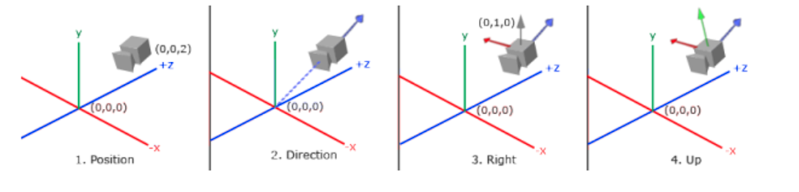

To compute steps 3 and 4, use cross products.

Given $ \vec{d} $, we compute $ \vec{r} $ as the cross product between $ \vec{d} $ and (0, 1, 0), that is, the cross product between $ \vec{d} $ and "directly up" in world coordinates. Then, we compute $ \vec{d} \times \vec{r} $ to get the "up" direction relative to the camera, call it $ \vec{up} $.


$$
V = \begin{bmatrix}
    \hat{r}_x & \hat{r}_y & \hat{r}_z & -e_x \\
    \hat{up}_x & \hat{up}_y & \hat{up}_z & -e_y \\
    \hat{d}_x & \hat{d}_y & \hat{d}_z & -e_z \\
    0 & 0 & 0 & 1
\end{bmatrix}
$$

This is the view matrix that (conceptually) positions the camera at location $(e_x, e_y, e_z)$ in world coordinates and looks toward $ \vec{t} $. Right? Not quite! Recall that the order of a transformation matters. This matrix above actually corresponds to rotating first and then translating. Will that give us what we want from a "look at" function? Nope. We need to move the camera to its position in the world first and then rotate it to look at what it should be looking at.

$$
V = \begin{bmatrix}
    \hat{r}_x & \hat{r}_y & \hat{r}_z & -\hat{r}_z e_x - \hat{r}_y e_y - \hat{r}_z e_z \\
    \hat{up}_x & \hat{up}_y & \hat{up}_z & -\hat{up}_z e_x - \hat{up}_y e_y - \hat{up}_z e_z \\
    \hat{d}_x & \hat{d}_y & \hat{d}_z & -\hat{d}_z e_x - \hat{d}_y e_y - \hat{d}_z e_z \\
    0 & 0 & 0 & 1
\end{bmatrix}
$$


## Marching Cubes

So far we can use meshes, but how are these meshes made? We can use the marching cubes algorithm to form triangle meshes but, in order to understand it, we need to look at a simpler case

## Marching Squares

Marching squares is an algorithm meant to approximate 2D shapes, the idea of which will form a basis for marching cubes, effectively separating into triangles

The algorithm works as follows:

1. Divide the area into squares
2. For each square test whether the corners are inside or outside the square
3. Generate a vertex along any edge that has one corner inside the surface and one corner outside
4. Connect each vertex to its nearest neighbours

Here’s an example of the algorithm in action

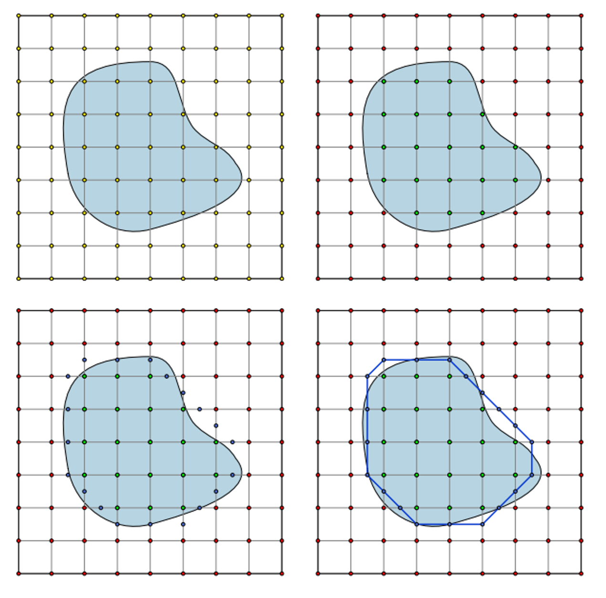

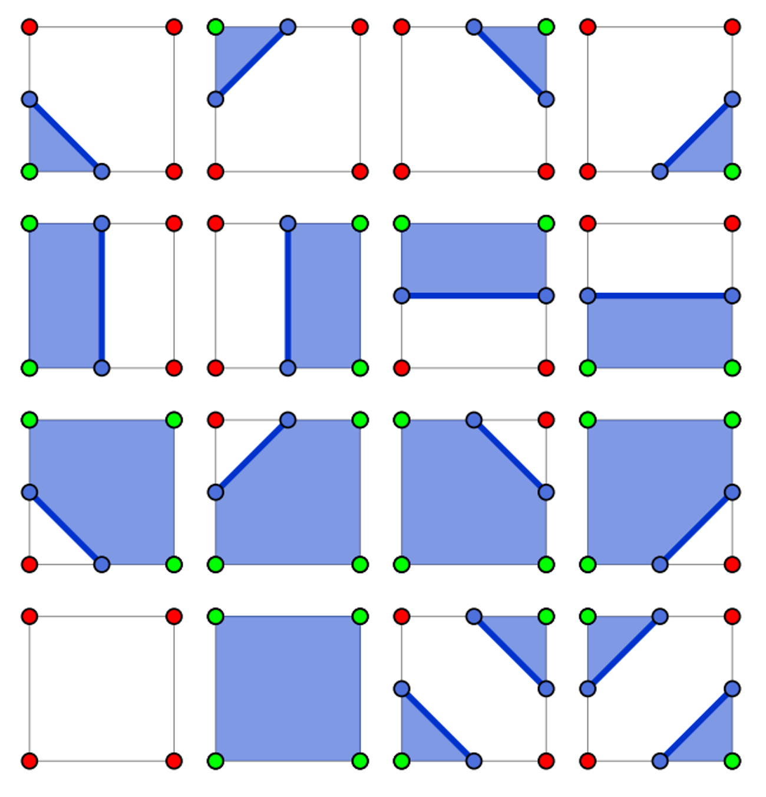

If we want to simplify this even further, we can define a look-up table of pre-defined segments, since there’s only 16 cases

## Bitmaps

A bitmap is a structure using individual bits to encode several booleans, with each bit representing true or false, which can be used as a number to handle compound cases

With marching square, we can encode inside as true and outside as false, assigning each bit in a 4-bit number to a corner

Top-left corner:     1000        Top-right corner:    0100
Bottom-right corner: 0010        Bottom-left corner:  0001

With a bitwise AND, we can get a particular case

```cpp
#define TOP_LEFT 8
#define TOP_RIGHT 4
#define BOTTOM_RIGHT 2
#define BOTTOM_LEFT 1

int case = 14;
if (case & TOP_LEFT) {
    // This case has the top-left corner inside the object
}

if (case & TOP_RIGHT) {
    // This case has the top-right corner inside the object
}

// ...
```


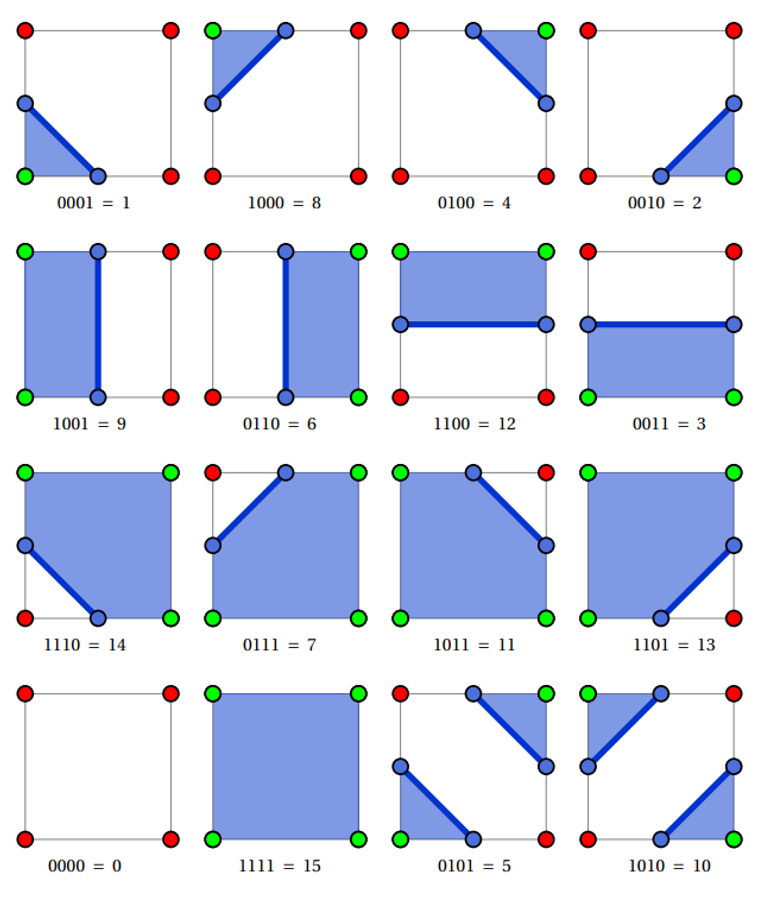

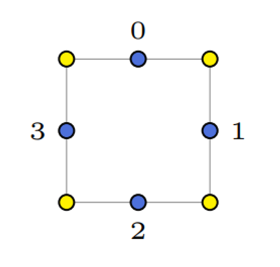

We can also do the reverse with bitwise OR, building our number additively


```cpp
int case = 0;
if (top-left corner is inside object) {
    case |= TOP_LEFT;
}
if (top-right corner is inside object) {
    case |= TOP_RIGHT;
}
if (bottom-right corner is inside object) {
    case |= BOTTOM_RIGHT;
}
if (bottom-left corner is inside object) {
    case |= BOTTOM_LEFT;
}
```


Given this new bitmap, we can use it as an index into a lookup table returning the corresponding line segments

To encode these segments, we can start with labelling the midway points 0-3,

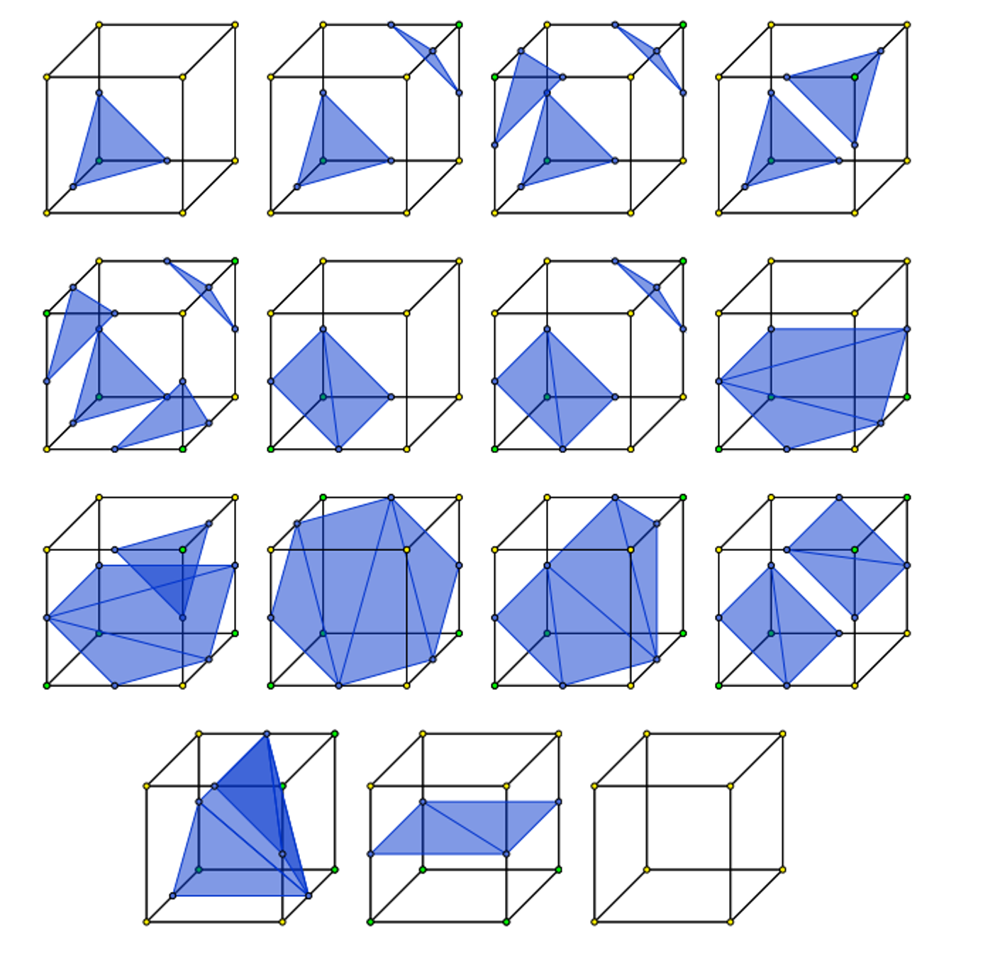

Since there’s at most two of these line segments, we can encode each with 4 indices, using -1 as padding


```cpp
int marching_squares_lut[16][4] = {
    {-1, -1, -1, -1},
    {2, 3, -1, -1},
    {1, 2, -1, -1},
    {1, 3, -1, -1},
    {0, 1, -1, -1},
    {0, 1, 2, 3},
    {0, 2, -1, -1},
    {0, 3, -1, -1},
    {0, 3, -1, -1},
    {0, 2, -1, -1},
    {0, 3, 1, 2},
    {0, 1, -1, -1},
    {1, 3, -1, -1},
    {1, 2, -1, -1},
    {2, 3, -1, -1},
    {-1, -1, -1, -1}
};
```


We can then give a second lookup table for the vertices of the line segments

Here is the content from the image in a markdown code block:

```cpp
float g_verts[4][2] = {
    {0.5f, 1.0f},
    {1.0f, 0.5f},
    {0.5f, 0.0f},
    {0.0f, 0.5f}
};

// Note these vertices do not give exact positions. Rather, they give the position of a line segment's
// vertex relative to the corners of the square which it is in. For a square with bottom-left corner (x, y)
// and a side length s, one can compute the absolute positions of a line segment's vertex as:

x + s * g_verts[i][0]
y + s * g_verts[i][1]

for (float y = ymin; y < ymax; y += s) {
    for (float x = xmin; x < xmax; x += s) {
        bottomleft = test(x, y);
        bottomright = test(x + s, y);
        topleft = test(x, y + s);
        topright = test(x + s, y + s);

        int case = 0;
        // build up bit mask...
    }
}
```

## Marching Cubes

Marching cubes is the exact same, except applied to cubes

There’s 256 cases to go through, but excluding rotational symmetries and inverses, there’s only 15

The algorithm isn’t too different either, we just have to change the lookup table and add an extra dimension to the march

```cpp
for (float z = zmin; z < zmax; z += s) {
    for (float y = ymin; y < ymax; y += s) {
        for (float x = xmin; x < xmax; x += s) {
            // test the 8 corners and build a bitfield
        }
    }
}
```