# Intro / Review


A lot of the challenges of graphics come from figuring out how to manipulate coordinates, vectors and matrices to our benefit

With this in mind, it’s worth our time to review a bit of linear algebra

## Coordinate Systems

To understand this, let’s take an example

A 1-dimensional coordinate system would be a number line, but when we get up to 2 dimensions we form a Cartesian plane and so on and so forth

In general, a coordinate system is a geometrical system with tuples of numbers being used to describe unique points, lines, surfaces and other structures

In all cases, we need to define an origin (0, (0,0), etc.) and an orthonormal basis (x, (x,y), (x,y,z), etc.)

The points are the tuples themselves, which we can then use to form the rest of our structures

## Vectors

The orthonormal basis is defined by vectors, which, for our purposes, has a direction and a length

- 1600 taught this more formally, but this is our main concern with graphics

These can start from the origin, but they can start from anywhere since they don’t particularly care about location

Typically, we construct vectors using displacement, describing how the coordinate space is transformed

For example, if we have a point $p(x,y)$, then $p + (2,3)=(x+2,y+3)$

We can also do scalar multiplication, so if $$\vec{v}=\begin{bmatrix}
v_1 \\
v_2 \end{bmatrix}$$, then $$2\vec{v}=\begin{bmatrix}
2v_1 \\
2v_2 \end{bmatrix}
$$

- This changes the vector length but not the direction, which is defined as $\|\vec{v}\|=\sqrt{(v_1^2+v_2^2+...+v_n^2)}$

    - This definition is the Euclidian norm
- In general, $\|c\vec{v}\|=c\|\vec{v}\| \forall c \in R$

Another operation on vectors is addition, so if we have two vectors $\vec{v}, \vec{w}$, then $\vec{v} + \vec{w}=\begin{bmatrix}
v_1+w_1 \\
v_2+w_2 \end{bmatrix}$

- The order doesn’t matter here, so $\vec{v}+\vec{w}=\vec{w}+\vec{v}$
- Vector subtraction works the same way

### Products Between Vectors

We can also take the product between two vectors in one of two ways: dot product or cross product

The dot product returns a scalar as such

$$
\vec{v} \cdot \vec{w}=\sum_{i=1}^nv_iw_i
$$

We can use this to quickly find the length of a vector, since $\vec{v} \cdot \vec{v}=\|\vec{v}\|^2$

Another thing we can do is find the angle between two vectors as such

$$
\frac{\vec{v}\cdot \vec{w}}{|\vec{v}||\vec{w}|}=\cos(\theta)
$$

This, combined with normalizing vectors with $\frac{\vec{v}}{\|\vec{v}\|}$, we can create orthonormal vectors, or vectors that are normalized (length 1) and equal to each other

Simply put, if $\vec{v} \cdot \vec{w}=0$ when both vectors are normalized, the two vectors are perpendicular, since $\cos(90^\circ)=0$

- We can basically figure out the angle between normalized vectors without even taking the length
- Note that we’re fetching only angles $\leq 180^\circ$

It might be intuitive to say that vectors have a particular direction like north or south, but this doesn’t really mean anything since direction is relative

In general, when we describe direction, we mean a normalized vector

- There is exactly one normalized vector per direction

### Cross Product

Orthonormal vectors are normal vectors that are orthogonal, which is what defines a vector

$$
\vec{i}=\begin{bmatrix}
1 \\
0 \\
0\end{bmatrix}, \vec{j}=\begin{bmatrix}
0 \\
1 \\
0\end{bmatrix}, 
\vec{k}=\begin{bmatrix}
0 \\
0 \\
1\end{bmatrix}
$$

For these vectors, this is pretty easy to figure out, but in general, we need the cross product, which will give the vector that is orthogonal to two vectors

$$
\vec{u}\times \vec{v}=\begin{bmatrix}
u_2v_3-u_3v_2 \\
u_3v_1-u_1v_3 \\
u_1v_2-u_2v_1\end{bmatrix}
$$

- This is derived from the determinant, but you don’t need to worry about this for now (you don’t even REALLY need to worry about this formula for most graphics work since you’ll usually have access to an easy function that does this for us)

The important thing about cross products is that they can be used to define the span of two vectors, i.e. the plane they take up

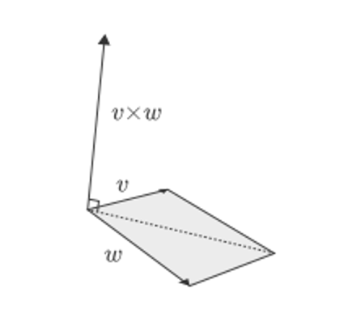

How do we decide which direction to use is dependent on the “handedness” of the system

If you’re using a right-hand system, open your right palm towards $\vec{u}$ and bend your fingers towards $\vec{v}$ to find the direction of $\vec{u}\times \vec{v}$

- Do the same on your left hand for left-handed systems

This is an important distinction to make since different graphics libraries will use different systems

- OpenGL uses a right-handed system

Something else that’s interesting is that we can use cross product to get the sin of the angle between two vectors

$$
\frac{|\vec{u}\times \vec{v}|}{|\vec{u}||\vec{v}|}=\sin(\theta)
$$

This, however, isn’t very useful in practice, since computing cross products is expensive

## Matrices

An $m \times n$ matrix is a rectangular array organized into $m$  rows and $n$ columns, denoted by $A_{m \times n}$

Usually, for this course, we’ll mainly be focused on square matrices since, given square matrices $A,B,C$, then $(AB)C=A(BC)$

Much like with vectors, we can do dot products

$$
A_{m \times n} \cdot B_{n \times p}=C_{m \times p} \\
c_{i,j}=\begin{bmatrix}
a_{i,1} &a_{i,2} &... &a_{i,n} \end{bmatrix} \cdot \begin{bmatrix}
b_{1,j} \\
b_{2,j} \\
... \\
b_{n,j}\end{bmatrix}
$$

## Displays

Displays are a 2D grid of pixels where we change the values of pixels

Back in the day, we used to have raster displays, which draws lines of pixels one at a time

- HBlank is almost never used, but VBlank is pretty important (this is where v-sync comes from)

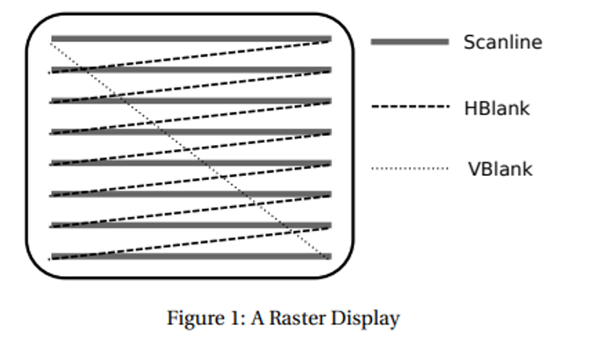

Nowadays, raster displays are pretty irrelevant, but they’re still used in graphics programs

More modern displays are bitmap-oriented, where each pixel is modified independently and controlled by a particular spot in video memory

Typically, these are laid out as an RGB stripe, but other ones do exist

The modern standard of displays (LCD and LED) combine the light from many subpixels to get deeper colors

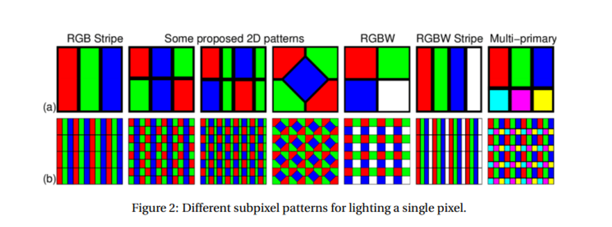

## Color Models

When displaying colors to someone on a screen, we have to understand a little more about how humans see color

A good way to do this is with a color model, which is a way to describe colors using a set of descriptors (ex. RGB, HSV, CMYK)

Models can be divided into additive (mixing to move away from black) and subtractive (mixing to move away from white)

- It’s just our luck that RGB is additive, so it works great for us

To make this more mathematical in a way a computer can understand, we can add a coordinate system to get a color space (we can use a 3D system for RGB, ex. $[255,0,255]$ describes purple)

- Each of these coordinates is called a color channel

Optimally we’d want all real numbers to be possible, but computers have limited memory, so we’ve come up with a few approaches

- RGB16: 16 bits in total to describe a color. Typically, each of R, G, B is a 5-bit integer and A is a 1-bit integer (i.e. the color is "on" or "off"). Each of RGB ranges from 0 to 31 and is interpreted as a fraction out of 31
- RGB24: 24 bits in total, 8 bits per R, G, B. Thus, the range of values is 0 to 255, interpreted as a fraction out of 255
    - Often called true color since it can handle more colors than what we can percieve
- RGBA32 uses 32 bits in total, 8 bits for each of R, G, B, A
    - This is what’s used in PNG files and is most common overall since it’s the most performative
    - It’s not uncommon to use floats for these either, so each channel is a 32-bit float in between 0 and 1

The set of colors that we can create with a color space is called a palette, which is represented with a hex code in the case of RGB

- For example, in #F3AB12, red is at F3 (100%), blue is at AB (~66%) and green is at 12 (almost 0%), so we can guess this is around orange

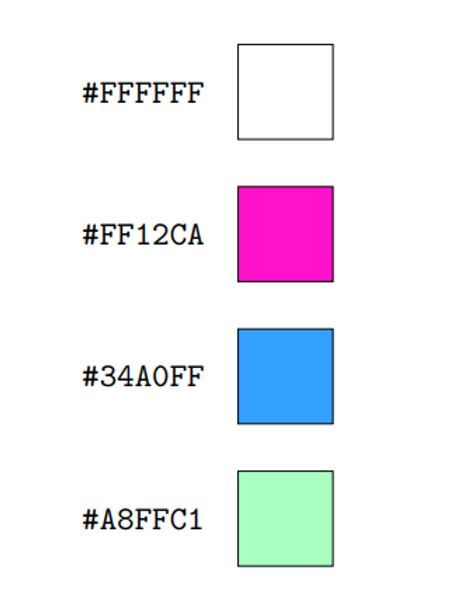

More examples

These are rarely used nowadays since we need so many colors, but back in the day they made for a great lookup table

# Displays

We can’t do graphics without displays, so let’s look at how these are handled

Different graphical systems have different coordinate systems with left-handed systems (origin at the top left) being used by Tkinter, Java Swing and Direct2D

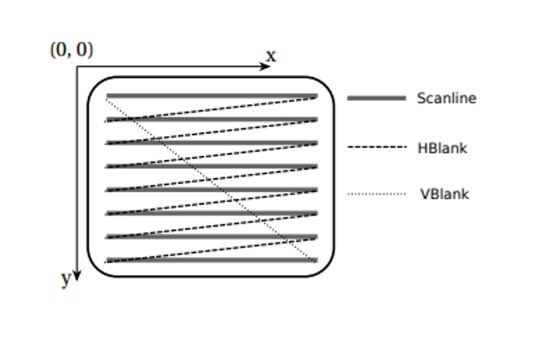

On the other hand, right-hand coordinate systems put the origin more naturally in the bottom left, which is used by Nintendo and Direct2D

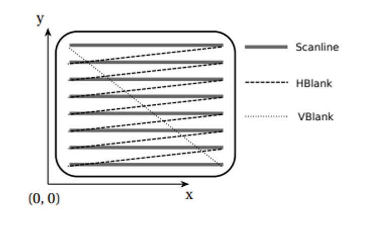

We’ll use right-handed systems for theory, but left-handed systems make more sense from an application perspective since that’s the way we read matrices

Most libraries give you the option between device space (handled by your system) and user space (whichever one you want) so it doesn’t REALLY matter which one you pick, as long as you account for it in your transforms

Sometimes we want to keep all our graphics in a window and not have a program draw directly to the screen, so we can use a windowing system to maintain a separate render target

This window would then, in turn, have its own coordinate system, with the windowing system taking care of layering and combinations of windows

Due to our access to multiple windows, we tend to only work on one window at a time, each with its own context maintaining separate render settings and render target

# Primitives

Now that we have a display, what do we actually draw? We can start with some primitives, which are basic 2D graphical objects

Each primitive has some attributes, parameters that affect how the primitive is drawn

- More on this later

Some primitives include

1. Vertex - a point used to describe positions of more complex derivatives
2. Point - much like a vertex, except handled as a filled circle with some given radius (technically these are zero-dimensional but shhhh)
3. Line - a straight line segment joining two vertices (technically one-dimensional but shhhhh)
4. Polyline - a piecewise line, where all intermediate vertices are both the end of one line and the beginning of another
5. Text - text
6. Raster graphic - a 2D grid of pixels with color stored explicitly
7. Sprite - like a raster graphic, except it stores an index to a palette rather than explicit color storage

This is analogous to how we draw shapes in real life; we draw a bunch of points, connect them together and our brain fills in the rest

We connect these together to create a 2D image, and connect THOSE together to create a 3D image

# Polygons

Polygons are closed shapes made of straight lines joined together

- These are simple if no lines intersect the surface and complex otherwise

Since you can represent any polygon as a series of triangles (we’ve known this since Egypt), polygons are most often represented as triangles

There’s lost of ways to draw these in OpenGL


Quads is deprecated

## Winding Order

We can be more specific with these polygons by defining winding order, which refers to which normal to use when rendering


This is CCW by default

# In OpenGL

OpenGL has two main components:

1. Global state - There’s always one state machine for each context which holds all render settings; if you want to change this between drawings, you need to explicitly state it
2. Client/Server - All programming must be done through front end calls, all of which are sent to a back end that does the actual rendering
    1. These aren’t literal front ends and back ends, just metaphorical ones

There’s also two ways to draw things

1. Immediate mode - Functions are called every frame; this is characterized by glBegin() and glEnd()
2. Retained mode - Server side retains data to be rendered; containers holding data only need to be filled once, so all the client needs to do is point to the right data in the server
    1. This is more advanced but more practical (more on this in 3D graphics)


# Transforms

# Screen Space

Before we talk about transforms, let’s look at how we render things to different windows

Since every screen is different, graphics libraries will use normalized device coordinates (NDCs) unless explicitly told to do otherwise

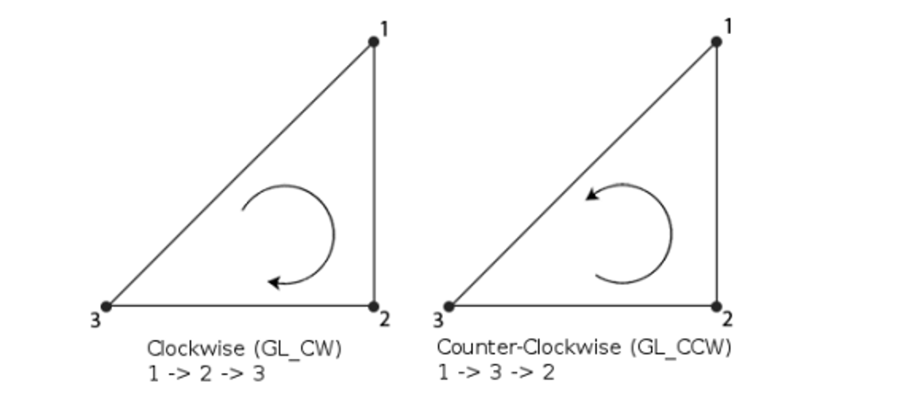

Obviously most screens aren’t square, so GLFW handles this with a viewport, which is specified by a window’s width and height

- Remember that graphics libraries render to targets rather than straight to monitors

This frame buffer is the same size as the window, serving as an in-memory raster image within the window

How do we actually figure out where to draw stuff from the NDC? We can use the viewport matrix

If we have vertex at $(x,y)$ in the NDC and a viewport at position $(x_0, y_0)$ with width $w$ and height $h$, we can use the following formula

$x_s=(x+1)\frac{w}{2}+x_0$ \\
$y_s=(y+1)\frac{h}{2}+y_0$

This is defined for you, but you can use glViewport(x0,y0,w,h) to set a new one

# Affine Transforms

Now that we’ve figured out how to draw things, let’s figure out how to move stuff around

An affine transform is any geometric manipulation that preserves lines and parallelism

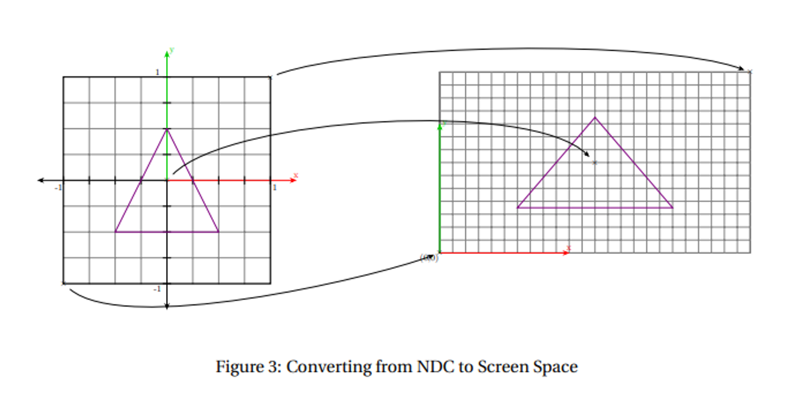

Each of these can be combined and handled with a single matrix multiplication, which is great because this is most of what we do (except for perspective projection, which will come in later)

- For the following, we’ll assume a right-handed coordinate system with positive x going right and positive y going up

## Scaling

Scaling is the simplest to understand, since all it involves is taking the vertices and multiplying their positions

We can apply this differently in each direction by scaling the x coordinate differently from the y coordinate

For this, we can take a simple scalar $(s_x, s_y)$ and multiply it by a vertex $(x,y)$ as such

$$
\begin{bmatrix}
s_x & 0 \\
0 & s_y
\end{bmatrix}
\begin{bmatrix}
x \\
y
\end{bmatrix} = 
\begin{bmatrix}
s_x \cdot x \\
s_y \cdot y
\end{bmatrix}
$$

- We can invert this by scaling by the reciprocal

## Shear

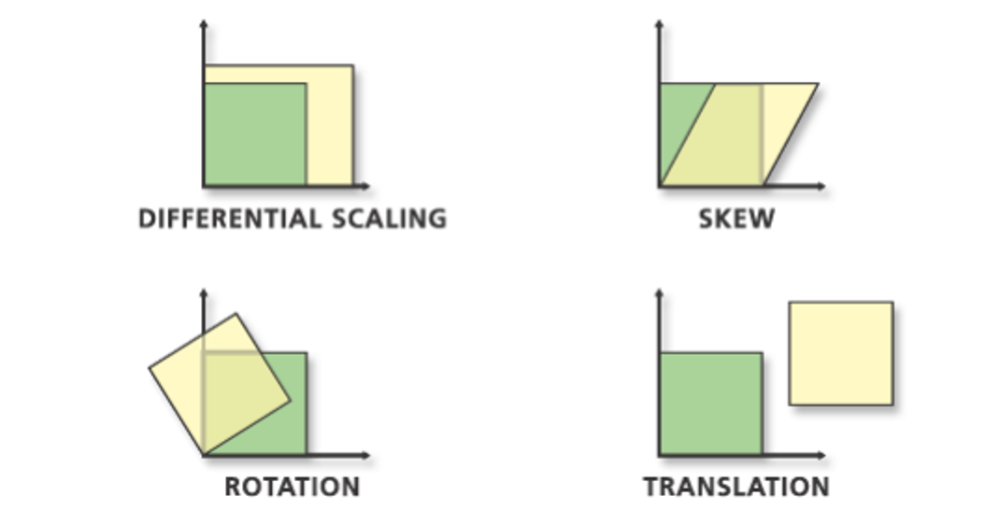

This is just another matrix multiplication, where the new shape has slope

$$
\begin{bmatrix}
1 & m \\
0  & 1
\end{bmatrix}
\begin{bmatrix}
x \\
y
\end{bmatrix} = 
\begin{bmatrix}
x+my \\
y
\end{bmatrix}
$$

With vertical shear, it’s much of the same

$$
\begin{bmatrix}
1 & 0 \\
m & 1
\end{bmatrix}
\begin{bmatrix}
x \\
y
\end{bmatrix} = 
\begin{bmatrix}
x \\
y+mx
\end{bmatrix}
$$

## Rotation

For rotation, this can be handled simply given an angle $\theta$ that’s counterclockwise

$$
\begin{bmatrix}
\cos(\theta) & -\sin(\theta) \\
\sin(\theta) & \cos(\theta)
\end{bmatrix}
\begin{bmatrix}
x \\
y
\end{bmatrix} = 
\begin{bmatrix}
x\cos(\theta)-y\sin(\theta) \\
x\sin(\theta)+y\cos(\theta)
\end{bmatrix}
$$

We can invert this with a negative angle as such


$$
\begin{bmatrix}
\cos(\theta) & \sin(\theta) \\
-\sin(\theta) & \cos(\theta)
\end{bmatrix}
\begin{bmatrix}
x \\
y
\end{bmatrix} = 
\begin{bmatrix}
x\cos(\theta)+y\sin(\theta) \\
-x\sin(\theta)+y\cos(\theta)
\end{bmatrix}
$$

## Reflection

Reflecting in the direction $\vec{v}=(v_x,v_y)$, we get the following

$$
\begin{bmatrix}
v_x^2-v_y^2 & 2v_xv_y \\
2v_xv_y & v_x^2-v_y^2
\end{bmatrix}
$$


## Combinations

Just multiply the corresponding matrices (lol)

## Translation

This is surprisingly the most complicated, since we can’t multiply a vector by a scalar and get an addition every time

What we can do instead is use homogenous coordinates, which are actually quite simple: turn our coordinates and vectors into 3D vectors, where the 3rd dimension is 1 for a 2D point and 0 for a vector

$$
\begin{bmatrix}
x\\
y\\
0
\end{bmatrix} \iff
\begin{bmatrix}
x\\
y\\
1
\end{bmatrix}
$$

Now we can take our displacement vector $\vec{d}=(d_x,d_y)$ and form a vector like so

$$
\begin{bmatrix}
1 & 0 & d_x \\
0 & 1 & d_y \\
0 & 0 & 1
\end{bmatrix}
\begin{bmatrix}
x \\
y \\
1
\end{bmatrix} = 
\begin{bmatrix}
x+d_x \\
y+d_y \\
1
\end{bmatrix}
$$

If we try this with a direction, nothing happens (try this out for yourself)

We can scale up our other transforms in order to combine with transformations

### Scale.
$$
\begin{bmatrix}
s_x & 0 \\
0 & s_y
\end{bmatrix}
\quad \rightarrow \quad
\begin{bmatrix}
s_x & 0 & 0 \\
0 & s_y & 0 \\
0 & 0 & 1
\end{bmatrix}
$$

### Shear.
$$
\begin{bmatrix}
1 & m \\
0 & 1
\end{bmatrix}
\quad \rightarrow \quad
\begin{bmatrix}
1 & m & 0 \\
0 & 1 & 0 \\
0 & 0 & 1
\end{bmatrix}
$$

$$
\begin{bmatrix}
1 & 0 \\
m & 1
\end{bmatrix}
\quad \rightarrow \quad
\begin{bmatrix}
1 & 0 & 0 \\
m & 1 & 0 \\
0 & 0 & 1
\end{bmatrix}
$$

### Rotation.
$$
\begin{bmatrix}
\cos(\theta) & -\sin(\theta) \\
\sin(\theta) & \cos(\theta)
\end{bmatrix}
\quad \rightarrow \quad
\begin{bmatrix}
\cos(\theta) & -\sin(\theta) & 0 \\
\sin(\theta) & \cos(\theta) & 0 \\
0 & 0 & 1
\end{bmatrix}
$$

## In Left-Handed Systems

When we have a top-left origin with positive y going down, this is basically the same but with slightly modified matrices

- Scale: same matrix, although scaling up now turns into scaling down
- Rotation: same matrix, except $\theta$  now signifies clockwise rotation, since our previous matrix actually just goes from positive x to positive y
- Shear: change $m$ for $-m$
- Transformation: same matrix, but keep in mind the new direction of $d_y$

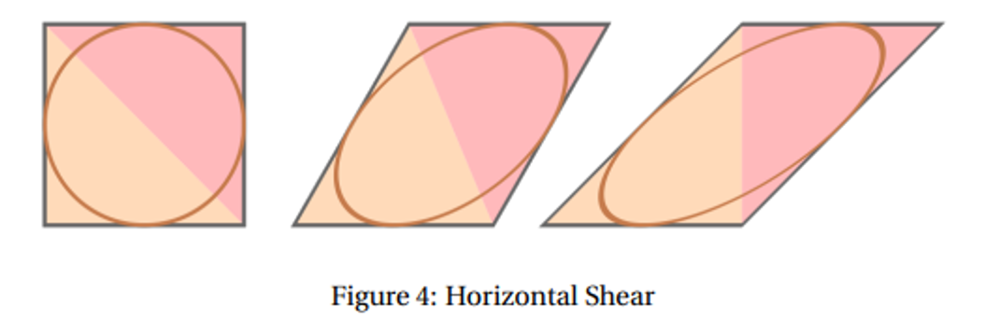

We can also think of these transformations as simply altering the coordinate system itself, much like turning your head around to look at something from an angle instead of turning the object itself

When we think of it this way, transferring between coordinate systems becomes a matter of reflecting along the x axis

- This becomes very important later

# Orthographic Projection

To represent 3D objects on a 2D screen, we need to project it

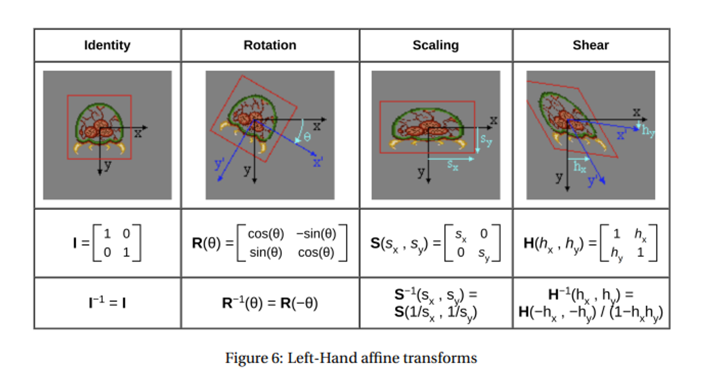

So far, we’ve just been setting $z=0$ in our 2D drawings, but we can set it farther back and get different effects

When we bring $z$ into our NDC in the same way, we realize that NDCs are kinda useless

What if we want to draw further out? We can define an orthographic view volume with glOrtho

```
glOrtho(left, right, bottom, top, near, far)
```

Of course, it isn’t that easy since we have the pesky global state machine, but we can set this in global state with glMatrixMode(GL_PROJECTION)

In total, the following three functions should do the trick

```
glMatrixMode(GL_PROJECTION)
glLoadIdentity() //replaces the current matrix with the identity matrix
glOrtho(left, right, bottom, top, near, far)
```