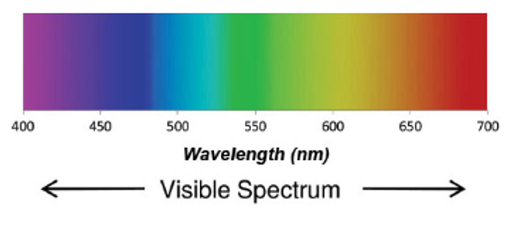
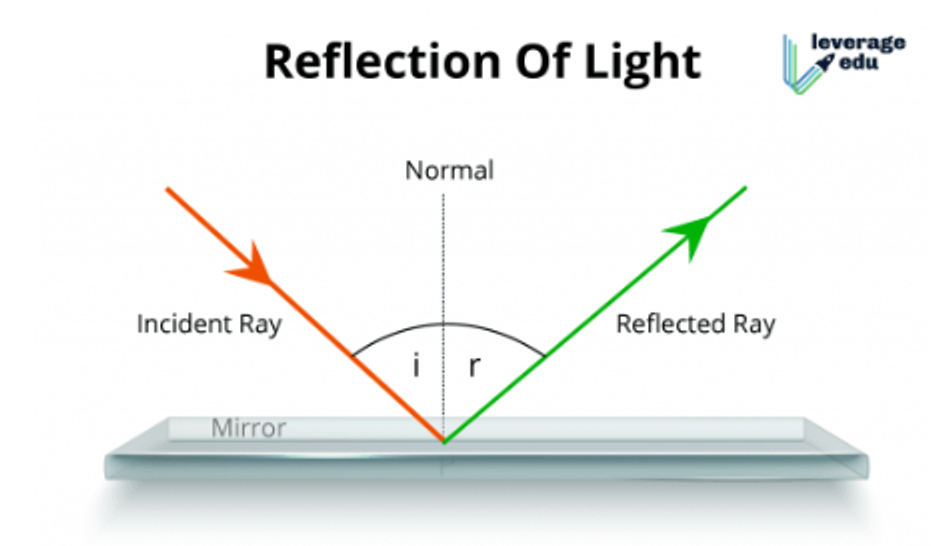
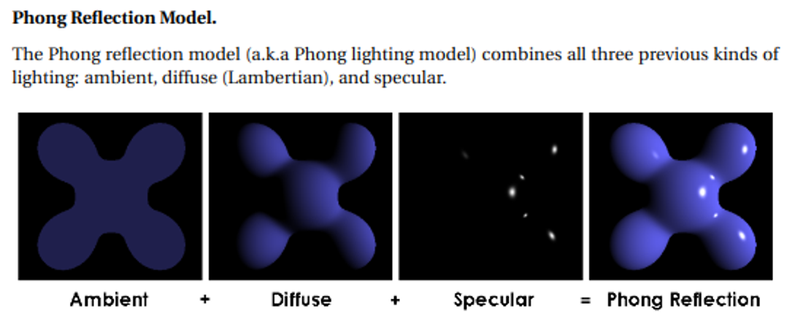
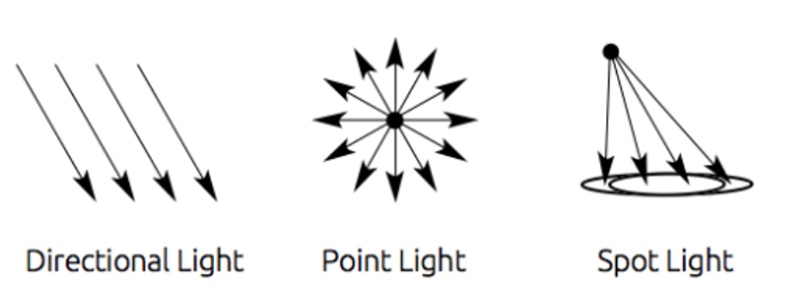
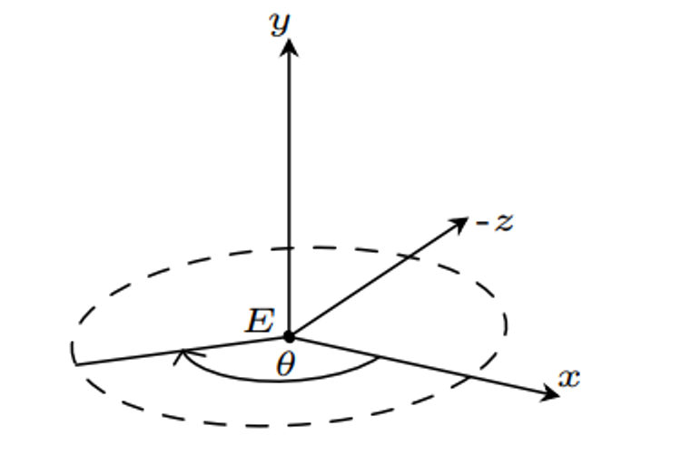
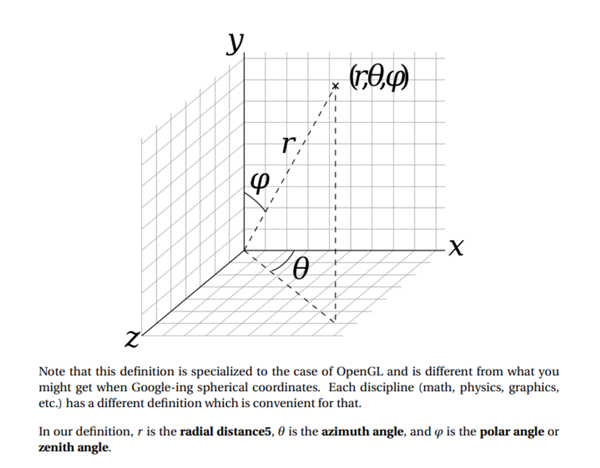

# Lighting + Cameras


To make our scenes more realistic, lighting will be necessary to create the desired effects

But to go into this, we need a quick physics lesson

## What is Light?

Light, as physics is concerned, is well-studied and gives us various terminology that will be useful, such as:

- Irradiance: the amount of light recieved by a surface per unit area
- Raidance: amount of light emitted by a surface per unit area
- Reflection: change in direction of light where the light returns to the original volume
- Refraction: change in direction of light where the light moves out of the original volume
- Albedo: measure of amount of light reflected vs light refracted
    - In graphics, this can also refer to the base color of an object

White light is the combination of every color of light



The color we actually see has to do with which wavelengths are absorbed and which ones are not

- This is where albedo comes in to describe the base color

## Reflections

Now that we have a basic idea of how light works, let’s go over the math we need to render it

For a perfect mirror, it’s actually pretty simple: all we need is the normal and the angle between the ray and the normal



This can be done with some simple dot vectors

$$
\frac{\vec{i}\cdot \vec{n}}{|i||n|} = \frac{\vec{r}\cdot \vec{n}}{|r||n|}
$$

- It gets even better since we have GLSL to compute this automatically

There’s just one problem: most surfaces aren’t perfect mirrors, so to do photorealistic lighting, we need something else

$$ L_o(\mathbf{x}, \omega_o, \lambda, t) = L_e(\mathbf{x}, \omega_o, \lambda, t) + \int_{\Omega} f_r(\mathbf{x}, \omega_i, \omega_o, \lambda, t)L_i(\mathbf{x}, \omega_i, \lambda, t)(\omega_i \cdot \mathbf{n}) \, d\omega_i $$

where
- $ L_o(\mathbf{x}, \omega_o, \lambda, t) $ is the total spectral radiance of wavelength $\lambda$ directed outward along direction $\omega_o$ at time $t$, from a particular position $\mathbf{x}$
- $\mathbf{x}$ is the location in space
- $\omega_o$ is the direction of the outgoing light
- $\lambda$ is a particular wavelength of light
- $t$ is time
- $ L_e(\mathbf{x}, \omega_o, \lambda, t) $ is emitted spectral radiance
- $\int_{\Omega} \ldots d\omega_i$ is an integral over $\Omega$
- $\Omega$ is the unit hemisphere centered around $\mathbf{n}$ containing all possible values for $\omega_i$ where $\omega_i \cdot \mathbf{n} > 0$
- $ f_r(\mathbf{x}, \omega_i, \omega_o, \lambda, t) $ is the bidirectional reflectance distribution function, the proportion of light reflected from $\omega_i$ to $\omega_o$ at position $\mathbf{x}$, time $t$, and at wavelength $\lambda$
- $\omega_i$ is the negative direction of the incoming light
- $ L_i(\mathbf{x}, \omega_i, \lambda, t) $ is spectral radiance of wavelength $\lambda$ coming inward toward $\mathbf{x}$ from direction $\omega_i$ at time $t$
- $\mathbf{n}$ is the surface normal at $\mathbf{x}$
- $\omega_i \cdot \mathbf{n}$ is the weakening factor of outward irradiance due to incident angle, as the light flux is smeared across a surface whose area is larger than the projected area perpendicular to the ray. This is often written as $\cos \theta_i$.

This is, to be frank, a disgusting equation, so let’s pick it apart a bit

- $L_o$ is the output light from the surface
- $L_e$ is the emitted light from the surface
- $L_i$ is the incident light on the surface
- $f_r$ is the bidiractional reflectance distribution function (BRDF), where $\omega_i$ is the incoming light direction, $\omega_o$ is the outgoing direction and $\lambda$ is the wavelength
    - The exact function needs to be measured by experiment for every surface, but we can approximate with lighting models

## Models

Lighting/shading models (used interchangeably) are a simplification of light, color, reflection and refraction and how they interact

This has a few different types

- Ambient reflectance: all the light that doesn’t come from a specific source (it just “exists”) (this naturally doesn’t cast shadows)
- Lambertian reflectance: assumes BRDF is constant, meaning the reflection is evenly spread across all directions (gives a matte appearence known as diffuse reflection)
- Phong model: combines the previous types along with specular



With the phong model, the color is calculated for each fragment individually as a combination of ambient, diffuse and specular reflection

$$
color_{out} = ambient+diffuse+specular
$$

This is the easy part, however, so let’s look at each part

Ambient is uniform, so just paint it with a colour like we did before we knew about lighting

Diffuse is independent of viewer position, calculated by the following formula

$$ L_d = I \cdot \max(0, \mathbf{n} \cdot \mathbf{l}) $$

where $I$ is the incoming light intensity, $\mathbf{n}$ is a normalized vector for the surface normal at that point, and $\mathbf{l}$ is a normalized vector for the direction to the light source from the point on the surface.

- We use max since the dot product can be negative, which doesn't make much sense.

Specular does depend on viewer position, but what we want is glossy reflection, with mirrored highlights but not necessarily a mirrored finish. The actual formula is pretty similar to the one for diffuse:

$$ L_s = I \cdot \max(0, \mathbf{v} \cdot \mathbf{r})^\alpha $$

where $I$ is the incoming light intensity, $\mathbf{r}$ is a normalized vector in the direction of the reflected light ray, and $\mathbf{v}$ is a normalized vector for the direction to the viewer from the point on the surface. Finally, $\alpha$ is the shininess parameter that controls how "shiny" the surface appears. The larger the value, the more shiny. Typical values are between 0 and 100.

## Light Sources

In order to make our light accurate, we need to define a source

There are three main categories for this

- Directional
- Point
- Spot



Most scenes just have one, but you could have as many as you want

- This gets computationally expensive as we add more lights

## Lighting Colors and Materials

Obviously scenes get more complicated than what we mentioned, so it’s good to have some parameters we can tweak

To start, we can change the light color and intensity for each light source, with some libraries allowing us to specify ambient, specular and diffuse colors for a single source

We can also modify our materials with various shaders with many parameters to choose from

Below are some basic parameters that are present in all materials

- $k_a$: the ambient reflection constant; the fraction of ambient light that is reflected
- $k_d$: the diffuse reflection constant; the fraction of ambient light that is reflected
- $k_s$: the specular reflection constant; the fraction of specular light that is reflected

Ideally, we'd want a reflection constant for each wavelength, but that's insanity unless we have a supercomputer, so most of the time we just use the color channels we have (red, green, blue) and specify colors for each parameter.

### A Phong shader in GLSL:

```glsl
#version 400

// Interpolated values from the vertex shaders
in vec3 Normal;
in vec3 EyeDirection;
in vec3 LightDirection;

out vec4 color;

void main(){
    // Material colors
    vec4 diffuse = vec4(0.0, 1.0, 1.0, 1.0); // blue-green color
    vec4 ambient = vec4(0.2,0.2,0.2,1.0);
    vec4 specular = vec4(0.7, 0.7, 0.7, 1.0);

    vec3 n = normalize( Normal );
    vec3 l = normalize( LightDirection );
    float cosTheta = clamp( dot( n, l ), 0, 1 ); // ensure dot product is between 0 and 1

    vec3 E = normalize(EyeDirection);
    vec3 R = reflect(-l,n);
    float cosAlpha = clamp( dot( E, R ), 0, 1 );

    float alpha = 64;
    color = ambient + diffuse*cosTheta + specular*pow(cosAlpha,alpha);
}
```


## Camera Manipulation

We’ve talked about the camera in an abstract sense and given it a concrete location in the world, but now let’s manipulate it in more cool ways

**First Person**

In first person, you’re the camera, which is what’s commonly done by video games

This is the simplest to do; just pick a height, put the camera there and have it look parallel to the ground

First person cameras keep movement stiff, meaning the camera movement affects player movement as well, which is also easily done with a look_at function

- VR is different since movement is independent, but this is outside the scope of this course

We start with a world position $E$ with the y-axis pointing directly and a target $T$ with the same y coordinate

Our last degree of freedom is rotation, so we only have $\theta$ left to define



$D=(\cos \theta , 0, \sin \theta )$, which we can use to form our matrix

Movement is also fairly easy with classic tank controls to simply move the camera forward and backward, along with rotation

```cpp
double currentTime = glfwGetTime();
static double lastTime = glfwGetTime();
float deltaTime = (currentTime - lastTime);

// Rotate counterclockwise
if (glfwGetKey(window, GLFW_KEY_LEFT) == GLFW_PRESS) {
    theta -= deltaTime * speed;
}

// Rotate clockwise
if (glfwGetKey(window, GLFW_KEY_RIGHT) == GLFW_PRESS) {
    theta += deltaTime * speed;
}

glm::vector3 dir(cos(theta), 0, sin(theta));

if (glfwGetKey(window, GLFW_KEY_UP) == GLFW_PRESS) {
    eye += dir * (deltaTime * speed);
}

// Move backward
if (glfwGetKey(window, GLFW_KEY_DOWN) == GLFW_PRESS) {
    eye -= dir * (deltaTime * speed);
}

V = glm::lookAt(position, eye, {0, 1, 0});
lastTime = currentTime;
```

**Third Person**

Third person consists of multiple different types of perspective

- Fixed: camera stays in one place relative to the avatar
- Tracking: camera follows the avatar, with no direct user control
- Interactive: player controls both the avatar and camera independently

For fixed, we can just define an offset of the camera, so the camera is at world position $P_p+O$ and is looking at $P_p+D$, where $P_p$ is the player position and $O$ is the offset

**Movement**

In third person, we must move the camera and the avatar, which makes things a bit more complicated

The thing we need to recall is that we can’t just use look_at since movement isn’t completely one-to-one with camera movement, so we need to do the transformations outselves

This isn’t so bad once we take into account local coordinates, but we can’t just manually move the z coordinate the same amount as we do for the player

Instead, we must move the player relative to world coordinates by taking the direction into account

```cpp
glm::vec3 pos(x, y, z);
glm::vec3 dir(sin(theta), 0, cos(theta));

// Move forward
if (glfwGetKey(window, GLFW_KEY_UP) == GLFW_PRESS) {
    pos += dir * (deltaTime * speed);
}

// Move backward
if (glfwGetKey(window, GLFW_KEY_DOWN) == GLFW_PRESS) {
    pos -= dir * (deltaTime * speed);
}
```
To adjust theta, we need to remember that the camera is behind the player with local z pointing into the screen and local x pointing to the left, so we turn left by increasing theta

```cpp
// Rotate counterclockwise
if (glfwGetKey(window, GLFW_KEY_LEFT) == GLFW_PRESS) {
    theta += deltaTime * speed;
}

// Rotate clockwise
if (glfwGetKey(window, GLFW_KEY_RIGHT) == GLFW_PRESS) {
    theta -= deltaTime * speed;
}
```

Putting it all together, we can define a model matrix using the avatar's world position and θ:

```
M = glm::mat4(1.0f);
M = glm::translate(M, pos);
M = glm::rotate(M, θ, up);
```

- We do translation first because we want the model to move and THEN rotate in place

The last thing to do is place the camera with that offset we talked about earlier

Considering that we’re $d$ units behind the player, the camera position is given by the following

```cpp
glm::vec3 camPos = pos;
camPos.x -= sin(theta) * d;
camPos.z -= cos(theta) * d;
V = glm::lookAt(camPos, pos, up);
```

**Spherical Coordinates**

For certain applications, spherical coordinates makes our math much easier, which is a coordinate system with three axes

1. $r$: the distance of the point to the origin
2. $\theta$: the rotation of the point in the x-z plane from positive x to positive z
3. $\phi$: the rotation of the point off the y-axis from positive y to negative y



is pretty simple: 

$$
r=\sqrt{x^2+y^2+z^2} \\
\theta, \phi = \text{Exercise for the reader} \\
x = r \cos \theta \sin \phi \\
y = r \cos \phi \\
z = r \sin \theta \cos \phi
$$

**Using Spherical Coordinates**

With spherical coordinates, we can have the camera maintain its orientation when moving closer by modifying $r$, spin horizontally around an object with $\theta$ and spin vertically around an object with $\phi$

For this, it’s not enough to just use arrow keys, so a better option is to use click-and-drag mouse operations for $\theta$ and $\phi$ and scroll for $r$

```cpp
static double mouseDownX;
static double mouseDownY;
static bool firstPress = true;

double dx = 0.0, dy = 0.0;
int state = glfwGetMouseButton(window, GLFW_MOUSE_BUTTON_LEFT);
if (state == GLFW_PRESS)
{
    if (firstPress) {
        glfwGetCursorPos(window, &mouseDownX, &mouseDownY);
    }

    double xpos, ypos;
    glfwGetCursorPos(window, &xpos, &ypos);

    dx = xpos - mouseDownX;
    dy = ypos - mouseDownY;

    mouseDownX = xpos;
    mouseDownY = ypos;
}
if (state == GLFW_RELEASE) {
    firstPress = true;
}
```