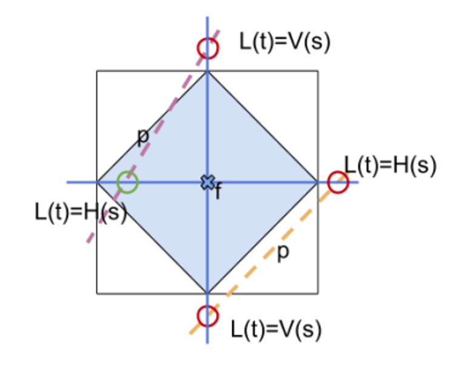

# OpenGL


We know that we start with a coordinate system and we have all the math, but now what do we do? What we can start with is clipping lines

## Line Clipping

Clipping, the act of excluding data from a drawing, is fundamental to computer graphics

We can do this easily on lines with the Cohen-Sutherland algorithm, with the idea of dividing the screen space into 9 areas, with only the center area being visible

1. Line entirely in window = draw completely
2. Line entirely outside window = draw nothing
3. Otherwise cut it at the edge and repeat

Testing the first two is pretty simple


y2 should be y1

- This test will miss some lines that are trivially outside, but we can just chop these and retest

The idea with chopping is that we use all the mins and maxes as “knives” to cut the line

An explanation on chopping can be found below

We can use classic $ y = mx + b $ to determine the new endpoints after cutting. The key is that, when being cut by "top", the endpoint’s new $ y $ coordinate is $ y_{\text{max}} $. When cut by "bottom" the endpoint’s new $ y $ is $ y_{\text{min}} $. Same goes for left and right, but for $ x $.

Then, we can use the line’s slope to determine the corresponding $ x $ coordinate (when cut by top or bottom) or $ y $ coordinate (when cut by right or left).

$$
m = \frac{y_1 - y_0}{x_1 - x_0}
$$

Then, from $ (x_0, y_0) $, following along a straight line of slope $ m $, and ending at $ y_{\text{max}} $ must have corresponding $ x $ coordinate $ x_{\text{new}} $:

$$
\frac{y_1 - y_0}{x_1 - x_0} = m = \frac{y_{\text{max}} - y_0}{x_{\text{new}} - x_0}
$$

$$
(x_{\text{new}} - x_0)(y_1 - y_0) = (y_{\text{max}} - y_0)(x_1 - x_0)
$$

$$
x_{\text{new}} - x_0 = (y_{\text{max}} - y_0)(x_1 - x_0) / (y_1 - y_0)
$$

$$
x_{\text{new}} = x_0 + (y_{\text{max}} - y_0)(x_1 - x_0) / (y_1 - y_0)
$$

The almost same formula can be used to find $ x_{\text{new}} $ at $ y_{\text{min}} $ by just replacing $ y_{\text{max}} $ with $ y_{\text{min}} $.

When we are cutting along right or left, the new $ x $-coordinate will be $ x_{\text{max}} $ or $ x_{\text{min}} $, respectively. We can then find $ y_{\text{new}} $ using the same slope formula:

$$
\frac{y_1 - y_0}{x_1 - x_0} = m = \frac{y_{\text{new}} - y_0}{x_{\text{max}} - x_0}
$$

$$
(x_{\text{max}} - x_0)(y_1 - y_0) = (y_{\text{new}} - y_0)(x_1 - x_0)
$$

$$
y_{\text{new}} - y_0 = (x_{\text{max}} - x_0)(y_1 - y_0) / (x_1 - x_0)
$$

$$
y_{\text{new}} = y_0 + (x_{\text{max}} - x_0)(y_1 - y_0) / (x_1 - x_0)
$$


There’s other ways to do this, but this is the simplest

We can write an algorithm for this as such

```cpp
// let xmin, xmax, ymin, ymax be defined as globals
bool CS_clip (float& x0, float& y0, float& x1, float& y1) {
    while(1) {
        if (line totally inside viewport) {
            return true;
        } else if (line totally outside) {
            return false;
        } else if ((x0, y0) is outside) {
            if (y0 > ymax) {  // top
                x0 = x0 + (x1 - x0) * (ymax - y0) / (y1 - y0);
                y0 = ymax;
            } else if (y0 < ymin) {  // bottom
                x0 = x0 + (x1 - x0) * (ymin - y0) / (y1 - y0);
                y0 = ymin;
            } else if (x0 > xmax) {  // right
                y0 = y0 + (y1 - y0) * (xmax - x0) / (x1 - x0);
                x0 = xmax;
            } else {  // left
                x0 = xmin;
                y0 = y0 + (y1 - y0) * (xmin - x0) / (x1 - x0);
            }
        } else if ((x1, y1) is outside) {
            // repeat above but for (x1, y1)
        }
    }
}
```

- We also need to clip for polygons, but this is very sophisticated and we don’t need to know the algorithm

## Dot/Line Plots

Something cool we can do is use a bunch of tiny dots to draw images, since drawing enough of them will give us a full image

This is useful for creating literal dot plots, but can be used for other things as well

```cpp
// set the world origin at the center of the screen
glMatrixMode(GL_PROJECTION);
glLoadIdentity();
glOrtho(-10, 10, 8, -8, -1, 1);

/* Loop until the user closes the window */
while (!glfwWindowShouldClose(window))
{
    /* Poll for and process events */
    glfwPollEvents();

    /* Clear here */
    glClear(GL_COLOR_BUFFER_BIT);

    // Draw the plot as points
    float x, y;
    float min_x = -10, max_x = 10;
    glColor3f(0.0f, 0.0f, 0.0f);
    glPointSize(2.0f);
    glBegin(GL_POINTS);
    for (int i = 0; i < N; ++i) {
        // calculate x-coord based on N and i
        x = ((float)i) / N * (max_x - min_x) + min_x;
        y = my_fave_f(x);
        glVertex2f(x, y);
    }
    glEnd();

    /* Swap front and back buffers */
    glfwSwapBuffers(window);
}
```


**Poly-line drawings**

A very useful kind of 2D drawing is a poly-line: connecting endpoints of multiple lines together. With $ N $ vertices we get $ N - 1 $ line segments. We can think of it as drawing by connecting dots, without picking up the pen from the paper.

If we want to draw a star using the typical "opposite corners" approach, we can use poly-lines. It all starts with `glBegin(GL_LINE_STRIP)`.

```cpp
glBegin(GL_LINE_STRIP);
glVertex2f(-3.5f, -3.5f);
glVertex2f(0.0f, 7.0f);
glVertex2f(3.5f, -3.5f);
glVertex2f(-5.0f, 3.5f);
glVertex2f(5.0f, 3.5f);
glVertex2f(-3.5f, -3.5f);
glEnd();
```
The nice part of polyline drawings is that they are quite portable. Given a list of vertex positions, say, stored in a file, they can easily be loaded and rendered as a polyline drawing.

## Transforms

In OpenGL, moving something doesn’t require anything more than transforming the grid the object resides in

This is part of what makes ortho so useful, since we can very easily define specific transformations

Take the following as an example:

```cpp
glMatrixMode(GL_PROJECTION);
glLoadIdentity();
glOrtho(-10, 10, -10, 10, -1, 1);

glTranslatef(5, 5, 0);
glBegin(GL_TRIANGLES);
    glVertex2f(0.0f, 1.0f);
    glVertex2f(-1.0f, 0.0f);
    glVertex2f(1.0f, 0.0f);
glEnd();
glTranslatef(-5, -5, 0);
```
Here, we’re modifying the projection matrix to translate the triangle, which isn’t great (although it works for now)

An alternative is to use GL_MODELVIEW, which will be applied before the projection matrix

$$
v_{ndc} = PV v_{local}
$$

```cpp
void drawTriangle() {
    glBegin(GL_TRIANGLES);
        glVertex2f(0.0f, 1.0f);
        glVertex2f(-1.0f, 0.0f);
        glVertex2f(1.0f, 0.0f);
    glEnd();
}

glMatrixMode(GL_PROJECTION);
glLoadIdentity();
glOrtho(-10, 10, -10, 10, -1, 1);

glMatrixMode(GL_MODELVIEW);
glLoadIdentity();
glTranslatef(5, 5, 0);
drawTriangle();

glLoadIdentity();
glTranslatef(-5, -5, 0);
drawTriangle();
```

## Pixels


Since screens are made of individual pixels, it’s time we learn how to convert to those

**Rasterization**

Rasterization is the process of transforming the vector-defined shapes and graphics primitives into a raster image that we can draw

Even after we apply viewport transformations, we still have to convert everything from floating-point numbers and formulas to actual pixels, so we create fragments, which is all the data we need to draw a pixel

1. Raster position (coordinates)
2. Color
3. Texture coordinates
4. Depth
5. Alpha
6. etc.

There’s lots of ways to handle this, but the main idea is to overlay the viewport onto a set of pixels, each with a test point in the center, using it to determine whether a primitive “covers” said pixel

**Line Rasterization**

A classic approach is Bresenham’s Line Algorithm, where we define a diamond shaped region and say that, if a line exits this region, it’s colored in



The precise area depends on the slope of the line


Notched corners are excluded from the test area, so if the line touches one of the other corners, it’s colored in

Below is an example:


**Triangle Rasterization**

This is a lot easier than line rasterization

1. If a pixel’s test point is in the region, color it
2. If it’s outside, don’t color it
3. If it’s right on the edge, color it if it falls on a top edge or left edge


- If we have a corner situation, we color the leftmost triangle


**Antialiasing**

As we can see, making discrete pixels makes things look jagged and ugly, so it’s nice to have a way to smooth things out


This is commonly done with supersampling, with a special case called multisampling being used in practice a lot

The process is pretty simple: given a pixel with $N$ test points, for each test point covered by a primitive, add $\frac{1}{N}$ of that primitives color to the pixel, while still using the top-left rule


- This is where terms like 2x multisampling or 8x multisampling come from

This, of course, is computationally expensive, since we need to multiply the number of samples for each pixel (there’s ways around this, but that’s for another time)

In OpenGL, this is made pretty simple

```cpp
glfwWindowHint (GLFW_SAMPLES , 4);
glEnable (GL_MULTISAMPLE);
```

The question is as follows then: how do actually sort these extra test points? Take the following three cases


Left-right: grid, rotated grid, jitter

Grid is the simplest to compute, but it’s bad with nearly-orthogonal lines, so rotated grid (RGSS) is the standard for 4x antialiasing


## Movement


2D drawing wouldn’t be complete if we couldn’t animate, so let’s figure out how to do that

**Lerps and Tweens**

A lerp (linear interpolation) is a simple operation that blends vector $A$ into vector $B$ in time $t$, where $P(0)=A, P(1)=B$

$$
P(t)=A(1-t)+Bt
$$

When applied to positions, we get a tween (in-between), which are particularly useful for animation since we can define them for individual vertices

Applied simultaneously, we can move everything at once in a smooth movement, but we have to define key frames (”ends” of each tween) in order to actually draw a concrete image


In OpenGL, these are relatively simple

```cpp
// Let's give it a try.
std::vector<float> star = {0.0f, 10.0f, 2.5f, 2.5f, 10.0f, 2.5f, 4.0f, -2.5f,
                           7.0f, -10.0f, 0.0f, -5.0f, -7.0f, -10.0f, -4.0f, -2.5f, 
                           -10.0f, 2.5f, -2.5f, 2.5f, 0.0f, 10.0f};

float v1x = 10*0.5, v1y = 10*1.5388, v2x = 10*1.30902,
      v2y = 10*0.951056, v3x = 10*1.618034, v3y = 0;
std::vector<float> poly = {v1x, v1y, v2x, v2y, v3x, v3y, -v2x, v2y, v1x, -v1y,
                           -v1x, -v1y, -v2x, -v2y, -v3x, v3y, -v2x, v2y, -v1x,
                           v1y, v1x, v1y};

glMatrixMode(GL_PROJECTION);
glLoadIdentity();
glOrtho(-20, 20, -20, 20, -1, 1);

float deltaT = 0.005, t = 0, vx, vy;

/* Loop until the user closes the window */
while (!glfwWindowShouldClose(window))
{
    //...
    glBegin(GL_LINE_STRIP);
    for (int i = 0; i < star.size(); i += 2) {
        vx = lerp(star[i], poly[i], t);
        vy = lerp(star[i+1], poly[i+1], t);
        glVertex2f(vx, vy);
    }
    glEnd();

    if (t > 1.0f || t < 0.0f) {
        deltaT *= -1.0f;
    }
    t += deltaT;
    //...
}
```

**Non-Linear Tweens**

Fortunately, we can add another vector $C$ to make a non-linear tween

The only issue is how do we actually partition $t$ into three pieces? Look at the following…

$$
1=(1-t)+t \\
1=((1-t)+t)^2 \\
1=(1-t)^2+2(1-t)t+t^2
$$

…well that was fast

This will create a smooth quadratic, with $P(t)=C$ this time, and $B$  acting as an intermediary since there’s no $t$ such that $P(t)=B$

$$
P(t)=(1-t)^2A+2t(1-t)B+t^2C
$$

Note that the function never actually touches B, so it simply acts as a control


This, mathematically speaking, is a Bezier curve degree 2, but we can go even further

If we chop this up further, we get the following

$$
1=((1-t)+t)^3 \\
1=(1-t)^3+3(1-t)^2t+3(1-t)t^2+t^3 \\
P(t)=(1-t)^3A+3(1-t)^2tB+3(1-t)t^2C+t^3D \\
$$

## Splines

These are cool and all, but you can only extend these so far before they become unwieldly large

Luckily, we can instead create a spline to connect everything together

For example, if we have 5 points $A,B,C,D,E$, we can connect them pretty easily with a poly line with line segments $(A,B),(B,C),(C,D),(D,E)$

We can apply this same piecewise treatment to splines, making a new piecewise function $S(t)$ that incorporates all our different points for $P(t)$

Let's say we have $ k $ such uniform subintervals. Thus, we have $[t_0, t_1), [t_1, t_2), \ldots, [t_{k-1}, t_k)$ with $ a = t_0 $ and $ b = t_k $. We will define a Bezier curve $ P_i(t) $ for each interval.

$$
S(t) =
\begin{cases}
P_1(t), & a \leq t < t_1 \\
P_2(t), & t_1 \leq t < t_2 \\
P_3(t), & t_1 \leq t < t_3 \\
\vdots & \\
P_k(t), & t_{k-1} \leq t < b \\
\end{cases}
$$


We, of course, have to scale this interval to $[0,1]$, which we can do with the following formula

$$
\forall P_i(t), t^\prime = \frac{t-t_i}{t_{i+1}-t_i}
$$

In practice, since we usually use splines to draw curves, we can just let the interval be $[0,1]$

Taking 3 main points and 4 control points, we can use the following code to create a simple spline

```cpp
float Ax = -15, Ay = -10;
float Bx = -3, By = 15;
float Cx = 12, Cy = 8;

float c1x = -12, c1y = 9;
float c2x = -7, c2y = 17;
float c3x = 1, c3y = 3;
float c4x = 9, c4y = -5;

glPointSize(10.0f);
glBegin(GL_POINTS);
    glVertex2f(Ax, Ay);
    glVertex2f(Bx, By);
    glVertex2f(Cx, Cy);
glEnd();

glPointSize(2.0f);
glBegin(GL_POINTS);
for (int i = 0; i < N; ++i) {
    float t = (float) i;
    t /= N;
    glVertex2f(bezier4(Ax, c1x, c2x, Bx, t), bezier4(Ay, c1y, c2y, By, t));
    glVertex2f(bezier4(Bx, c3x, c4x, Cx, t), bezier4(By, c3y, c4y, Cy, t));
}
glEnd();
```


This obviously isn’t smooth, but we can alleviate this with some high school math to line up the control points

Let's calculate the line connecting control point 2 and $ B $. Recall that the formula for the line between two points is:

$$
y - y_1 = \frac{y_1 - y_0}{x_1 - x_0} (x - x_1)
$$

$$
c_2 = (-7, 17) \quad B = (-3, 15)
$$

$$
y = \frac{15 - 17}{-3 + 7} (x + 7) + 17 = \frac{-x}{2} + \frac{27}{2}
$$

So, we should move $ c_3 $ to also be on this line. Let's keep its $ x $-coordinate the same and compute its correct $ y $ coordinate as:

$$
c_{3,y} = \frac{-1}{2} + \frac{27}{2} = 13
$$


## User Interaction


**Interaction Paradigms**

In genera, there are two ways to receive and process user interaction no matter what you’re working on

1. Polling - program constantly asks if events of interest happened
2. “Event Handlers”: Callbacks - have a function which handles a certain event

Both of these can be used depending on what you need, so there’s no clear benefit to using one over the other

**Mouse Interaction**

The most obvious place to start with user interaction is the mouse, allowing users to interact with a precise location in the program as well as with the different types of presses (left click, right click, scroll, holds, etc.)

As we’ve seen, the viewport has a bottom left origin, while most windowing systems have a top left origin, but luckily we can handle this with the following formula

$$
mouse_y=screen_y-mouse_y
$$

**Button Interaction**

Buttons have two states: released and pressed

- There’s a third called repeat but this is the most basic setup