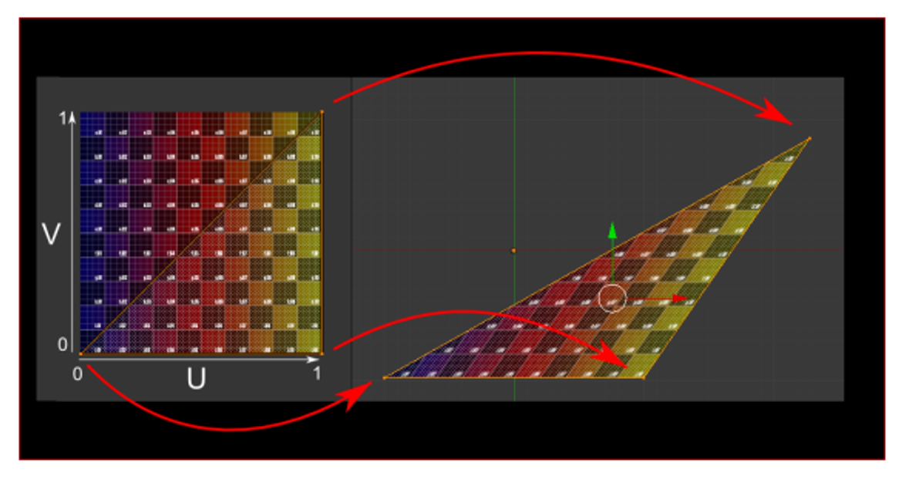
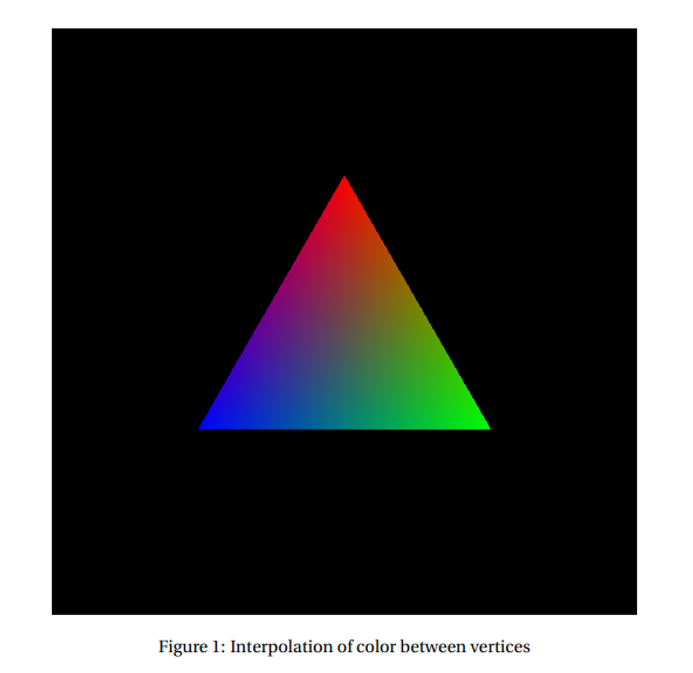
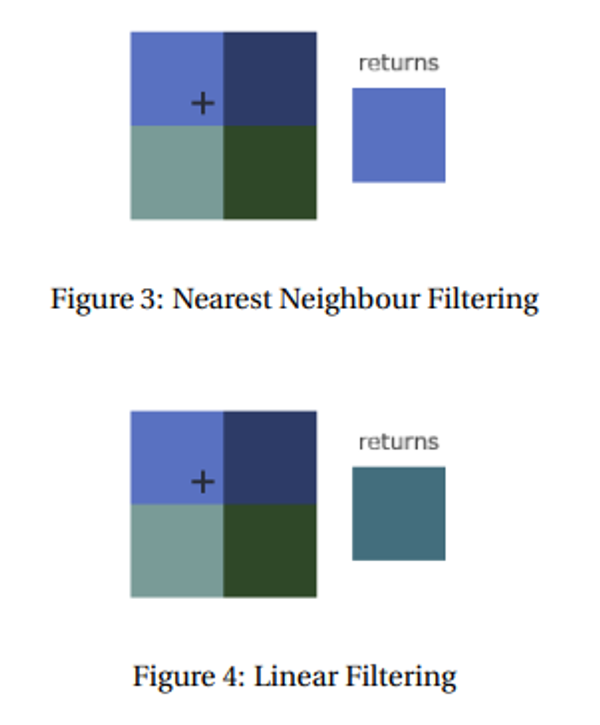

# Render Pipeline

Now that we’re heading into 3D, it’s important that we know how OpenGL actually renders objects and in what order

The pipeline follows 5 basic steps

1. Vertex specification
2. Vertex processing
3. Vertex post-processing
    1. Primitive assembly
    2. Clipping
    3. Face culling
4. Rasterization
5. Sample Processing
    1. Depth testing, blending, etc.

## Vertex Specification

Vertices are, at their core, points in space used to generate primitives

The only required attribute for these is position (glVertex), but there are others used to build the broader primitives

- glColor
- glNormal
- glTexCoord (for textures)

Since OpenGL is a state machine, vertex attributes like glColor persist and are applied to evert vertex specified with each glVertex call

For the texture, we’re essentially covering triangles with an image rather than a color



The texture coordinates are a pair of floats in the range $[0,1]$, often called $(u,v)$, which map to the width and height of the texture, respectively

The texture is then squished onto the image according to the triangle’s vertices to fit onto the triangle 

## Fixed Functions

The fixed function pipeline, a layer in between vertex specification and assembly, defines default behaviour for vertices, basically consisting only of matrix multiplication (GL_MODELVIEW → GL_PROJECTION)

- It’s consider fixed because it has no programmatic capabilities

After this, we get to primitive assembly

## Primitive Assembly & Face Culling

Primitive assembly is the process of breaking down a vertex stream into a sequence of base primitives (points, lines and triangles)

- Face culling is done to remove triangles whose front face is or is not facing the camera

With winding order and glFrontFace, we specify whether the front face has vertices circling clockwise or counter-clockwise around the center

We can then enable face culling with glEnable(GL_CULL_FACE) and then well it which faces to cull, either front towards the camera (glCullFace(GL_FRONT)), back or both (GL_BACK, GL_FRONT_AND_BACK)

## Rasterization & Attribute Interpolation

Rasterization is the process of converting base primitives to fragments, providing all the information needed to color a pixel, including position, depth, color and other attributes

What we didn’t color is interpolations, which is the process that rasterization uses to turn vertex attributes into the values for each fragment

Interpolation is used to interpolate multiple vertices’ attributes across all fragments between those vertices, using a simple lerp between the attributes of each vertex

However, since a triangle has three vertices, it’s not a simple lerp, but rather a weighted average based on the distance between a fragment’s position and each of the vertices

For an example, if a triangle has all three vertices set to a different color, the result fragments vary between combinations of those colors



This is essentially how texture mapping works, since each fragment gets an interpolated value of texture coordinates

- From here, we access a texture’s pixel (texel) to determine the color of the fragment

We still need to handle discrete pixel coloring, which we do with texture filtering

Two strategies exist: nearest neighbour and bilinear/linear filtering



## Sample Processing

Now that we have out fragments we need to draw them out to the frame buffer, but it’s possible for different primitives to overlap, allowing more than one fragment to cover the same pixel

What we mainly need to consider is depth and blending; without enabling these, whatever is drawn last would be displayed

- We enable these with glEnable

### Depth

When a fragment is determined to cover a pixel, it first checks if that pixel is already covered, color that pixel if it isn’t

If it is, either color it again (overdraw) or discard the current fragment and leave the pixel unmodified

The choice to overdraw depends on the depth test, using the z coordinate of the fragment after perspective divide to determine whether the current fragment passes or not

The values that pass a depth test depend on the depth function, using glDepthFunc

The options include

- GL_LESS: if the depth value is less than the previous one, depth test passes
- GL_GREATER: same thing but in reverse

The actual comparison is facilitated through the depth buffer, so when we draw fragments to the frame buffer, we also draw them to the depth buffer in a one-to-one correspondence

### Blending

Blending allows fragments to be blended and mixed together to get interesting effects, using the blend function to determine how that fragment’s color is mixed with the existing pixel color in the frame buffer

Many of these functions exist, but they all specify a weighted sum of the course color and the destination color

Letting $f_{s,R}, f_{s,G}, f_{s,B}, f_{s,A}$ be the scale factors for the source color channels $R,G,B,A$ and $f_{d,R}, f_{d,G}, f_{d,B}, f_{d,A}$ be the destination color channels, the new color is calculated by the following

$$
new_i = S_if_{s,i}+D_if_{d,i}
$$

- $new_i$ is clamped so as to not overflow the max

We specify the blend function with glBlendFunc with the most common being glBlendFunc(GL_SRC_ALPHA, GL_ONE_MINUS_SRC_ALPHA) and the default being glBlendFunc(GL_ONE, GL_ZERO)

- The most common one mimics the effect of translucent objects

### Clearing

We can clear our buffers and write a solid color to everywhere with glClear, with glClearColor specifying a default color and glClearDepth to specify a default depth (default is 1)

## Shaders

An important part of graphics is shaders, which specify textures, lights, material, etc.

We can use GLSL to write these shaders, which is a programming language similar to C, executed as a shader object, linking to become a program

GLSL doesn’t have the same capacity as C, but it does include more stuff, including vectors, matrices, textures and more

The basic program consists of 4 main parts

```c
#version xyz core //version code

in vec3 fromPreviousShader //input variables

out vec3 toNextShader //output variables

void main() { //main function
	toNextShader = fromPreviousShader;
}
```

You can also just write these as functions and call them from main

### Vertex Shaders

Vertex shaders are executed for each vertex in a draw call, with the inputs coming from vertex specification and any other attributes

- You NEED to have these attributes if the shader expects it, otherwise you’re screwed

The outputs are then passed to the next stage (other shaders if they’re specified, post-processing if they’re not)

We need a vertex position at minimum, which is specified in clip space, so for vertices in local coordinates, the output should be $PVMv_{local}=v_{clip}$

- The shader usually does this itself but we can always do it on the client side

### Tesselation & Geometry Shaders

These generate more primitives from existing primitives as a sort of primitive pre-assembly and extension, where tesselations sub-divide primitives and geometries create new vertices

- More on this later…

### Fragment Shaders

To shade fragments, we get some inputs by default that don’t need to be explicitly mentioned

- vec4 gl_FragCoord, the (x,y) position of the fragment in window space
- bool gl_FrontFacing, says whether or not the fragment is facing the camera or not
- Anything else interpolated from vertex attributes in the vertex shader

The output must include at least one color so that we can see it, traditionally using vec4 gl_FragColor as a built-in

- This is deprecated in newer versions, so we should output a different variable that specifies what to draw

If you noticed, the next shader must take input values that are outputted from the previous shader, which is known as interface matches

## Shaders in Practice

To actually use shaders, we specify the code as a string, which is compiled into a shader object and linked to programs at runtime

The basic steps are as follows

1. Create a shader object with glCreateShader(GL_SHADER_TYPE), returning a unique ID
2. Specify the source code with glShaderSource(shaderID, count, stringArray, lengthArray)
3. Compile the shader with glCompileShader(shaderID)

Usually stringArray is just one string, but OpenGL allows for several strings to be passed and a concatenation is produced, creating the source code

- lengthArray is the length of the string (we can use NULL to specify that the strings are NULL-terminated)

Now we don’t have a program yet, so let’s do that

1. Create the program with glCreateProgram()
2. Attach the objects with glAttachShader(programID, shaderID)
3. Link the program with glLinkProgram(programID) to create an executable

This state is then fixed until we call glLinkProgram again

### Using Shaders

Now we have a program, but we still need to use this, so we need to look at vertex specification

Each attribute in a vertex shader is given a location, so we need to tell OpenGL where they are for each draw call


```glsl
in vec3 vertexPosition_modelspace;
in vec4 color_in;

void main() { ... }
```

In the above, `vertexPosition_modelspace` implicitly has location 0 and `color_in`, location 1. We can also explicitly give a variable a location by prefacing it with `layout(location = i)`.

```glsl
layout(location = 0) in vec3 vertexPosition_modelspace;
layout(location = 1) in vec4 color_in;

void main() { ... }
```

Let’s say we have parallel arrays of floats for the vertex attributes of position and color. For example, vertex `i` should have (x, y, z) position:
```
(vertices[3*i], vertices[3*i + 1], vertices[3*i + 2])
```
and RGBA color:
```
(colors[3*i], colors[3*i + 1], colors[3*i + 2], colors[3*i + 3]).
```
We must enable a vertex attribute at a specific location, and then provide a pointer to that attribute data.

```c
glEnableVertexAttribArray(0); // enable location 0
glVertexAttribPointer(
    0,                  // attribute location in shader
    3,                  // this attribute has 3 coordinates
    GL_FLOAT,           // type
    GL_FALSE,           // normalized?
    0,                  // stride
    vertices            // vertex attribute pointer
);

glEnableVertexAttribArray(1); // enable location 1
glVertexAttribPointer(
    1,                  // attribute location
    4,                  // this attribute has 4 coordinates
    GL_FLOAT,           // type
    GL_FALSE,           // normalized?
    0,                  // stride
    colors              // vertex attribute pointer
);
```

We need to recall that our vertices are assumed to be in clip space, so we need to translate ourselves

Luckily, GLSL provides us a way to just import the matrix that we’re using


1. **Find** the uniform: we get the location of a uniform variable of name `varName` using `glGetUniformLocation(ProgramID, "varName")`. This returns a unique ID for the variable in the program. This find only needs to be done one time, after the program is linked.

2. **Set** the uniform: we use `glUniform*(uniformID, ...)`

With this shader:
```glsl
in vec3 vertexPosition_modelspace;
uniform mat4 MVP;

void main() {
    gl_Position = MVP * vertexPosition_modelspace;
}
```

The following sets the uniform:
```cpp
glm::mat4 Projection = glm::perspective(glm::radians(45.0f), screenW/screenH, 0.001f, 1000.0f);
glm::mat4 V = glm::lookAt(eye, center, up);
glm::mat4 M = glm::mat4(1.0f); // identity
glm::mat4 MVP = Projection * V * M;

GLuint MatrixID = glGetUniformLocation(ProgramID, "MVP");
glUniformMatrix4fv(MatrixID, 1, GL_FALSE, &MVP[0][0]);
```


## Textures Again

We can use texture objects similarly to how we use shader objects, complete with texture storage

1. **Bind** the texture object to a **texture target**. Possible targets are, `GL_TEXTURE_1D`, `GL_TEXTURE_2D`, `GL_TEXTURE_3D`, etc. depending on the dimensions of the image to load. This is done with `glBindTexture(textureTarget, textureID)`.

2. **Load** the bitmap image into a texture target: `glTexImageXD` must use `GL_TEXTURE_XD` as its target, where X is one of 1, 2, 3.

3. **Generate Mipmaps**. Just call `glGenerateMipmap(GL_TEXTURE_XD)`. Otherwise your texture won't work.

4. After loading, one should **unbind** the texture object. Since OpenGL is a state machine, we want to avoid accidental side-effects of leaving a texture object bound. We unbind an object to a target by calling `glBindTexture(GL_TEXTURE_XD, 0)`.


Texture units can also be defined, which are slots used to access texture data in draw calls.

1. **Set which texture unit is active** by calling `glActiveTexture(GL_TEXTUREi)`.

2. **Enable a texture target within the active unit**. We call `glEnable` with one of `GL_TEXTURE_1D`, `GL_TEXTURE_2D`, `GL_TEXTURE_3D`, etc. to get that texture enabled for subsequent draw calls.

3. **Bind** a texture object to a texture target. We may have previously bound a texture object to a texture target in order to fill it with data, but now we have to bind it again so that the draw calls can read the texture data.

4. Do your draw calls (details below).

5. **Unbind** the texture object.


A vertex shader should input and output texture coordinates as part of the vertex specification. After interpolation, each fragment will have its own texture coordinates. Now, the fragment shader should use those texture coordinates to actually read data from the texture. This is the job of the sampler.

```glsl
#version 330 core

in vec2 uv2;
uniform sampler2D tex;

void main() {
    gl_FragColor = texture(tex, uv2);
}
```

In GLSL, we use the `texture()` function to read the color data from a texture's texture storage at a particular location. If the texture is 2D, we need 2D coordinates, etc. The uniform variable `tex` is actually a simple integer to describe which texture unit to read from. By default, it is 0.

If we want to read from a texture unit other than `GL_TEXTURE0`, we have to set the uniform in the shader appropriately. In our client code, we get the uniform location from the linked program object and then set its value:

```cpp
GLuint texID = glGetUniformLocation(ProgramID, "tex");
glUniform1i(texID, i); // i is an integer corresponding to GL_TEXTUREi
```
