# Tesselation Shaders

We’ve talked about how there’s tesselation and geometry shaders in between fragment shaders and vertex shaders, but what do these actually mean?

Essentially, these are here to dynamically create more vertex data

## Tesselation

We create more vertex data by adding a patch, which computes new vertex values for the purpose of having more rendered data and, thus, better visual results that otherwise wouldn’t be possible due to limited resources

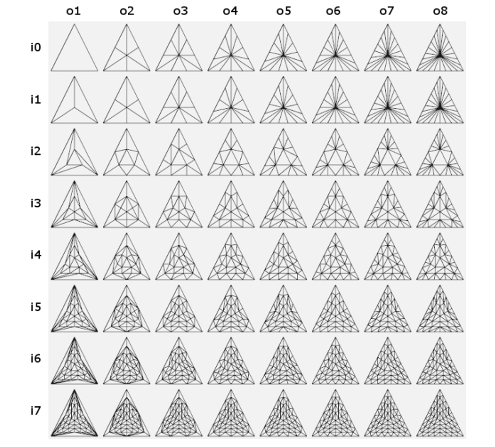

This patch is a special primitive which consists of $n$ vertices in the range $[0,32)$

The tesselation itself is split into 3 stages:

1. Tesselation Control Shader (TCS): this controls the amount of tesselation in each patch, as well as the number of vertices (size)
2. Tesselation primitive generation: a fixed functionality where abstract patches (collections of vertices with the same tesselation parameters) are subdivided
3. Tesselation Evaluation Shader: a secondary shader that computes the correct per-vertex values for vertices generated by the previous step

### How Much Tesselation?

Tesselation is controlled by outer tesselation (how many vertices on the outside edges) and inner tesselation (how many vertices are inside the patch)

The algorithms themselves are disgusting to look at so I’ll spare you the details, but in general we want to equally space out our new vertices as much as possible when we put in an integer

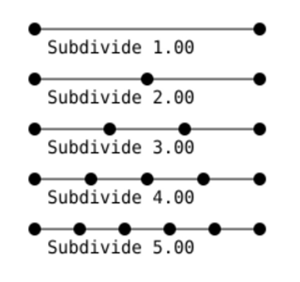

- We can use decimals to do unequal spacing, but that’s outside the scope of this course

For triangles, there’s 3 outer tesselation levels and 1 inner tesselation level

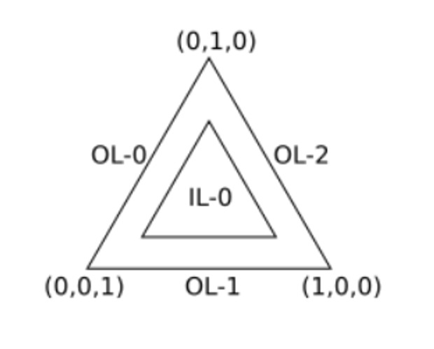

We start by subdividing the outer edges based on the inner tesselation level (outer based on inner…you can see why I’m sparing the details) and then, for each generated vertex, drawing a perpendicular line from it towards the center

Then, every time one of these lines cross, we create a new vertex, from there creating a ring in the middle

From here, we continue making new vertices from the lines crossing with the rings, making new lines out of those vertices and so on and so forth

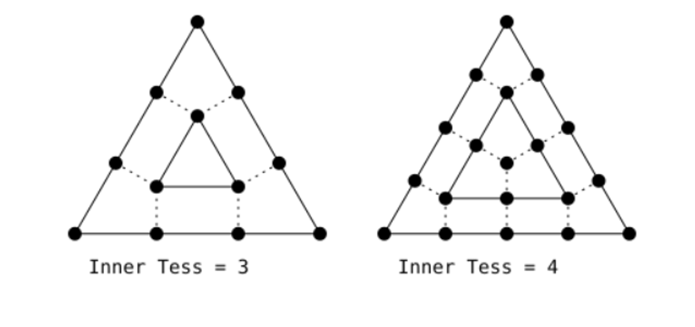

Next, we remove all the generated vertices on the outside, recalculating them with the outer tesselation level

Finally, we triangulate the vertices so that the mesh spans the area of the triangle

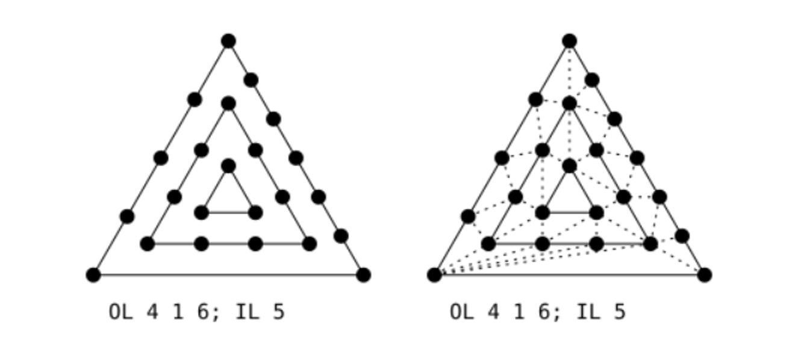

Quads are a similar story, except there’s two inner tesselation levels (one for vertical, one for horizontal) and four outer tesselation levels

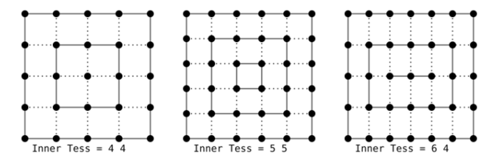

These are more often used in 3D graphics to smooth out and add detail to objects

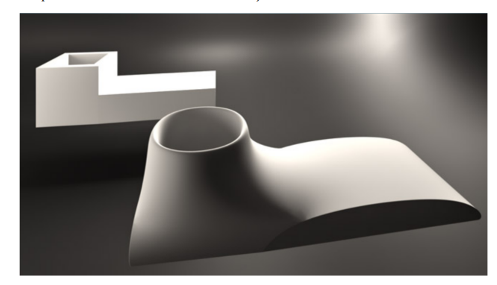

## Geometry Shaders

Geometry shaders sit in between tesselation and fragment shaders, so it takes input from the tesselation shader if it exists, and vertex shader if there’s no tesselation done

In essence, these deal with primitives, so it takes in an input primitive and outputs another kind of output primitive

These can create, remove and change vertices, much like tesselation can, except more powerful

The input is one of the following

- Points
- Lines (segments)
- Lines_adjacency (two vertices for a segment and two more vertices for adjacency vertices; more on this in a bit)
- Triangles
- Triangles_adjacency (three vertices for a triangle and three more adjacency vertices)

We specify lines_adjacency with GL_LINES_ADJACENCY in glDrawArrays or glDrawElements

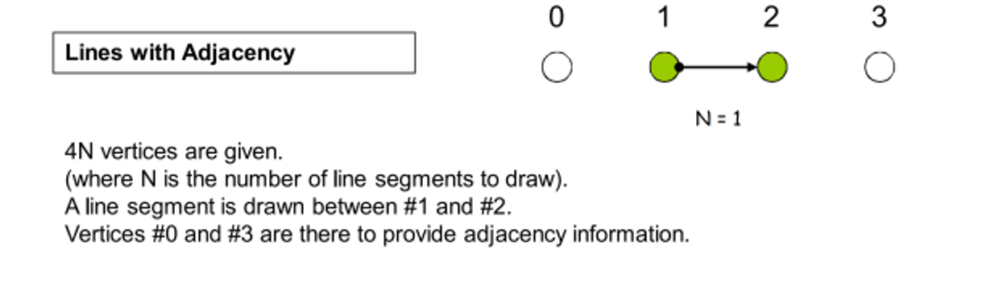

Triangles, likewise, are done the same way but with GL_TRIANGLES_ADJACENCY

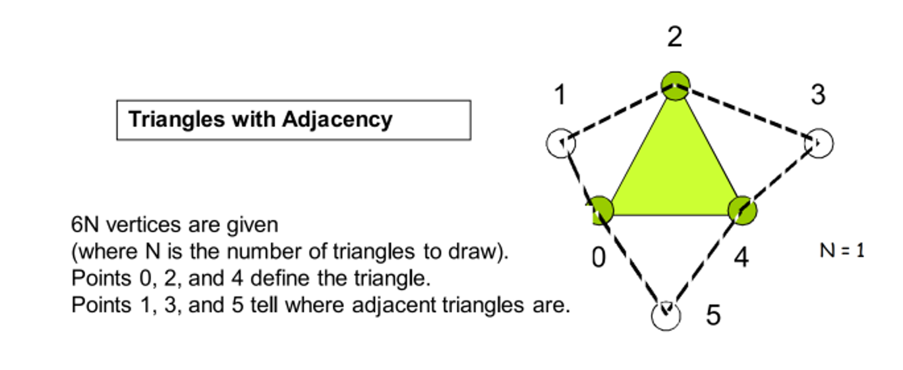

We output zero or more primitive, all of which have a particular output type, including points, line strips and triangle strips

Below is a geometry shader that does…nothing!
```cpp
#version 400
layout (triangles) in;
layout (triangle_strip, max_vertices=3) out;

in vec2 uv_vs[];
out vec2 uv;

void main() {
    for(int i = 0; i < gl_in.length(); ++i) {
        gl_Position = gl_in[i].gl_Position;
        uv = uv_vs[i];
        EmitVertex();
    }
    EndPrimitive();
}
```

The mandatory parts are as follows

- layout(…) in: gives the input type
- layout (…, max_vertices=n) out: gives the type of the out primitive and the max number of vertices in any particular strip (n=1 when outputting points)
- Interface matching with the fragment shader (we still need to do that, you know)

To do real interface matching, we need two special pieces of information:

The first thing we need is that vertex shaders output per-vertex attributes, but geometry shaders process primitives, meaning what we receive is arrays of per-vertex values, with the size depending on the number of vertices needed for the input type (1-6)

Secondly, the number of output vertices is dynamic and can be different for each invocation, so we must use a stream approach for our putout

We do the second part with EmitVertex(), which generates a vertex using previously defined atrributes

- Calling EmitVertex() clears the next set of variables, so you must redefine the values for each call

We also should call EndPrimitive() once we’re done outputting a primitive, but we can also use this to output multiple primitives in a single invocation

The following makes an exploding object based on its normals, computed in clip space because we want the primitives to maintain their size but move position, so the vertex shader should output gl_Position = MVP * vecPos

```cpp
#version 400
layout (triangles) in;
layout (triangle_strip, max_vertices=3) out;

in vec2 uv_vs[];
out vec2 uv;

vec3 GetNormal() {
    vec3 a = vec3(gl_in[0].gl_Position) - vec3(gl_in[1].gl_Position);
    vec3 b = vec3(gl_in[2].gl_Position) - vec3(gl_in[1].gl_Position);
    return normalize(cross(a, b));
}

void main() {
    vec3 normal = GetNormal();
    for(int i = 0; i < gl_in.length(); ++i) {
        gl_Position = gl_in[i].gl_Position + 4*vec4(normal, 0.0);
        uv = uv_vs[i];
        EmitVertex();
    }
    EndPrimitive();
}
```

Generating new data is also pretty straightforward

Expanding out exploding object, we can create layers of exploded polygons like so

```cpp
#version 400
layout (triangles) in;
layout (triangle_strip, max_vertices=9) out;

in vec2 uv_vs[];
out vec2 uv;

vec3 GetNormal() {
    vec3 a = vec3(gl_in[0].gl_Position) - vec3(gl_in[1].gl_Position);
    vec3 b = vec3(gl_in[2].gl_Position) - vec3(gl_in[1].gl_Position);
    return normalize(cross(a, b));
}

void main() {
    vec3 normal = GetNormal();
    for(int i = 0; i < gl_in.length(); ++i) {
        gl_Position = gl_in[i].gl_Position + 0*vec4(normal, 0.0);
        uv = uv_vs[i];
        EmitVertex();
    }
    EndPrimitive();
    for(int i = 0; i < gl_in.length(); ++i) {
        gl_Position = gl_in[i].gl_Position + 3*vec4(normal, 0.0);
        uv = uv_vs[i];
        EmitVertex();
    }
    EndPrimitive();
    for(int i = 0; i < gl_in.length(); ++i) {
        gl_Position = gl_in[i].gl_Position + 6*vec4(normal, 0.0);
        uv = uv_vs[i];
        EmitVertex();
    }
    EndPrimitive();
}
```

A classic example is hair, but a simpler case would be drawing normals of a mesh for debugging

So, in the case, we want to draw a line segment starting at the vertex going along the normal, requiring vertex data to go to the geometry shader in model space, so it’s up to the geometry shader to put everything in clip space

```glsl
#version 400

layout(location = 0) in vec3 vertexPosition_modelspace;
layout(location = 1) in vec3 vertexNormal_modelspace;

out vec2 uv_vs;
out vec3 normal_vs;

void main(){
    uv_vs = uv_coord;
    normal_vs = vertexNormal_modelspace;

    gl_Position = vec4(vertexPosition_modelspace,1);
}
```


```glsl
#version 400
layout (points) in;
layout (line_strip, max_vertices=9) out;

in vec2 uv_vs[];
in vec3 normal_vs[];

uniform mat4 MVP;

void main() {
    gl_Position = MVP*(gl_in[0].gl_Position);
    EmitVertex();
    gl_Position = MVP*(gl_in[0].gl_Position + 2.0*vec4(normal_vs[0], 0.0f));
    EmitVertex();
    EndPrimitive();
}
```

Adding some bezier curves, we get hair!

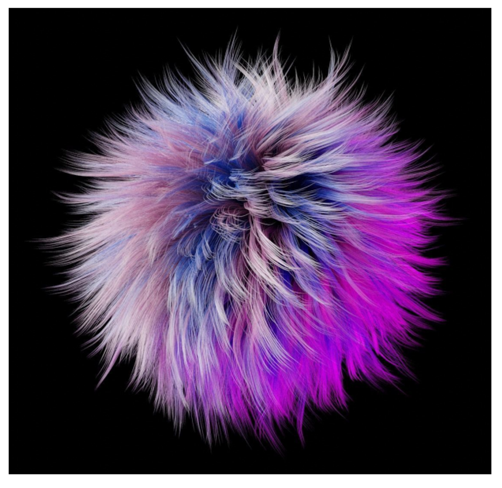


## Tesselation Control Shaders

We write these shaders to invoke on a single match of vertices, with the number of vertices being specified by the following

```cpp
layout (vertices=N) out;
```

This shader is invoked once per vertex per path, the vertex in question corresponding to a gl_InvocationID which is built in to the shader

All of the inputs to the TCS are aggregated into an array based on the size of the input patch, so user-defined outputs can be accessed as such

```cpp
in vec3 color_vs[];
```

The outputs that are built in are accessed as such

```cpp
gl_in[gl_InvocationID].gl_Position;
```

Likewise with the input, the output should also be outputted to an array using gl_InvocationID

```cpp
out vec3 color_tcs[]
//...
color_tcs[gl_InvocationID] = color_vs[gl_InvocationID];
```

It also must write to gl_TessLevelOuter[] and gl_TessLevelInner[] to control the tesselation level, with the number of indices to use depending on the patch type defined in the tesselation evaluation shader

- For triangles: 3 outer levels, 1 inner level;
- For quads: 4 outer levels, 2 inner levels;
- For isolines: 2 outer levels, 0 inner levels;


Lastly, we meed the gl_out[].gl_Position


## A Tessellation Control Shader
```glsl
#version 400

layout (vertices = 3) out;

in vec3 color_vs[];
out vec3 color_tcs[];

uniform float outerTess;
uniform float innerTess;

void main() {
    gl_out[ gl_InvocationID ].gl_Position = gl_in[ gl_InvocationID ].gl_Position;
    color_tcs[gl_InvocationID] = color_vs[gl_InvocationID];

    gl_TessLevelOuter[0] = outerTess;
    gl_TessLevelOuter[1] = outerTess;
    gl_TessLevelOuter[2] = outerTess;
    gl_TessLevelInner[0] = innerTess;
}
```

**Note:** `gl_InvocationID` is the index within the patch of the incoming vertex. If your vertex buffer has:

```
-1, 1, 0,
 1, 1, 0,
 0, 0, 0
```

Then vertex `(-1, 1, 0)` has `gl_InvocationID 0` and `gl_in[0]` corresponds to whatever the vertex shader outputs when processing the vertex `(-1, 1, 0)`.


## Tesselation Evaluation Shader

The tesselation primitive generation produces extra vertices from the input patch vertices and the abstract primitives they define depending on the levels specified in the previous step

The actual type of the primitive is defined in the TES, as well as giving all the new vertices their attributes, acting as a secondary vertex shader

- These are NOT automatically interpolated!

The TES must compute the correct vertex attributes for each newly generated vertex, invoked once per new vertex, computing…

1. Vertex position (either in clip space or whatever the geometry shader wants)
2. Any user-defined attributes expected by the geometry/fragment shader

In particular, there are a number of specifications

1. The abstract patch type and **how** tessellation should be applied is defined by the layout parameter:

    ```glsl
    layout (triangles, equal_spacing) in;
    ```

    The abstract patch types are triangles, quads, and isolines. The spacing types are `equal_spacing`, `fractional_even_spacing`, `fractional_odd_spacing`.

2. All inputs from TCS to the TES are aggregated into arrays, based on the number of vertices in the abstract patch type.

    User-defined inputs and built-in inputs are accessed just as the TES, but using the vertex indices of the abstract patch rather than `gl_InvocationID`.

3. All outputs of the TES are per-vertex and are thus **not** arrays. This includes the normal vertex shader outputs like `gl_Position`, and any other vertex attribute expected by the geometry/fragment shader.

4. When the abstract patch is a quad, the outputs of the TES are computed similar to texture coordinates, using a normalized 2D point to interpolate between the 4 corners of the quad. It uses the first two indices from `vec3 gl_TessCoord`.

5. When the abstract patch is a triangle, the outputs of the TES are computed using barycentric coordinates and three indices from `vec3 gl_TessCoord`.


### Barycentric Coordinates

Barycentric coordinates give positions within a triangle as a 3D vector, thus giving the weights in a weighted sum of the 3 corners

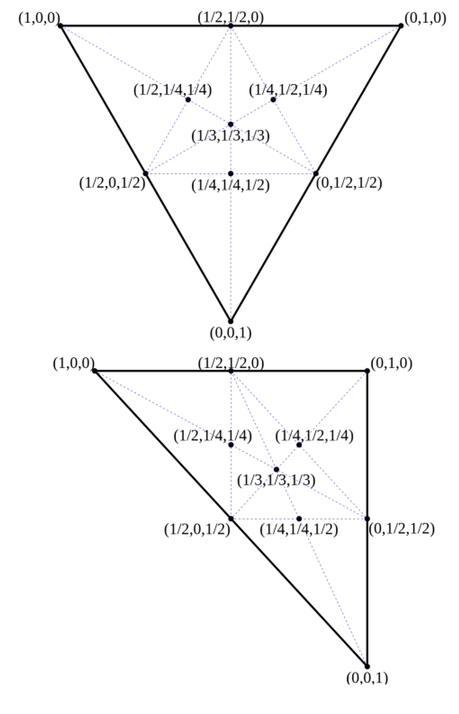

Overall, our TES might look something like this

```glsl
// A Tessellation Evaluation Shader
#version 400

layout (triangles, equal_spacing) in;

uniform mat4 MVP;

in vec3 color_tcs[];
out vec3 color_gs;

void main() {
    vec4 p1 = gl_in[0].gl_Position;
    vec4 p2 = gl_in[1].gl_Position;
    vec4 p3 = gl_in[2].gl_Position;

    gl_Position = vec4(0.0);
    gl_Position += gl_TessCoord.x * p1;
    gl_Position += gl_TessCoord.y * p2;
    gl_Position += gl_TessCoord.z * p3;
    
    color_gs = vec3(0.0);
    color_gs += gl_TessCoord.x * color_tcs[0];
    color_gs += gl_TessCoord.y * color_tcs[1];
    color_gs += gl_TessCoord.z * color_tcs[2];
}
```

## Geometry Shaders with Tesselation Shaders

Implicit interpolation of attributes is always pretty annoying when it comes to tesselation shaders, so the vertices output might lose the face that they are now independent primitives

Consider defining a vertex attributes for each corner of a tesselation-generated triangle as…

```cpp
vec3 attrib1(1, 0, 0);
vec3 attrib2(0, 1, 0);
vec3 attrib3(0, 0, 1);
```

Since the new vertices are computed using gl_TessCoord, it’s extremely difficult to determine which vertex corresponds to which discrete primitive, but this is where the geometry shader comes in!

Here, we can just treat the new vertices as if they were full-fledged primitives, so long as the input primitive type of the geometry shaders matches the abstract patch type of the TES

```glsl
// A Geometry Shader
#version 400

layout (triangles) in;
layout (triangle_strip, max_vertices = 3) out;

in vec3 color_tes[];
flat out vec3 color_gs;
out vec3 triDistance;

void main() {
    gl_Position = gl_in[0].gl_Position;
    color_gs = color_tes[0];
    triDistance = vec3(1, 0, 0);
    EmitVertex();

    gl_Position = gl_in[1].gl_Position;
    color_gs = color_tes[1];
    triDistance = vec3(0, 1, 0);
    EmitVertex();

    gl_Position = gl_in[2].gl_Position;
    color_gs = color_tes[2];
    triDistance = vec3(0, 0, 1);
    EmitVertex();

    EndPrimitive();
}
```

Here, triDistance will be interpolated across each fragment generated by this primitive during rasterization, so triDistance corresponds to how close the generated fragment is to the edges of the primitive

We can exploit this in the fragment to generate edges to the tesselation

```glsl
#version 400

flat in vec3 color_gs;
in vec3 triDistance;

out vec4 color;

void main(){
    float d1 = min(min(triDistance.x, triDistance.y), triDistance.z);
    if (d1 < 0.02) {
        color = vec4(0, 0, 0, 1);
    } else {
        color = vec4(color_gs, 1.0);
    }
}
```

## In OpenGL

Finally, we just need to call glPatchParameteri(GL_PATCH_VERTICES, N), where N is the number of vertices in the TCS, as well as use GL_PATCHES with any calls to glDrawArrays or glDrawElements