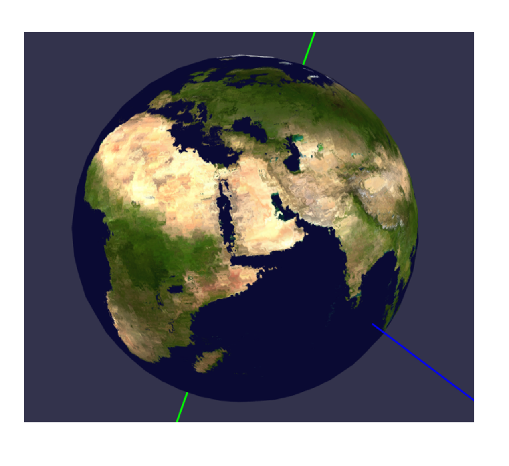

# Improved Textures

To make our textures realistic, we can use bump maps, displacement maps and normal maps to manipulate the lighting calculation of the geometry itself

## Height Maps

A height map is a very simple map; it’s a grey-scale image where, the lighter a portion is, the higher up it is


We can use this for more than height, but this is up to user interpretation and how it’s utilized in the rendering process

## Bump Maps

With classic bump mapping, we read height data from a texture at a point and the points surrounding it to compute a normal

Consider a height map encoding a function $f(u,v)=h$, or coordinates $u,v$ generating a value $h$: from vector valculus, we can compute the normal at the point using the gradient

$$\vec{n} = \nabla F(x, y, z) = \left( \frac{\partial F}{\partial x}, \frac{\partial F}{\partial y}, \frac{\partial F}{\partial z} \right)$$


Don’t worry! We don’t have to calculate this from fresh since we have discrete pixels and not a continuous function

```
  T
L O R
  B
```


Given this encoding, we can just calculate the derivates manually

All we need now is $z$, which is just given 1 for “out of the page”

The problem is that we need to normalize this, so we should scale $z$to match the scale of the height map, with a “bump amount” ranging from 0 to 1

$$
\frac{\partial F}{\partial x} = \frac{R - L}{2}
$$

$$
\frac{\partial F}{\partial y} = \frac{T - B}{2}
$$


$$
\vec{n} = \left( \frac{R - L}{2}, \frac{T - B}{2}, \text{bumpAmount} \right)
$$


This looks good, but it’s relative to the image surface, so we have to translate this much like we did with textures

### Tangent Space

Given a point on a surface, we can picture a plane at that point with the same normal as that surface


The texture coordinates are also technically specified here, with the 2D space tangent to the point in all directions

The normal of this plane is the normal of the surface at the point, spanned by two vectors called the tangent vector and the bitangent vector


What we need to do now is to bring the height map normal over to world space, which we can do with yet another matrix

Specifically, we want to convert $(T,B,N)$ to $(W_x, W_y, W_z)$, which is actually pretty simple: we already have world coordinates and tangent coordinates, so we can form a triangle like so


P1-3 are in world space, while UV are in tangent space

From here, we can get $E_1=P_3-P_2$ and $E_2=P_2-P_1$, computing the two tangent space vectors as $(u_3-v_3)-(u_2, v_2)$ and $(u_2,v_2)-(u_1, v_1)$

From here, we can build up our matrix as such

This creates a system of equations that we can solve to find $ T $ and $ B $ as vectors in world space.

$$
\begin{bmatrix}
E_{1x} & E_{1y} & E_{1z} \\
E_{2x} & E_{2y} & E_{2z}
\end{bmatrix}
=
\begin{bmatrix}
u_2 - u_1 & v_2 - v_1 \\
u_3 - u_2 & v_3 - v_2
\end{bmatrix}
\begin{bmatrix}
T_x & T_y & T_z \\
B_x & B_y & B_z
\end{bmatrix}
$$

Finally $ N = T \times B $. So, our so-called TBN matrix which transforms from tangent space to world space is:

$$
TBN =
\begin{bmatrix}
T_x & B_x & N_x \\
T_y & B_y & N_y \\
T_z & B_z & N_z
\end{bmatrix}
$$

This is very similar to how we constructed the View matrix using right, up, and direction vectors for camera space:

$$
\begin{bmatrix}
\hat{r}_x & \hat{r}_y & \hat{r}_z \\
\hat{u}p_x & \hat{u}p_y & \hat{u}p_z \\
\hat{d}_x & \hat{d}_y & \hat{d}_z \\
\end{bmatrix}
$$


From here, we can just take the transpose of TBN (which is also the inverse) to get a matrix to go from tangent to world instead of world to tangent

### TBN in Practice

A simple (but INEFFICIENT) way is to use a geometry shader

Since the geometry in a triangle mesh usually doesn’t change, we can compute the tangent space and store it once, so using a geometry shader just moves the computation to be done or us by the rendering pipeline

In other words, given a triangle, we want to compute the TBN matrix for it, so the geometry shader with its per-triable info is very well suited for this


Solving the system can be done by computing the inverse of the 2x2 matrix. The inverse can be computed using a formula of $ u_1, u_2, u_3, v_1, v_2, v_3 $ rather than actually computing a matrix inverse.

```glsl
#version 400
layout (triangles) in;
layout (triangle_strip, max_vertices=3) out;
...

void main() {
    vec3 edge1 = worldPos_vs[1] - worldPos_vs[0];
    vec3 edge2 = worldPos_vs[2] - worldPos_vs[1];
    vec2 delta1 = uv_vs[1] - uv_vs[0];
    vec2 delta2 = uv_vs[2] - uv_vs[1];

    vec3 T, B;
    float f = 1.0f / (delta1.x * delta2.y - delta2.x * delta1.y);

    T.x = f * (delta2.y * edge1.x - delta1.y * edge2.x);
    T.y = f * (delta2.y * edge1.y - delta1.y * edge2.y);
    T.z = f * (delta2.y * edge1.z - delta1.y * edge2.z);

    B.x = f * (-delta2.x * edge1.x + delta1.x * edge2.x);
    B.y = f * (-delta2.x * edge1.y + delta1.x * edge2.y);
    B.z = f * (-delta2.x * edge1.z + delta1.x * edge2.z);

    T = normalize(T);
    B = normalize(B);

    vec3 N = normalize(cross(T, B));
    mat3 TBN = mat3(T, B, N);
    ...
}
```

Lastly, we can use our fragment shader to compute the tangent-space normal from the height map and use it as the normal for lighting

Since we’re using the Phong model again, so we need to change the normal to camera space using V and TBN
```cpp
void main() {
    // Material properties
    vec4 diffuse = texture(colorTex, uv_gs);
    vec4 ambient = 0.2 * diffuse;
    vec4 specular = vec4(0.0, 0.0, 0.0, 1.0);

    float step = 0.005;
    float T = texture(heightTex, uv_gs + vec2(0, step)).x;
    float B = texture(heightTex, uv_gs + vec2(0, -step)).x;
    float R = texture(heightTex, uv_gs + vec2(step, 0)).x;
    float L = texture(heightTex, uv_gs + vec2(-step, 0)).x;
    vec3 heightN = vec3((R - L) / 2, (T - B) / 2, 0.05);
    heightN = TBN * heightN;
    heightN = (V * M * vec4(heightN, 0)).xyz;

    float bumpAmt = 0.5;
    vec3 n = normalize((1 - bumpAmt) * normal_cameraspace_gs +
                        normalize((bumpAmt * heightN)));

    vec3 l = normalize(light_cameraspace_gs);
    float cosTheta = clamp(dot(n, l) + 0.65, 0, 1); // +0.65 to help with "planet" lighting

    vec3 E = normalize(eye_cameraspace_gs);
    vec3 Rf = reflect(-l, n);
    float cosAlpha = clamp(dot(E, Rf), 0, 1);

    float alpha = 4;
    color = ambient + diffuse * cosTheta + specular * pow(cosAlpha, alpha);
}
```

Here’s what we get as the result


## Normal Mapping

Bump mapping is kinda legacy nowadays and height maps are still used for height encoding, but normals are usually done with normal maps, which encodes the normals of a surface as an RGB image, with the three channels encoding x, y and z

To use the normal map, we still need all the tangent space vectors and the TBN matrix, but our fragment shader becomes a lot simpler since we can get the normal straight from the texture

The only problem is that normals can point in any direction, while colors can’t, so we must remap the RGB color range from $[0,1]$ to $[-1,1]$, so the blue-grey color we see (0.5,0.5,1) corresponds to the neutral normal of (0,0,1)


```glsl
vec3 heightN = texture(normalTex, uv_gs);
    heightN = 2.0 * heightN - vec3(1.0, 1.0, 1.0);
```

Our fragment shader then looks like this

```glsl
void main() {
    // Material properties
    vec4 diffuse = texture(colorTex, uv_gs);
    vec4 ambient = 0.2 * diffuse;
    vec4 specular = vec4(0.0, 0.0, 0.0, 1.0);

    vec3 heightN = texture(normalTex, uv_gs);
    heightN = 2 * heightN - vec3(1, 1, 1);
    heightN = TBN * heightN;
    heightN = (V * M * vec4(heightN, 0)).xyz;

    float bumpAmt = 0.5;
    vec3 n = normalize((1 - bumpAmt) * normal_cameraspace_gs +
                        normalize((bumpAmt * heightN)));

    vec3 l = normalize(light_cameraspace_gs);
    float cosTheta = clamp(dot(n, l) + 0.65, 0, 1); // +0.65 to help with "planet" lighting

    vec3 E = normalize(eye_cameraspace_gs);
    vec3 Rf = reflect(-l, n);
    float cosAlpha = clamp(dot(E, Rf), 0, 1);

    float alpha = 4;
    color = ambient + diffuse * cosTheta + specular * pow(cosAlpha, alpha);
}
```

## Displacement Mapping

This approach uses a height map to manipulate or perturb other data, the data of which depends on the situation

- Vertex displacement uses the value of the height map to move the vertex’s position and change the geometry to render, used to displace the vertex a certain amount in a fixed direction
- Displacement mapping generically can be used to perturb any data, with the most common use case being to perturb uv coordinates before sampling a texture, creating cool distortion effects

Consider vertex displacement first: using a texture to get some height value that we’ll use as displacement strength, we can perturb every vertex in the direction of its normal based on this strength

$$
\vec{v} = \vec{v} + d \vec{n}
$$

This is easy enough with the geometry, but we should be doing this in local/world space and not clip space, so we should do this before multiplying by MVP

If using a geometry shader for this, we need to make sure our vertex shader doesn’t multiply by MVP and that the geometry shader does

With that all sorted, we get this cool (albeit crude) globe


With displacement mapping of UV coordinates, we could do blurring, ripples, or anything else with editing the texture mapping

The general strategy uses the height map to give a displacement strength, so grey pixels (0.5) offer no displacement, white pixels give full displacement and black pixels give full negative displacement

Full positive displacement could be up and to the right a certain amount, while black can be the other way around, the amount being controlled by a float dispStrength between 0 and 1


```glsl
vec2 dispuv = texture(heightTex, uv_gs).xy - vec2(0.5, 0.5);
uv = uv_gs + dispStrength * dispuv;
```

This is most fun when the texture itself moves over time or, technically, the UV coordinates move over time, with what is referred to as scrolling textures:

```glsl
void main() {
    float dispStrength = 0.01;
    vec2 uv = uv_gs;
    vec2 dispuv = uv_gs + time * 0.01 * vec2(1, 1);
    vec2 disp = texture(heightTex, dispuv).xy - vec2(0.5, 0.5);
    uv = uv_gs + dispStrength * disp;
    color = texture(colorTex, uv);
}
```



This gives us a wobbly earth like so

