# ER Diagrams

## Databases

A database is a group of related data

Technically, anything that stores related data counts as a database, but we commonly think about large servers storing terabytes of data within itself

The database stores, of course, **data** (known facts that have implicit meaning and can be recorded), modelling what’s known as a **mini-world** (some part of the real world represented by the data in the database, ex. a university)

We can navigate a database through many different systems, but what’s most common nowadays is a **database management system** or **DBMS** (a software package to create/maintain computerized databases)

- These, together with a database and its data, create a **database system**

Back in the day, computer scientists had to use **flat files** (txt or ascii files), where each row is a **record** (instance) to form a database, but this is inefficient for a number of reasons

The first reason is inconsistent data, since there’s no type checking for pieces of data in each record

- Ex. nothing stops me from putting “ssss” in a student’s ID number

There’s also a number of other benefits of having a DBMS, including

- Reduced data redundancy
- Isolation from data
- Persistent storage
- Multi-user usage and sharing
- Better security and backups
- Generalized query tools (ex. SQL)
- Multiple UIs
- Standard enforcement
- Reduced development time
- Up-to-date centralized data

The only real disadvantages of DBMS are their cost, their training requirements for management and their complexity, but these pale in comparison to the practical benefits

## Who Handles a DBMS?

Due to their complexity, special protocols need to be made in their management, including the roles in a team meant to manage it

First, we have **database administrators (DBA)** who’s job includes giving new users access, upgrading the DBMS, monitoring its usage and performance, checking for security breaches and managing backups

Next is the **database designer**, who build the database through identifying data, relationships between data and the proper model to use

Of course, we also need to determine what our end users need, which is where the **system analysts** come in

- **Application programmers** fill in the gaps by making software to implement the specs with a programming language and testing their implementation

Finally, we have the **end users** who, while not part of the technical team, are the main consumers of data from the database, accessing data by either getting reports or using software

Let’s put ourselves in the shoes of the database designer for a second to explain why they’re built the way they are

## Schema

First, let’s define some terms

When we say **schema**, we mean a description of the database (such as defining what types of data are in each table and how many tables we have) but NOT the data itself

- In each database we also have **instances** (which we’ve talked about before as being records), encapsulated by a **state**, all the data in the database at some moment in time

When we define a new database, what we are really doing is specifying its schema, meaning the initial state will be empty

- A DBMS will make sure data is valid by storing the schema and the scheme of the schema, also known as **meta data** (more about this later)

For the schema, there’s three levels, the **internal, conceptual** and **external**

Internal schema describe the storage itself and their locations, deep down to the ones and zeroes

With conceptual schema, we store all the data into tables (aka the relational model, more on this later) to make things easier to read

What if we don’t need all the data as an end user? We make an external schema to present the data we need in the way we want

- We can have multiple external schemas per database depending on what we need

Because of these external schemas, we need to have **data independence** to make sure we don’t break the end user experience, with two types existing: **logical data independence** and **physical data independence**

Logical data independence is the capacity to change the conceptual schema without changing the external schema (ex. adding a new table shouldn’t be a problem, but making old tables reference that table or deleting old tables could)

The other type is physical data independence, where we can make changes to the physical schema without changing the conceptual schema (ex. upgrading the storage system to make data retrieval faster)

Now that we understand a schema is, we can build one, right? First, we should model our data properly

## Modelling

With databases, like all projects, it’s always best to create a plan before starting out, so we should start out with thinking about what data we need

Let’s say we’re building a database for a recipe website; we need to think of storing users with their username, login, authored recipes, saved recipes and anything else needed

To apply this thought process to some other application, we should think about

- Any data customers need to use/generate
- Any screens customers use to modify/enter data
- The way customers view the data
- What you can get away with not storing
    - This step is essential to minimizing bloat

After we think about this, we draw a model, specifically an **ER Diagram (Entity Relationship Model)**

This is a model created by Peter Chen in 1976 and acts as a visual representation of data which we can map to a currently used model for database implementation (ex. Relational Model)

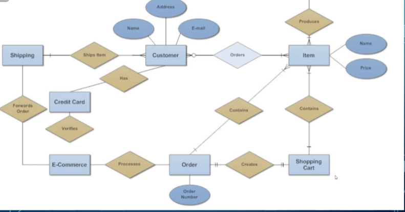

To better explain the process, let’s build a model of the following mini-world together

- Suppose we plan to model a company which is organized into departments.
- Each department has a unique name, number and employee who manages it (we want to keep track of when the employee started managing the department)
- A department may have several locations
- A department controls a bunch of projects, each project has a unique number, name and a single location
- Each employee has a name, number, address, salary, sex and birthdate
- An employee is assigned to only one department but may work on several projects which are not necessarily from the same department
- Keep track of the number of hours each employee works on each project.
- Keep track of the direct supervisor of each employee
- Keep track of the dependents of each employee (name, sex, birthdate and relation)

## More on ER Diagrams

To start off with, what should we use to draw the diagram? We have several options, including

- [Draw.IO](http://Draw.IO)
- smartdraw
- Microsoft Visio
- etc…

Next, we need to figure out how to represent our mini world using the right terminology, since if we hand over an ER diagram with the wrong symbols, the database application might be flawed

To start, we need to differentiate entities from attributes

An **entity** is something that can exist separate from anything else, while an **attribute** is some characteristic that is attached to an entity

For example, in “Each employee has a name, number, address, salary, sex and birthdate”, ‘employee’ would be an entity and ‘name’ would be an attribute

- If we chose to split first name and last name in our model, a full name would be what’s considered a **composite attribute**
- We can also differentiate between **multivalued attributes** as opposed to single-valued attributes, like how salary is a single attribute while a department’s projects would be multivalued
- **Derived** vs **Stored** values are also an important distinction, like how we don’t need to store a person’s age if we have their birth date, meaning we can make age a derived value

For each attribute, we also have a **domain** (meaning a set of values that the attribute can be equal to, i.e. integers, strings, characters, etc.)

Each entity is stored in a table along with everything that has the same **entity type** with a unique **key** as to differentiate them (ex. your student ID number)

In terms of ER diagrams, we use the following symbols

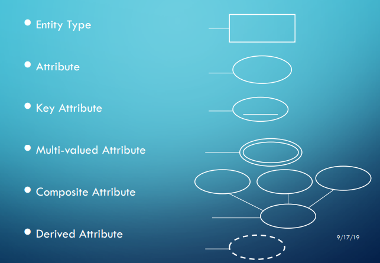

Now let’s look at our example again

- Suppose we plan to model a company which is organized into departments.
- Each department has a unique name, number and employee who manages it (we want to keep track of when the employee started managing the department)
- A department may have several locations
- A department controls a bunch of projects, each project has a unique number, name and a single location
- Each employee has a name, number, address, salary, sex and birthdate
- An employee is assigned to only one department but may work on several projects which are not necessarily from the same department
- Keep track of the number of hours each employee works on each project.
- Keep track of the direct supervisor of each employee
- Keep track of the dependents of each employee (name, sex, birthdate and relation)

Now we can begin to see where the entities are

- Department: name, number, location(s)

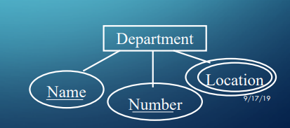

- Employee: name, number, address, salary, sex, birthdate
- Project: number, name, location
- Dependent: name, sex, birthdate, relationship
    - ER diagrams for these will be left as an exercise for the class

Now that we’ve covered the entity part of Entity Relationship, let’s talk about the relationship part

### Relationships

Notice how, when we defined our entities earlier, we didn’t mark the department manager or anything else where two entities interact

This is where we define our **relationships** (named grouping of entities)

- The set of relationships of the same type is referred to as the **relationship set**
    - More technically, a relationship type $R$ among $n$ entity types $E1,E2,...,En$ is a set of instances $ri$, where $ri$ associates $n$ entities $e1,e2,...,en$ and each entity $ej \in ri$ is a member of entity type $Ej, 1 \leq j \leq n$, hence making $R$ a mathematical relation on $E1,E2,...,En$
    - For example, (“Laura”, “Computer Science”) is a relationship set of (Prof, Department), with the relationship type being “teaches”

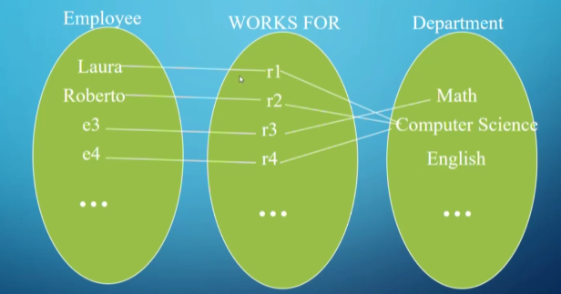

Things get more complicated as you expand your instances out

- Since there are two entities in the relationship set, we call this a **binary relationship**

Representation in ER form

In the above example, sometimes we want to associate an attribute onto a relationship, especially in situations where you want the attribute to describe the relationship somehow.

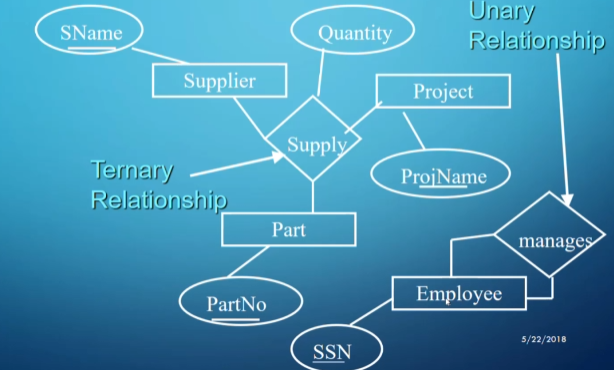

We can also have ternary relationships (the above diagram says a part is supplied by a supplier for a project).

As weird as it may sound, unary relationships also have their uses, especially when an instance has a relationship with a different instance of the same type (e.g., a student is friends with another student).

We can also talk about a relationship’s **cardinality ratio**, with the common ones being one-to-one, many-to-one, and many-to-many:

- **One-to-One**: Two instances are alone in their relationship (e.g., an employee could only manage one department and a department could only be managed by one employee).
- **Many-to-One**: One side of the relationship can share many relationships of the same type (e.g., an employee can only work for one department, but a department can have many employees).
  - **One-to-Many** is the same thing but from the other side.
- **Many-to-Many**: Both sides are free to add multiple instances (e.g., many employees work on one project, and an employee can work on many projects).

ER representation of a one-to-many relationship

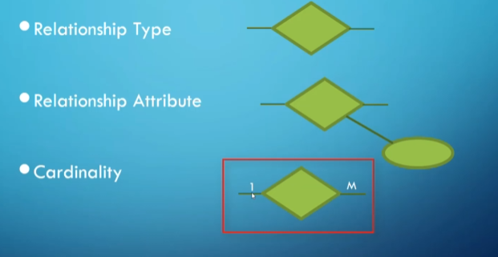

ER symbols

- Note that in a many-to-many relationship we use M on one side and N on the other.

For our overarching example, let’s look at the relationships:

- Suppose we plan to model a company which is organized into departments.
- Each department has a unique name, number, and employee who manages it (we want to keep track of when the employee started managing the department).
- A department may have several locations.
- A department controls a bunch of projects, each project has a unique number, name, and a single location.
- Each employee has a name, number, address, salary, sex, and birthdate.
- An employee is assigned to only one department but may work on several projects which are not necessarily from the same department.
- Keep track of the number of hours each employee works on each project.
- Keep track of the direct supervisor of each employee.
- Keep track of the dependents of each employee (name, sex, birthdate, and relation).

Our relationships would look something like this:

- Employee MANAGES department (one-to-one) (has start date as attribute).
- Department CONTROLS projects (one-to-many).
- Employees WORK_FOR department (many-to-one).
- Employees WORK_ON projects (many-to-many) (has hours as attribute).
- Employee SUPERVISES employees (one-to-many).
- Employee HAS dependents (one-to-many).

We’ve been careful about our use of the word “can” up until now, but what if some relationship is mandatory?

### Participation

**Participation** refers to whether or not an entity must participate in a relationship.

- If EVERY instance in the entity type has to participate in the relationship, it’s called **total participation** and we mark the relationship with a double line in our ER diagrams.
- Otherwise, it’s **partial participation** and we use a single line.
- We can also use (min, max) as notation which defines a minimum and maximum number of relationships (as long as $0 \leq min \leq max$ and $max \geq 1$).
  - A min of 0 implies partial participation.

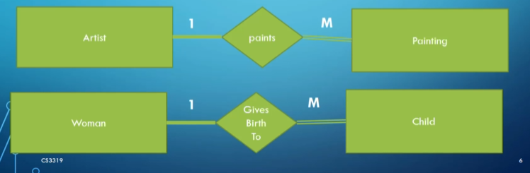

We put a double line on the side with total participation.

Note that the maximum of one side should match the other side.

Let’s go back to our example again:

- Suppose we plan to model a company which is organized into departments.
- Each department has a unique name, number, and employee who manages it (we want to keep track of when the employee started managing the department).
- A department may have several locations.
- A department controls a bunch of projects, each project has a unique number, name, and a single location.
- Each employee has a name, number, address, salary, sex, and birthdate.
- An employee is assigned to only one department but may work on several projects which are not necessarily from the same department.
- Keep track of the number of hours each employee works on each project.
- Keep track of the direct supervisor of each employee.
- Keep track of the dependents of each employee (name, sex, birthdate, and relation).

Our participation may look something like this:

- Employee (0,1) MANAGES (1,1) department.
- Department (0, M) CONTROLS (1,1) projects.
- Employees (1,M) WORK_FOR (1,1) department.
- Employees (1,M) WORK_ON (1,N) projects.
- Employee (0,M) SUPERVISES (0,1) employees.
- Employee (0,M) HAS (1,1) dependents.

### Weak Entities

In a relationship, we often run into situations where one side can’t exist without the other, with the side that won’t remain being referred to as a **weak entity**.

- For example, a room doesn’t exist without a building, but a building can exist without a room.

Weak entities also have some other properties, including:

- They have no key attribute (should have a partial key or key relative to the owner entity).
  - The partial key should have a dashed underline.
- They always have total participation with their owner.
- They are always represented with a double line around the entity and its relationship.

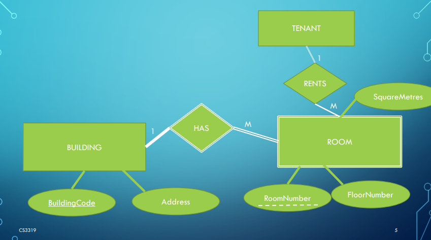

In our example from before, a dependent can be considered a weak entity since, without an attached employee, we don’t need to store it.

### General Guidelines

After everything’s done, our ER diagram looks something like this:

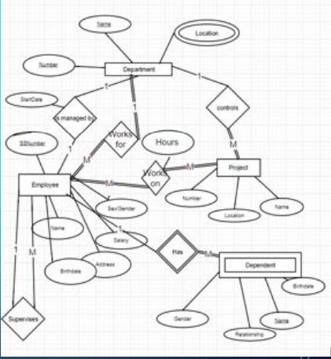

While this is technically correct, it’s clunky and hard to read, so let’s look at how we can improve it.

Here are some guidelines that should be followed:

- Use either all singular or all plural names (preferably singular).
- Use meaningful names (i.e., Item1 and Item2 aren’t very helpful).
- Make relationships read from left to right and top to bottom (i.e., department HAS employee, not department WORKS FOR employee, referring to the diagram above).

### Crow’s Feet Notation

This won’t be tested, but it’s good to recognize.

This notation is similar to UML diagrams, where attributes are under the entity name in a rectangle.

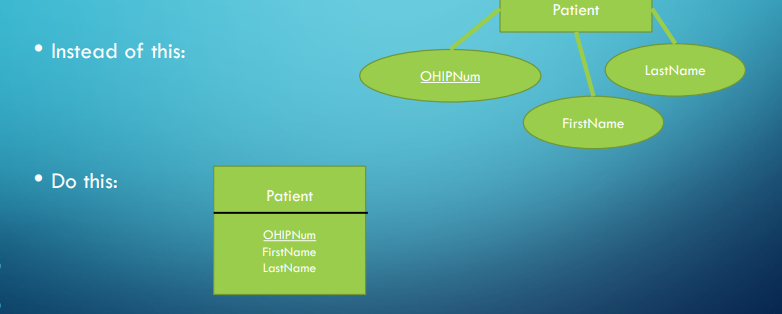

Instead of diamonds for relationships, we simply have lines that tell us the cardinality and participation depending on the notches.

With this, we can represent all of our relationships with a different notation.

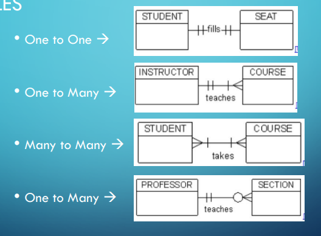
