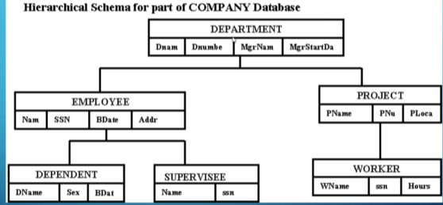
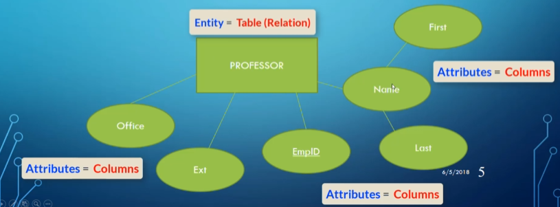
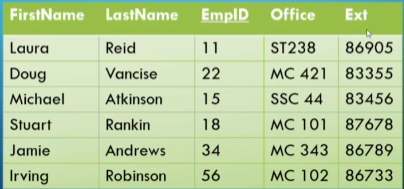
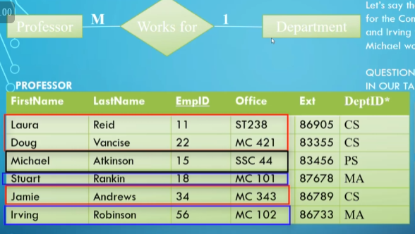
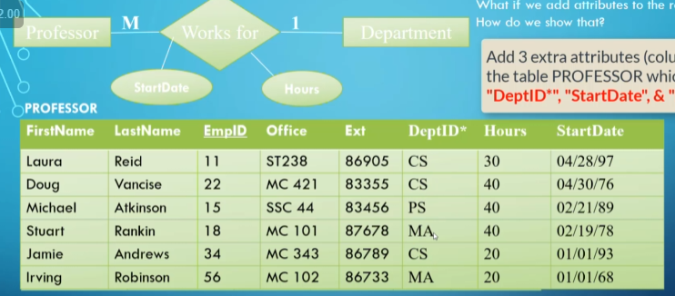
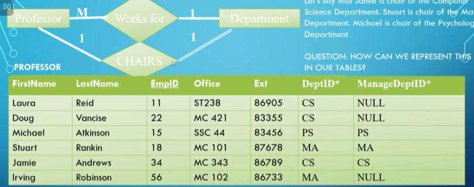
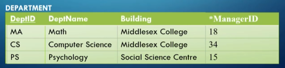
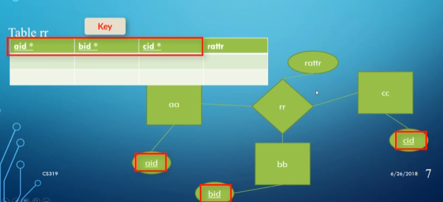
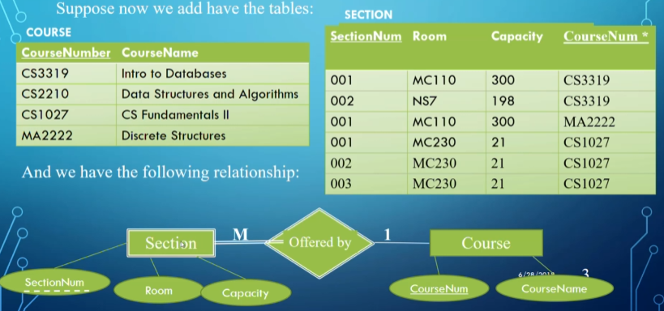
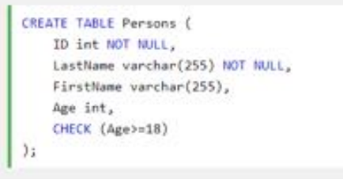

# Models

## Making Actual Databases

We know how to create a paper representation of a database, but how do we create a real-life database out of that diagram?

What we used to do is make a hierarchical model like so, where we map the ER diagram directly to a tree-like structure:

This sounds nice, but the issue is that we have some redundancy due to how some aspects don’t have clear hierarchical relations.

- Worker, Employee, and Supervisee in this example are all basically the same.

The other problem is with many-to-many relationships since they don’t fit neatly into a hierarchical model, so database designers had to form weird workarounds.

What revolutionized the database was a paper by Ted Codd in 1970, which explained the **relational data model**, the most used database model today.

Since the relational model is based around keys, it’s useful to know what a **key** actually is.

### Keys

A key is an attribute (or combination of attributes) that differentiates two tuples/records.

- An example of this would be your student number, but a combination of student number and last name could work as well (this is called a **super key**).
- Many different keys are possible for a given table, but some are more useful than others (the different keys that are possible are called **candidate keys**, with the **primary key** being the key chosen to identify tuples, which would depend on the context of the table).

The benefit of having keys be what differentiates records is that it makes relations easy to represent.

What we do is have a **foreign key** as an attribute representing a relation.

- For example, for the relation “student TAKES classes,” we would have a multivalued attribute representing classes taken with the primary keys of all the classes taken by the student.
    - We can also have a multivalued attribute in each class for the students taking the class as a foreign key, but it depends on the context whether or not you want one.

In order to be a primary key, an attribute must be unique and NON-NULL (called the **entity integrity constraint**), with most DBMS enforcing these rules.

This is essentially how relational databases function in a structural sense, but how do we know they work? For that, we need some math and some new terms.

### Theoretical Stuff

To explain what relations are in the mathematical sense, we need a few terms.

First off, we look at the term **domain**, which is a set of atomic values (e.g., Department_IDs, Employee_Ages, etc.) with a **data type** specified for each (e.g., integer, number, 10-character string, etc.).

Next, we look at **schemas**, which are defined as such:

> A relation schema (aka **table**) $R$ denoted by $R(A_1, A_2, ..., A_n)$ is made of a **relation name** and a list of attributes, where each attribute $A_i$ is the name of a role played by some domain $D$ in the relation schema $R$.

Now we can define a **relation** as such:

> A relation (or relation state) $r$ of a relation schema $R(A_1, A_2, ..., A_n)$ denoted by $r(R)$ is a set of tuples $r=\{t_1, t_2, ...,t_m\}$ where each n-tuple $t$ is an ordered list of $n$ values $t=<v_1,v_2,...,v_n>$ where each value $v_i, 1 \leq i \leq n$ is an element of $dom(A_i)$ or a special null value.

We can elaborate on these definitions by connecting them to terms we already know:

- $R$ is just the table (e.g., Doctor, Employee, Student).
    - Table is used interchangeably with relation schema and/or relation.
- **Attribute**: A column of the table.
- **Tuple**: A row in the table.
    - These are the same as the records of the table.
- **Degree of a relation**: The number of attributes it contains.
- **Cardinality of a relation**: The number of records it contains.

### Example Table

- The domain of the attribute `YearPublished` is integers.
- The second record $t_2=$ <”The Hunger Games”, B765, “Suzanne Collins”, 2008, “Scholastic Press”> is in the relation Book $= \{t_1, t_2, t_3, t_4\}$.
- The cardinality of Book is 4, and the degree is 5.

Mathematically, a relation is a subset of all possible tuples between the Cartesian products of a collection of sets.

For example:

- $D_1=\{\text{Simpson, Flanders, Smithers}\}$
- $D_2=\{\text{Homer, Ned}\}$
- $D_3=\{40,30\}$
- Possible $R = \{\{\text{Simpson, Homer, 30}\}, \{\text{Flanders, Ned, 40}\}\}$.

This represents all the possible states of our table.

### Properties of Relations

- Each relation name and attribute name within a relation is unique.
- Each cell in a relation contains 1 atomic value.
- The values of an attribute must share a domain.
- The order of attributes has no significance.
    - The key is usually placed first for readability but isn’t necessary.
- Each tuple is distinct (no duplicates).
    - This mainly relates to Codd’s theory, though practical applications may allow duplication.
- The order of tuples has no significance.
    - They’re usually ordered by placement for practicality.

## Doing Actual Modelling

Now that we have an idea of the relational model, we can take our ER diagrams and convert them into a relational database with only tables, rows, columns, and cells.

### Entities and Attributes

For entities and attributes, it’s fairly simple; the only thing we need to do is decide on a domain for each attribute.

- Since `Name` is a composite attribute, we can split it into `FirstName` and `LastName`.

We underline the primary key for readability.

### Relationships

Relationships are slightly more complex.

#### One-to-Many Relationships

For a one-to-many relationship, it’s as simple as creating a new attribute in the "many" side with the keys of the associated "one" side as values.

DeptID is highlighted as a foreign key by the * beside it.

For attributes of the relationship itself, we simply add the attributes onto the "many" side.

#### One-to-One Relationships

In a one-to-one relationship, the same principle of adding foreign keys as attributes applies, but the question is which side we store it in.

- For readability, place the foreign keys on the side with total participation (e.g., department) since it ensures no null values and reduces clutter.
- If both sides are total or partial, it doesn’t matter (though for partial, putting it on one side might be more practical).

Since some profs aren’t chairs of any department, we make the corresponding cell NULL.

#### Many-to-Many Relationships

For a many-to-many relationship, to remain in first normal form (i.e., every cell only has one value), we create a new table with the foreign keys of both sides matching up in each record.

Since each combination is unique, this still works.

#### Ternary Relationships

For a ternary relationship, the same logic applies:

rattr is just an attribute of the relationship.

### Weak Entities

For weak entities, since they only have partial keys, we need another way to represent them in our relational model.

- Place the key from the owning entity into the weak entity as a foreign key.

We use the foreign key with the partial key as the primary key for Section.

### Multivalued Attributes

For multivalued attributes, we create a new table with the attributes of the foreign key and the attribute itself.

The combination of the two attributes is unique, so it still counts as a primary key for the table LanguagesSpoken.

### 7 Rules of Mapping ER Diagrams to Relational Models

For mapping ER diagrams, there are 7 rules listed out by Codd:

1. For each **regular entity type $E$**, create a relation $R$ that includes all simple attributes of $E$, excluding composite attributes but including their simple components. Choose a key attribute as the primary key of $R$.
2. For each **weak entity type $W$**, create a relation $R$ and include all attributes of $W$. Also, include the primary key of the owner entity as a foreign key in $R$. Combine the foreign key with the partial key of $W$ to form the primary key.
3. For each **1:1 relationship**, include the primary key of one side as a foreign key in the other. Preference is given to the side with total participation.
4. For each **1:N relationship**, include the primary key of the "one" side as a foreign key in the "many" side.
5. For each **M:N relationship**, create a new relation to represent the relationship. Include the primary keys of both participating entities as foreign keys and combine them to form the primary key.
6. For each **multivalued attribute**, create a new relation that includes the attribute and the primary key of the parent entity as a foreign key.
7. For each **n-ary relationship** ($n > 2$), create a new relation to represent the relationship. Include the primary keys of all participating entities as foreign keys and combine them to form the primary key.

### Constraints

We can ensure database integrity through constraints.

#### Key Constraints

- Primary keys must be unique and non-null.

#### Referential Integrity

- A foreign key must reference an existing tuple in the parent table or be null.

#### Semantic Constraints

1. **State constraints**: Define valid states (e.g., hours worked ≤ 60).
2. **Transition constraints**: Define valid state changes (e.g., wages can only increase).

Enforce these using **triggers** or **assertions**:

Trigger.

Assertion in MySQL.
