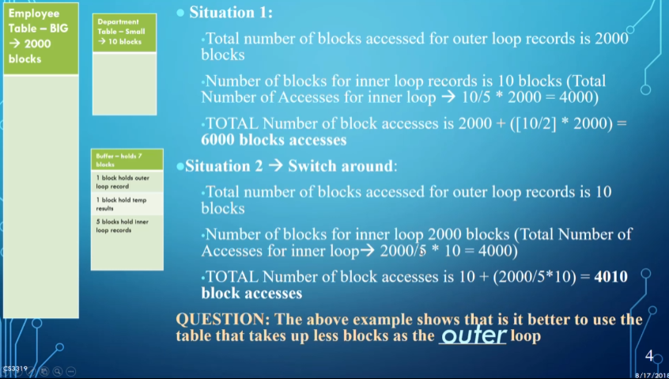

# Optimization

# Guidelines

There’s a few guidelines we should follow when designing databases so that we reduce redundancy, null values and general understanding in each tuple

The first guideline is that we should make our columns easy to understand and be easily explainable

For example, we don’t really need Dname and DmgrName since we want the departments to be consistent, so it’d be better to have it be a separate department to reduce confusion when update, inserting and deleting

Another goal is to reduce null values so that we don’t have junk cells

For example, if only 10% of employees have parking spots, it doesn’t make much sense to make an attribute on employee, so we should make it a separate table joining SSNs with parking spaces

We need to be careful when we split tables, however, because we need to make sure joining the tables doesn’t result in spurious tuples (extra rows) and anomalies (things that don’t make sense)

- This is referred to as a lossy join; what we want is a lossless join

Luckily, we can use normalization and functional dependency to help us

## Normalization

With normalization, we assign attributes to entities in a way that makes sense

So far, we’ve used a lot of common sense, but there’s a more formal way of going about this to reduces redundancy

For example, if there’s more than one attribute we can use as a key (called secondary keys, as opposed to the primary key), we need to take this into account

- In the case where we have a composite key, we call the keys prime and the non-keys non-prime

The process goes from first normal form to second normal form to third normal form, working through a series of stages to break down the table into smaller components

- Sometimes in the real world we want to denormalize for efficiency’s sake, but in this course we’ll just focus on normalization

### First Normal Form

This is the form we’ve already been using, disallowing multivalued attributes and composite attributes

What we instead do is make a new table for multivalued attributes

- We can also split out into repeating rows, but this introduces some redundancy
    - Again, this may be useful for efficiency reasons

Another option we can use is to simply make new indices as attributes, in scenarios where we know that there’s a limited number of values

### Functional Dependency

So far, we’ve learned a bunch of guidelines, but there’s a more formal way of determining what to do to move between different normal forms

Functional dependency is a tool to move into second and third normal forms

Formally, $X \rightarrow Y$ ($Y$ is functionally dependent (FD) on $X$ | $X,Y$ are sets of attributes on some tuple $r \in R$) if $t_1[X]=t_2[X] \rightarrow t_1[Y]=t_2[Y] \forall t_1,t_2 \in R$

- In English, the values of the Y component are dependent on the X component

For example, we can’t determine the student number based on last name, but we can determine last name based on student number, meaning last name is FD on student number

Since $X,Y$ are sets, we can have multiple attributes determine multiple attributes

- For example, {course code, student number} → final grade
- This means we can also have partial dependencies, where some $A \subseteq X$ can be removed and $X \rightarrow Y$
    - The opposite is full FD

We visually represent the FDs as such 

Note: these cannot be inferred from a particular instance of the database, rather we need someone who knows the semantics of the database

We also have some rules for determining FDs based on FDs we already know

- Reflexive: If $Y \subseteq X$ then $X \rightarrow Y$ by default
- Transitive: If $X \rightarrow Y$ and $Y \rightarrow Z$ then $X \rightarrow Z$
- Union: If $X \rightarrow Y$ and $X \rightarrow Z$ then $X \rightarrow Y \cup Z$
    - This is where we get candidate keys: some $K$ → {all attributes in the relation}

### Second/Third Normal Form

To be in 2NF, every nonprime attribute $A \in R$ must be fully functionally dependent on the primary key of $R$ OR not partially dependent on any key in $R$

To go from 1NF to 2NF…

- Write the key components on separate lines and the original key on the last line
- Make each of these components the key of a new table
- Write the dependent attributes after each of the new keys

For 3NF, we build off of 2NF by enforcing that there be no transitive dependencies (no nonprime attributes FD on another nonprime attribute)

To convert from 2NF to 3NF, we break off the transitive dependencies and put them into separate tables

You can check that you did everything properly with the following rules

Let $D=\{R_1,R_2\}$ be a decomposition of $R$; the join is lossless iff

- $R_1\cap R_2\rightarrow R_1$ OR
- $R_1 \cap R_2 \rightarrow R_2$

There’s also Boyce-Codd Normal Form, 4NF, 5NF, 6NF, etc. but these get contrived very quickly

We also may want to denormalize our tables to speed up queries, but optimally, we want to have everything normalized for clarity

## Optimizing Selects

Assume you wanted to join two tables Employee and Department with the following clause: give all the last names of employees who work in the research department

If we had a regular join, we would have to match up every department with the employees in the department and then search through to grab everyone in the research department, but a faster way would be to grab the primary key for research and search for that in employee

Let’s enumerate how much faster this approach is

When working with a modern database, this isn’t much of a problem, but with designing a DBMS, this is an important concept to learn

- Note that we’re not really optimizing as much as we’re applying generally efficient strategies (called the query execution plan); finding the optimal solution takes time as well

The DBMS does the following to form this strategy

- Scan (find the tokens in the queries)
- Parses (checks for syntax errors)
- Validates (checks that all attributes and relation names are valid)
- Forms a query tree (more on that later)
- Optimizes the query tree
- Grabs the best algorithm

For example, assume we have the following database

We have the following choices for a select

We can also make an estimate of selectivity to deal with tiebreakers, meaning a number between 0 and 1 describing the proportion of tuples in the relation that will be left over

For example, if we’re selecting on the key in a relation with 100 tuples, S=1/100=0.01, so we should do this first

## Optimizing Joins

When we’re doing a join there’s a few approaches we can take

The first is a brute force approach: for each record in $R$, search in $S$ to see if there’s a match

Even in this scenario, the order of the tables can make a difference in speed

We can also sort $R$ and $S$ on the join key and find matches in a final pass, depending on the speed of that sort

If there’s an index for one of the two tables, it may be better to walk through the one without the index and use the join key to access the one with the index

- We can also hash the rows of $R$ and $S$ into the same buckets to match things up

There’s some other strategies we can use depending on the operation

### Aggregate Functions

If we have something like SELECT MAX(salary) FROM employee and we know that salary has an ascending index, we can simply take the last value of the index without even looking at the table

With SUM(salary) and a dense index on salary, we can simply add up what’s in the index

- For a nondense index, this doesn’t work

For GROUP BY, we usually sort the table by the grouping attribute, followed by computing for each group

- If we have a clustering index on the grouping attribute this is even better

As for cartesian product, it’s better if we don’t use it at all

### Pipelining

Sometimes, we can feed the results of one operation into another without ever accessing the disk, but we might overload the buffer space

The opposite is materialization, which stores everything in a temporary relation

This is a lot slower, but if buffer space is a concern, this may be of use

## Query Tree

The general rules for building a query tree are

- Do selection and projections early on as they don’t increase the number of tuples
- Do selections and joins that are most restrictive first as they will result in the fewest tuples

To illustrate how building a query tree works, assume we have the following query

We then run through the following 5 steps

The order we do things in can speed up queries exponentially

