# Relational Algebra

# Queries

Now that we can organize and store data, it’s time to query our data in interesting ways to answer questions

In order to manipulate our data, we need some sort of language to do this in

Luckily, Codd discussed this in his famous paper, giving us **procedural languages** (using **relational algebra**) and **non-procedural languages** (using **relational calculus**)

- Formally, relational algebra is equivalent to relational calculus, meaning we can convert between the two

For procedural languages, we’ll use SQL, which is the most popular

On top of SQL being relationally complete, we can do some other cool things like sorting and calculations

In order to talk more about SQL, we need to talk about relational algebra

## Relational Algebra

Relational algebra is a language with operations that performs on relations and produces relations based on the operations

Since all our operations are relation → relation, this is a **closed language**, unlike division which isn’t (8/6 doesn’t give us an integer)

Since the language is closed, we can use output for one operation as input for another, the combination of which can be used for more complicated operations

- Ex. 3^4 = 3 x 3 x 3 x 3

In relational algebra, we have 5 basic operations

1. Selection: returns the tuples that satisfy a condition, $\sigma_{condition}(R)$
2. Projection: returns requested attributes (with no duplicates), i.e. a column subset, $\Pi_{attr_1, attr_2,...,attr_n}(R)$
    - These are both unary operations
3. Cartesian Product: returns the concatenation of every tuple in relation $R$ with every tuple in relation $S$, $R \times S$
4. Union: returns the combination of two relations $R,S$, where their tuples $I,J$ are combined, $R \cup S$
5. Set Difference: returns all tuples in relation $R$ but not in relation $S$, $R - S$
    - SQL itself has operations that don’t produce closure, but relational algebra doesn’t

Let’s talk about each of these in more detail

### Selection and Projection

Selection is pretty simple: collect all the tuples that meet a given condition

- For example, $\sigma_{age>30}(R)$ will return all tuples in $R$ where the attribute age > 30

Projection is also simple: collect all the attributes of a given name

- For example, $\Pi_{age, name}(R)$ will only give the age and name columns of the relation

We can combine these into other expressions as well, ex. $\Pi_{address}(\sigma_{gender=M}(R))$ gives only the addresses of men in the relation

- We could’ve split this operation as well

$$
T_1 \leftarrow \sigma_{gender=M}(R) \\ 
T_2 \leftarrow \Pi_{address}(T_1)
$$

Sometimes we need to rename the attributes when doing union and joins, so we can change the names with a subscript

$$
T_{2(addy)}\leftarrow \Pi_{address}(T_1)
$$

The order also matters (the sequence of operations below is invalid since gender doesn’t exist in $T_1$)

$$
T_1 \leftarrow \Pi_{address}(R) \\
T_2 \leftarrow \sigma_{gender=M}(T_1)
$$

Duplicates rows are also not allowed in relation algebra, so we must remove them, which can cause some problems with projects depending on what we want to do

### Union and Difference

In order to understand unions, we must talk about union compatibility

We say two relations are union compatible iff they have the same number of columns and each respective column in the same domain

For example, in the below diagram, TableA and TableB would not be union compatible, but TableB and TableD would

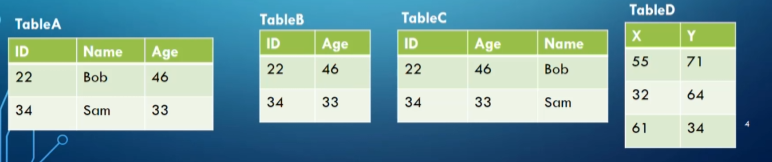

TableA and TableC wouldn’t work either since the respective columns don’t share domains

What $T_1\cup T_2$ does is create a table with rows of both $T_1$ and $T_2$ but with duplicates removed, assuming $T_1,T_2$ are union compatible

Difference also needs to be union compatible, however $T_1-T_2$ instead gives all rows that are in $T_1$ but not in $T_2$

### Cartesian Product

The cartesian product $T_1 \times T_2$ maps every row in $T_1$ with every row in $T_2$, where $T_1,T_2$ aren’t necessarily union compatible

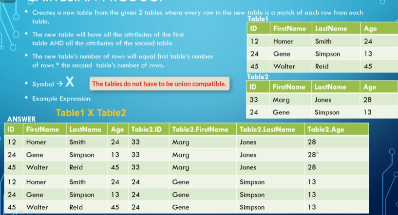

An example of what a cartesian product looks like

However, there is a restriction where the attributes can’t share names, so what we do is $"T_{name}.attr_{name}"$ for the names that are shared

The number of tuples in the resulting relation is the number of tuples in $T_1$ * the number of tuples in $T_2$, and the number of attributes is the number of attributes in $T_1$ + the number of attributes in $T_2$

When we combine cartesian product with what we know about foreign keys, what we can do now is match up every tuple with a tuple it’s associated with

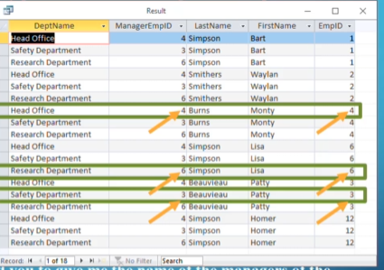

The cartesian product grabs every department manager next to the department they manage

From here, we can do $\Pi_{LastName, FirstName, DeptName}(\sigma_{ManagerEmpID=EmpID}(R))$ to get the names of all the department managers along with the department they manage

This effectively describes the **join** operation, which we’ll talk about now

### Joins

Joins are what we described above, where we combine a cartesian product and a selection

- It looks like $T_1 \Join T_2$

There’s two main types of joins: inner and outer joins

Inner joins can be further divided into two subtypes: **natural joins** (where we only select for equivalence in the attributes that share names between each other) and **equi joins** (where we select for equivalence between two given attributes that share the same domain)

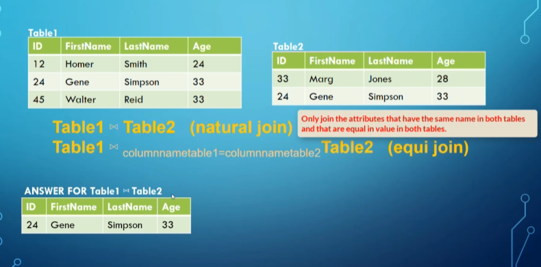

Natural join

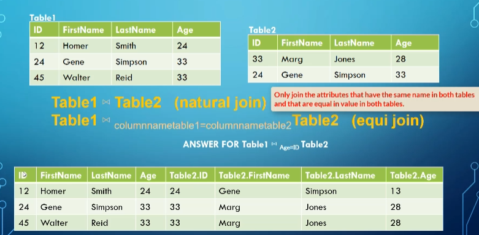

Equi join (we put the condition as a subscript)

For equi joins, we can use any boolean formula, meaning any formula with <, ≤, >, ≥, =, ≠, and, or, not

For a natural join, we include each pair of attributes with the same name ANDed together

$$
Q \leftarrow R(A,B,C,D) \Join S(C,D,E) \\
R.C=S.C \text{ AND }R.D=S.D \\
Q(A,B,C,D,E)
$$

- This is opposed to equi join, which will match up within the boolean formula given and include all attributes of the cartesian product

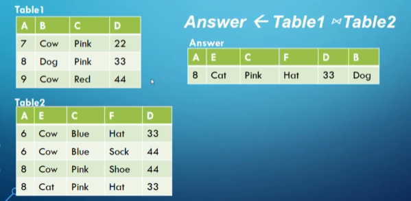

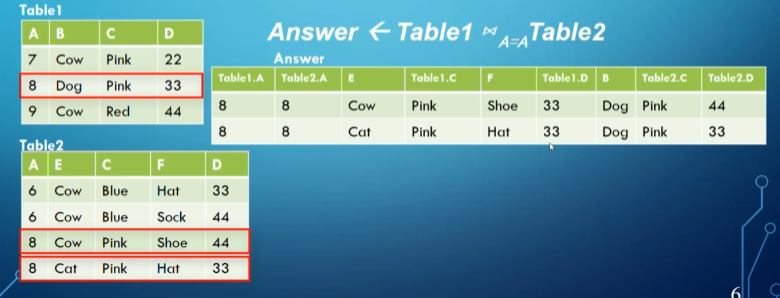

- Remember that rows in a relation cannot be duplicates, this might trip you up on exams

If you want to join to use a many-to-many relationship, you have to use the relationship table as well

$$
Employee \Join Works.On \Join Project
$$

Now we’ll talk about **outer joins**, which work slightly differently but still run on the same concept

Outer joins can be divided into three subtypes: **full**, **left** and **right**

Full outer joins $T_1 \space ⟗ \space T_2$ include all rows from both tables at least once even if they don’t have a matching value

- If there’s no match, we put nulls in the columns from the other table

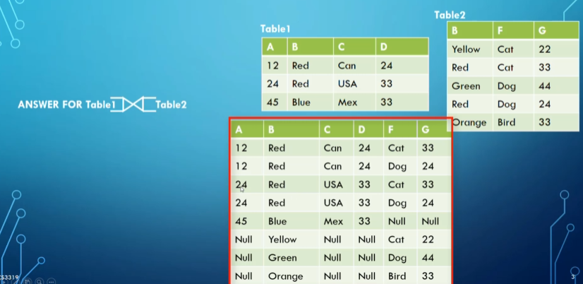

Notice the null values 

We can also use conditions to make this an equi join in the same way we did for inner joins

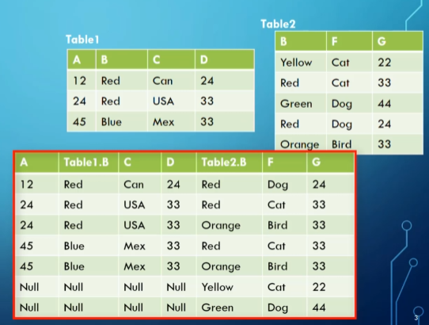

We also have left joins, $R \space ⟕  \space S$ which include all the rows from $R$ but not necessarily from $S$

- Right join, $R \space ⟖ \space S$, works the same way but in reverse

Often we use outer joins when we want a full table but also additional related data from another table

For example, if we wanted to get every employee along with the name of the department they manage (if they manage one), we do something like this

$$
T_1 \leftarrow Department \space ⟕_{ManagerEmpID=EmpID} \space Employee \\
A=\Pi_{FirstName, LastName, DeptName}(T_1)
$$

### Intersection

Intersection is another one of our combination operations that returns only identical rows between two tables

$$
R \cap S = (R \cup S)-((R-S)\cup(S-R))
$$

- $R,S$ must be union compatible, but I hope that’s obvious

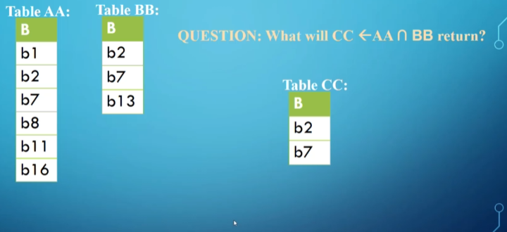

This is useful for any situation where you use ‘both’ or ‘and’, ex. get everyone who works on project A and project B

### Division

Division, $R \div S$, returns a new table that has only the columns that were in $R$ but not in $S$, as well as only the rows from the remaining columns of $R$ that match every row in $S$

- The columns of $S$ must be a subset of the columns in $R$

$$
L_1 \leftarrow \Pi_y(R) \\
L_2 \leftarrow \Pi_y((S \times L_1)-R) \\
L \leftarrow L_1-L_2
$$

This is a bit complicated, so let’s look at an example

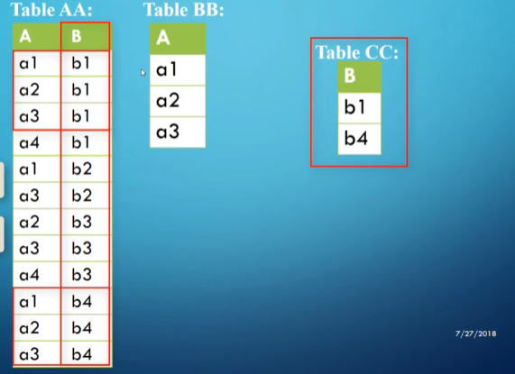

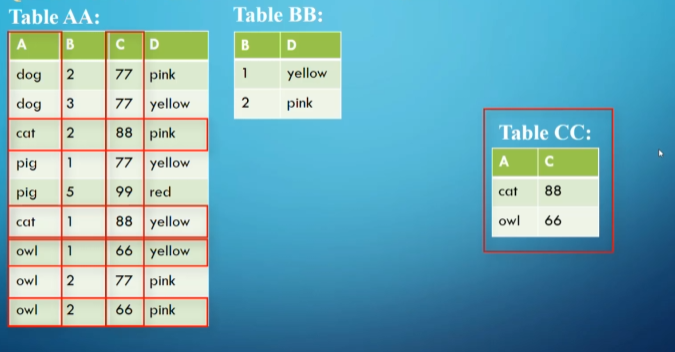

To see where this is useful, we can look at the following scenario

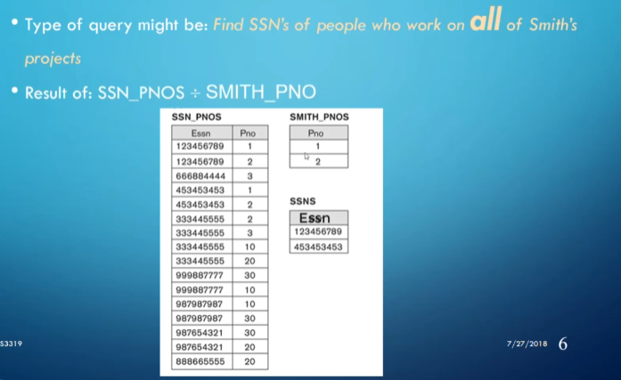

In general, when we have a scenario with the word ‘all’, we should look to division as the solution

- This is still not nearly as common as the other ones, but they still come up

To summarize everything we’ve learned so far:

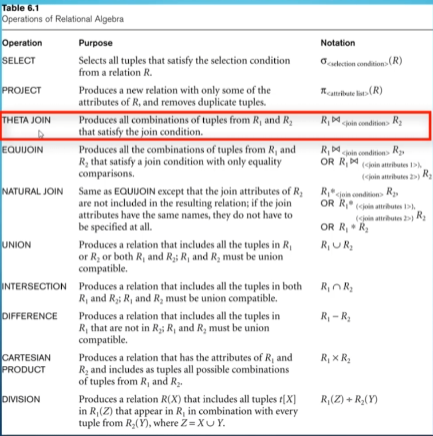

Theta join is effectively what we’ve been calling equijoins
