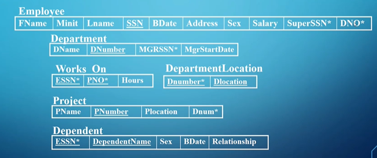

# Relational Calculus

Relational calculus in general is a way to say WHAT we want without describing HOW to get what we want, making this a **declarative/nonprocedural language**

- In relational algebra, we do the opposite, describing HOW to go about it with steps

This and relational algebra are very similar in that we can write all the same queries and get the same output, but the way we go about it is different 

Since there’s 2 dimensions of relations (tuples and domain), there’s 2 corresponding types of relational calculus: **tuple relational calculus** and **domain relational calculus**

## Tuple Relational Calculus

Tuple relational calculus takes the following general form

$$
\{t | \text{Condition}(t)\} \\
t \text{ is a tuple and Condition}(t) \text{ is a boolean expression} \\
\{t.fName,t.lName|\text{EMPLOYEE(t) AND t.Age > 5}\}
$$

- Hmm, this is starting to look a lot like SQL…

In general, we need to specify three things

1. The range relation of t
2. The condition which must evaluate to TRUE
3. A set of attributes to be retrieved (or just put the variable t if you want all attributes)

For upcoming examples, we’ll use the following tables

For joins, we can make use of the existential qualifier and universal qualifier from 2209

$$
(\exists t)(F) \\ (\forall t)(F) \\
\{t.fName|\text{EMPLOYEE}(t)\text{ AND } (\exists d) \text{ DEPARTMENT(d) AND} \\ \text{d.dNumber = t.DNO}\}
$$

- Keep in mind that $\forall$ applies to the ENTIRE DATABASE

You can also do division but it’s not tested and tbh I don’t feel like writing it down lmao

## Domain Relational Calculus

Just like we can do calculus on tuples, we can do the same for domains

Instead of grabbing specific tuples, we instead use the domains as our parameters

$$
\{x_1,x_2,...,x_n|COND(x_1,x_2,...,x_n,x_{n+1},...,x_{n+m})\} \\

$$

- $x_1,...,x_{n+m}$ represent columns

For example…

$$
\{u,v|(\exists q)(\exists s) (\text{EMPLOYEE(qrstuvwxyz) AND q="John"}) \\ \text{AND s="Mortensen"} \} \\
\{u,v|\text{EMPLOYEE("John",r,"Mortensen",t,u,v,w,x,y,z)}\}
$$

- ORDER MATTERS HERE
- These both do the same things, just with different notation

We can do joins in much of the same way

For example, the following gets the first name of every employee who has no dependents

$$
\{q|(\exists t)(\text{EMPLOYEE(qrstuvwxyz) AND (NOT }(\exists l)\\\text{ DEPENDENT(lmnop) AND t=l)))}\}
$$

### Query By Example

Query by Example (QBE) is a user friendly language developed by IBM that uses domain calculus to make queries for people that have little to no background in SQL

- This is what MS Access is based off of

In QBE, we take fields matched to tables and give them a condition

For example, the following QBE in MS Access finds all data about employees with the last name Simpson

Equivalent SQL query

- If we don’t want to show an attribute, we simply uncheck Show
- With the criteria Is Null, we can do unmatched queries (queries when we want tuples that DON’T have a value for some attribute)

We can also use our aggregate functions (averages, maximums, etc.) in Total without any SQL

# EER Diagrams

EER Diagrams are just like ER diagrams, except we introduce inheritance from OOP

The idea is that, if we think of entities as objects, then the entity type is an object class

From here, we can introduce subclasses (subtypes) that inherit properties from their superclass, just like we can in Java

- For databases, subclasses inherit all attributes and relationships of the super class

EER in practice

Note that entities can’t ONLY be part of the subclass, but it can be only part of the superclass like e5

We don’t JUST have to do disjoints; we can have overlap, where one member is in multiple subclasses

- Note that enhancing ER diagrams is optional; sometimes it can make things too cluttered or it might be more practical to have separation

## Mapping EER Diagrams to Tables

We talked about 7 steps for converting ER diagrams to tables, but now we can introduce an 8th rule:

Convert each specialization with $m$ subclasses $\{S_1,S_2,...,S_m\}$ and superclass $C$, where the attributes of $C$ are $\{k,a_1,...,a_n\}$ and $k$ is the primary key, into relations schemes using one of the four following options

1. Multiple relations - superclass and subclasses: Create a relation $L$ for $C$ with attributes $= \{k,a_1,...,a_n\}$ and primary key $=k$. Create a relation $L$ for each subclass $S_i,1 \leq i \leq m$, with the attributes $L_i=\{k\} \cup \{\text{attributes of } S_i\}$ and primary key of $L_i=k$

2. Multiple relations - subclass relations only: Create a relation $L$ for each subclass $S_i, 1 \leq i \leq m$ with the attributes $\{\text{attributes of } S_i\} \cup \{k,a_1,...,a_n\}$ (i.e. no not have a relation for $C$)

- Note: this only works for total specialization and only recommended for disjoint since it can cause redundant data otherwise

3. Single relation with one type attribute: Create a relation $L$ with attributes $\{k,a_1,...,a_n\} \cup( \bigcup^{i=1}_{i\leq m} \{\text{attributes of }S_i\})$ and primary key $k$

4. Single relation with multiple type attributes: Create a relation $L$ with attributes $\{k,a_1,...,a_n\} \cup( \bigcup^{i=1}_{i\leq m} \{\text{attributes of }S_i\}) \cup \{t_1,t_2,...,t_m\}$ and primary key $k$, where every $t_i, 1 \leq i \leq m$ is a boolean attribute indication of whether the tuple belongs to subclass $S_i$ 

