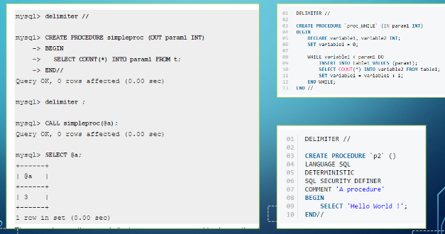

# Security

# Babyproofing

When you allow users to do SQL queries, things can go wrong very quickly

As a result, if we want multiple people to be able to make queries, we need to put some measures in place to make sure they can’t screw it up

## Triggers

Triggers are ways to execute a set of statement in response to an event occurring in a table

For example, if a user does an INSERT, we can run some statements to check if the inserted data is valid

- This is similar to constraints but more powerful (we’ll use triggers for now since MySQL hasn’t implemented constraints)

These are helpful because you may have different access points to your database, so if you need to set a general rule, you can simply add a trigger instead of asking everyone to change their code

- There’s also a performance boost since SQL statements run on the server

Triggers follow a pretty standard code format that should look familiar to you

These triggers will be dropped automatically if the associated table is dropped, but we can also drop the trigger itself

Use this command:
`DROP TRIGGER [IF EXISTS] trigger_name`

- As a note, we can’t have multiple triggers that share an event and activation time (ex. two BEFORE INSERTs aren’t allowed, but an AFTER INSERT and BEFORE INSERT are)

Something we can use alongside triggers is procedures

### Procedures

A procedure is some precompiled application program written in some language (ex. C++, Java, etc.), containing SQL statements alongside other logic statements

This will make some complicated SQL logic easier to execute and makes execution cheap due to server-side running

- It’s also more secure with how it allows for permission granting and it’s reusable in other databases

We need to be careful with where we use procedures, because too many can actually increase server load and slow down production

They’re also a lot harder to debug and migration from MySQL to something like PostgreSQL is tricky due to differences in syntax

These look similar to triggers, with the main difference being that we have parameters

# System Tables

We have a lot of complicated information in our database (entities, types, etc.) but how does MySQL store all of this metadata? With another database, duh

These tables (mainly information_schema and performance_schema) are automatically incremented based on information we add to other databases

MySQL implements some babyproofing on these schemas, mainly being that we can’t insert, update or delete manually, but we can view what’s in it

- Other DBMS (PostgreSQL, etc.) use slightly different methods to store metadata

## Using information_schema

There’s lots of ways to use information_schema, the main one being seeing all the metadata about all of your databases

We can also do:
`SELECT * FROM TABLES;`
to show all the data about all our tables, which may or may not be of use

A potentially useful command

A few more useful commands

# Security

Security is very important to ensure that only trusted users are allowed to do certain things

We can create a user with the CREATE USER command:

- `CREATE USER 'jeff'@'localhost'; --weakest`
- `CREATE USER 'jeff'@'localhost' IDENTIFIED BY 'mypass'; --still weak because the password can be accessed through a log file`
- `CREATE USER 'jeff'@'localhost' IDENTIFIED BY PASSWORD '**90E462C37378CED12064BB3388827D2BA3A9B689'; --strong`

Note that you have to be in the root (`mysql -u root -p`) to do this

This information is stored in the mysql database which we can access with `USE mysql;` and looking at the user table

- Be careful when you’re in here because you can actually edit this

In order to log in as a user, we simply do `mysql -u username -p`

- Admin username is `root`

Something to note is that there is a log file `.mysql_history`, but this doesn’t store `CREATE USER` commands even for the weaker versions

However, there’s other ways of getting access to the information through creating a log file, so it’s overall better to use the strong version

## Permissions

In order to make users useful, we need a way of giving them permissions

In SQL, we can do this with the `REVOKE` and `GRANT` keywords

- We can also use `WITH GRANT OPTION` on the end of a GRANT command to allow a user to give other users the same permissions

To be more specific with what information we want to grant permissions on, we can give permissions on views as well

## Control

Control is another aspect of security that can be divided into three parts

- Role-Based Access
- Mandatory Access
- Statistical Access

### Role-Based Access

The problem with how we did things before is that giving permissions to individual users gets time-consuming, so what we can do is create broad roles and give them to certain users

- Ex. A librarian can only access certain information, so we can create a librarian role

To make a role, we do `CREATE ROLE 'role_name';` and then do our grants as normal

- If these don’t work you might have an old version of mysql, but you should have the newest version on your VMs

### Mandatory Access

In some database systems, this doesn’t work too well, so what we can instead do is use security classes on the data itself to determine what users can access

This is often used by governments and militaries where we have highly classified information

For information (relations, tuples, etc.) we label them as CLASS(O), but for users or programs, we label them as CLASS(S)

We also have some rules in place

1. S cannot read from O if CLASS(S) < CLASS(O)
2. S cannot write to O if CLASS(S) > CLASS(O)

Rule 2 seems a bit weird intuitively, but when we think about it from the lens of security, it makes sense

If some unclassified user writes to top secret tables, they haven’t actually found any new information, but if a top secret user accidentally wrote top secret info in unclassified tables, that results in a leak

### Statistical Access

With statistical access, we give users access to statistical data (averages, sums and other aggregate data) without giving them access to individual rows

This is useful for research contexts to ensure we can study data without giving access to private information

However, if we know enough about the context of the data, we can start to deduce private information in certain scenarios

This also works if there’s two tenured female profs, since we can do MAX and MIN

Luckily, there’s ways to counteract this, including

- Limiting queries if the result is less than some threshold
- Limiting repeated queries on the same rows
- Introduce false data to flood our database with fake data (not recommended but it does work)

We can also use tools we already have, including

- Views to determine what exactly the user needs
- Roles (if we have access to them in our DB package) to hand out permissions
- Specific interfaces that only do certain tasks

# Transactions

Imagine a few situations:

1. Homer wants to move $50 from savings to checking  
2. While this is happening, Marge deducts $75 from savings at the same time

For just scenario 1, a situation could happen where the query is interrupted by, lets say, the power going out.

Depending on the order of our updates, we either have Homer losing $50 or gaining $50, both of which we don’t want.

Adding in scenario 2, if we don’t do our checks properly, we could have a scenario where the account ends up in a negative balance, which shouldn’t happen.

To solve these, we’ll use transactions, which are sequences of database operations that preserve the consistency of the database.

With these transactions, we can implement protocols that make sure things are done in proper order, where running through things at the same time is now a non-issue.

We could still have problems in a transaction of course, including power outages and hardware failure, so we need some sort of test to make sure things remain consistent.

The ACID test is a test that makes sure we can go back to a consistent state in case something goes wrong.

In SQL, our transactions look like this:

For things like power outages or crashes, we still have our log files to make sure everything is going as planned.

We should store our log file on a separate disk (in case of disk failure) and on multiple backups (in case the original log file disk fails).

## Concurrency Control

We want all transactions to run smoothly, but this is difficult when we have multi-user databases.

What we want to do is ensure serializability, where interleaving transactions has the same effect as running them sequentially.

To enforce this, we introduce a schedule $S$ of $n$ transactions $T_1,...,T_n$ such that, for all $i<j$, each operation of $T_i \in S$ must occur before each operation in $T_j \in S$.

Not following this rule can cause lost updates (overriding updates incorrectly), uncommitted data (not taking into account rollbacks) and inconsistent retrievals (doing selects while an update is occurring).

Schedulers are pieces of software that create schedules, using a number of methods, including locking, time stamping and optimism.

This scheduler preserves the order of operations within transactions and makes system component schedules, but it can’t make planned schedules because it doesn’t know what users will do at any particular moment.

In an ideal world, we would want all schedules to be serial (meaning all of $T_i$ is completed before $T_j$), but this is extremely slow, so sometimes we need interleaving.

### Serializability

We say that a schedule is serializable if it is equivalent to some serial schedule.

- This doesn’t mean result equivalent.

What we do is evaluate conflict equivalence, meaning the order of any 2 conflicting operations is the same in both schedules.

In testing for conflict serializability, we do the following:

Normally we don’t do the full calculation since it’s expensive, so we use strategies to make sure we don’t have this problem in the first place.

## Locking

Locking guarantees exclusive use of the data until the transaction is complete.

There’s different levels of locking we can use depending on the situation:

There’s also different types of locks we can use, including binary locks, shared locks and 2-phase locking.

### Binary Locking

Binary locking sets a boolean for an object, with it either being locked (1) or unlocked (0).

This works but it’s restrictive because we sometimes have situations where two transactions only read the block and don’t want to write.

### Shared Locking

With a shared lock, we shift through modes depending on what we need, including no lock, shared lock (only reading the data) and exclusive lock (updating data).

This comes with the problem of creating deadlock, as well as sometimes not being serializable, which is the problem we’re trying to solve.

### 2-Phase Locking

With 2-phase, we run through phases of locking:

- Phase 1: transaction gets all required locks without unlocking any data.
- Phase 2: transaction unlocks data without locking more data.

This insures that no two transactions can have conflicting locks while no unlock can precede a lock.

This works and is a lot more efficient, but we can still have deadlock sometimes.
