# Storage

## Storage

A database is no good if we don’t have a way to store the data, but how do we go about this in an effective manner? In order to answer this, we have to look at how data is physically stored first.

### Physical Storage

At the physical level, there are three types of storage: primary storage (RAM), secondary storage (hard drives, SSDs, etc.), and tertiary storage (optical disks, tapes, etc.).

In an ideal world, we’d want to throw the database onto the CPU because it’s faster, but this comes with some problems:

- RAM is expensive and volatile.
- There’s usually not enough room to fit an entire database.

With this in mind, most databases are stored on hard drives available online at any time, with tertiary storage (mainly tapes) being used mainly as backups or archives.

- SSDs are faster than hard drives, but there’s a limit to how much you can write.

Due to the way hard drives work, it’s beneficial to store data in a specific way, deciding on:

1. Primary organization (how records are placed on the disk, i.e., ordering, and how the records are accessed).
2. Secondary organization (how we should effectively access other commonly accessed attributes).

#### Hard Drives

The way these work is that we have an arm reading from the lines (called **tracks**) along a series of disks (called **platters**) all stacked on each other around a spindle.

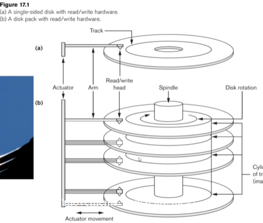

When we want to get data, we spin the disks until the data is over the head of the arm, where it is then read.

Since each block is usually not enough space to store all the data we need, we have to bring data in chunks (called **blocks**).

We can divide the speed of the disk into three categories:

- **Seek time**: Time taken to find the right track.
- **Latency (rotational latency)**: Time taken to find the right **sector** (section of the track to read from).
- **Block transfer time**: Time taken to read and move the data.
    - This is usually much faster than the seek and latency.

The way we group data is in the form of records of either fixed or variable length, which are collections of related data values (called bytes).

The resulting file is a sequence of these records, along with a file header that includes information to describe the file, such as field names, data types, and addresses of the blocks.

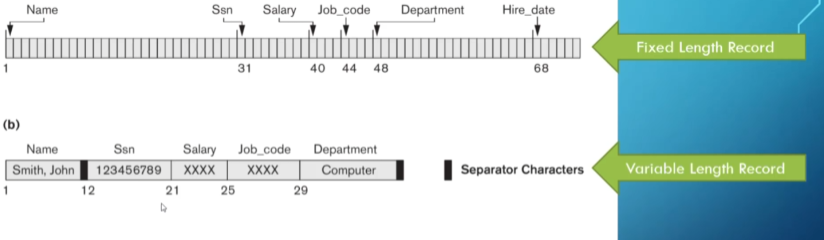

We bring in this data one block (sequence of bytes) at a time, with the block size depending on the operating system since we bring the block straight into main memory.

Sometimes we can store multiple records in one block, the number of which we refer to as the **blocking factor**.

- If this isn’t an integer, there might be empty space.

Similarly, we sometimes have **spanned records**, which take up one or more blocks.

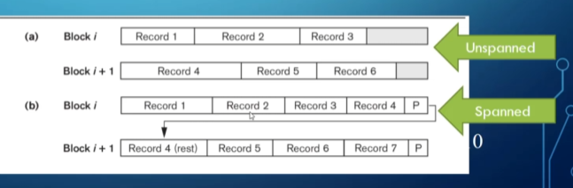

- Usually, we use spanned blocking for variable-length records.

These blocks can either be contiguous, linked, or indexed.

- For the example above, the spanned blocking is linked, and the unspanned blocking is contiguous.

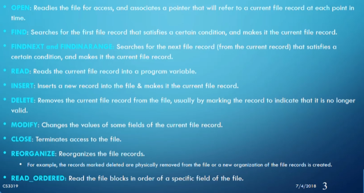

A list of some of the other things we want to do to files, which basically boil down to adding, modifying, and deleting files/records.

The way we decide to store our records makes a huge impact on which method we use to access the records from memory.

## Access Algorithms

Since we have multiple ways of storing data physically, we should have multiple algorithms and organizations for accessing our data depending on what we use.

### Heap

In a heap, when we get a new record in a file, we simply add it to the end of that file, making this the simplest of all the organizations.

Let’s take a look at how fast our three operations are: insert, modify, and delete.

- **Insert**: Since we tack it on to the end of the file, this is $O(1)$ time.
- **Modify**: Since there’s no order to the files, we have to manually check each record until we find what we’re looking for, making this $O(n)$ time, where $n$ is the number of block accesses.
- **Delete**: Same story as modify, $O(n)$ time.
    - For delete, we also have to consider whether we want to move everything up or leave a gap in our file.

This is very good for bulk loading and bulk reading, as well as when we have a small relation or other access structures such as an indexed key (more on this later).

Where this gets bad is when we regularly have to search for specific records, delete records, or sort the relation.

Here’s an interesting question: If we have 100,000 records in a file with a block size of 2048 bytes and a record size of 500 bytes, how many blocks will we have to access on average for a search?

First, we calculate the blocking factor ($b_{fr}$) and the number of blocks ($b$):

$$
b_{fr} = B/R = 2048/500 \approx 4 \\
b = r/b_{fr} = 100000/4 = 25000
$$

Now, since the average speed of linear search is $b/2$, calculating the number of accesses is straightforward:

$$
b_a = b/2 = 25000/2 = 12500
$$

### Ordered

In an ordered organization, we pick some field to order by and insert records based on that order.

- Often, this is the primary key, but it depends on your needs.

Now for the three operations:

- **Insert**: Since we have an order, we can use binary search to get to the right spot in $O(\log(n))$, but we have to push records back to fit the new one, which still amounts to $O(n)$.
- **Modify**: We only need binary search to get to the record we want, so this is $O(\log(n))$.
- **Delete**: Same story as insert, $O(n)$.

This is good when we want to search a lot and need files to be in order (i.e., no sorting required), but not so good when we’re inserting and deleting a lot.

Binary search on the disk itself can get expensive, which is why this is rarely used without a primary index.

Let’s ask the same question from before: Since the number of blocks is still 25000, if we need to do a sequential search, we still need 12500 accesses on average.

However, if we know the order key of the record we want, we can use $\log(b)$ to get both the average and worst-case scenarios:

$$
\log(b) = \log(25000) \approx 15
$$

### Hash

In a hash, we divide our file into $M$ equal-sized buckets with a fixed number of blocks and one attribute as the hash key.

When we have a record with the hash key value $K$, we store it in bucket $i$, where $i = h(K)$ and $h$ is the hash function.

- The key to a good hash function is distributing the data evenly and randomly.

This is great if you need to get a record using its key a lot (e.g., credit card numbers).

The way we create this hash function often is by taking $K \mod M$, giving us a number between $0$ and $M-1$.

The main problem with this approach is collisions (i.e., a bucket is full when we try to insert a record). However, there are ways to handle this:

- **Open addressing**: Place the record in the next available spot.

- **Chaining**: Form an overflow area and create a pointer to the area in place of the record itself.
    - This is the most common approach for hashing on disks since space isn’t as limited.
    
    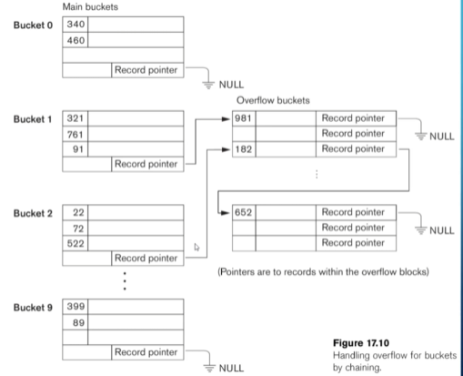
    
- **Multiple hashing**: Apply another hash function until there’s no collision.

Hashing works well for key-based lookups but has limitations when retrieving multiple records or ranges of values.

Asking our speed question again for 25000 blocks, we need only one block access (assuming no collisions).

- All operations (insert, modify, delete) are $O(1)$.

### Indexes

Indexes are a way to make data access faster. Think of a phone book: it’s indexed by starting letters, making it easier to find a specific number. We can apply the same logic to our relations by creating an index as a separate file (typically one record long) and loading it directly into main memory.

The index file helps us locate the block containing the record associated with a specific field.

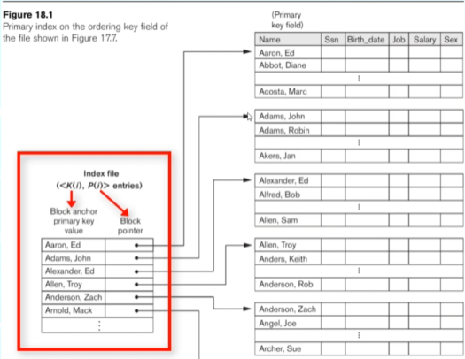

This makes indexing a more efficient version of hashing, as it allows us to look up a range of values quickly.

#### Types of Single-Level Indexes

There are three types of single-level indexes: primary, clustered, and secondary.

1. **Primary Index**
   - Defined on an ordered data file with an ordering key field.
   - Includes one index entry for each block in the data file.

2. **Clustered Index**
   - Uses an ordered non-key field, with one index entry for each distinct value.
   - Simplifies insertions and deletions when each cluster starts a new block.

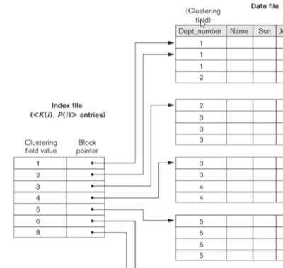

3. **Secondary Index**
   - Provides secondary access to a file that already has a primary access.
   - Typically defined on a candidate key but can be used with any attribute.
   - Creates one entry for every record, making it a dense index.

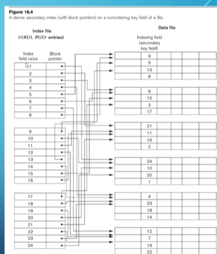

   - If not using a candidate key, we may need to point to multiple blocks of record pointers for each value.

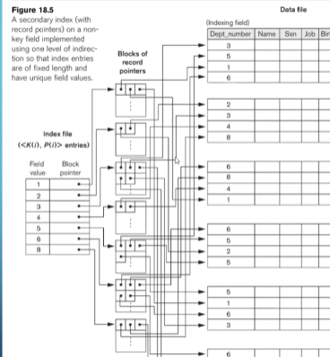

#### Speed Analysis

Let’s calculate access times for a dense index (worst-case scenario):

1. Let the ordering key be 10 bytes and the block pointer be 7 bytes.
2. The primary index record size becomes $P + K = 17$ bytes.
3. Calculate the blocking factor:

$$
b_{fr} = B/(P+K) = 2048/17 \approx 120
$$

4. Determine the number of blocks:

$$
b = r/b_{fr} = 100000/120 \approx 834
$$

5. Use binary search to find the number of accesses:

$$
b_a = \log(b) = \log(834) \approx 10 \text{ (index)} + 1 \text{ (data)} = 11
$$

For a **sparse index** (one entry per block):

1. Total blocks = 25000.

2. Index blocks:

$$
b_i = b/b_{fr} = 25000/120 \approx 209
$$

3. Access time:

$$
b_a = \log(b_i) = \log(209) \approx 8 \text{ (index)} + 1 \text{ (data)} = 9
$$

### Multi-Level Indexes

A multi-level index uses multiple levels of indexes to improve access times. When a single-level index is too large to fit into memory, we create indexes pointing to other indexes until the highest level fits into one block.

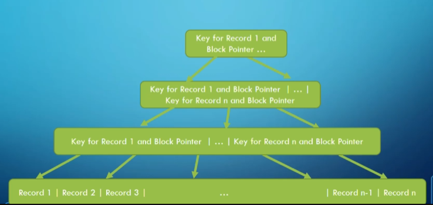

This structure resembles a tree, so we model it as such.

#### B+ Trees

A B+ tree is a variation of a B-tree where every value in the search field shares a level in the tree. Data pointers are only in the leaves, and the leaves form a linked list for easier range access.

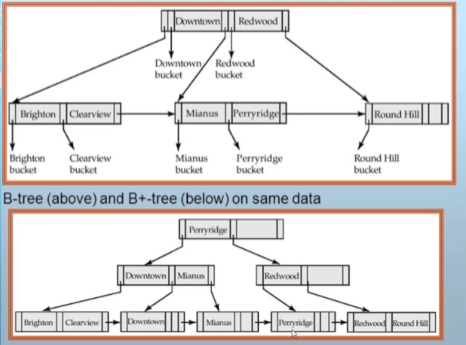

Rules for B+ trees include:

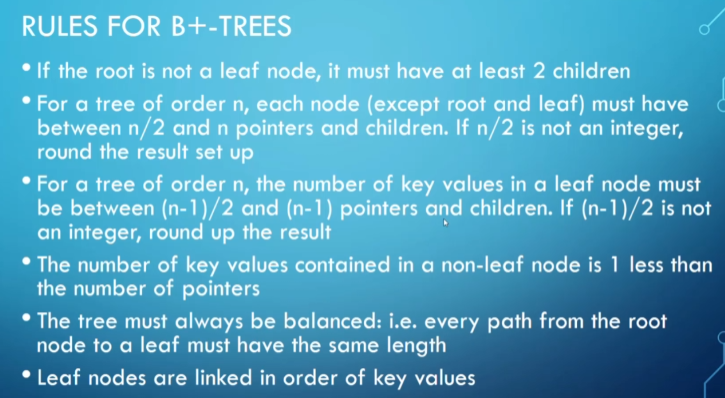

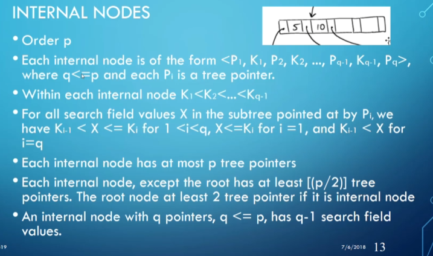

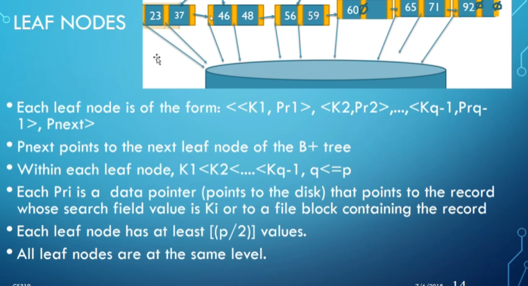

Inserting into a B+ tree follows specific rules to maintain balance. Let’s consider adding values step-by-step.

#### Example: Adding 48 to the Tree

Initial state:

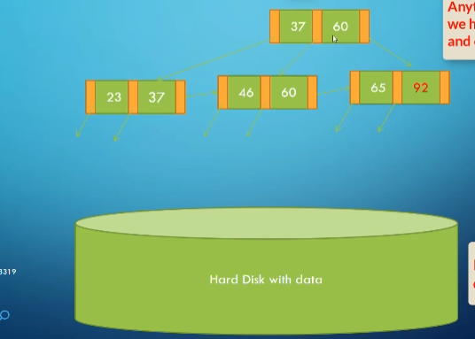

After adding 48:

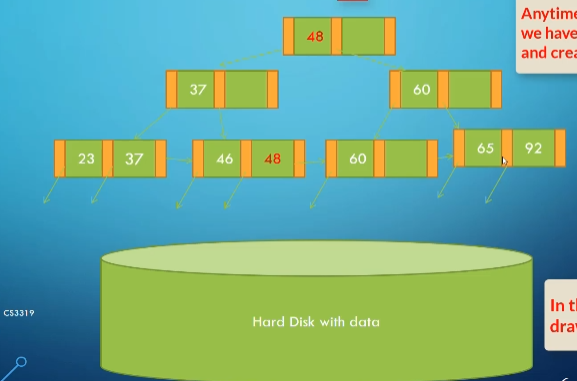

After adding 71:

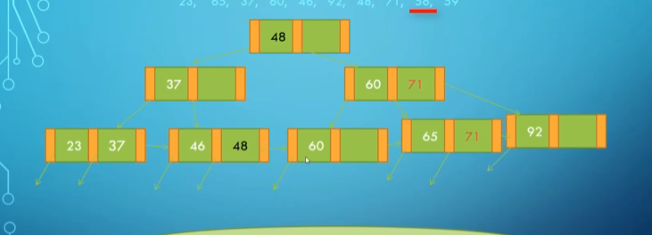

After adding 56:

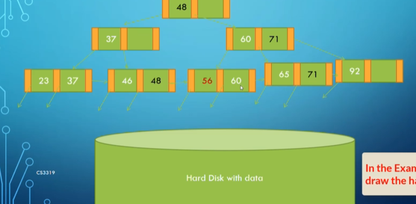

After adding 59:

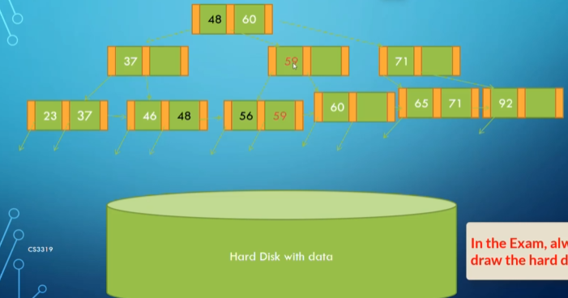

#### Speed Analysis with B+ Trees

1. Calculate levels for a B+ tree with an order of 120 (120 indices per block).
2. Start with 834 blocks for the index:

$$
\text{Level 1: } 834 \\
\text{Level 2: } 834/120 \approx 7 \\
\text{Level 3: } 7/120 \approx 1 \\
\text{Data Block (Level 4): Final level.}
$$

In total, **4 block accesses** are needed to find a record, a significant improvement over previous methods.
