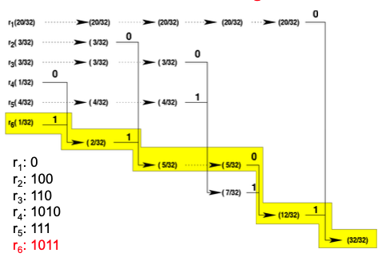
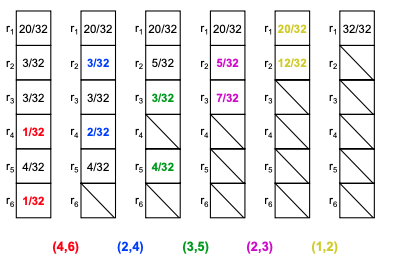
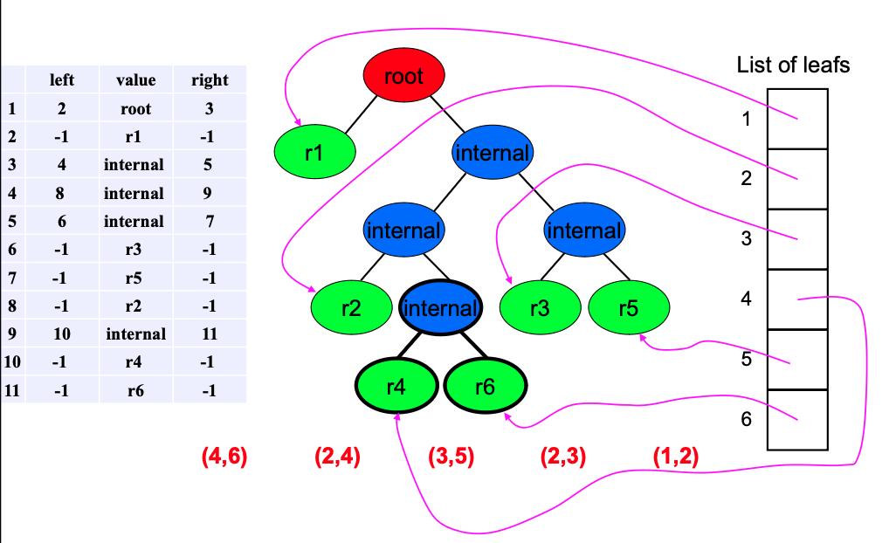

# Huffman Coding

## Codeword Encoding/Decoding

- **Encoding** involves assigning binary sequences to elements of an alphabet.
- An **alphabet** is a collection of symbols.
- The set of binary sequences is known as a **code** or **codebook**.
- Each sequence in the code is referred to as a **codeword**.
- **Example**: ASCII uses a fixed-length 7-bit code, where 'a' is coded as `1100001`2 and 'A' as `1000001`2.

**Fixed-Length Codes**
- The simplest method of encoding, where each codeword has the same number of bits.
- This method's bit rate per symbol is consistent, equivalent to the codeword length.
- To reduce bits required for various messages, a variable bit length per symbol can be used, especially to use fewer bits for more frequently occurring symbols.

**Codeword Decoding**
- **Decoding** converts a codeword back to the corresponding element in the alphabet.
- A **uniquely decodable code** means there is only one way to decode a sequence of codewords.
- **Non-uniquely Decodable Example**: The phrase "I saw a man on a hill with a telescope" can imply multiple interpretations.

**Uniquely Decodable Codes**

**Example 1**
- Codewords: a1 → 0, a2 → 0, a3 → 1, a4 → 10
- This code is not uniquely decodable as a1 and a2 share the same codeword, causing ambiguity.

**Example 2**
- Codewords: a1 → 0, a2 → 1, a3 → 00, a4 → 11
- Ambiguity arises here because encoding a1 twice (`00`) can also decode as a3.

**Example 3**
- Codewords: a1 → 0, a2 → 10, a3 → 110, a4 → 111
- This is a uniquely decodable and instantaneous code because each codeword's end can be identified without extra context (ends with `0` or three consecutive `1`s).

**Example 4**
- Codewords: a1 → 0, a2 → 01, a3 → 011, a4 → 0111
- Also uniquely decodable; decoding stops as soon as a `0` is encountered.
- However, it lacks the instantaneous property of Example 3 because the decoder needs to check following bits to confirm codeword completion.

**Discussion on Instantaneous Codes**
- Instantaneous codes allow immediate decoding of each codeword as it is read, without needing the subsequent codeword.
- While beneficial, instantaneous decoding is not required for a code to be uniquely decodable.

**Definitions and Testing for Unique Decodability**
- **Prefixes and Dangling Suffixes**: A codeword `a` (k bits long) is considered a prefix of another codeword `b` (n bits long, where k < n) if the first k bits of `b` are identical to `a`. The remaining bits of `b` are called the dangling suffix.
- **Example**: If `a = 010` and `b = 01011`, then `a` is a prefix of `b`, and the dangling suffix is `11`.

**Procedure to Test for Unique Decodability**
1. **Examine all pairs of codewords**: Identify if one codeword is a prefix of another.
2. **Check the dangling suffix**: If the dangling suffix matches any original codeword, the code is not uniquely decodable. Otherwise, add the dangling suffix to an augmented list for further checks.
3. **Repeat the process**: Continue until no new unique dangling suffixes can be added or a suffix matches an original codeword.

### Examples
**Example 5**
- **Codewords**: `a1 → 0`, `a2 → 01`, `a3 → 11`
- **Analysis**:
  - Initial list: `{0, 01, 11}`
  - `0` is a prefix for `01` with dangling suffix `1`.
  - The list becomes `{0, 01, 11, 1}`.
  - No further unique suffixes, and no suffix matches a codeword exactly. Hence, the code is uniquely decodable.

**Example 6**
- **Codewords**: `a1 → 0`, `a2 → 01`, `a3 → 10`
- **Analysis**:
  - Initial list: `{0, 01, 10}`
  - `0` is a prefix for `01` with dangling suffix `1`.
  - `1` is a prefix for `10` with dangling suffix `0`.
  - Since `0` is a codeword, the code is not uniquely decodable.
  - **Counter Example**: Concatenation of `01` and `10` can be decoded ambiguously as `a2 a1` or `a1 a3`.

**Example 7**
- **Codewords**: `a1 → 101`, `a2 → 1011`, `a3 → 0100`, `a4 → 00101`
- **Analysis**:
  - Identifying prefixes and suffixes creates a cycle where `101` (a1) reappears as a suffix, confirming the code is not uniquely decodable.
  - **Counter Example**: The sequence `10110100101` can be decoded in multiple ways, confirming ambiguity.

**Notes on Uniquely Decodable Codes**
- **NB1**: This testing method does not assess whether the code is instantaneous.
- **NB2**: If no codeword is a prefix of another, this results in a prefix-free code. Prefix-free codes are always uniquely decodable and instantaneous, but not all uniquely decodable codes are prefix-free.

## Huffman Encoding

A full implementation can be seen 
[here](https://github.com/norgera/CS4481-Image-Compression/tree/main/Huffman%20Coding "Github")

- **Node Layout**: Begin by laying out the individual symbols as an array of unmarked nodes.
- **Weight Assignment**: Assign to each node a weight corresponding to the frequency or probability of the symbol's occurrence.
- **Tree Construction**:
  1. Identify two unmarked nodes with the lowest weights.
  2. Create an unmarked parent node for these two nodes, assigning it a weight equal to the sum of the weights of the two child nodes.
  3. Label the paths to the child nodes arbitrarily with "0" and "1".
  4. Mark the child nodes as part of the tree.
- **Code Generation**: The code for each symbol is formed by accumulating the labels from the root to the symbol itself at the leaf.

Example of Huffman Encoding

Consider a set of symbols R = {r1, r2, r3, r4, r5, r6} with the following probabilities of occurrence:

- P(r1) = 20/32
- P(r2) = 3/32
- P(r3) = 3/32
- P(r4) = 1/32
- P(r5) = 4/32
- P(r6) = 1/32

 

### Draw Huffman trees
- Start from a single node (the root node).
- Each node can have either:
  - zero branch (in this case we call it external node, or leave node)
  - Two branches (in this case we call it internal node)
- One of these branches corresponds to a 0 (assume it is the left branch).
- The other branch corresponds to 1 (assume it is the right branch).

While the end-of-symbols-need-to-be-encoded is not reached:
- Read a single symbol from the input data.
- Find the corresponding Huffman code for that symbol.
- Concatenate this Huffman code to the compressed Huffman data.

**Example:**
- `r5 r1 r1 r5 r2 r6 r3 r1 r1 r4` will be encoded as `111001111001011110001010`.

Consider a set of symbols R = {r1, r2, r3, r4}
- The probability of occurrence of these symbols are:
  - P(r1) = 1/8
  - P(r2) = 1/8
  - P(r3) = 1/4
  - P(r4) = 1/2

Design a Huffman code for these symbols and calculate the average bit rate per each symbol.

- Using the same steps in Figure 1,

- r1: 100
- r2: 101
- r3: 11
- r4: 0

Average bit rate calculation:
- `3 × 1/8 + 3 × 1/8 + 2 × 1/4 + 1 × 1/2 = 1.75 bits per symbol`

- Consider a set of symbols R = {r1, r2, r3, r4}
- The probability of occurrence of these symbols are:
  - P(r1) = 1/4
  - P(r2) = 1/4
  - P(r3) = 1/4
  - P(r4) = 1/4
- Design a Huffman code for these symbols and calculate the average bit rate per each symbol.

Assigned Huffman Codes:
- r1: 00
- r2: 01
- r3: 10
- r4: 11

Average bit rate calculation:
- `2 × 1/4 + 2 × 1/4 + 2 × 1/4 + 2 × 1/4 = 2 bits per symbol`

## Huffman Decoding

While the end-of-compressed-Huffman-data is not reached:
- Set the current node to the root node.
- While the current node is not a leaf node:
  - Read a single bit from the compressed Huffman data.
  - If it is `0`, go to the left child node and declare it as the current node.
  - If it is `1`, go to the right child node and declare it as the current node.
- Get the decoded symbol from the current node root.

**Example:**
- The sequence `111001111001011110001010` will be decoded as:
  - `r5 r1 r1 r5 r2 r6 r3 r1 r1 r4`
