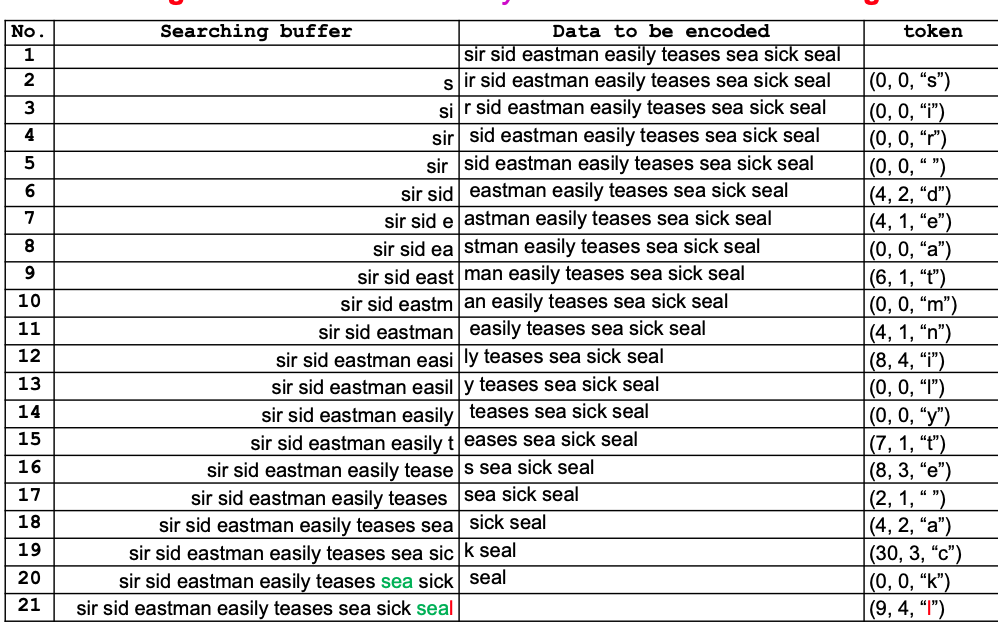
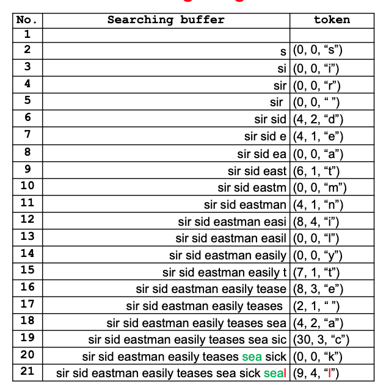
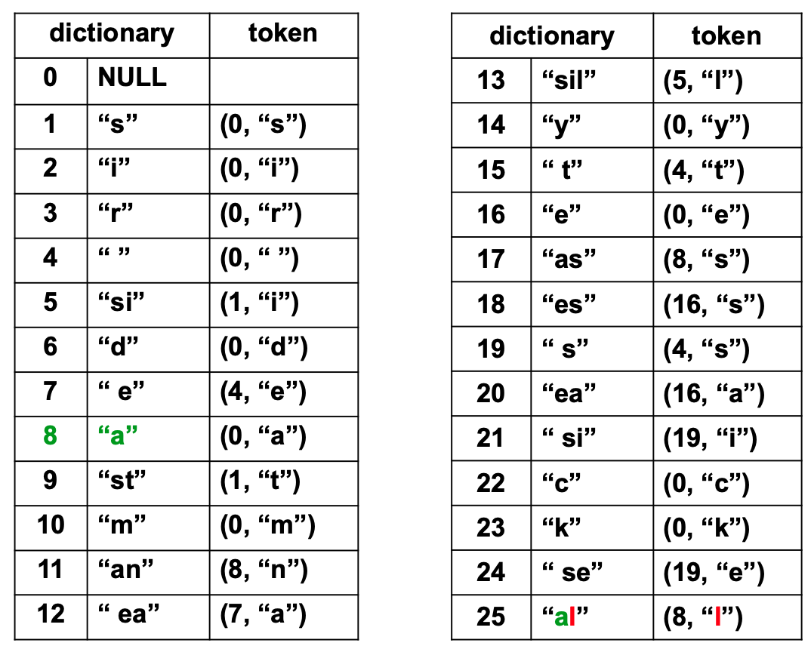
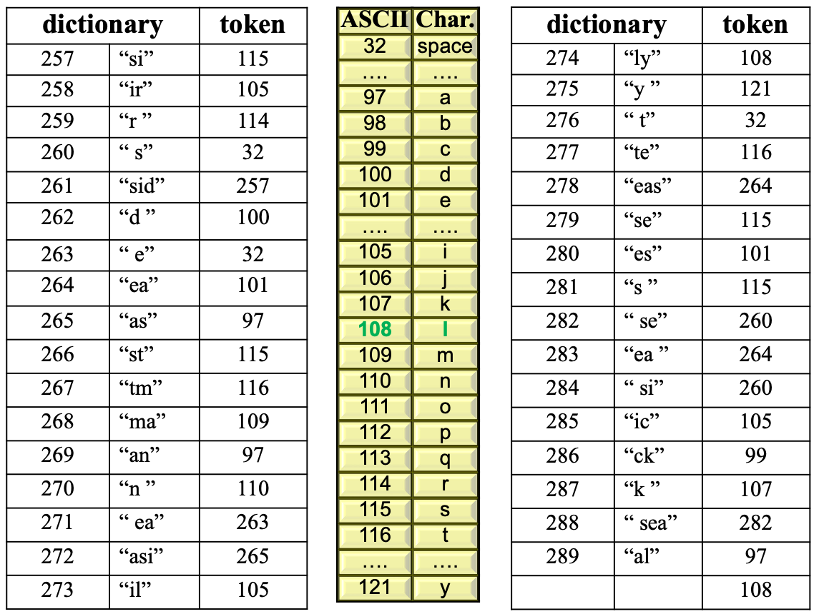

# LZ77 - LZ78 - LZW

### Dictionary-based Compressions

- **Introduction**:
  - **How many words are in a dictionary?**
    - Pocket dictionary: about 25,000 words.
    - Full-size dictionary: about 60,000 words.
  - **Bits needed for indexing**:
    - Pocket dictionary: 15 bits are needed (0 to 32,767).
    - Full-size dictionary: 16 bits are needed (0 to 64,535).

**Dictionary-based Encoding for Large Dictionaries**

- **Example Setup**:
  - Assume an English word consists of 6 letters on average.
  - Consider a dictionary containing half a million words:
    - This dictionary is searched for each word that needs to be encoded.
    - If a match is found:
      - The word is encoded by a pointer to that word (20 bits total):
        - 1 bit to indicate that a match was found.
        - 19 bits as a dictionary index to that word.
    - Otherwise:
      - The word is encoded without any compression (50 bits on average):
        - 1 bit to indicate that no match was found.
        - 7 bits to identify the length of the word.
        - 6 characters per word (on average) × 7 bits per character.

**Compression Efficiency Calculation**

- **Compression Calculation**:
  - After reading and compressing $N$ words, the size of the compressed file will be (on average):
    $
    N \times (20 \times P + 50 \times (1 - P)) \text{ bits},
    $
  - Without compression, we would need:
    $
    N \times 49 \text{ bits} \text{ to encode these } N \text{ words}
    $
  - To achieve compression, the following relation must hold:
    $
    (20 \times P + 50 \times (1 - P)) < 49
    $
  - Or in other words, $P$ must be greater than $\frac{1}{30}$.

**Statistical-based Versus Dictionary-based Compressions**

- **Comparison**:
  - **Statistical-based compression schemes**:
    - Use a statistical model of the data.
    - The quality of the achieved compression depends on how good that model is.
  - **Dictionary-based compression schemes**:
    - A data string is partitioned into sub-strings of symbols.
    - Each sub-string is encoded as a dictionary index.
    - The dictionary can be:
      - **Static**:
        - Holds predetermined strings (image independent).
        - Sometimes allows strings addition.
        - Does not allow strings deletion.
      - **Dynamic (adaptive)**:
        - Holds strings previously found in the input stream (image dependent).
        - Allows strings addition and deletion.
  - **Famous examples**:
    - Perhaps the most famous dictionary-based compression schemes are LZ77 and LZ78.

### LZ77 Compression

A full implementation on real images can be found [here](https://github.com/norgera/CS4481-Image-Compression/tree/main/LZ77%20Coding "Title")


- **Background**:
  - LZ77 is a dictionary-based compression scheme described by Ziv and Lempel in 1977, giving it the name LZ77.

- **Main Concept**:
  - The principal idea of LZ77 is to use part of the previously seen input stream as a dictionary, known as the searching buffer.
  - The searching buffer acts as a sliding window on the input characters/pixels that have recently been encoded.

- **Encoding Process**:
  - The encoder scans the search buffer looking for a match to the current data symbol to be encoded.
  - If a match is found, the encoder tries to match as many following symbols as possible.
  - The encoder continues the scan, attempting to find longer matches.
  - The longest match is selected to generate the token.

- **Token Structure**:
  - An LZ77 token consists of three parts:
    - **Offset**: How far back in the buffer the match starts.
    - **Match Length**: The number of characters in the match.
    - **Next Mismatched Symbol Code**: The code of the next mismatched symbol from the input stream.


```python
def lz77_encode(data, search_buffer_size=4096):

    encoded = []
    i = 0

    while i < len(data):
        max_match_length = 0
        max_match_distance = 0
        next_symbol = ''

        # Adjust search buffer to include the character for the current token
        buffer_start = max(0, i - search_buffer_size)

        # Search for the longest and nearest match within the buffer
        for j in range(i-1, buffer_start-1, -1):
            match_length = 0
            while i + match_length < len(data) and data[j + match_length] == data[i + match_length]:
                match_length += 1
                if j + match_length >= i or i + match_length == len(data):  # Stop conditions
                    break

            if match_length > max_match_length or (match_length == max_match_length and i - j < max_match_distance):
                max_match_length = match_length
                max_match_distance = i - j

        if i + max_match_length < len(data):
            next_symbol = data[i + max_match_length]

        encoded.append((max_match_distance, max_match_length, next_symbol))

        # Calculate the position after encoding the current token for accurate buffer
        i += max_match_length + 1

        # Ensure the search buffer now reflects the inclusion of the token's character
        buffer_start = max(0, i - search_buffer_size)
        search_buffer = data[buffer_start:i]  # Corrected to reflect current token character
        data_to_be_encoded = data[i:]  # The rest of the data to encode

        # Print the current search buffer and the remaining data to be encoded
        print(f"Token: {encoded[-1]}")
        print(f"Search Buffer ('{search_buffer}') | Data to be Encoded: '{data_to_be_encoded}'")
        print("----")

    return encoded

# Re-encode with updated logic
example_data = "sir sid eastman easily teases sea sick seal"
encoded_data_longest_nearest = lz77_encode(example_data)
```

**Output:**




```python
def lz77_decode(encoded_data):
    
    decoded = ""

    for offset, length, next_symbol in encoded_data:
        # Start by finding the position in the decoded string to copy from
        start_pos = len(decoded) - offset
        if start_pos < 0:
            raise ValueError("Invalid offset in token, cannot decode.")

        # Copy the matched string from the decoded data itself
        for i in range(length):
            if start_pos + i < len(decoded):
                decoded += decoded[start_pos + i]
            else:
                break  # In case length exceeds the current decoded string size

        # Append the next symbol to the decoded string
        decoded += next_symbol

        # Print the current state of decoding
        print(f"Token: {offset}, {length}, '{next_symbol}')")
        print(f"Buffer: '{decoded}'")
        print("----")

    return decoded


decoded_data = lz77_decode(encoded_data_longest_nearest)
print("Decoded data:", decoded_data)

```

**Output:**

Decoded data: sir sid eastman easily teases sea sick seal




### LZ78 Compression

- **Overview**:
  - Unlike LZ77, LZ78 does not use a search buffer or sliding window.
  - Instead, it employs a dictionary of previously encountered strings.

- **Dictionary Initialization**:
  - The dictionary starts empty, except for a null string at position zero.
  - The dictionary size is limited.

- **Compression Process**:
  - During compression, the dictionary is searched for the longest substring which is a prefix of the sequence yet to be encoded.
  - The LZ78 encoder produces a two-part token:
    - A pointer to a dictionary entry.
    - The code of the next symbol.

- **Token Structure**:
  - The length part of the token has been eliminated, as it is implied in the dictionary entry.

- **Dictionary Update**:
  - Each token corresponds to a substring of encoded input symbols.
  - This substring is added to the dictionary after the token is written on the compressed stream.


```python
def lz78_encoding(input_string):
    # Initialize the dictionary with a NULL entry
    dictionary = {0: 'NULL'}
    dict_index = 1  # Start dictionary indices from 1 as 0 is reserved for NULL
    
    # The list to hold the tokens produced by the LZ78 encoding
    tokens = []
    current_string = ''
    
    # Process the input string character by character
    for char in input_string:
        # Check if the current string plus the new character is in the dictionary
        if current_string + char not in dictionary.values():
            # If the current string is empty, the index is 0, otherwise find the index
            index = 0 if current_string == '' else list(dictionary.keys())[list(dictionary.values()).index(current_string)]
            # Append the token (index, new character) to the tokens list
            tokens.append((index, char))
            # Add the new string to the dictionary and increment the index
            dictionary[dict_index] = current_string + char
            dict_index += 1
            # Reset current string to empty
            current_string = ''
        else:
            # If the string is in the dictionary, concatenate the character to the current string
            current_string += char
    
    # Handling the last token if the current_string is not empty
    if current_string:
        index = list(dictionary.keys())[list(dictionary.values()).index(current_string)]
        tokens.append((index, ''))
    
    return dictionary, tokens

# The input string for LZ78 encoding
input_string = "sir sid eastman easily teases sea sick seal"

# Perform the LZ78 encoding
dict_result, tokens_result = lz78_encoding(input_string)

# Print the tokens
print("Tokens:")
for token in tokens_result:
    print(f"{token},")

# Print the dictionary entries
print("\nDictionary Entries:")
for key, value in dict_result.items():
    print(f"{key}: '{value}'")

```

**Output:**

Tokens:
(0, 's'),
(0, 'i'),
(0, 'r'),
(0, ' '),
(1, 'i'),
(0, 'd'),
(4, 'e'),
(0, 'a'),
(1, 't'),
(0, 'm'),
(8, 'n'),
(7, 'a'),
(5, 'l'),
(0, 'y'),
(4, 't'),
(0, 'e'),
(8, 's'),
(16, 's'),
(4, 's'),
(16, 'a'),
(19, 'i'),
(0, 'c'),
(0, 'k'),
(19, 'e'),
(8, 'l'),

Dictionary Entries:
0: 'NULL'
1: 's'
2: 'i'
3: 'r'
4: ' '
5: 'si'
6: 'd'
7: ' e'
8: 'a'
9: 'st'
10: 'm'
11: 'an'
12: ' ea'
13: 'sil'
14: 'y'
15: ' t'
16: 'e'
17: 'as'
18: 'es'
19: ' s'
20: 'ea'
21: ' si'
22: 'c'
23: 'k'
24: ' se'
25: 'al'

or



```python
def lz78_decoding(tokens):
    # Initialize the dictionary with a NULL entry
    dictionary = {0: ''}
    decoded_string = ''
    
    # Process the tokens to rebuild the dictionary and the decoded string
    for index, char in tokens:
        # If the index is in the dictionary, get the string and add the character to it
        if index in dictionary:
            entry = dictionary[index] + char
        else:
            entry = char
            
        # Add the entry to the dictionary
        dictionary[len(dictionary)] = entry
        # Add the entry to the decoded string
        decoded_string += entry
    
    return decoded_string

# The tokens from the LZ78 encoding
tokens = [
(0, 's'),
(0, 'i'),
(0, 'r'),
(0, ' '),
(1, 'i'),
(0, 'd'),
(4, 'e'),
(0, 'a'),
(1, 't'),
(0, 'm'),
(8, 'n'),
(7, 'a'),
(5, 'l'),
(0, 'y'),
(4, 't'),
(0, 'e'),
(8, 's'),
(16, 's'),
(4, 's'),
(16, 'a'),
(19, 'i'),
(0, 'c'),
(0, 'k'),
(19, 'e'),
(8, 'l')
]


# Perform the LZ78 decoding
decoded_string = lz78_decoding(tokens)
print(decoded_string)

```

**Output:**
sir sid eastman easily teases sea sick seal

---

### Lempel-Ziv-Welch (LZW) Compression

- **Introduction to LZW**:
  - LZW is a variant of the LZ78 compression algorithm, developed by Terry Welch in 1983. It's named after its creators, Lempel, Ziv, and Welch.

- **Token Simplification in LZW**:
  - Unlike LZ78, LZW can eliminate the need for the second part of the token (the single character) by pre-initializing the dictionary.
  - **Dictionary Initialization**:
    - The dictionary is initialized with all possible values for single characters, i.e., `{0, 1, 2, ..., 255}`.
    
- **Special Control Code**:
  - **Dictionary Entry Number 256**:
    - Reserved as a special control code within the LZW dictionary.
  - **Purpose**:
    - This control code is used to force the dictionary to be flushed. This means it resets or clears the dictionary to start fresh.
  - **Reason for Flushing**:
    - The flushing mechanism allows the compression algorithm to adapt to changes in the data being compressed, which can enhance compression efficiency in scenarios where the data characteristics change over time.

- **Why LZW?**:
  - By initializing the dictionary with all possible single-character strings and using a special control code to manage the dictionary's size, LZW simplifies the encoding process. This reduces the complexity and size of the tokens generated during compression, potentially leading to more efficient compression under certain conditions.


```python
def lzw_encoding(input_string):
    # Initialize the dictionary with single characters (ASCII values)
    dictionary = {i: chr(i) for i in range(256)}
    dict_size = 256
    current_string = ''
    tokens = []
    
    # Process the input string character by character
    for char in input_string:
        # Form a new string by concatenating the current string and the new character
        new_string = current_string + char
        if new_string in dictionary.values():
            # If the new string is already in the dictionary, set it as the current string
            current_string = new_string
        else:
            # If current_string is not empty, add it to tokens
            if current_string:
                # Adjust the index for tokens greater than 255
                index = list(dictionary.keys())[list(dictionary.values()).index(current_string)]
                tokens.append(index if index < 256 else index + 1)
            # Add the new string to the dictionary and increment dict_size
            dictionary[dict_size] = new_string
            dict_size += 1
            # Reset current_string to the current char as it's not in the dictionary
            current_string = char
    
    # Append the last token if current_string is not empty
    if current_string:
        index = list(dictionary.keys())[list(dictionary.values()).index(current_string)]
        tokens.append(index if index < 256 else index + 1)
    
    return dictionary, tokens

# Perform LZW encoding on the given string
input_string = "sir sid eastman easily teases sea sick seal"
dict_result, tokens_result = lzw_encoding(input_string)

# Print out the tokens, adjusted for indices greater than 255
for token in tokens_result:
    print(token)

# Print the new dictionary entries, adjusted to start at index 257
print("\nNew dictionary entries (starting from 257):")
new_dict_entries = {k + 1: v for k, v in dict_result.items() if k >= 256}

for key, value in new_dict_entries.items():
    print(f"{key}: '{value}'")
```

**Output:**

115
105
114
32
257
100
32
101
97
115
116
109
97
110
263
265
105
108
121
32
116
264
115
101
115
260
264
260
105
99
107
282
97
108

New dictionary entries (starting from 257):
257: 'si'
258: 'ir'
259: 'r '
260: ' s'
261: 'sid'
262: 'd '
263: ' e'
264: 'ea'
265: 'as'
266: 'st'
267: 'tm'
268: 'ma'
269: 'an'
270: 'n '
271: ' ea'
272: 'asi'
273: 'il'
274: 'ly'
275: 'y '
276: ' t'
277: 'te'
278: 'eas'
279: 'se'
280: 'es'
281: 's '
282: ' se'
283: 'ea '
284: ' si'
285: 'ic'
286: 'ck'
287: 'k '
288: ' sea'
289: 'al'

or 



Decode Function: TODO