## File Systems

For general-purpose OS, the file system is the most visible part, containing files (with metadata) and directories

We’ve talked about how they’re stored, but how are they organized?

To answer our previous question, we need to understand what we really mean by files and directories

### Files

Files are collections of related information, either binary (zips, executables, etc.) or alphanumeric (code, text files, etc.)

- Linux uses files to represent system attributes under /proc since they’re so fundamental

These have attributes, which give some information

The basic operations are create, read, write, reposition, delete, truncate (erase contents but not metadata) and open/close (bring in/out of memory), with others including read (update file name in metadata) and append (write to end of file)

Any other operations are just a combo of the basic ones above (ex. copy a file really means opening for reading, creating a new one, opening that one for writing, reading the contents for that file, writing its contents into the new file and closing both files)

The OS keeps track of what files are open with a read/write table, including read/write info, position and the process that opened it

Some OSes also used file locking, either with a shared lock or an exclusive lock, so if there’s conflict we can either mandatory lock (prevent processes from sharing like in Windows) or advisory lock (leave it up to the processes, like in Linux)

- More info on locks is discussed in lesson 6

Some applications identify files with extensions, with the operating system assisting with default applications

| file type       | usual extension                          | function                                         |
|-----------------|------------------------------------------|--------------------------------------------------|
| executable      | exe, com, bin or none                    | ready-to-run machine-language program            |
| object          | obj, o                                   | compiled, machine language, not linked           |
| source code     | c, cc, java, pas, asm, a                 | source code in various languages                 |
| batch           | bat, sh                                  | commands to the command interpreter              |
| text            | txt, doc                                 | textual data, documents                          |
| word processor  | wp, tex, rtf, doc                        | various word-processor formats                   |
| library         | lib, a, so, dll                          | libraries of routines for programmers            |
| print or view   | ps, pdf, jpg                             | ASCII or binary file in a format for printing or viewing |
| archive         | arc, zip, tar                            | related files grouped into one file, sometimes compressed, for archiving or storage |
| multimedia      | mpeg, mov, rm, mp3, avi                  | binary file containing audio or A/V information  |

Some files are rigid in structure (simple record or complex record), while others are free-form

- The OS doesn’t care since it’d cause overhead, but applications do

### Access Methods

Files have to be loaded into memory to be used, either by sequential access, direct access or other methods

Sequential access uses read next, write next, reset and skip forward/backward and is the most common method

Direct access reads and writes record in any order with knowledge of block location, with read block N and write block N being the only methods

- Since files are typically scattered in blocks, N refers to blocks relative to the first block
- We can still simulate sequential with this method

Other access methods include indexes for quick lookup (used in databases)

### Directories

Directories group files together, containing all the filenames and their identifiers, which we then use to look up other file information

The basic operations include searching for a file, creating a file, deleting a file, listing directories, renming a file and traversing the system

There are organized logically for efficiency (fast finding), naming (easy finding) and grouping (similar files in one directory)

These directories can either be atomic, two-level, a tree or a graph

With a single-level directory, each directory exists side by side, which is easiest but is the least useful since we can’t name efficiently and we can’t group similar files together

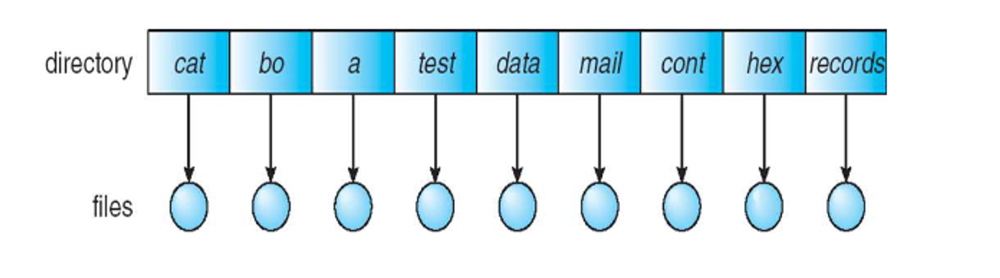

Two level is slightly better, but we have the same problem with grouping

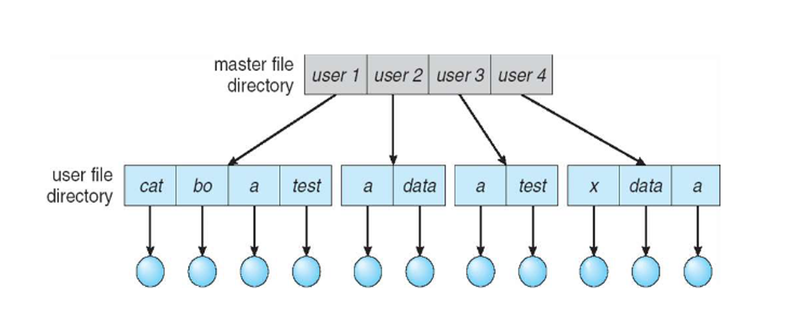

Trees get to the meat of the problem, starting with a root dir and then stemming out from there, so we can use a flag 0 for a file and a flag 1 for a directory to differentiate the two

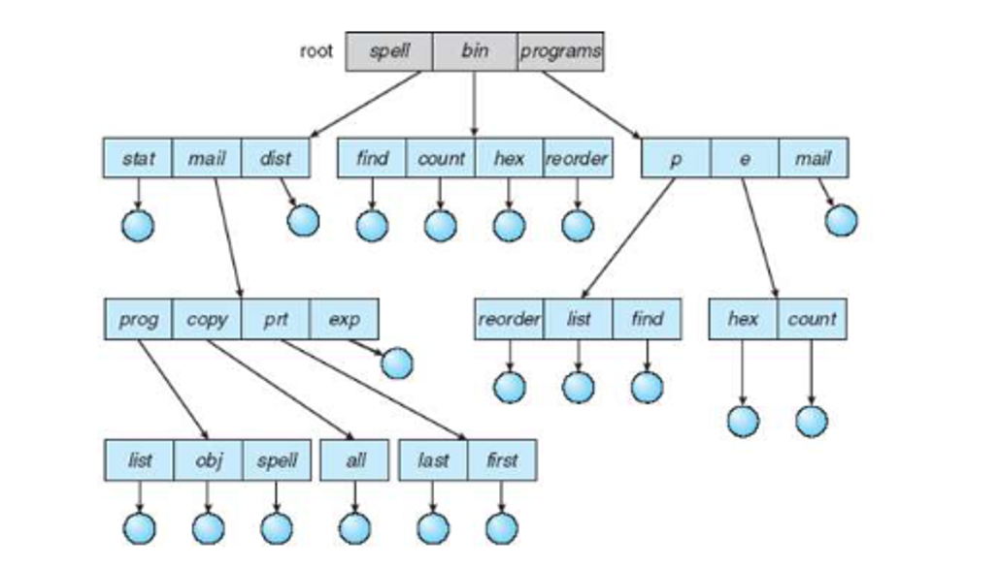

With an acyclic graph, we relax the structure even more by allowing files to exist in multiple directories with pointers called links or shortcuts

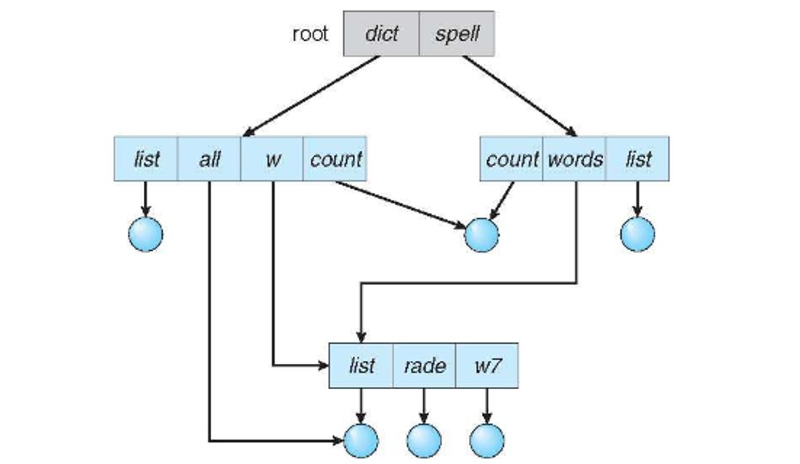

Directory traversal must account for possible cycles, so we must disallow links to directories and limit the number that can be search

Deletes and link adds also need to account for cycles by keeping a count of incoming references and using garbage collection to remove unreferenced files

Regardless of structure, if the directory isn’t specified, all operations occur in the pwd, so deleting the pwd can remove all files and directories in the subtree

- On Linux, directories need to be empty before they’re deleted, but we can override this with rm -r

### Protection

Files need to be protected from not only physical damage but improper access as well, which we can do with authentication (valid user/pass like sudo), authorization (user perms) and encryption (even if the drive is copied, the files should be protected)

We can think about this in accordance to our basic mtehods

- **Read** – Can the contents of the file be read?

- **Write** – Can data be written or re-written to the file?

- **Execute** – Can the contents of the file be loaded into memory and executed?

- **Append** – Can data be appended to the file?

- **Delete** – Can the file be deleted and space reclaimed?

- **List** – Can the name and attributes be listed?

- **Attribute change** – Can the attributes (metadata) be changed?

Most OSes employ identity-based protection with an access control list (ACL) mapping users to permissions

These can be quite large, so Linux uses classifications such as owner (the user who created the file), group (a set of users who share the file) and others

More complex permissions can be achieved with some tricks

## Implementation

The file system handles file structure, allocating/recovering space, tracking locations and interfacing with the OS

- OSes provide support for many of these systems, with Linux supporting over 130

Picking a file system depends on user needs, including performance, reliability and extra features, with new ones being created all the time

- There are even tools such as FUSE providing interfaces to easily roll out custom file systems without editing the kernel

These systems are made of multiple layers, which reduces complexity while adding overhead

1. Application programs
   - ↓
2. Logical file system
   - ↓
3. File-organization module
   - ↓
4. Basic file system
   - ↓
5. I/O control
   - ↓
6. Devices

The I/O layer contains drivers and interrupt handlers, which controls I/O devices and are given commands like the following

read drive1, cylinder 72, track 2, sector 10, into memory location 1060

This gives low-level hardware specific commands to the hardware controller

The basic file system uses buffers and cache to store data as it’s retrieved or stored, being given more generic commands such as retrieve block 123

- This also manages I/O scheduling

The file organization layer understand files, logical addresses and physical blocks, translating between logical and physical while also freeing and allocating space

The logical file system manages metadata, while translating file names into numbers, handles and locating by maintaining file control blocks (inodes in UNIX)

- We also maintain file control blocks (FCBs), directories and file protection

These together provide structures and operations to manage files and directories using several storage or memory structures as well as operations on these structures

- On-storage structures persist, but in-memory structures last until file system dismount or system reboot

Some common ones include the boot control block (contains boot information for an OS, 1 per block), volume control block (contains volume details such as total blocks, total free blocks, block size and free block pointers, 1 per block), directory structures (1 per file system) and FCBs (1 per file, containing metadata)

- Windows with NFTS uses as master table instead of FCBs

For in-memory, we have the mount table (file system mount, mount points and file system types), directory structure cache (recently used directories), system-wide open-file table (FCB of each file and other info) and per-process open-file table (pointers to the system-wide open-file table along with other info)

For operations, things get a bit complicated (and I don’t feel like writing)

E.g. To create a new file, a process calls the logical file system layer to create

The logical file system layer will allocate a new FCB, assign the FCB and the new file to a directory in the directory structure

The file organization module layer will find logical blocks for the file

The basic file system layer will map the logical blocks to physical blocks

The I/O control layer will write the data to disk

E.g. To read the new file, a process calls the logical file system layer to open and read

The logical file system layer will search the system-wide open-file table
  - If it is already open, a per-process open-file table is created pointing to this entry and the entry is incremented
  - If it is not already open, search the directory structure for the file and add the FCB to the system-wide open-file table

Update the per-process open-file table to include read location in the file and access mode

E.g. To close the new file, a process calls the logical file system layer to close

The logical file system layer will remove the per-process open-file table

Decrement the system-wide open-file table entry
  - If the open count is now 0, write any metadata to the directory structure and remove the entry

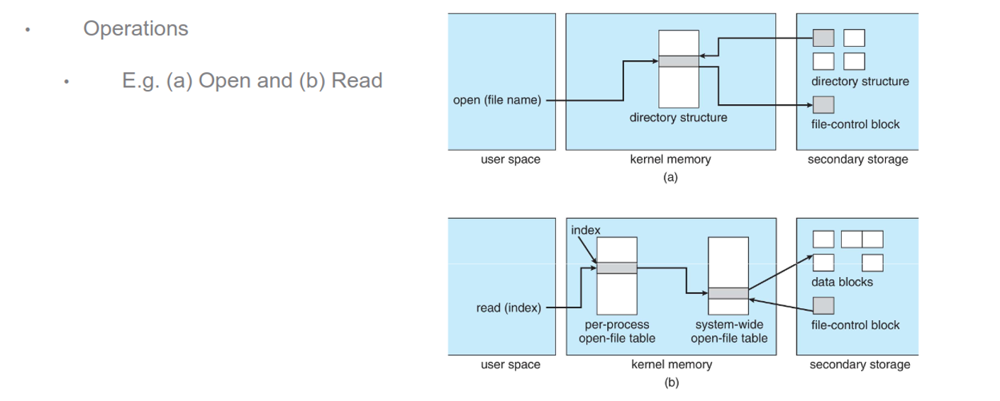

### Directories

The directory structure impacts efficiency, performance and reliability and depends on what we’re doing

We could do a linear list with pointers to data blocks, which is simple to program but is linear time

- We could maintain alphabetical order, but sorting is also time-consuming

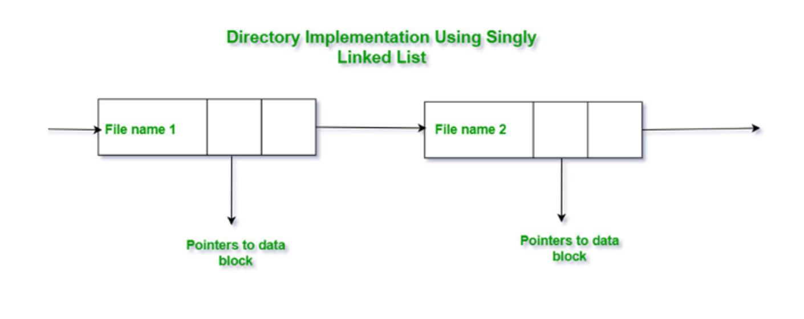

Hash tables are another option, which decrease search time but come at the cost of hash collisions

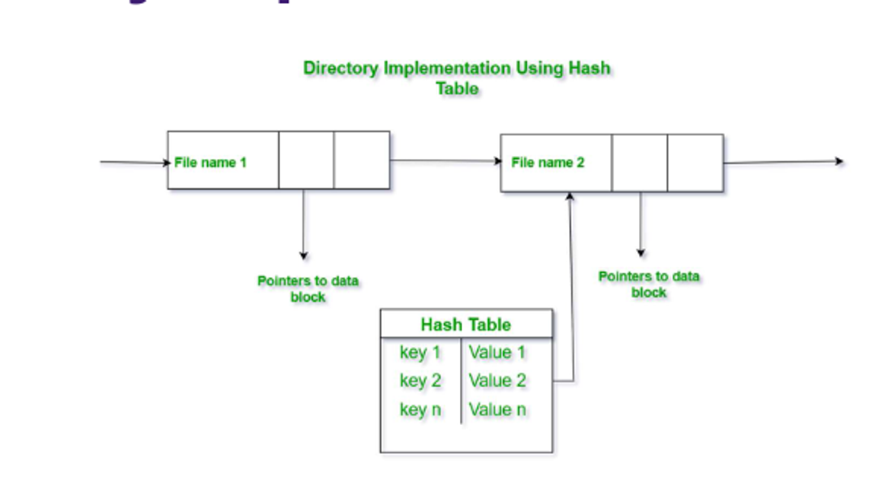

### Allocations

The file system assigns contiguous sectors on the physical disk to a logical block, with files consisting of one or more blocks and free space being all the blocks that aren’t used

The file system needs to keep track of these blocks efficiently, with three main approaches

Contiguous allocation has each file occupying a contiguous set of blocks, with superior performance and simplicity, but makes finding space harder since we need to know the file size ahead of time

- There’s also problems with fragmentation, which we discuss in lesson 7

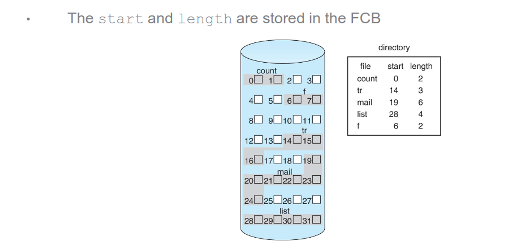

Linked lists can eliminate external fragmentation and allow for dynamic file sizes, but random access is slow and a small portion of the block needs to be reserved for a pointer to the next block

- Clustering blocks can help somewhat

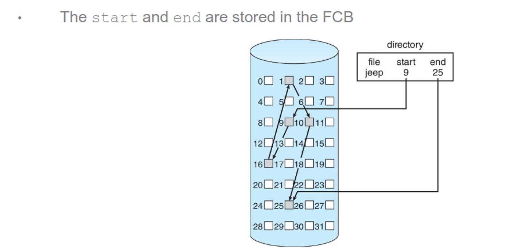

Indexed allocation gives each file an index block, with the index pointing to all other blocks

This also eliminates external fragmentation and makes random access fast, but if the number of indices exceeds the size of the index block, we will need multiple layers

- These layers scale up fast, to where adding an extra layer can bring the block size from 4MB to 4GB

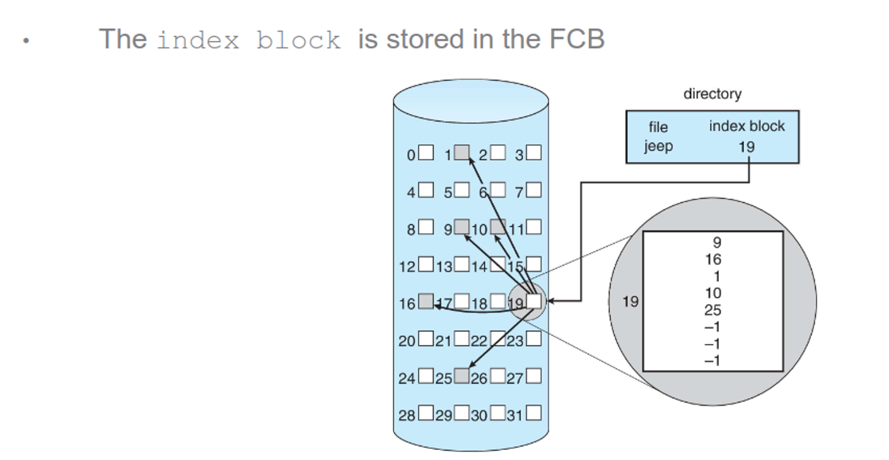

Some OSes will combine direct and indirect blocks, so small files will not use an index block, while large files will use multiple layers

Increasing the size of the pointers will raise the maximum file size, so 32-bit pointers can hold up to 4GB, while must UNIX file systems support 64-bit pointers

- ZFS uses 128-bit pointers

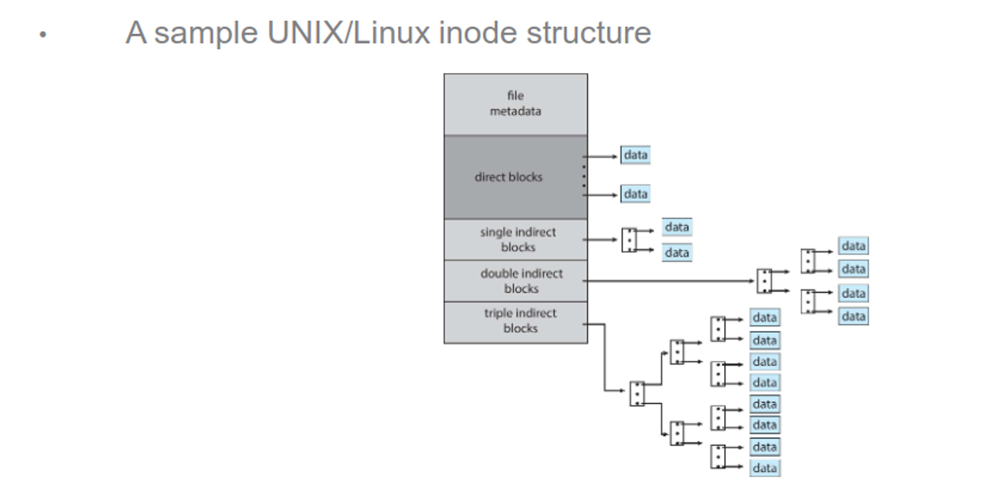

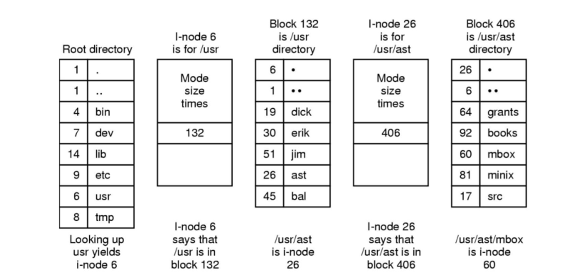

If the workload against a file is known, the allocation type can be chosen at file creation, but this usually isn’t the case

Reducing disk movement (discussed in lesson 8) can help, but for NVMs, we need different methods

### Free-Space

We need to keep of list of free blocks, either as a bitmap or as a true list

With a bitmap, we can assign each block to a bit, using 0 for in-use and 1 for free

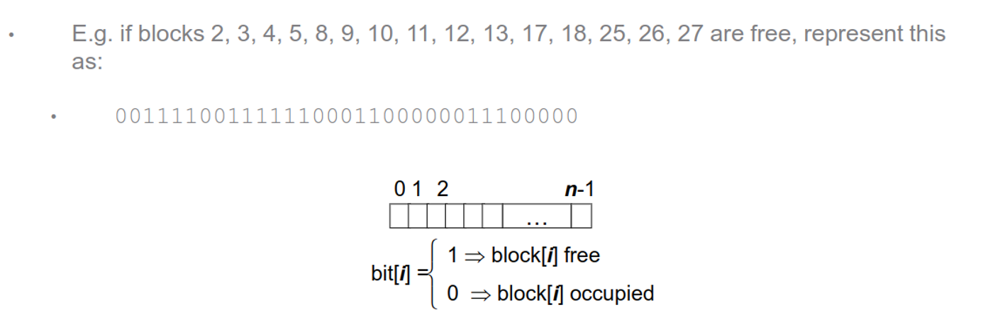

This makes finding free blocks very simple and is easy to implement, as well as finding contiguous blocks, while also taking up a lot of space (1TB with 4KB blocks requires a 32MB bitmap in memory)

A linked-list makes it easy to find a free block (just look at the head), but traversing the list is costly (we rarely do a full traversal)

- To make this more efficient, we can use grouping (blocks storing a list of n addresses, with n-1 being free and the last block pointing to another group of addresses) or counting (storing a value n to signify that the next n blocks are free)

Freeing blocks doesn’t require erasing data, so file systems just mark the block as being free, saving time while hurting security (forensics experts ca manually read the disk)

- HDDs and NVMs can either do this immediately, during a quiet period or before the block is used again

### Efficiency

The biggest bottleneck is the disk itself, so we must consider the following

- Unix spreads inodes across the volume. Files are stored close to their directory's inode. This reduces seek time

- Keeping "last modified" and "last accessed" dates can tell the OS if the file needs to be loaded into memory or to be backed up to tertiary storage

- Pointer size – 32-bit pointers use less space but limits file size to 4GB. 64-bit pointers use more space but allow for larger files.
  - (A device capable of holding $2^{128}$ bytes at the atomic level should weigh about 272 trillion kilograms)

- Use a cache both on the disk and in memory. Most operating systems combine process and file data cache in a unified virtual memory

### Recovery

Crashes and bugs can create inconsistencies, so we must correct these issues in the file system itself

In the system, we can scan the metadata to check for inconsistencies

- This can take minutes or even hours, so we should save this for boot time

A status bit can be used to indicate whether or not the whole system is up to date, so if the system reboots suddenly, the file system is marked as “in flux”, triggering a full consistency check such as fsck in UNIX

We can alsu take a tip from DBs and use log-based transaction-oriented recovery (aka journaliing), which requires maintaining a running log of unconfirmed transactions that must be replayed when an interruption occurs

This log can be stored in a separate section of the file system or a different device, with the log also allowing the OS to write data asynchronously

Backups are also recommended, typically following a schedule like the following

- A typical backup schedule (e.g. weekly or monthly)

  - **Day 1** – Copy all files to a backup medium. This is a **full backup**

  - **Day 2** – Compare a file's last backup date with the last modified date. If the file has changed, back it up. This is an **incremental backup**

  - Continue this process up to day N. Then run a full backup again

  - Watch out for daylight savings time

To restore the file system, we can restore from either a full backup or an incremental backup

- A differential backup is also a good substitute for a incremental backup, restoring only files that differ from the full backup
- Cold storage is also a good idea, keeping a long-term backup off-site and disconnected to protect against the environment or malicious attacks

## Internals

General-purpose computers can have multiple storage devices, including USBs, extra drives and so on

These storage devices can be further divided into partitions, assigned to one or more volumes and each of those being formatted into a file system

Some common ones include

- Windows: NTFS, FAT, FAT32
- UNIX: ext2, ext3, ext4, zfs, ufs
- Special-purpose: tmpfs for temp I/O, procfs for process information as a file system in UNIX, others for specific workloads like Google filesystem

### Mounting

Systems need to be mounted before they can be used, with the OS being given a name and a mount point, a location in the file structure (usually empty)

- The file system is either given or determined automatically

If the system is already mounted, the OS needs to either allow or disallow multiple mounts

If the mount point is non-empty, the OS must also decide whether to prevent the action or obscure existing files and directories until the file system is unmounted

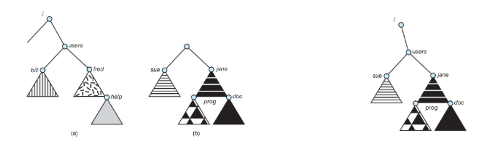

### Partitions

Partitions can either be raw (just blocks, like in databases or RAID) or cooked with a file system (bootable, root, etc.)

### Perms

User-oriented OSes must accomodate shared files, with permissions being kept in the FCB

When we mount a file system to another OS, we must take care of perms, like in the case fo multiple user IDs across systems

To make this seemless, we can use virtual file systems, separating generic operations fro implementation details

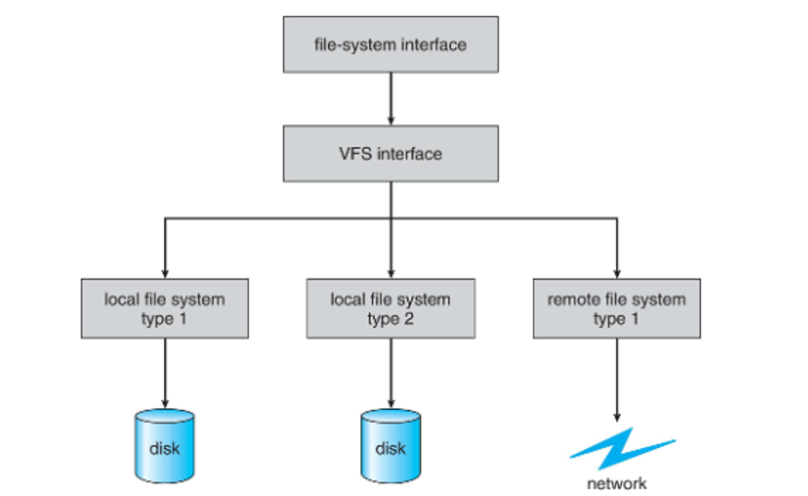

### Remote Systems

To transfer files, we can use ftp like back in the day, or use a distributed file system (DFS) like we do nowadays

- File transfers across the Internet usually use http

DFS uses a file-server protocol, with the client seeking the mount the remote and the sever sharing its local file system, while providing authentication and authorization

- These need to account for more failure conditions than local file systems, but keeping state on both client and server side can help identify these easily, while adding security and overhead

These must specify behaviour when there’s multiple users sharing files, which is discussed in more detail in lesson 6

We can either block requests until a file session (between open() and close()) is complete, or share read-only and just use blocking for writes

### Network File System

The NFS is a popular remote system model using a similar client-server model and mounts to a remote NFS share, appearing as if it’s part of the local file system

This is designed to work in heterogeneous environments (different OSes, machines, protocols, etc.)

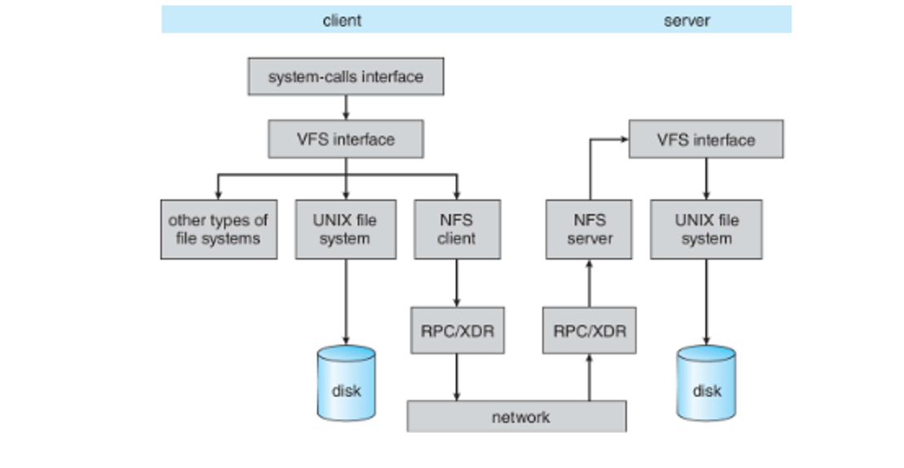

With this, the client requests a remote directory and the server identifies client perms on the directory, including read-only and read-write

If permission is granted, the mount is recorded in an export table used to track all mounts, revoke access and notify of downtimes, among other things

We also use a set of remote procedure calls (RPCs) to handle searching, rerading a set of entries, changing links, accessing file attributes and reading/writing

Version 3 of this is stateless while version 4 is stateful, requiring additional overhead but being more secure since we don’t send vital info as parameters all the time

Despte the version, writing data to disk requires a lot of safety mechanisms, which can take minutes

- Windows uses common Internet file system (CIFS) instead