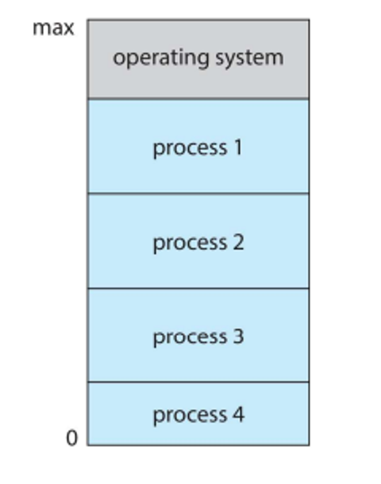

# Intro to OS

An OS effectively acts as an in-between, separating a user from a computer’s hardware

With the OS, we should strike a balance between power and ease of use, allowing users to execute programs to solve problems

## History

Back in the day (1950s), there was no OS, so we had to rewire the computer and fiddle with the hardware itself to run programs

Eventually, we needed a general-purpose computer, which led to the development of batch systems in the late 50s

Programmers would write their code on paper in either FORTRAN or assembly before encoding them on punch cards

An input room would have an operator that feeds the cards into the machine and let the programmer know when their job is done

- The program that interprets the cards is effectively the first OS

At some point in the late 60s, we figured out how to do integrated circuits, so we could have multiple jobs run at once and queue up any other jobs, determined by the OS

As time went on, we eventually developed the OS’s we know today, divided into Microsoft’s OS (DOS, Windows) and Unix (macOS, Linux, iOS, Android)

## But What Does it Do?

This entirely depends on your perspective

For a user, it provides convenience and ease of use, with no regard for resource utilization, but for a shared computer, resource allocation is essential to keep users happy

We also need to care about the device’s health and energy usage, so even if we could run a million jobs at once, it might not be a good idea

- For mobile devices especially resource use is extremely important since they’re very small and running off portable batteries

The computers themselves are built on one or more CPUs and device controllers connected through a shared memory, all of which compete for memory cycles

Each of these controllers has a particular type and local buffer, with each type having its own OS

When a controller is done with an operation, it informs the CPU with an interrupt so that the CPU doesn’t sit idly waiting

The entire OS, in fact, is ran on interrupts, with the interrupts themselves transferring control to the interrupt service routine through the interrupt vector, saving the address of the interrupted instruction in memory

- This is different from software-generated interrupts, which are caused by user error or request (aka exceptions)

The OS acts to preserve the state of the CPU whenever an interrupt happens by storing the registers and program counter

### Storage

The computer will store things in 3 different types of systems

1. The Bootstrap (stored in ROM, typically a program that loads on power-up and initializes all aspects of the system, including the kernel)
2. Volatile storage (RAM, only large storage that the CPU has direct access to, usually volatile)
3. Nonvolatile storage (HDD or SSD, extension of main memory)

Typically, the faster a type of storage is, the more volatile it is and the smaller it is

We have to be careful when we multitask for this reason, being absolutely sure to use the most recent value, no matter where it is in the storage hierarchy

When you have a multiprocessor environment, we need to have all CPUs have the most recent value in their cache

- This gets even worse with distributed systems, but this is covered more later

(slide 26)

To handle multiple CPUs, we could just have one channel like so

Alternatively, we can use Non-uniform Memory Access (NUMA), where each CPU has its own memory channel, which is what’s most used in servers and other high-performance systems

For clustered systems (multiple computers connecting to each other), we typically use a storage-area network to handle shared storage

### Where the OS fits

The OS is loaded in by the bootstrap program, started with the kernel, then the system daemons (services provided outside the kernel)

This kernel is interrupt driven, either by hardware interrupt from one of the devices or software interrupt from software errors (ex. division by zero)

This presents a problem when a program goes into an infinite loop, so the OS handles running multiple programs at once so that one user can’t always keep the CPU busy

We use batching/multiprogramming to organize jobs, with a subset of jobs being kept in memory

We also have timesharing, where jobs are swapped frequently in order to layer them together

(slides 36-37)

### Resource Management

There are four things we mean when we say resource management:

1. Process management
2. Memory management
3. File management
4. Storage management

Process management manages programs in execution, which need resources such as I/O, CPU, file and input to accomplish tasks

- When the process terminates, we need to reclaim any reusable resources

With single-threaded process, we have one program counter specifying the next instruction, counting one at a time until everything’s complete

- With a multi-threaded process, we need one counter per thread

Usually a system will have many process running concurrently by multiplexing the CPUs among the processes/threads

With the OS, we need to create and delete processes, suspend and resume processes, synchronize processes, handle communication between processes and handle deadlocks

Memory management determines what’s in memory and when, with the OS keeping track of memory usage, allocating memory and deciding which process to move memory to

With file system management, we need to create/delete files and directories, manipulate files and directories and perform backups

We also need to handle storage disks through proper storage management, including mounting/unmounting, free-space management, allocation, scheduling, partitioning and protection

- We also need to handle security, but that’s for future courses (what you should know is that they first distinguish among users, then groups, which are sets of users)

We also need a way to virtualize, or run applications within other OS's

This is either done through emulation, where the source CPU type is different from the target type (pretty slow, using interpretation) or virtualization, when the OS is natively compiled for the CPU running guest OS's

- A good example of this is Docker

### Environments

Back in the day, we usually just have single computers, but nowadays we need to handle different environments that our OS may be on, including mobile, client-server, peer-to-peer, cloud computing and real-time embedded systems

## Meat of the OS

The OS provides an environment for execution of programs and services to programs and users

The command line interface (CLI) allows for direct command entry, implement in either the kernel or the systems program

This primarily fetches and executes command, which can either be built-in or user created

- Sometimes multiple flavours (shells) are implemented

A GUI is a user-friendly desktop version with icons, with most systems having both GUI and CLI

- There’s also touchscreen interfaces, with a virtual keyboard for text entry

Programmers, of course, need their own interface for their programs, with systems calls used indirectly through a high-level API (ex. Win32 API for Windows and Java API for JVM)

The caller doesn’t need to know about how the system call is implemented and only needs to worry about the API instructions and result

We can also pass parameters to these calls, often when more information is required 

We can either pass these parameters through registers, blocks in memory or the memory stack which is popped off by the OS

The OS also comes with system services which provide an environment for program development and execution

These include file manipulation, language support, communications and program loading/execution

### OS Structure

For a general purpose OS, we usually divide functionality in one of four ways

1. Monolithic (fastest but hard to modify)
2. Layered (layers from 0 - hardware to N - user interface)
3. Microkernels (push functionality to user space)
4. Hybrid (combination of the three, most common with modern OSes)

### Debugging

The OS will generate log files with error info, either in a core dump for app error or crash dump for OS failures