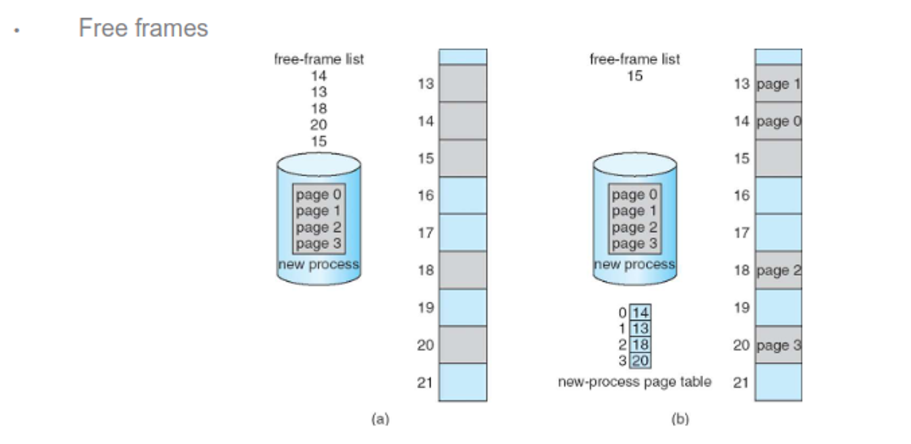
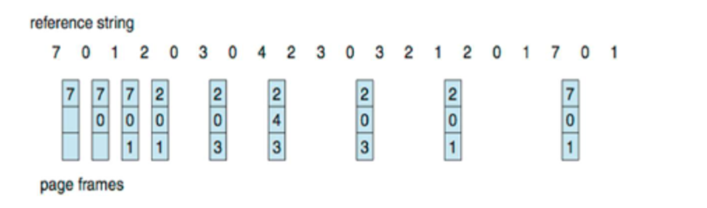

# Memory Management

# A Core Problem

Modern computers need some sort of memory to store certain temporary data for processes, so the OS must handle this efficiently

Hardware design and support is important as well, but there are certain software tricks we can use to make our approaches better, including with

- Allocating memory
- Managing memory during runtime
- Deallocating memory

## Why Do We Need This?

The CPU can access main memory and registers directly, but the OS has to fetch from memory itself

Since the memory can stall, the CPU has its own cache to store a small amount of data, the only problem being that it’s small

All the CPU sees is a stream of data and addresses, not actual permissions, so these need to be enforced by something else

An OS-level solution won’t work directly since it takes a lot of overhead, so we can use a base register and a llimit register for this to record the beginning of the process memory space and the amount of space that is allocated to the process, respectively

- The combination of these two registers gives the maximum address we can access

We can do a simple check to see if we’re between these two limits when we’re in user mode

- **Compile time** – The location in memory may be known at compile time. The compiler generates absolute code. If the location changes, the program must be recompiled.

- **Load time** – The location in memory may not be known at compile time but it is decided when the program is loaded. The loader can use relocatable code. If the location changes, the program just needs to be reloaded.

- **Execution time** – If the process can be moved during its execution from one memory segment to another, binding must wait until run time. Special hardware is required to make this work. This is the method most modern operating systems use.


We also have to differentiate between logical addresses (generated by the CPU) and physical addresses (the actual address of the memory-address register in memory)

- Using compile-time binding, these are the same, but with runtime binding, these are different

This translation is handled by the memory management unit (MMU), so we can use a special relocation register in this device instead of a base register, adding this to every logical address to get the physical address


The logical addresses are in the range 0 to max, and the physical addresses add a base value R to both of these

### Dynamic Loading

Something that sophisticated memory management also helps with is partial loading, where we only have the parts of the program that we need in memory at one time, so we can load routines into memory as they’re called

- We can handle this in user space, so no fancy OS stuff yet, but the OS can give tools

This also allows us to have more efficient libraries with dynamically linked libraries (DLLs, aka shared libraries) that are loaded dynamically at runtime

- Some OSes don’t support this, however

Since these are shared, we now need the help of the OS

### Conitguous Allocation

This is an early approach which partitions main memory into two partitions, with the OS either being in low or high memory and user processes being held in the opposite partition in one contiguous section

- The OS is usually in high memory

To prevent harm to processes, the MMU uses the base and limit registers from before, which are updated during a context switch


The contiguous sections are either fixed or dynamic, with fixed meaning that the sizes never change, but can be different sizes depending on implementation (we can use either first-fit or best-fit for the latter approach)

This has the problem of internal fragmentation (internal portions that are wasted) and external fragmentation (enough free space but they span partitions)


With dynamic partitions, the sizes can change as needed, with empty partitions being shifted and adjusted through compaction, so we can select partitions by either first-fit, best-fit or worst-fit

With this, internal fragmentation is a non-issue and external fragmentation can be solved by using compaction


This sounds good, but compaction takes some time, which makes it better suited for persistent storage

For main memory, we need a different approach…

## Paging

Paging is a non-continuous method where we we partition physical memory and logical memory into fixed-sized blocks called frames and pages, respectively, using a page table to translate between the two

- When there are more pages than frames, we are using virtual memory, which we’ll touch on later

We’ll take up pages 0 to N so, as far as the CPU is concerned, memory IS contiguous, even if physical memory isn’t

This helps eliminate external fragmentation, but we can still have internal fragmentation

The logical address is divided into a bitmap of length m, so we can have $2^m$ addresses structured as such

- **Page number (p)** - used as an index into a page table which contains the base address of each page in physical memory. It is of length $m-n$ or $2^{m-n}$ bits.

- **Page offset (d)** – combined with base address to define the physical memory address that is sent to the memory unit. It is of length $n$ or $2^n$ bits. This is the size of each page.


From here, we can translate to physical memory with a lookup table


Since we have fixed size pages, we can have internal fragmentation still

Consider page sizes of 2048 bytes and a process size of 2049 bytes; we’d still need two pages, but one of the pages will be mostly empty, leading to wasted space

We need a balance of page sizes, since making them too large leads to waste (but makes disk I/O more efficient) and too small leads to more overhead (while minimizing fragmentation)

Most operating systems illeviate this with two page sizes: 4kb or 8kb for regular processes, 2mb or 4mb for exceptionally large processes

- Since we can just take a free page, external fragmentation is solved

We test freeness with a flag in a frame table, giving 0 if the frame is free and the PID of whatever process is using it if it isn’t



### Hardware

Since the table is quite large, it’s kept in main memory, with the address and size being stored in the page-table base register (PTBR) and the page-table length register (PTLR), respectively

With this, each memory access requires two accesses: one for a reference to the page table and one to get the actual data from memory

This is a bit wasteful, so we solve it by caching the page table, which is called the translation look-aside buffer (TLB)

These are usually small, with some entries being made permanent, so we only consult memory to load into the TLB if we don’t find the page we need in the TLB beforehand

- Some TLBs hold address space identifiers (ASIDs) to lock in their own entries; otherwise we’d have to reload this for every context switch


We can measure the effective memory access time with a pretty simple formula


- The percentage of times the page number of interest is found in the TLB is the hit ratio
  - If it is not found in the TLB, we need to consult the page table (1 access)
  - Then we can use the address (1 access)

$$
\text{Effective Access Time} = (\text{Hit}) \cdot \text{AccessTime} + (1 - \text{Hit}) \cdot 2 (\text{AccessTime})
$$

- Suppose a hit ratio of 80% and a memory access time of 10 nanoseconds, then effective access time is $0.80 \times 10 + 0.2 \times 20 = 12$ nanoseconds

- A hit ratio of 99% is 10.1 nanoseconds


### Protection

To ensure that read-only memory isn’t overwritten, we can have each entry hold a protection bit, and for accidentally crossing over into inaccessible memory, we use the PTLR from before

- Each entry also holds a valid-invalid bit for all frames in the space


That being said, we can also make read-only pages for DLLs, making shared space easy


### Structure

Since these pages are so large, we can use hierarchies to slim them down a bit


For 64 bits, this isn’t gonna work, so we can use hashes instead, so each entry will hold a hash for the page number, the frame and a pointer to the next hash


Another method is to use one global page table for all processes, removing the need to maintain a lot of page tables, at the cost of time efficiency and having to remap shared memory a lot


- Most OSes used a mixture of these methods for different purposes

If need be, we can temporarily swap processes into a backing store and then bring it back into memory when there’s room

- This is called a swap partition and the scenario is called being oversubscribed

This store should be reasonably fast, like an SSD, while also only being used in emergencies

- Nowdays we usually just swap individual pages rather than entire processes, as it can be costly

## Virtual Memory

We mentioned virtual memory before, but what does this actually mean?

We can realize that we don’t need to bring in an entire program for execution, especially for routines that are rarely used like error routines or sections of a large data structure

The way we do this is with virtual memory, or using more pages than frames, along with a memory map


There are a few ways we can go about using this

### Demand Paging

One way is to bring in pages only when it’s needed, leading to faster responses, less memory and less I/O

- This is similar to swapping except the pages brought in is intentional, using the same valid/invalid approach in our MMU

Initially, each entry is invalid since it’s not in memory, so if we request an invalid page, we generate a page fault

The general process is as follows


1. If there is a reference to a page, first reference to that page will trap to operating system (Page fault)

2. Operating system looks at another table to decide:
   - Invalid reference → abort
   - Just not in memory

3. Find free frame

4. Swap page into frame via scheduled disk operation

5. Reset tables to indicate page now in memory. Set validation bit = v

6. Restart the instruction that caused the page fault


If all the frames are invalid, the page table will eventually populate with valid pages, which means processes will settle after a lot of page faults

The free-frame list tells the OS where to put pages that need to be in memory, which is initally zeroed out for security


- We’ll talk about how to fill this list later

Page faults need to be kept to a minimum, since the formula for access time relies on the probability being small


$$\text{Effective Access Time} = (1 - p) \cdot \text{AccessTime} + (p) \cdot \text{PageFaultTime}$$


If a page fault time on an HDD is 8ms and the memory access time is 200ns, even if the chance of a page fault is 1/1000 the effective accesstime becomes 8.2 microseconds, which is a huge leap

We can use an SSD speclailzed for swap space to alleviate this

- Some devices (typically phones) don’t use swap space

We can also use copy-on-write to speed things up, which which shares pages until there’s an update, with the idea that most child processes just call exec()


### Page Replacement

Despite our best efforts, we WILL run out of frames, so we must replace valid pages that are no longer needed


To do this, we follow a simple process


1. Find the location of the desired page on disk

2. Find a free frame:
   - If there is a free frame, use it
   - If there is no free frame, use a page replacement algorithm to select a victim frame
   - Write victim frame to disk; update the page and frame tables

3. Bring the desired page into the (newly) free frame; update the page and frame tables

4. Continue the process by restarting the instruction that caused the trap


This uses a page-out and page-in for every page fault, but we can eliminate the need for a page-out by keeping a modify-bit, which is set if any byte in the page has been changed

We pick a victim frame either by FIFO, least recently used, least frequently used or most frequenly used


The more frames we have, the fewer faults we should expect


Here’s what the different algorithms look like

We’ll start with FIFO, which sometimes gives bad results, or even more page faults as frames increase (called Belady’s anomaly)


We could derive the theorhetical optimal replacement, but this requires future knowledge, which we don’t have



A good solution is LRU, which is already better than FIFO


We determine the least recently used frame with either a counter (increment when it’s used and search for the oldest) or by stack (move to the top when it’s used and grab the page at the bottom when we need a replacement)


This might not be ideal since we’re being instant about our replacement, so we can use a reference bit to give tolerance, setting it to 1 when it’s used

- This is called a second-chance algorithm

For this, we check the reference bit first, so we set the bit to 0 when it’s 1 and replace it otherwise


We can also use a counter, either by smallest count (LFU) or largest count (MFU), but these aren’t as common

Regardless, all 3 require guesses about page access, with some applications having better knowledge (ex. databases) with direct disk access

### Frame Allocation

Eventually we’ll run out of frames and need page replacement, but we’ll also need to allocate new frames to be freed


If a process needs memory, it might replace pages that it needs, so requests will page fault, so the recent page will be repalce and so on and so forth

If we’re not careful, when resolving these loops will take more time away from the CPU, resulting in thrashing


We can force processes to use the same set or, more likely, page-in the page request along with some pages in the same locality (i.e. dealing with the same program or data struct)

We can also reduce page faults with good programming


```c
int i, j;
int [128][128] data;
for (j = 0; j < 128; j++) {
    for (i = 0; i < 128; i++) {
        data[i][j] = 0;
    }
}
```

Since C holds multidimensional arrays in row-major order, if a page can hold one row, this code could generate 128x128 (16,384) page faults due to demand paging. One for every update.


```c
int i, j;
int [128][128] data;
for (i = 0; i < 128; i++) {
    for (j = 0; j < 128; j++) {
        data[i][j] = 0;
    }
}
```

This will zero each element in the page before requesting the next one. This will cause 128 page faults (~0.8% of 16384). Good programming can reduce page faults.


Stacks have good locality as well since they always access from the top, while hash tables don’t, so if memory is a huge factor, this is worth thinking about

- Other things like speed also need to be considered

The compiler and loaded can also do things like avoiding placing routines across page boundaries

### Other Things

We can prepage some or all of a program to avoid page faults at startup, but this is difficult since we need to know what pages we need from the get go

- This is used for input files a lot since they’re read sequentially, so Linux provides a readahead() method to prefetch files into memory

If we have a situation where a page is chosen for replacement but we’re currently writing to it, we can give it a lock bit to ensure the page is off limits, which can be done for common internal processes

- DBs can request this as well if they have the right privileges