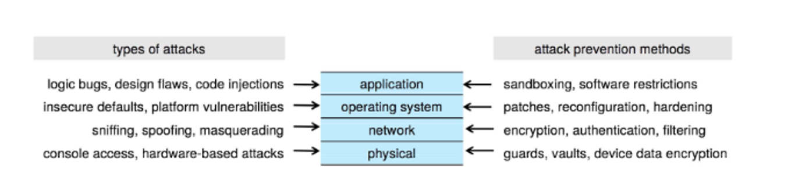
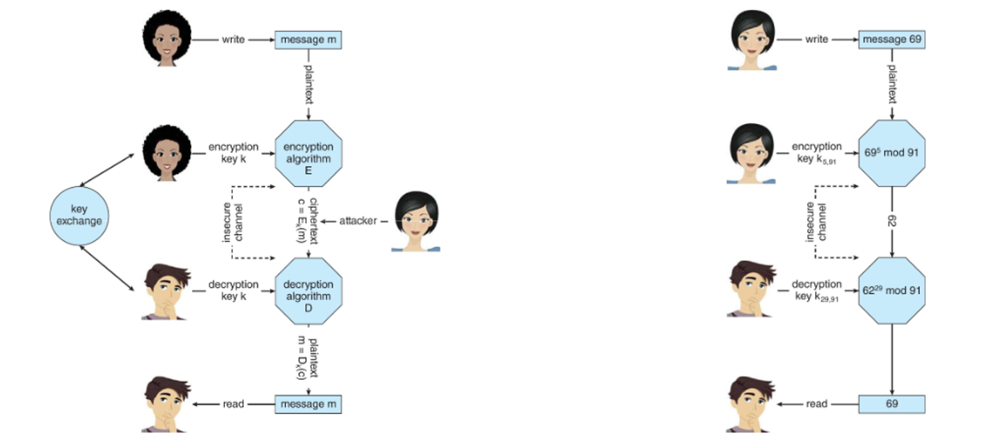
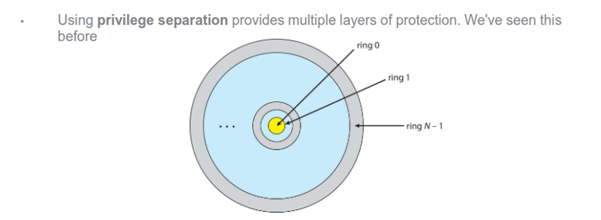
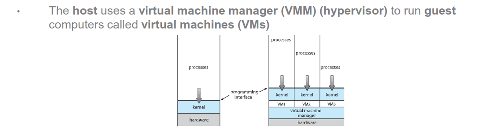
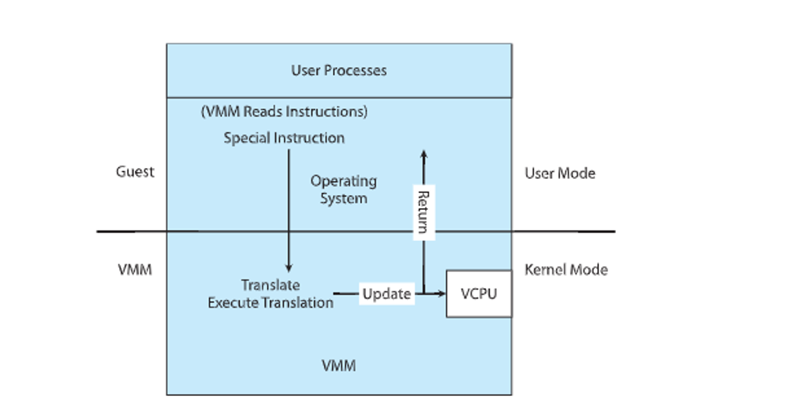
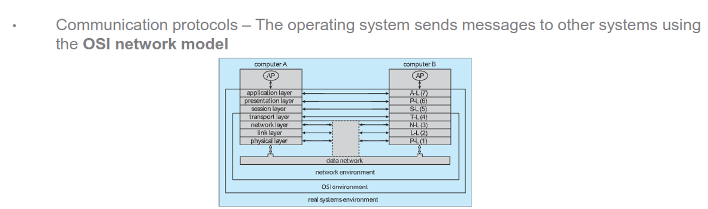
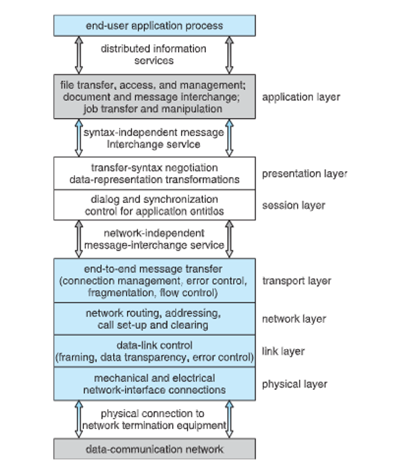

# Networks + Security

## Security

Security is a measure of confidence that the system will maintain integrity, with protection providing mechanisms to provide this

Total security is impossible, but we can get pretty close with the help of the OS

- We need security as the physical, app and network layers as well

Security is only as good as the weakest link, with humans being the weakest link of all

Threats include malware (malicious software like trojans), code-injection (regular software that has bugs ripe for exploiting), viruses (malware that self-replicates, attached to regular software) and worms (viruses that self-replicate without human interaction)

We can increase security by only giving users as much privileges as they need and nothing more (principle of least privilege)

- A monoculture can raise these threats (Linux is safe!!)

Network threats still exist and makes security much more difficult, including DDoS (packet spam to shut down a target) and port scanning (automated port connection used to check for vulnerabilities)

- We can check security on our own networks with nmap or nessus

We can use cryptography as a tool to help us out, either symmetrically (sender and recievers share the same key) or asymmetric (public key for encrypting and private key for decrypting, usually more compute intensive)

- Certificate authorities sign these keys to build trust with users

A user can be authenticated by either something they know (a password), something they posess (phone) or something they are (biometrics), with common issues being reused password

- We can alleviate some of this with MFA, which is increasingly common as smartphones get more popular

The more layers we have, the more secure our system becomes, with self-vulnerability assessments, firewalls, virus protection and logging all being useful layers we can add on

# Protection

We implement security with protections, including mechanisms (the how) and policies (the what), with apps and the OS implementing these mechanisms

Common ones include principle of least privilege and multi-layering, but there are others as well

- Rough-grained control is easier but can be too broad (user perms in UNIX are a good example)
- Fine-grained control is more complex but more protective (ACLs, RBAC, etc.)

One good way on the OS is privilege separation, which abstract away from the hardware

Each ring should only have required objects, with each user being given a domain

- We can use sudo to switch between domains with UNIX

Another method is an access matrix

- If we treat rows as domains and columns as objects, we have an access matrix

- $\text{Access}(i, j)$ is the set of operations that process in domain $i$ can perform on object $j$

|           | object | $F_1$ | $F_2$ | $F_3$ | printer |
|-----------|--------|------------|------------|------------|------------|
| **domain**|        |            |            |            |            |
| $D_1$ |        | read       |        | read         |            |
| $D_2$ |        |            |            |            | print      |
| $D_3$ |        |            | read       | execute    |            |
| $D_4$ |        | read, write| |  read, write          |            |

Access control can be implemented in the OS as a global table, and ACL for each object, a capacity list for each domain or a lock-key mechanism, with each having its own trade-offs

- Most OSes uses a combo of ACLs and capacity lists

Other ways we could use are role-based access control (assign privileges to roles) and mandatory access control (put labels on objects and users and only grant access when the labels match)

Other methods include the following

- **System Integrity Protection (SIP)** – Used since macOS 10.11. Restrict the core operating system files from processes (even if the processes are run by **root**)

- **System-call filtering** – Like a firewall for system calls. Can also inspect system call arguments

- **Sandboxing** – Running processes in a limited environment even though the user privileges would dictate more access

- **Code-signing** – Only running programs that have been digitally signed by the vendor (E.g. iOS App Store, Android Play store, Microsoft store)

## Virtualization

We can abstract the hardware into a bunch of different environments, creating the illusion of a separate computer using VMs

This includes emulation (software designed for a different architecture in a similar environment) programming virtualization (used by Java, Pythong and .NET) and containers (separating applications from eachother with the illusion of stand-alone, like Docker)

Virtualization was in effect as early as 1972 with IBM’s multi-user batching, but by the 90s, Intel CPUs could finally do true virtualization, with many companies being founded on the idea (ex. VMWare)

This protects the host OS from guest OSes, allows for live migrations, makes testing OSes easy, makes templating easy, gives cost savings and allows for cloud computing

The VMM can’t be a perfect duplicate, like in the guest kernel mode

These come in many types

- **Type 0** – The VMM is embedded in the firmware at the hardware level. Less common as sharing hardware resources is challenging
- **Type 1** – The VMM is a special purpose operating system designed for running VMs. This is the most common type (E.g. VMWare ESXi, Microsoft Hyper-V)
- **Type 2** – The VMM is simply another process running in the operating system. Useful for end-users who want to use multiple operating systems without modifying their operating system (E.g. Oracle Virtualbox, Parallels, VMWare workstation)

**They also come with many components**

- **CPU Scheduling** – The VMM will present multiple vCPUs to the guest. The number of vCPUs can be changed. More vCPUs than physical CPUs is known as **oversubscribing**. CPU scheduling and threading makes oversubscribing possible
- **Memory management** – The VMM can oversubscribe memory using paging and de-duplication techniques
- **I/O management** – The VMM provides disk I/O. An entire partition for a guest OS is just a single file on the host machine (e.g. a .vmdk file)
- **Networking** – The VMM can bridge the guest OS directly to the external network or provide a local/private IP address from the host OS (like a wi-fi router does)

This is a common research topic since it allows for better security, resource usage and flexibility making things like robotics and IoT deivces

## Networks and Distributed Systems

A distributed system is a collection of loosely coupled nodes interconnected by a network, with each node being a different type and communicating using messages while giving the following benefits

- **Resource sharing** – Resources on one system can be shared with another
- **Computation speedup** – Partitioning and load balancing
- **Reliability** – Resources can be shared eliminating a **single point of failure**

The structure can be either a LAN with a small area on WiFi or a WAN over a large area (ex. the Internet, but others like North Korea’s WAN exist)

The Internet uses a DNS to resolve names to IP addresses and they send messages through protocols, with the OS using the OSI network model

We can also have network OSes (giving an environment to access remote resources like SSH and SFTP) and distributed OSes (seamless access to remote resources, like NFS but also wiwth shared computation)

- The Internet is a bit like a distributed OS if you think about it

These distributed systems come with some design issues as well

- Systems should be **resilient**. Failures can be detected using **heartbeat** messages ("Are you up?" -> "I am up"). If a failure occurs, reconfiguration and recovery is needed. If the failed system held critical resources, the surviving systems must handle this.
- Systems should be **transparent**. Users should be unaware they are using remote resources (e.g. Playing music on Spotify feels like the music is stored on your machine).
- Systems should be **scalable**. As user load increases, the ability for the distributed system to service requests should not be hindered.

These distributed OSes use distributed file systems such as NFS
