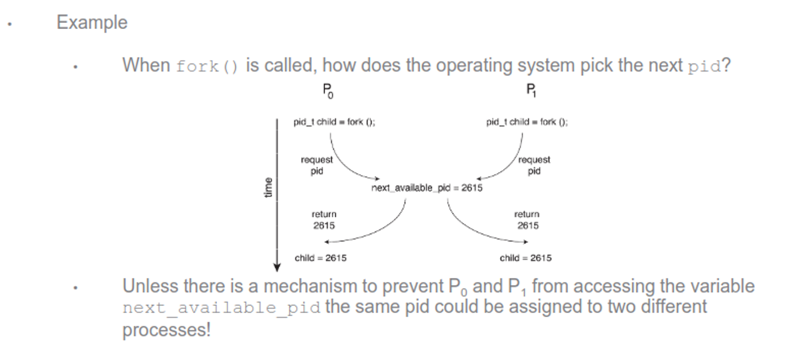
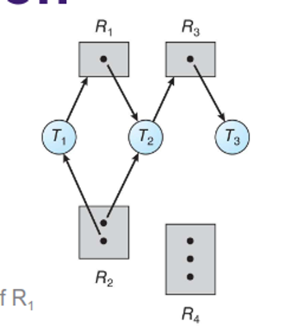
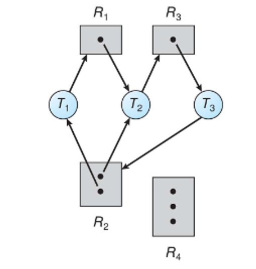
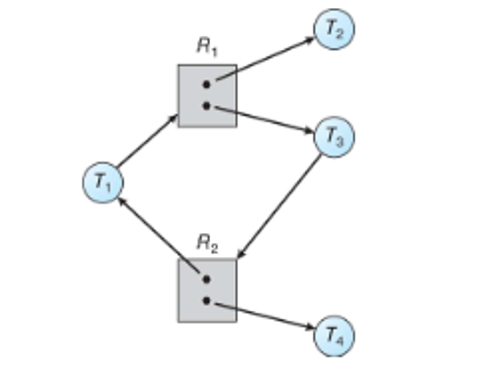
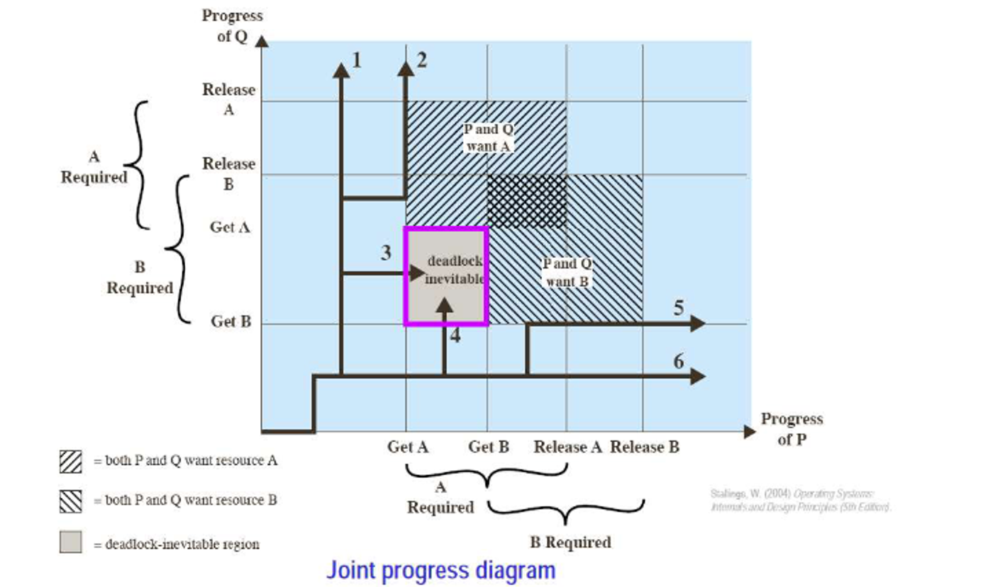
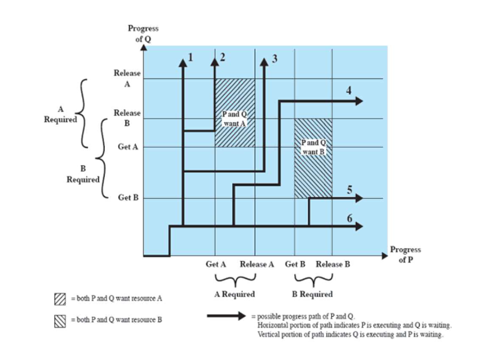

# Process Sync

# Multiprocessing

We’ve mentioned race conditions before, but what actually are they?

A race condition happens when two threads use and change the same resource, but you don’t know which one will act first

Take this for example


---

Example

- We have seen that a producer and consumer can share a pointer to the next slot

- `count++` could be implemented as
  - ``` 
    register1 = count
    register1 = register1 + 1
    count = register1
    ```

- `count--` could be implemented as
  - ```
    register2 = count
    register2 = register2 - 1
    count = register2
    ```

Example

- Consider the following order of operations when `count == 5`

$$
\begin{array}{|c|c|c|c|}
\hline
\text{Time} & \text{Who} & \text{Instruction} & \text{Value} \\
\hline
T_0 & \text{Producer} & \text{register1 = count} & \text{register1 = 5} \\
T_1 & \text{Producer} & \text{register1 = register1 + 1} & \text{register1 = 6} \\
T_2 & \text{Consumer} & \text{register2 = count} & \text{register2 = 5} \\
T_3 & \text{Consumer} & \text{register2 = register2 - 1} & \text{register2 = 4} \\
T_4 & \text{Producer} & \text{count = register1} & \text{count = 6} \\
T_5 & \text{Consumer} & \text{count = register2} & \text{count = 4} \\
\hline
\end{array}
$$

- What is the value of `count`?

For count++, this is fairly innocent depending on what we’re doing (Youtube has the same problem and deals with it just fine), but race conditions can get seriously bad



We also need to think about resource sharing

Example: Multiple processes require multiple resources
The "Dining Philosopher's Problem"
Five philosophers sit at a table with 5 chopsticks
A philosopher will either think or eat
If the philosopher thinks, the philosopher leaves two chopsticks available
If the philosopher eats, the philosopher requires two chopsticks
High potential for deadlock and starvation (literally!)

## Critical-Section Problem

This is a more specific version of a race condition dealing specifically with updating shared data, such as a database or file

- Reading is fine, however

We can solve this problem with this type of structure


Entry section – Request permission to enter the critical section

Critical section

Exit section – Relinquish control of the critical section

Remainder section – (non-critical section parts)


Diagram:
```
while (true) {
    entry section
    critical section
    exit section
    remainder section
}
```

This seems simple enough, but not when we’re dealing with the scheduler swapping around all over the place

We could disallow interrupts, but this is impractical, but temporarily disabling interrupts can cause starvation and give too much control to developers + how would you deal with multicores

- Flags also don’t work, since they only allow entry through alternation, so we could have processes waiting for sections that are wide open

### Solutions

Any solution needs 3 qualities

1. Mutual exclusion - one at a time in the critical section
2. Progress - give the section to another process as soon as the current process is done
3. Bounded waiting - set limits on the number of times other processes can enter their critical sections

One older solution is Peterson’s Solution, where two processes share a turn and a flag


```c
int turn;
boolean flag[2];
```

The variable `turn` indicates whose turn it is to enter the critical section.

The `flag` array is used to indicate if a process is ready to enter the critical section.

- `flag[i] = true` implies that process $P_i$ is ready


The code for $P_i$

```c
while (true) {
    flag[i] = true;
    turn = j;
    while (flag[j] && turn == j)
        ;
    /* critical section */
    flag[i] = false;
    /* remainder section */
}
```


- If both processes were in their critical sections, then `flag[i] == flag[j] == true`
  - Mutual Exclusion Achieved!
- If $P_i$ is blocking while $P_j$ is in its critical section, as soon as $P_j$ finishes, $P_i$ can immediately continue
  - Progress Achieved
- $P_i$ must wait only as long as $P_j$ is in its critical section. The next process to enter its critical section is $P_i$
  - Bounded Waiting Achieved


This is good for past problems, but when we expand this to multiple threads on multiple cores, it gets unwieldly pretty quick

Another solution is using the hardware itself, and most architectures do give some tools

**Memory barrier instructions** – Instructions to force memory updates to all processors ensuring that all threads use the correct data

**Hardware instructions** – Instructions guaranteed to function atomically (uninterruptible)

**Atomic variables** – Variables with operations that use only atomic hardware instructions


This applies to kernel devs, but isn’t exactly what we need

The way we actually solve this is with mutex locks. which are bools that switch to true if the lock is available and false if it isn’t

- Use acquire() to get the lock and release() to release the lock
- If the lock is held, no one else can get it


```c
acquire() {
    while (!available)
        ; /* busy wait */
    available = false;
}

release() {
    available = true;
}

while (true) {
    acquire()
    /* critical section */
    release()
    /* remainder section */
}
```

---
This is an effective solution, but it is SLIGHTLY inefficient because of the busy wait taking up CPU cycles

The more sophisitcated version is a semaphore, either a binary semaphore with an integer range between 0 and 1 or a counting semaphore with a range over an unrestricted domain

We can use this for resources with more than one instance, so we can set it to N when N processes can be in the section at once

This is also pretty simple to implement


- Set $S$ to the number of resources available
  - Use `wait(S)` to obtain a resource if one is available
  - Use `signal(S)` to release a resource
  - If the value of $S$ reaches 0, then no resources are available, and the call `wait(S)` will block until one becomes available
  - (Again, both `wait()` and `signal()` are implemented using atomic hardware instructions. So they can be trusted)


```c
wait(S) {
    while (S <= 0)
        ; /* busy wait */
    S--;
}

signal(S) {
    S++;
}
```

---

We can also use these for synchronization

```c
/* S1 */
signal(synch);

/* S2 */
wait(synch);
```

`synch` starts at 0


We can improve these further by using sleep() instead of a spin-lock, running wakeup() when the process is ready

The general structure of a semaphore looks like this


```c
typedef struct {
    int value;
    struct process *list;
} semaphore;
```


```c
wait(semaphore *S) {
    S->value--;
    if (S->value < 0) {
        add this process to S->list;
        sleep();
    }
}

signal(semaphore *S) {
    S->value++;
    if (S->value <= 0) {
        remove a process P from S->list;
        wakeup(P);
    }
}
```
These are a more effective solution than mutex locks, but are easier to screw up in your code, so you have to be careful

In C, we use them like so


```c
#include <semaphore.h>

sem_t S

sem_init(sem_t *sem, int pshared, unsigned int value);

sem_wait(sem_t *sem);

sem_post(sem_t *sem);

sem_destroy(sem_t *mutex);
```


```c
#include <stdio.h>
#include <pthread.h>
#include <semaphore.h>
#include <unistd.h>

sem_t mutex;

void* thread(void* arg){
    sem_wait(&mutex); // wait
    printf("\nEntered..\n");
    sleep(4); // critical section
    printf("\nJust Exiting...\n");
    sem_post(&mutex); // signal
}
```


```C
int main() {
    sem_init(&mutex, 0, 1);

    pthread_t t1, t2;
    pthread_create(&t1, NULL, thread, NULL);
    sleep(2);
    pthread_create(&t2, NULL, thread, NULL);
    pthread_join(t1, NULL);
    pthread_join(t2, NULL);

    sem_destroy(&mutex);
    return 0;
}
```

## Deadlocks

Something else that we need to consider when we’re dealing with multithreading is deadlock, where a piece of data is locked in perpetuity

Recall that any system has a set of resources denoted $R_1...R_n$ which could be I/O devices, mutex locks, CPU cycles or anything else

When we have a process that needs a resource, the process

1. Requests
2. Uses
3. Releases

The problem comes about when we have multiple processes requiring the same resources

We can think of this like the situation like the sidewalk shuffle, where you’re trying to get past someone and you end up mirroring eachother’s actions

- This is technically a livelock, since you’re both doing things, but you’re getting nowhere

As a technical example, consider two semaphores

T1:

- wait(s1)
- wait(s2)

T2:

- wait(s2)
- wait(s1)

A true deadlock requires 4 simultaneous conditions

1. Mutual exclusion - resource is locked to one thread at a time
2. Hold and wait - a thread holding one resources is waiting for another resource held by another thread
3. No preemption - a resources can only be released by a thread after it’s completed its task
4. Circular wait - $T_0$ waits for $T_1$, $T_1$ waits for $T_2$ … $T_n$ waits for $T_0$

We can further identify our deadlocks with resource allocation graphs, denoting our threads with $T_k$ and our resources by $R_k$



Adding a new edge, we can start to see a deadlock through the appearence of a cycle



Note that a cycle doesn’t necessarily mean we have a deadlock

To illustrate this, consider the following



In this case, once $T_2$ and $T_4$ finish, extra instances will be deallocated, freeing them up for the other two threads

### How To Deal With Deadlocks

We have four options when dealing with deadlocks

1. Do nothing - let the devs figure it out, they’re smart enough :) (most efficient and the approach of most operating systems)
2. Deadlock prevention - ensure one of the characteristics doesn’t occur
3. Deadlock avoidance - declare all resources before starting, force threads to wait if there might be overlap (very inefficient)
4. Deadlock detection - check for deadlocks and recover appropriately (common in databases)

For deadlock prevention, we can really only enforce no circular wait, possibly with an increasing order on all resources for all threads 

- This still causes the issue of forcing devs to obey the order, which means you might as well make them prevent deadlocks themselves in the first place

When applying deadlock avoidance, we don’t allow threads to enter the graph in the first place if it’ll create a cycle

We can use a deadlock trajectory diagram to illustrate when we must do



In this case, we have a dead end, but if we shift our process around a bit, we can find a middle path to make this nice



Applying detection, this is as simple as taking the allocation graph and invoking an algorithm to search for cycles

The question then arises: how often do we run this algorithm? We don’t want to run it so often that the overhead gets in the way of other processes, but if we don’t run it often enough, deadlock will be too frequent

We also need to deal with recovery: do we rollback all threads or just one thread at a time until the deadlock stops?

In any case, we should choose whichever action has a minimum cost, including thread priority, computation time, resources held and fewest threads to clear the lock

- If one thread is always a victim, there’s a good chance of starvation