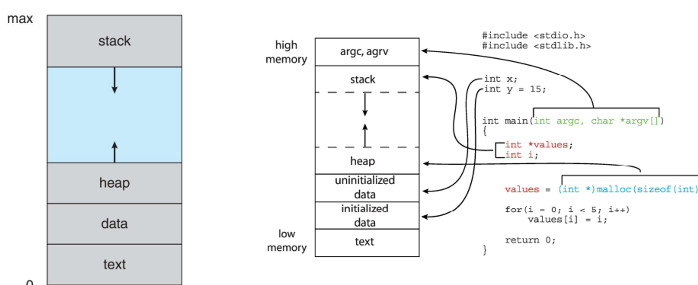
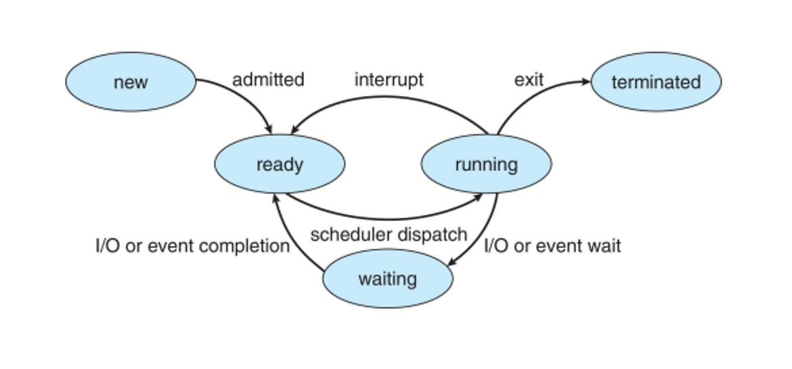
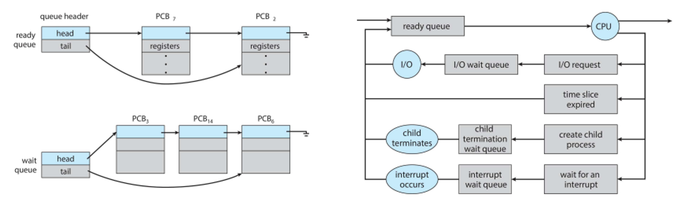
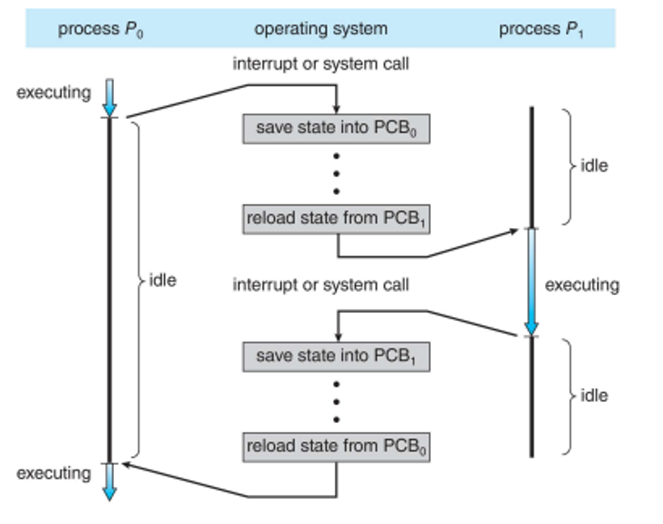
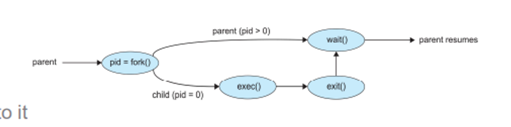
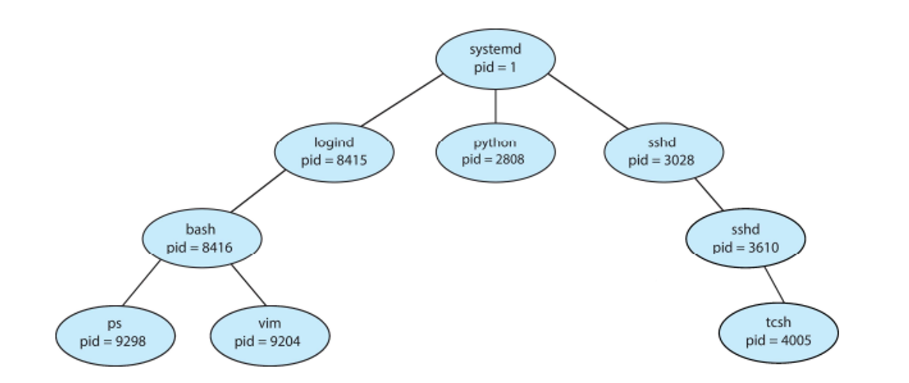
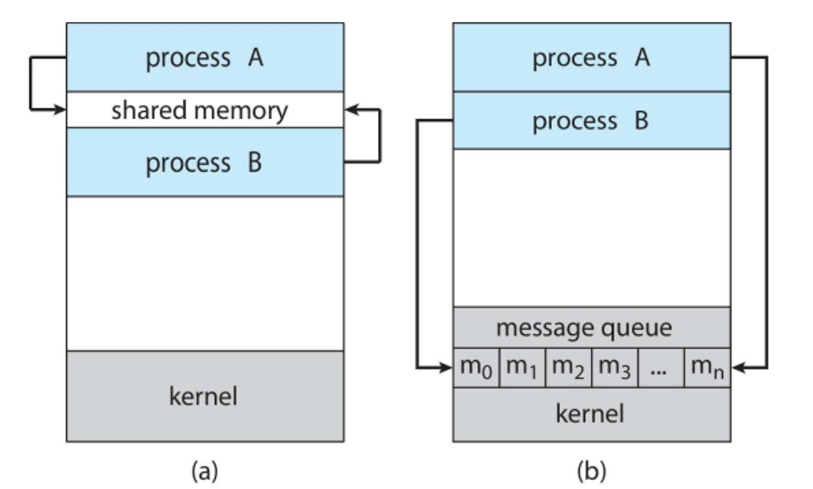

# Processes


Processes are programs in execution, with each instruction in a process being executed in sequence

The process consists of multiple parts:

- Text section - where the program code is stored
- Program counter - keeps track of the function
- Stack - contains temporary data (parameters, return addresses, local variables)
- Data section - contains global variables
- Heap - contains dynamically allocated memory
    - Note that the PROGRAM is passive and stored on the disk, while what we’re describing is the PROCESS, which is active (programs become processes when they’re loaded into memory)



The process, visualized with some C code and their place in the process

A program can encompass several processes, such as a program being executed by multiple users at the same time

As the program is being executed, it changes between states

- New - process is in creation
- Running - instructions are being executed
- Waiting - process is waiting on an event (i.e. user input)
- Ready - process is waiting for processor assignment
- Terminated - process is over



The state diagram of a process

Below is an explanation of the process control block (PCB)

The image provides information about the Process Control Block (PCB) in an operating system, specifically Linux. Here's a breakdown of the key points from the image:

## Task Control Block

- **Process state:** Indicates whether the process is running, waiting, etc.
- **Process number:** Unique identifier for the process.
- **Program counter:** Location of the next instruction to be executed.
- **Registers:** Contents of all process-centric registers.
- **CPU scheduling information:** Priorities and scheduling queue pointers.
- **Memory-management information:** Memory allocated to the process.
- **Accounting information:** CPU usage, clock time elapsed since start, time limits.
- **I/O status information:** I/O devices allocated to the process, list of open files.

## Process Control Block in Linux
- Represented by the C structure `task_struct`.
- Key fields in `task_struct`:
  - `pid_t pid;` - Process identifier.
  - `long state;` - State of the process.
  - `unsigned int time_slice;` - Scheduling information.
  - `struct task_struct *parent;` - Pointer to the parent process.
  - `struct list_head children;` - List of child processes.
  - `struct files_struct *files;` - List of open files.
  - `struct mm_struct *mm;` - Address space of this process.

**Diagram of `task_struct`**
The diagram shows how `task_struct` instances are connected, with links to parent, child, and sibling processes, representing the hierarchical structure of process management in Linux.


## Scheduling

Scheduling is handled by the process scheduler, which picks available processes for next execution, with the goal of maximizing CPU usage while quickly switching between them

To do this, we create two queues: a ready queues with all processes in main memory and a wait queue with processes that are waiting for an event (i.e. I/O)



The switch between processes is called a context switch



In a context switch, we must save the state of the old process and load the state of the new process, both of which are stored in the PCB

- The time spent switching is purely overhead, meaning the system doesn’t do useful work
- The more complex the OS and PCB, the longer the switch takes

We can speed this up through simpler OS/PCB or more complex hardware, including multiple sets of registers per CPU, allowing for more contexts

# Where do Processes Come From?

Parent processes create child processes, each of which can create other processes

This in turn creates a process tree, with each process identified with a process identifier (pid)

When creating child processes, we have lots of option for sharing resources, either all, none, or just a subset

- We can also execute concurrently or wait until the child terminates

This child program will be a duplicate with a program loaded on it, splitting away from the parent with the fork() command

After this, the parent calls wait() waiting for the child to terminate, while the child calls exec() to replace the memory space with a new program

Finally, the child calls exit() to give back control to the parent



In UNIX, these are created automatically when we run programs



## Termination

To terminate a process, we ask the system to delete with the exit() system call, which then causes the OS to return status data from child to parent via wait(), before deallocating any resources created by the child

The parent can also terminate child processes using abort(), which can be done when the child’s task is no longer needed or the child has exceeded allocated resources

Depending on the OS, the child can’t exist without the parent, so the child must also be terminated through cascading termination initiated by the OS

- In situations where there is a child without a parent, that child is an orphan

The parent process may wait for termination, but if it doesn’t, it’s called a zombie

Below is a breakdown of the wait() keyword



## In Practice

In C, fork() returns -1 if there’s no child created, 0 to the child and the child’s PID to the parent, meaning we can take advantage of this in a single program to tell whether we’re on the parent or child process

- We can also call pid_t getpid() to get the current PID and pid_t getppid() to get the parent’s PID

Due to the interleaving of instructions on the CPU, forking output is nondeterministic, meaning we can’t tell what the exact output will be just from the code

For example, look at the following

```c
#include <stdio.h>
#include <sys/types.h>
#include <unistd.h>
int main(){
	pid_t pid;
	int i;
	pid=fork();
	if( pid> 0 ) { /* parent */
		for( i=0; i< 10; i++ )
			printf("\t\t\tPARENT%d\n", i);
		}
	else { /* child */
		for( i=0; i< 10; i++ )
			printf( "CHILD %d\n", i);
		}
	return 0;
}
```

Just looking at this, we’d think that the output is something like this

```c
PARENT 0
PARENT 1
PARENT 2
PARENT 3
PARENT 4
PARENT 5
PARENT 6
PARENT 7
PARENT 8
PARENT 9
CHILD 0
CHILD 1
CHILD 2
CHILD 3
CHILD 4
CHILD 5
CHILD 6
CHILD 7
CHILD 8
CHILD 9
```

In reality, the lines could be interwoven into each other

```c
PARENT 0
PARENT 1
PARENT 2
PARENT 3
PARENT 4
PARENT 5
PARENT 6
CHILD 0
CHILD 1
CHILD 2
PARENT 7
PARENT 8
PARENT 9
CHILD 3
CHILD 4
CHILD 5
CHILD 6
CHILD 7
CHILD 8
CHILD 9
```

This switch depends on a number of factors, including overall machine load and process scheduling, but it isn’t random

We can also change out the current process for a new one with execl(), loading a binary file into memory

- execl() shouldn’t return anything, but it will return -1 on failure

## Files

When forking with files, the child process is given a copy of the parent’s file descriptor table, which holds stdin, stdout, stderr and an in_file, which points to a file name and its data

- If the file is opened before a fork, both parent and child share the same file pointer
- If the file is opened after a fork, both parent and child still get a copy of the file descriptor table but with different pointers

# Process Communication

Since everything on the OS is processes, it makes sense to have a way for these processes to communicate, but how do we actually go about this?

The way we go about this is called interprocess communication (IPC), which has two models: shared memory managed by user processes and message passing managed by the OS


a) shared memory
b) message passing

A question soon arises: how do we do this in a way that the data can be produced and consumed universally while also being lossless?

We have two variations we can use: an unbounded buffer or a bounded buffer

An unbounded buffer places no practical limit on the buffer size, meaning the producer never has to wait for free buffer space

A bounded buffer assumes a fixed buffer space, so the producer must wait until some buffer space is freed up

## Shared Memory

In a shared memory paradigm, an area of memory is shared among a set of processes that wish to communicate, which is under the control of the user processes

This is a simple solution, but it comes with the problem of synchronizing everything between processes

- How to handle this is covered later in the course

In C, we can create a buffer like so

```c
#define BUFFER_SIZE 10
typedef struct {
...
} item;

item buffer[BUFFER_SIZE];
int in = 0;//points to next item to produce
int out = 0;//points to next item to consume
```

This buffer can only use BUFFER_SIZE-1 elements

When in == out, the buffer is empty, so if you try to fill in the last slot will make in == out again

How do we alleviate this and use every slot available? What we can do is share a counter

We can do this with pretty similar code on the producer and consumer side

```c
//producer
while (true) {
	/* produce an item in next_produced */
	while (counter == BUFFER_SIZE)
		; /* do nothing */
	buffer[in] = next_produced;
	in = (in + 1) % BUFFER_SIZE;
	counter++;
}

//consumer
while (true) {
	while (counter == 0)
		; /* do nothing */
	next_consumed = buffer[out];
	out = (out + 1) % BUFFER_SIZE;
	counter--;
	/* consume the item in next_consumed */
}
```

This is alright, but it still poses the same synchronization problem, since the counter could be a different value between processes

- This is also covered later

## Message Passing

With message passing, we can instead send data to a process directly, with send(message) and receive(message), the message size being either fixed or variable

To actually facilitate communication this way, processes first need to establish a communication link before passing messages

- This is much like TCP if you’ve taken a class on networks

The implementation comes with several complications that we need to handle, including

- Physical: do we do this with shared memory? or a hardware bus? or through a network?
- Logical: is this direct or indirect? sync or async? automatic or explicit buffering?

No matter the implementation, we must be explicit with who we send to a receive from

```c
send(P, message)
receive(Q, message)
//P,Q are processes
```

The links between processes for communications are established automatically, associated with just one pair of processes

- These are usually bidirectional, but can be unidirectional

We can also have indirect communication, much like a mailbox where messages are directed to a received from ports, each with a unique ID

In this case, a link can be associated with many processes and each pair can share many links, but processes can only communicate if they share a mailbox

With an indirect approach, we can create a new mailbox, send a received through the mailbox and delete the mailbox

The primitives look something like this

```c
send(A, message)
receive(A, message)
//A is a shared mailbox
```

This is all well and good with two processes, but when we get to three we get the issue of multiple processes receiving from the same mailbox: who actually gets the message in this case?

There’s a few ways we can handle this

- Restrict the link to two processes
- Restrict reception to one process at a time
- Have the system select a receiver arbitrarily and tell the sender which processes got the message

There’s also the case of what to do during the transfer of a message: do we block the sender or receiver from doing anything until the message goes through (sync)? Or do we let the sender do whatever and deal with the consequences on the receiver side (async)?

- We can also have a combination of the two, such as the sender being async and the receiver being sync
- If both are sync, we have a rendezvous

Lastly, what happens when there’s messages that are sent before the receiver is ready? We also have some options here

- No buffer; sender must wait (rendezvous)
- Bounded buffer; sender must wait until there’s free space in the buffer
- Unbounded buffer; sender never waits

## Pipes

Pipes provide a 1-to-1 channel between processes, where messages can be sent back and forth

These can be uni or bidirectional, half or full duplex, without a relationship and even over a network

Pipes are divided into two types: ordinary pipes that can’t be accessed outside the process that created it and mostly created by parents to children, and named pipes that can be used anywhere

In ordinary pipes, the parent/producer writes to one end and the child/consumer reads from the other, making them unidirectional

- These are called anonymous pipes in Windows
- To make these bidirectional, set up an additional pipe

With named pipes, communication is bidirectional and no relationship is needed beforehand, meaning they can even be used in networks

- These can also be used by other processes

Pipes are inherently limited by the OS, meaning any extra writes while full will be blocked by the system by default

- The same happens with reading from an empty pipe


## In C
 Using shared memory in C to map a portion of a file descriptor in memory and write to the shared memory using sprintf()

```C
#include <stdio.h>
#include <stdlib.h>
#include <string.h>
#include <fcntl.h>
#include <sys/mman.h>
#include <sys/stat.h>
#include <unistd.h>

int main() {
    /* the size (in bytes) of shared memory object */
    const int SIZE = 4096;

    /* name of the shared memory object */
    const char *name = "OS";

    /* strings written to shared memory */
    const char *message_0 = "Hello";
    const char *message_1 = "World!";

    /* shared memory file descriptor */
    int shm_fd;

    /* pointer to shared memory object */
    void *ptr;

    /* create the shared memory object */
    shm_fd = shm_open(name, O_CREAT | O_RDWR, 0666);

    /* configure the size of the shared memory object */
    ftruncate(shm_fd, SIZE);

    /* memory map the shared memory object */
    ptr = mmap(0, SIZE, PROT_WRITE, MAP_SHARED, shm_fd, 0);

    /* write to the shared memory object */
    sprintf(ptr, "%s", message_0);
    ptr += strlen(message_0);
    sprintf(ptr, "%s", message_1);
    ptr += strlen(message_1);

    return 0;
}
```

```C
#include <stdio.h>
#include <stdlib.h>
#include <fcntl.h>
#include <sys/mman.h>
#include <sys/stat.h>
#include <unistd.h>

int main() {
    /* the size (in bytes) of shared memory object */
    const int SIZE = 4096;

    /* name of the shared memory object */
    const char *name = "OS";

    /* shared memory file descriptor */
    int shm_fd;

    /* pointer to shared memory object */
    void *ptr;

    /* open the shared memory object */
    shm_fd = shm_open(name, O_RDONLY, 0666);

    /* memory map the shared memory object */
    ptr = mmap(0, SIZE, PROT_READ, MAP_SHARED, shm_fd, 0);

    /* read from the shared memory object */
    printf("%s", (char *)ptr);

    /* remove the shared memory object */
    shm_unlink(name);

    return 0;
}
```

Pipes: Use pipe() to create a pipe, then use fork()

```C
#include <stdio.h>
#include <stdlib.h>
#include <sys/types.h>
#include <sys/wait.h>
#include <unistd.h>
#include <errno.h>

int main(void) {
    int n;
    int status;
    char c;
    int port[2];
    pid_t pid;

    if (pipe(port) < 0) {
        perror("pipe error");
        exit(0);
    }
    pid = fork();
    if (pid < 0) {
        perror("fork error");
        exit(0);
    }

    if(pid > 0) { //parent
        printf("\n From parent: writing ABCD to pipe now..");
        write(port[1],"ABCD",4);
        printf("\n From parent: waiting for child to complete..\n");
        wait(NULL);
    } else { //child
        printf("\n From Child: reading A from the pipe now..");
        read(port[0],&c,1);
        printf("\n From child: this is what I read %c\n", c);
    }
    return 0;
}
```

Pipes: Writing and reading different types

```C
#include <stdio.h>
#include <stdlib.h>
#include <sys/types.h>
#include <sys/wait.h>
#include <unistd.h>
#include <errno.h>

int main(void) {
    int port[2];
    if (pipe(port) < 0) {
        perror("pipe error");
        exit(1);
    }
    pid_t pid = fork();
    
    if (pid < 0) {
        perror("fork error");
        exit(1);
    }

    if (pid > 0) { // parent
        char c = 'A';
        char s[4] = "ABC"; // Note: sizeof(s) == 4
        int a = 1234;
        write(port[1], &c, sizeof(c)); // write char
        write(port[1], s, sizeof(s)); // write string
        write(port[1], &a, sizeof(a)); // write int
        wait(NULL);
    } else { // child
        char c;
        char s[4];
        int a;
        read(port[0], &c, sizeof(c)); // read char
        read(port[0], s, sizeof(s)); // read string
        read(port[0], &a, sizeof(a)); // read int
        printf("\n From child: read '%c', '%s', %d\n", c, s, a);
    }

    return 0;
}
```