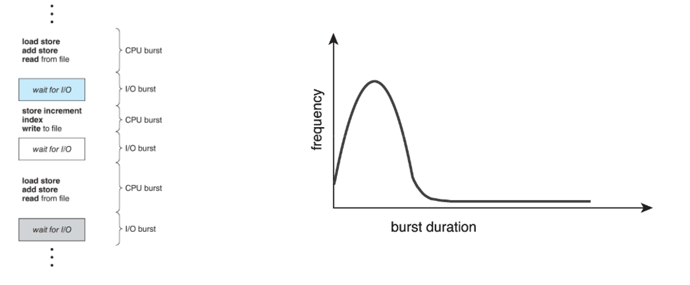
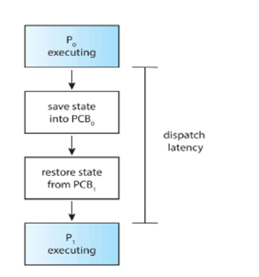
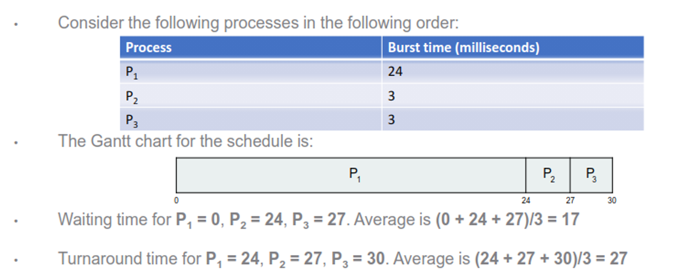
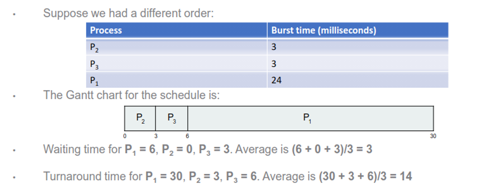
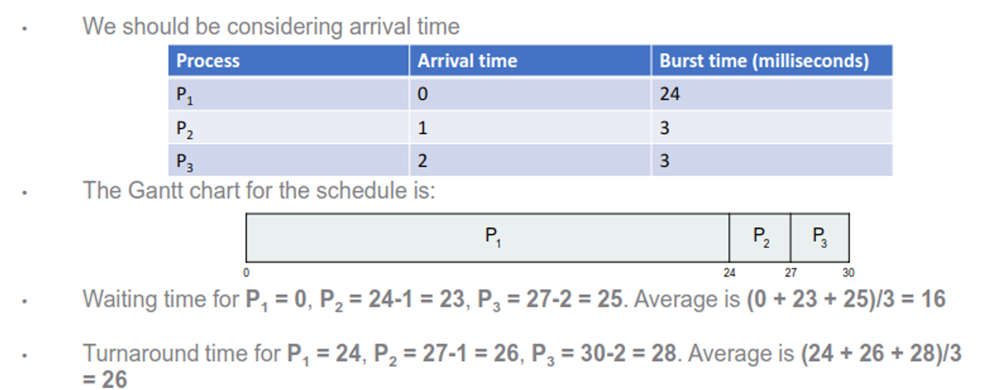
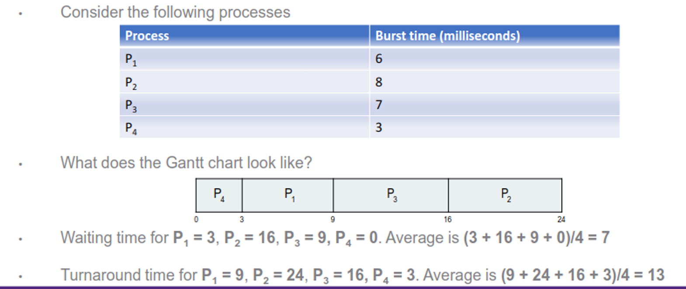
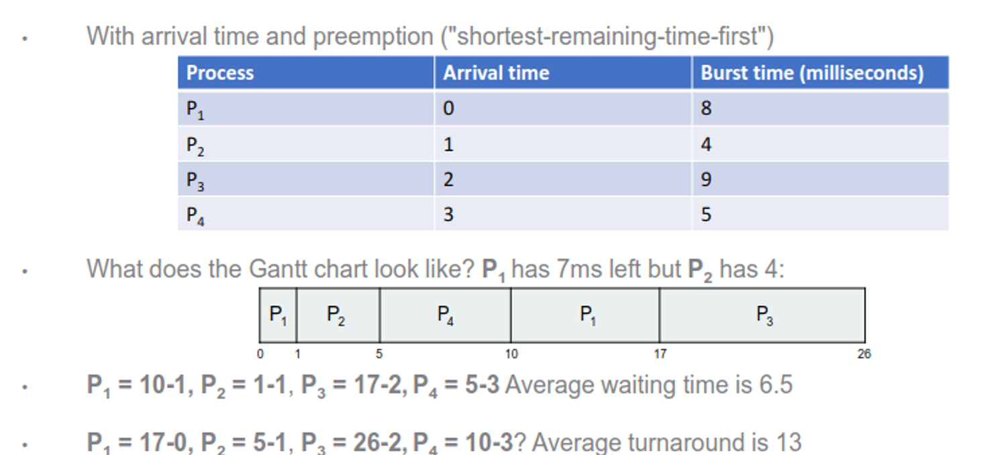
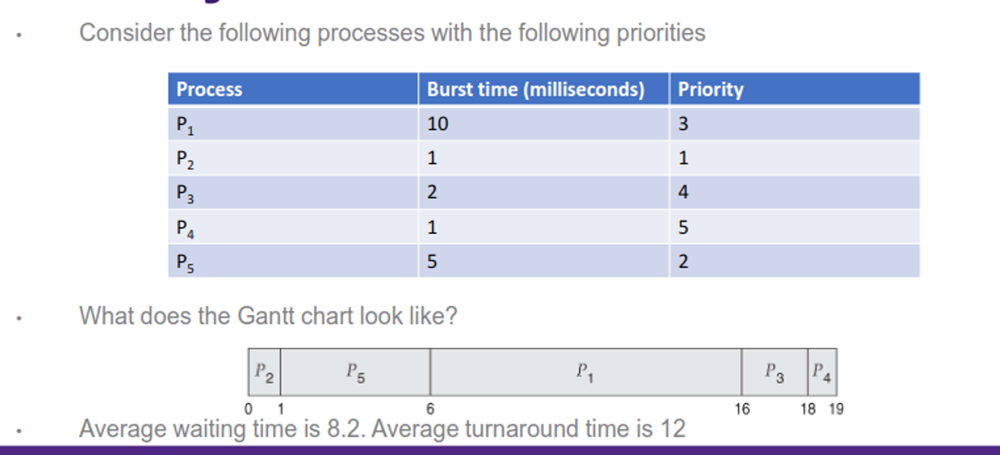
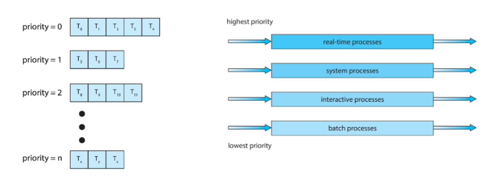
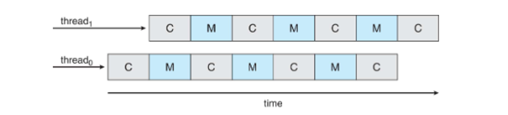

# Scheduling

On most computers, we need to run multiple things at once, but how do we achieve this efficiently?

We’ve spoken about multicore systems, but this is only part of the puzzle; we need to incorporate scheduling in order to make this work

We do this with a CPU-I/O burst cycle, where we cycle short bits of CPU usage with short bits of I/O usage, each called a burst

There are (supposed to be) many short bursts and only a few long bursts, so we can interleave pretty easily

The scheduler itself selects processes from a queue of processes that haven’t been completed

These processes switch from running to waiting, running to ready, waiting to ready, or any state to termination

For situations 1 and 4, we can’t do much with our scheduler, but for 2 and 3 we can shake things up a bit with choice

- The former is nonpreemptive scheduling (processes keep the CPU until it either waits or terminates) and the latter is preemptive (a different process can interrupt)
- Preemptive is the standard for all modern OSes since it’s required for real-time computing and user interaction, but at the cost of race conditions (to be discussed in depth later)

We handle process swapping with the dispatcher, which swaps context, between user mode and kernel mode and going to where it left off in a previous program

This dispatcher has some latency, but this should be minimized as much as possible (we can use vmstat to track this)

## Scheduling Algorithms

There’s many different ways to calculate how to interleave processes, but which one do we choose?

To decide, we need to take into account CPU utilization, throughput, turnaround time, waiting time and response time

- We also need to account for fairness; we don’t want a process sitting and waiting for the CPU forever

### Simple Queue

The first and most simple way to go about this is to run whatever comes first in a FIFO queue, running until it needs I/O or is terminated

- This is nonpreemptive since the OS doesn’t intervene at all

The problem is that the wait time can be very long, so if you run a bunch of processes at once, it can be a while before we get to the next process

To look at this deeper, consider the following processes

This obviously isn’t good for 2 and 3, but if we had a different order, things get much better

This begs the question: what if we slap $P_1$ into the middle? Crunching the numbers, we get the following

|  | Burst | Wait | Turnaround |
| --- | --- | --- | --- |
| P2 | 3 | 0 | 3 |
| P1 | 24 | 3 | 27 |
| P3 | 3 | 27 | 30 |
| Avg | - | 10 | 20 |

We notice that when we have short processes stuck behind long processes, we have longer wait times are turnaround times, much like a slow truck on a one-lane stretch of highway

- This is called the convoy effect, and we want to avoid this!!

This, of course, assumes that we have everything arrive at the same time, which usually isn’t the case

If we take into account arrival time, our calculations look slightly different

### Stack

Another option is to use a stack, where processes are handled in LIFO

This option improves response time for newly created processes, but has an extremely large risk of starvation, so it’s probably best to avoid this

### Shortest-Job-First

In this, we take the shortest CPU burst and run that first, followed by the next shortest burst

- This is also nonpreemptive but we can make it preemptive

This gives the benefit of an optimal SJF with a minumum guaranteed average waiting time for a given set of processes, but determining the length of the burst is a bit complicated

We could either make a guess based on history (which is automatic but inaccurate) or make the user/developer set it (accurate but annoying to have to set)

To see how optimal this really is, let’s crunch the numbers

This gives us our best times yet from all the other methods, but how do we actually calculate the burst length ahead of time?

One way we can do this is with an averaging formula known as exponential smoothing, with the idea that the next CPU burst will probably be a similar length

Here is the text from the image, typed out word for word:

---

1. $t_n$ = actual length of $n^{th}$ CPU burst
2. $\tau_{n+1}$ = predicted value for the next CPU burst
3. $\alpha$, $0 \leq \alpha \leq 1$
4. Define:
$$\tau_{n+1} = \alpha t_n + (1 - \alpha) \tau_n$$

We can modify $\alpha$ to get different effects

- Set $\alpha$ to 0 – The most recent history has no bearing. Pick an estimate and never update it
$$\tau_{n+1} = \tau_n$$

- Set $\alpha$ to 1 – Only the most recent history has any bearing
$$\tau_{n+1} = t_n$$

- More commonly, set $\alpha$ to ½ so we get the most recent history and all the past history
  - Set $\alpha$ to 0.5 – 1.0 to put higher weight on recent history, 0 – 0.5 to put higher weight on past history

This gives us slightly better times if we use it properly

Here is the text from the image, typed out word for word:

Here is the corrected table, typed out word for word:

---

- What if we give higher weight to the most recent burst and set $\alpha$ to 0.75

$$
\begin{array}{|c|c|c|c|c|c|c|c|c|}
\hline
t_i &  & 6 & 4 & 6 & 4 & 13 & 13 & 13 \\
\hline
\tau_0 & 10 & 4.5+2.5 & 3+1.8 & 4.5+1.2 & 3+1.4 & 9.8+1.1 & 9.8+2.8 & 9.8+3.2 \\
 &  & 7 & 4.8 & 5.7 & 4.4 & 10.9 & 12.6 & 13 \\
\hline
\end{array}
$$

---

### Round Robin

This is probably the simplest of the “effective methods”: just split time evenly

More specifically, we give each burst a certain amount of time (given by a time quantum) before switching to the next process, and so on in a loop

In this case, no one process waits more than (n-1)q time units, but we have to be careful with q: too low and we spend more time context switching, but too high and we’re just doing FCFS again

- This is usually 10-100ms

Despite this, round robin is the most common scheduling algorithm, with pretty good results

### Priority

We can also assign priority for each process with an integer, with the upside of more control and the downside of possible starvation

We can partially solve the starvation issue with process aging, so as the time progresses, increase priority

### Lottery

Give each process a lottery ticket, and if it’s chosen, run that process, which eliminates starvation but can be inefficient

### Multilevel Queue

We can also combine all of these together, with one method for each queue, which gives the best of all worlds but still can starve processes

A variation of this that solves starvation is the feedback queue, where processes can be promoted to higher priority queues as they age and demoted to lower priority queues if they use too much CPU time

Here is the text from the image, typed out word for word:

Consider an example with three queues
- $Q_0$ – RR with time quantum 8 milliseconds
- $Q_1$ – RR time quantum 16 milliseconds
- $Q_2$ – FCFS

A new process enters queue $Q_0$ and receives 8 milliseconds

If it does not finish in 8 milliseconds, the process is moved to queue $Q_1$

At $Q_1$ job is again served in RR and receives 16 additional milliseconds

If it still does not complete, it is preempted and moved to queue $Q_2$

## On Multiprocesses

Things get more complicated when we introduce parallelism, because now we can balance the load more efficiently

One approach we can take is asymmetric multiprocessing, where we use one process for kernel-level scheduling and other processors just execute code

- Since the primary processor is a bottleneck, this isn’t used nowadays

The other approach is symmetric multiprocessing, where each processor schedules itself, where each processor can choose from a common queue (can lead to race conditions) or a private queue (can unbalance the load)

- Race conditions are more of a problem, so modern OSes use this with a private queue

This is applied either on

- Multicore processors - each core is a logical CPU for the OS (faster and saves power, but can create memory stalls)
    
    
    
- Multithreaded multicore processors - each core can handle two or more threads (ex. Intel i7)
- In this case, the chip has built-in thread scheduling
    
    
    

This also comes with the issue of load balancing, since now we have threads to work with

We have two approaches to sort this out

- Push migration - check tasks periodically and push from overloaded CPUs to other CPUs
- Pull migration - idle processors pull waiting tasks from bust processors
- Most use a combination of both

We usually don’t want threads to migrate to new processors since we have to then repopulate the cache again

- This is another reason to use private queues

We can enforce this further by either using soft affinity (OS attempts to keep the thread running on the same processor) or hard affinity (threads specify a set of processors to run on)

This is counterbalanced by load balancing, so the more we load balance, the less benefit we get from affinity, so we need to achieve a golden mean between the two in our algorithms