# Storage Systems

# Persistent Space

Modern computers need some type of persistency to do most things, with multuple processes potentially using it concurrently

This is storage is either on a HDD or an NVM (ex. SSD or USB), with some systems even using parts of RAM for this, known as RAM drive

- The last option is more common for temp data or data in transit
- We can also use magnetic tape for an archive

## HDDs

HDDs use a spinning disk that is written with a read-write head, separated by a thin layer of gas, with each platter divided into cylinder → tracks → sectors

These rotate at 5.4k-15k RPM, with certain types like CDs being removeable

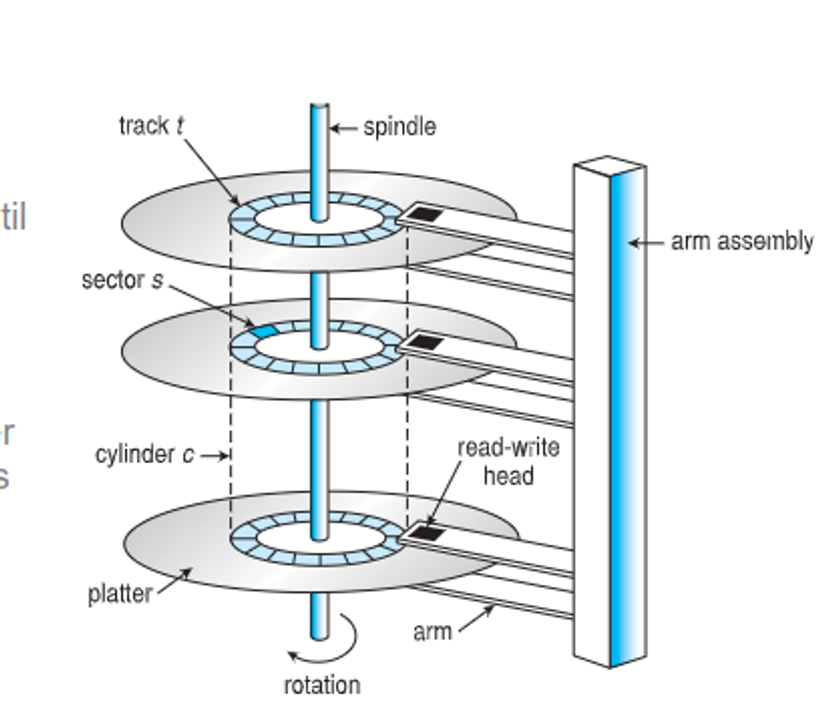

Sectors nowadays are usually 4kb, but they can be larger on the outer tracks, increasing data density and capacity

The performance depends on transfer rate (data flow speed) and positioning time (getting to the right place, seek time + rotation latency)

- The head can also crash if it contacts the surface, which is unrecoverable unless we have backups or RAID

## NVMs

NVMs are purely digital, with are more reliable but have shorter lifespans and are more expensive with less capacity

Some busses might even be slower than connecting straight to the system bus, so these are better suited for phones and laptops

These using paging, similar to main memory, making it efficient for reads but inefficient for writes, as they can also degrade the memory cell over time

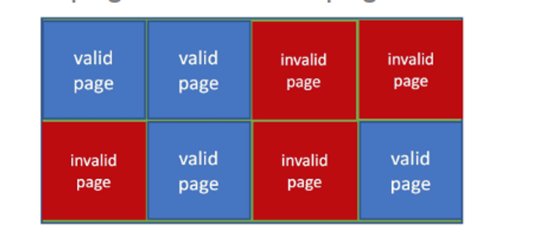

## Scheduling

These are schedules as 1D arrays with each block mapped to a sector

- HDDs
  - Sector 0 is the first sector on the first track on the first outermost cylinder
  - Then mapping proceeds through each track in the same cylinder
  - Continue from the outermost cylinder to the innermost

- NVM
  - Simply address through each chip, block, and page

The OS should deal with these efficiently, decreasing access time through good movement

Processes that need sources wait in an I/O queue and disk requests are held in a queue on disk for modern models

These requests contain read/write info, disk address, memory address, sectors, etc.

Managing the queue intelligently can increase efficiency, with the following being examples of algorithms to use

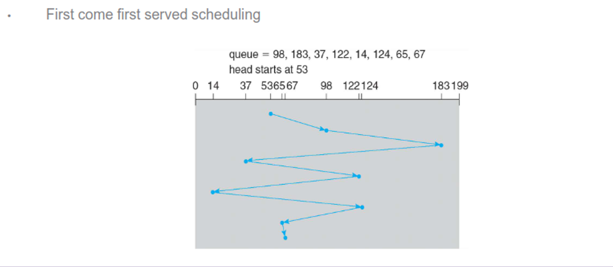

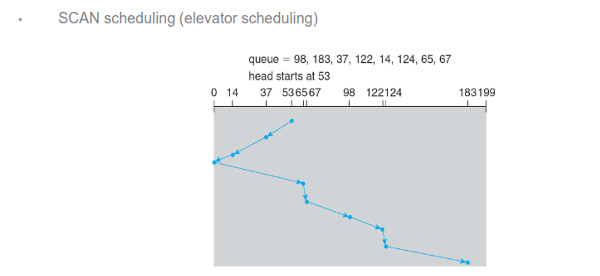

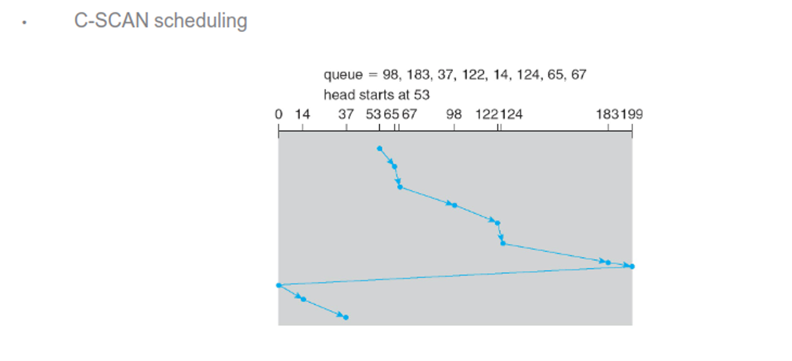

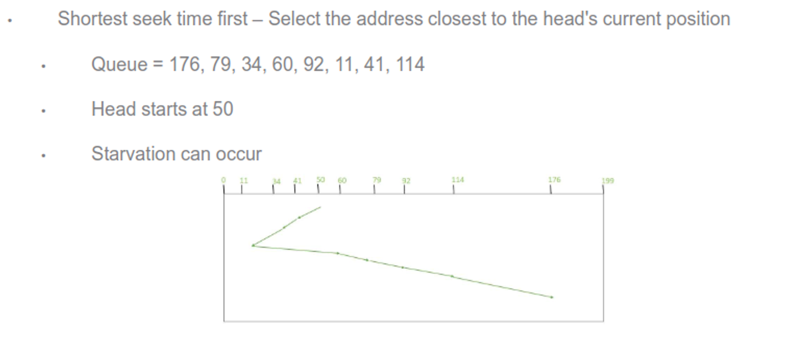

There are others as well, including random, LIFO and priority, but all of these depend on the expected workload and most OSes use a combination

- On NVMs, since there’s no disk heads, random is the best approach, as well as optimizing for reads since they’re uniform and generally faster

## Error Detection

We can detect read/write errors with parity bits and ECCs, which you should already know by now

## Device Management

On a low level, we divide the disk into sectors, with the OS keeping a record of its own data structures on a disk

We partition this disk into one of more cylinders, each treated as a logical disk (C and D on Windows, /boot /usr and /home on UNIX), with each partition being logically formatted into a file system type

- These file systems keep data in similar sectors to reduce seek time

These also contain metadata about bootability, with the computer having bootstraps baked into the firmware

The last thing this program does is reading the MBR, which is the first block on the first partition, which loads the rest of the OS

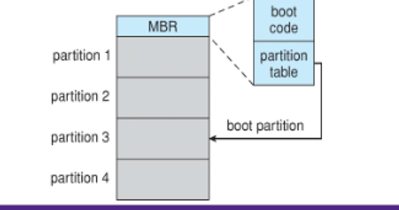

## Swap-Space Management

When we use swap space for pages, we can either send it to a raw partition or files on a partition, which are subject for the file system structure

- For the former we want to optimize speed

## Storage Attachment

Disks are attached to the I/O bus and data is transferred on this bus by controllers, the host controller on the motherboard and the data controller on the disk

- SATA is the most common, but other include USB FireWire, Thunderbolt and fibre optic

We can also attach storage to network under LAN

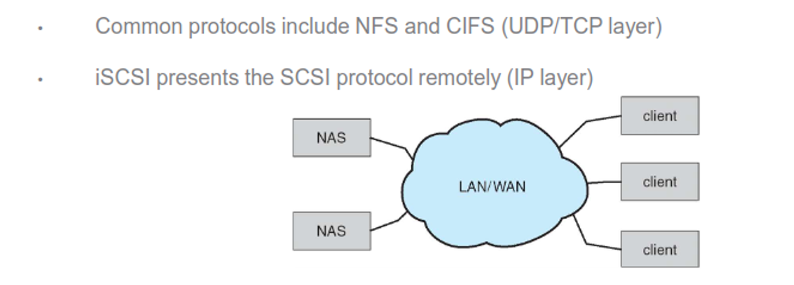

Cloud storage also exists, which is similar to NAS except it’s over the Internet, including Google Drive and Dropbox

If cloud storage is undesirable (ex. servers) we can use SANs to set up a local array or servers, with disks being added and replaced transparently

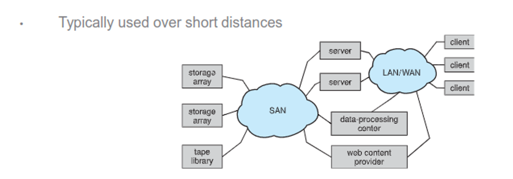

## RAID

All disks are prone to failure, with loss being catastrophic, so Redundant Array of Inexpensive Disks (RAID) exists as a way to add redundancy through extra disks

The logic for this exists on both the hardware level (for supercomputers), software level (for desktops) and firmware (ex. BIOS)

There are 6 differnet types, generally

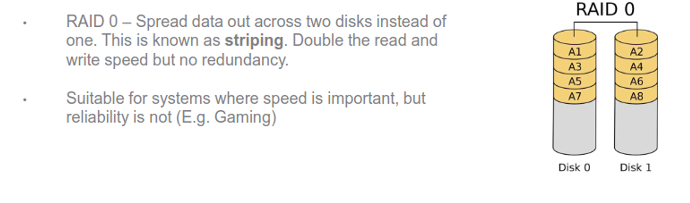

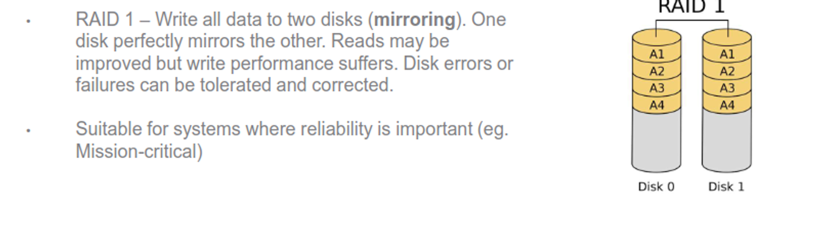

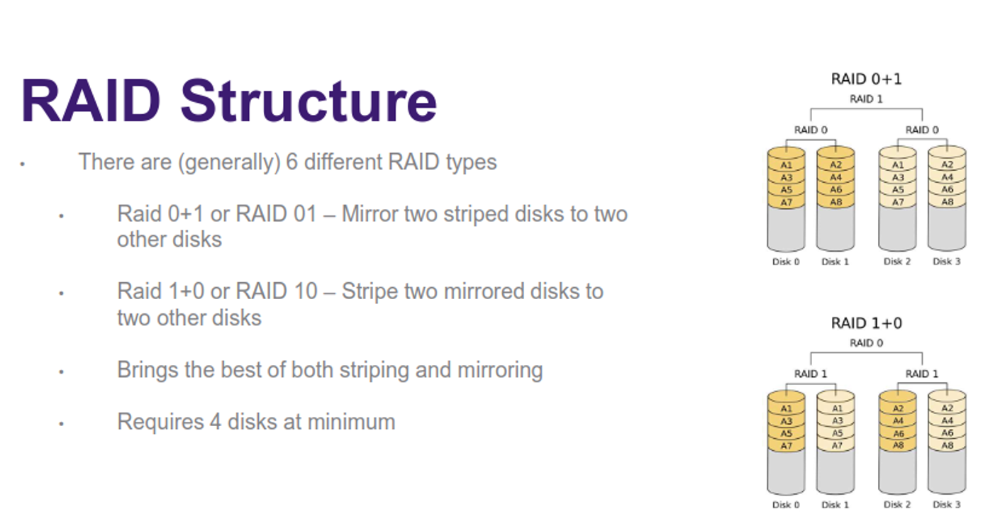

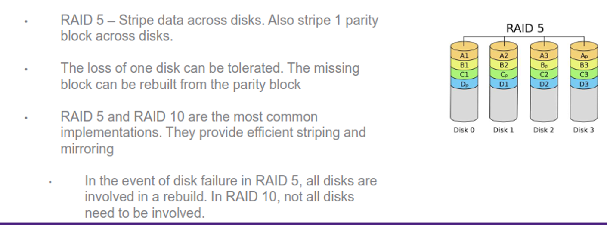

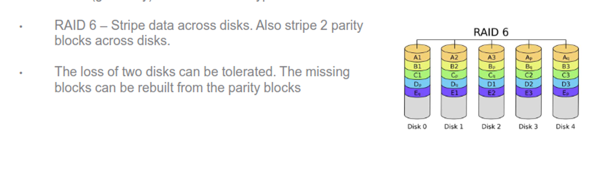

Other variants exist as well, such as RAID 2, 3, 4, 50, 60, etc.

- These can’t protect from user error, so backups are still needed

All of these RAID disks need to be the same size, as it’s hard to add or shrink space

We can use hot spares to give immediate rebuilds as well, but these can temporarily impact performance