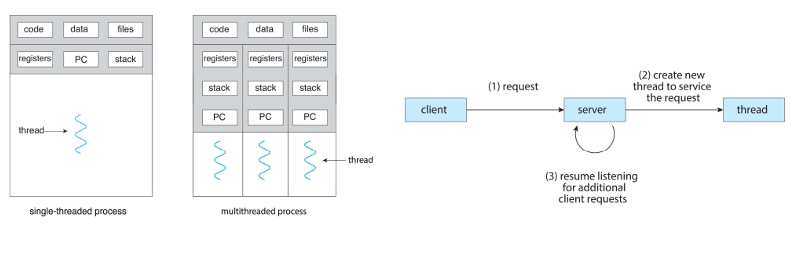
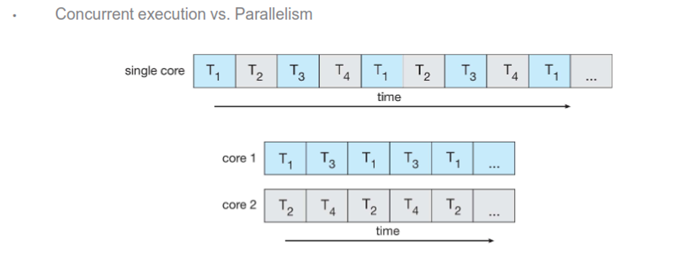
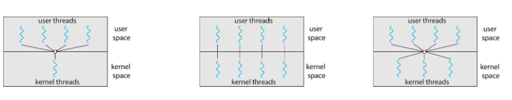

# Threads

# How Computers Multitask

Parallel processing has been essential to the development of modern applications, something that is only possible because of threading

With multithreading, we have multiple threads run within an operation, each of which is performing a different task or set of tasks

This is more lightweight than creating a separate process while also simplifying code and increasing efficiency



### Multicore

Note that the system needs a multicore with parallelism (doing multiple things at once) in order for threading to be useful; otherwise we’re just doing concurrency (more than one task-making process) which we could’ve just done with a new process



Parallelism itself can be either data (distributes data evenly across multiple cores with the same operation) or task (threads across cores with unique operations)

When you have a multicore, you can do good parallelism, but the tasks of dividing activities, balance, data splitting and other things are at the behest of the programmer

We can actually calculate how much we’ll speed up with a simple formula: if tasks can be done in 60 seconds serial and 30 seconds parallel, it’s 2 times faster, so on and so forth

In general, if a task can be done in X seconds serial and Y seconds parallel, the speedup of (X/Y) times

We can generalize this even further with Amdahl’s law

The image illustrates Amdahl's Law, which is used to find the maximum improvement possible for an overall system when only part of the system is improved. Amdahl's Law is typically used in parallel computing to predict the theoretical maximum speedup of a program using multiple processors.

### Amdahl's Law Formula
The speedup of a program using multiple processors in parallel computing is given by:

$$\text{speedup} \leq \frac{1}{S + \frac{(1 - S)}{N}}$$

Where:
- $S $ is the fraction of the program that is serial (cannot be parallelized).
- $N $ is the number of processing cores.

### Example Calculations

**1. If the application is 75% parallel and 25% serial, moving from 1 to 2 cores results in a speedup of:**
$$\text{speedup} \leq \frac{1}{0.25 + \frac{0.75}{2}}$$

Let's calculate it:
$$\text{speedup} \leq \frac{1}{0.25 + 0.375}$$
$$\text{speedup} \leq \frac{1}{0.625}$$
$$\text{speedup} \leq 1.6$$

**2. If the application is 50% parallel and 50% serial on 2 cores:**
$$\text{speedup} \leq \frac{1}{0.5 + \frac{0.5}{2}}$$

Let's calculate it:
$$\text{speedup} \leq \frac{1}{0.5 + 0.25}$$
$$\text{speedup} \leq \frac{1}{0.75}$$
$$\text{speedup} \leq 1.33$$

**3. If the application is 50% parallel and 50% serial on 1024 cores:**
$$\text{speedup} \leq \frac{1}{0.5 + \frac{0.5}{1024}}$$

Let's calculate it:
$$\text{speedup} \leq \frac{1}{0.5 + 0.00048828125}$$
$$\text{speedup} \leq \frac{1}{0.50048828125}$$
$$\text{speedup} \leq 1.998$$

**Summary of Results:**
- 75% parallel / 25% serial with 2 cores: Speedup of 1.6 times.
- 50% parallel / 50% serial with 2 cores: Speedup of ~1.33 times.
- 50% parallel / 50% serial with 1024 cores: Speedup of ~1.998 times.

These examples highlight how the speedup diminishes as the serial portion of the task increases, even with a large number of processing cores.

Here, as N approaches infinity, the speedup approaches 1/S, and as S approaches 0, speedup approaches N

This can apply to all parallel tasks as well, not just cores

The image illustrates the use of Amdahl's Law for calculating the speedup of a system with different portions of the workload that can be improved by different factors. The specific example given includes four portions of the workload with the following characteristics:

- **11%** of the workload must be done in serial (cannot be parallelized).
- **18%** of the workload can be done **5 times faster** (1/5th the time).
- **23%** of the workload can be done **20 times faster** (1/20th the time).
- **48%** of the workload can be done **1.6 times faster** (1/1.6th the time).

**Speedup Calculation**

The formula used for calculating the overall speedup ($S_{\text{latency}}$) is:

$$S_{\text{latency}} = \frac{1}{\frac{p_1}{s_1} + \frac{p_2}{s_2} + \frac{p_3}{s_3} + \frac{p_4}{s_4}}$$

Where:
- $p_1, p_2, p_3, p_4 $ are the fractions of the workload.
- $s_1, s_2, s_3, s_4 $ are the speedup factors for each fraction.

For the given example:
- $p_1 = 0.11 $, $s_1 = 1 $ (serial portion)
- $p_2 = 0.18 $, $s_2 = 5 $ (5 times faster)
- $p_3 = 0.23 $, $s_3 = 20 $ (20 times faster)
- $p_4 = 0.48 $, $s_4 = 1.6 $ (1.6 times faster)

Plugging these values into the formula:

$$S_{\text{latency}} = \frac{1}{\frac{0.11}{1} + \frac{0.18}{5} + \frac{0.23}{20} + \frac{0.48}{1.6}}$$

Let's break down each term:

$$\frac{0.11}{1} = 0.11$$
$$\frac{0.18}{5} = 0.036$$
$$\frac{0.23}{20} = 0.0115$$
$$\frac{0.48}{1.6} = 0.3$$

Summing these terms:

$$0.11 + 0.036 + 0.0115 + 0.3 = 0.4575$$

Therefore, the overall speedup is:

$$S_{\text{latency}} = \frac{1}{0.4575} \approx 2.19$$

**Summary**
The overall speedup for the given system with the specified improvements in different portions of the workload is approximately 2.19 times. This demonstrates how different parts of a workload contribute to the overall speedup and how improvements in parallelizable sections can lead to significant performance gains.

### Multithreading

There’s two types of threads that we refer to when we say threads

1. User threads (with user-level libraries)
2. Kernel threads (supported by the kernel)

We have to join these together and there are generally three ways to do it

1. Many-to-one: everyone shares one thread
2. One-to-one: thread count is unlimited, but the kernel might run out of resources
3. Many-to-many: thread count is unlimited, but the kernel has to manage all of them

One-to-one is by far the most common since most computers have multiple cores



### Threads

We can make threads in POSIX with the pthread.h header, where on linux, pthread_create() uses clone() just like fork() does

- Windows and Java have their own thread creation methods that we won’t go into

Some compilers also create threads themselves as an optimization through a labelling process

There are many ways to do this, such as thread pools, fork-join model and others, but I won’t go too deep into it here

Some problems arise pretty quickly with the way we do things, however

First: is fork() supposed to duplicate all the threads or just the calling one? On Linux we only duplicate the calling thread, but some UNIXes have two versions, one for each use case

- exec() just replaces all threads

Second: how should signals work? For a single-threaded process, the signals are just delivered to the process and handled where they are, either by the default or by a user-defined override

How about multi-threaded? For some signals like SIGKILL, it goes straight to all threads, but it can also go to threads where the signal applies, just certain threads, or we can also assign a specific thread to take all signals

kill(pid_t pid, int signal) vs. pthread_kill(pthread_t tid, int signal)

Last: how do we cancel threads early? We have two approaches...

Async cancellation (smite it immediately)
Deferred cancellation (let it check if it should be cancelled)
We can do both in C relatively easy

Use pthread_cancel() - but this is only a request
Use pthread_setcanceltype() to set it. Use pthread_testcancel() to check for cancellation requests

```C
pthread_t tid;

/* create the thread */
pthread_create(&tid, 0, worker, NULL);

...

/* cancel the thread */
pthread_cancel(tid);

/* wait for the thread to terminate */
pthread_join(tid, NULL);
```

### In C

Creating a thread is just a one-liner

```C
int pthread_create(pthread_t* thread, pthread_attr_t* attr, 
    void * (start_routine), void *arg);
```

Returns 0 to indicate success, otherwise returns error code

thread – name of the new thread

attr – argument that specifies the attributes of the thread to be created (NULL = default attributes)

start_routine – function to use as the start of the new thread

arg – argument to pass to the new thread routine

To wait on a thread, we can join it up like so

```C
int pthread_join(pthread_t thread, void **retval);
```

Returns 0 to indicate success, otherwise returns error code

thread – name of the new thread

retval – copy the return value of pthread_exit() into the address of retval

If you do not wait for a thread to complete, the parent process may get cleaned up before the thread can do its work

```C
#include <stdio.h>
#include <unistd.h>
#include <pthread.h>

void *do_work() {
    printf("Hello, World!...I am a thread\n");
}

int main(int argc, char **argv) {
    pthread_t worker_thread;
    if (pthread_create(&worker_thread, NULL, do_work, NULL)) {
        printf("Error while creating thread\n");
    }
    pthread_join(worker_thread, NULL);
    return 0;
}
```

These threads should work independently, but if we want to copy data between parent and thread for some reason, we can do this either with

- Global variables
- Passing pipes to pthread_create

```C
// Pass in a message
#include <stdio.h>
#include <unistd.h>
#include <pthread.h>

void *thread_prints_msg(void *msg) {
    printf("From thread_prints_msg: %s\n", (char *) msg);
}

int main(int argc, char **argv) {
    pthread_t thread_1;
    printf("From main: Going to create Thread...\n");
    pthread_create(&thread_1, NULL, thread_prints_msg, "Hello, World!");
    pthread_join(thread_1, NULL);
    printf("Thread terminates...\n");
    return 0;
}
```