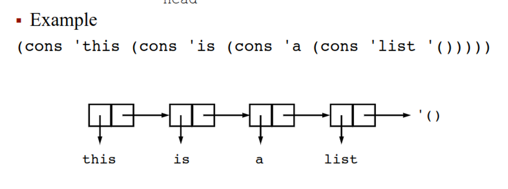
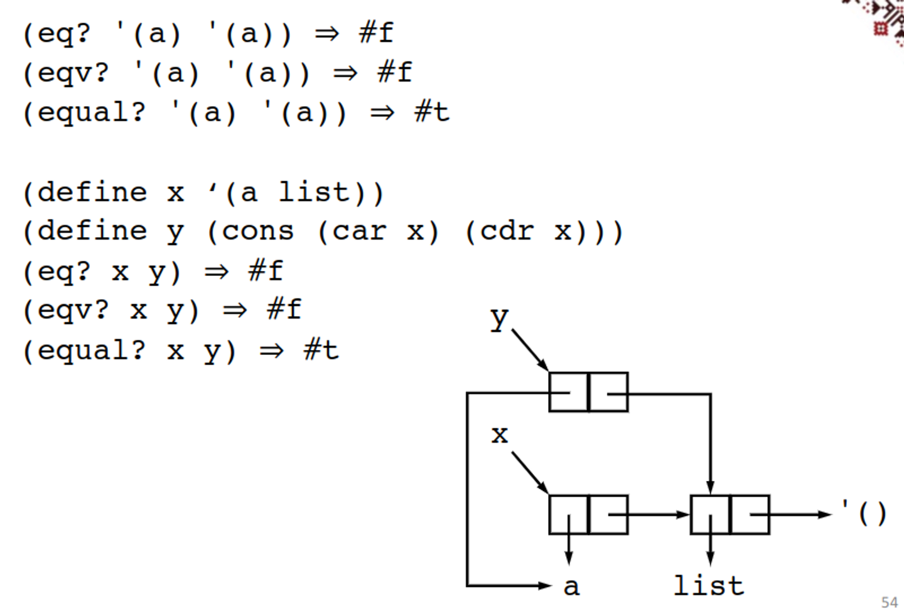
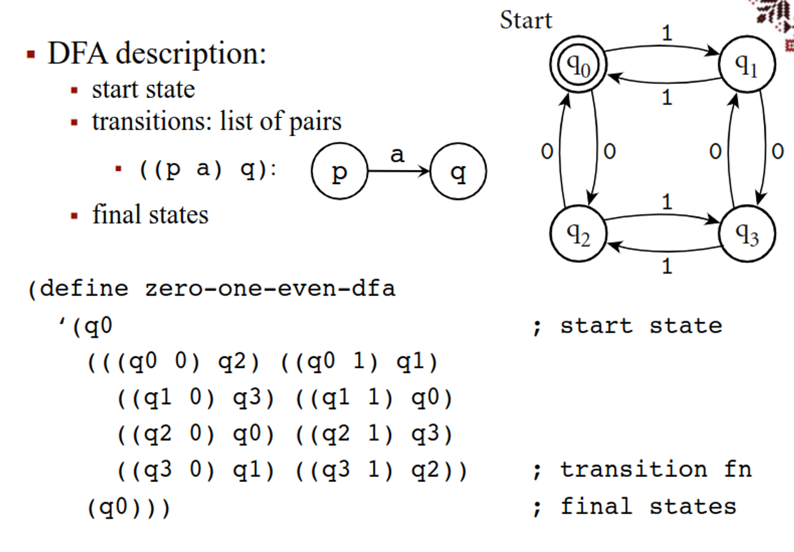

# Functional Programming

# Lambda Applied

Functional programming is a way to directly apply lambda calculus to code, with the benefit of having no internal state or unintended side effects like we have in imperative languages

Essentially, everything we do in functional languages is made of functions, which can be passed to other functions, returned from functions or assigned to variables

These also come with some features you may be familiar with

- **Polymorphism**
  - Functions can be applied to general class of arguments

- **Lists**
  - Natural recursive definition
  - List = head + tail (list)

- **Homogeneity**
  - Program is a list – can be manipulated the same as data

- **Garbage collection**
  - Heap allocation for dynamically allocated data
  - Unlimited extent

This gives us predictable belaviour, referential transparency (expressions independent of order) and equational reasoning (expressions that are equivalent will stay equivalent), but suffer from difficult data structures and making trivial objects for every result

- Trivial update problem isn’t necessarily a weakness; it does make functional programming very safe

## Scheme

One popular functional language is Scheme, a language from 1975 that is now a general-purpose language

The syntax is very close to real lambda

- **λ-calculus**
  - $ \lambda x.x $
  - $ (\lambda x. x * x) \, 4 \Rightarrow_{\beta} \, 16 $

- **Scheme**
  - `(lambda (x) x)`
  - `((lambda (x) (* x x)) 4)  ⇒  16`

We can represent the stuff we usually have in lambda calc or other languages with a few keywords

- **Identifiers**
  - Cannot start with a character that may start a number: `digit`, `+`, `-`, `.` 
  - Case is important

- **Numbers**: 
  - Integers: `-1234`
  - Ratios: `1/2`
  - Floating-point: `1.3`, `1e23`
  - Complex numbers: `1.3 - 2.7i`

- **List constants**: `'(a b c d)`
- **Empty list**: `'()`
- **Procedure applications**: `(+ (* 3 5) 12)`
- **Boolean values**: `#t` (true), `#f` (false)
  - Any object different from `#f` is true

- **Vectors**: `#(this is a vector of symbols)`
- **Strings**: `"this is a string"`
- **Characters**: `#\a`, `#\b`, `#\c`
- **Comments**:
  - `; ... end_of_line`
  - `#| ... |#`

- **Variable definitions**
  - `(define a 23) a  ⇒  23`

- **Function applications**
  - `(+ 20 10)  ⇒  30`
  - `(+ 1/4 6/3)  ⇒  9/4`
  - `(* (* 2/5 5/6) 3)  ⇒  1`


Functions are pretty interesting, since we can give regular lambda functions as well as binding functions to variables

- **Defining a function**
  - `(define (square x) (* x x))`
  - `(square 5)  ⇒  25`

- **Anonymous functions**
  - `(lambda (x) (* x x))`
  - `((lambda (x) (* x x)) 5)  ⇒  25`

- **Named functions**
  - `(define square (lambda (x) (* x x)))`
  - `(square 5)  ⇒  25`

Another thing we can do is print a literal statement without evaluating

- **(quote obj)** or **'obj**
  - tells Scheme not to evaluate
  - `(quote (1 2 3 4 5))  ⇒  (1 2 3 4 5)`
  - `(quote (+ 3 4))  ⇒  (+ 3 4)`
  - `(quote +)  ⇒  +`
  - `+  ⇒  #<procedure:+>`
  - `'(1 2 3 4 5)  ⇒  (1 2 3 4 5)`
  - `'(+( (* 3 10) 4))  ⇒  (+ (* 3 10) 4)`
  - `'2  ⇒  2` ; unnecessary
  - `2  ⇒  2`
  - `' "hi"  ⇒  "hi"` ; unnecessary
  - `"hi"  ⇒  "hi"`

Of course, we still have all our list operations

- **(car list)**
  - gives the first element

- **(cdr list)**
  - gives the list without the first element
  - `(car '(a b c))  ⇒  a`
  - `(cdr '(a b c))  ⇒  (b c)`
  - `(car (cdr '(a b c)))  ⇒  b`

- **(cons list)**
  - constructs a list from an element and a list
  - `(cons 'a '())  ⇒  (a)`
  - `(cons 'a (cons 'b (cons 'c '())))  ⇒  (a b c)`
  - `(cons 'a 'b)  ⇒  (a . b)` ; improper list

- **(list obj₁ obj₂ ...)**
  - constructs (proper) lists; arbitrarily many arguments
  - `(list 'a 'b 'c)  ⇒  (a b c)`
  - `(list)  ⇒  ()`
  - `(list 'a '(b c))  ⇒  (a (b c))`

- **(null? list)**
  - tests whether a list is empty
  - `(null? '())  ⇒  #t`
  - `(null? '(a))  ⇒  #f`

### Variables

Using (let ((var val)…) exp1 exp2 …), we can bind variables in the context of a set of expressions, returning the value of the final expression

- This binding does not exist outside of let

```
(let ((x 2))              ; let x be 2 in ...
  (+ x 3))  ⇒  5
(let ((x 2) (y 3))
  (+ x y))  ⇒  5
(let ((a (* 4 4)))
  (+ a a))  ⇒  32
(let ((f +) (x 2) (y 3))
  (f x y))  ⇒  5
(let ((+ *))
  (+ 2 5))  ⇒  10
(+ 2 5)  ⇒  7  ; + unchanged outside previous let

Since let is itself an expression, we can have nested lets also

(let ((x 1))
  (let ((y (+ x 1)))     ; nested lets
    (+ y y)))  ⇒  4

(let ((x 1))
  (let ((x (+ x 1)))     ; new variable x
    (+ x x)))  ⇒  4

(let ((x₁ 1))
  (let ((x₂ (+ x₁ 1)))   ; indices show bindings
    (+ x₂ x₂)))  ⇒  4  
```

With the second example, only the inner let is used, since the expression belongs to the inner let

If we want to avoid unecessary nesting, we can use let* instead, which evaluates vals from left to right, meaning we can use values within the same let statement

```
(let* ((x 10) (y (- x 4)))
  (* y y))  ⇒  36

(let ((x 10) (y (- x 4)))
  (* y y))  ; Error: unbound variable x
```

letrec is the same, except no order is implied

To summarize:

- `let` – for independent variables
- `let*` – linear dependency among variables
- `letrec` – circular dependency among variables

### Functions

The obvious way to do a function is with lambda, which simple returns a function

- `(lambda formals exp₁ exp₂ ...)`
  - returns a function
- `formals` can be:
  - A proper list of variables `(var₁ ... varₙ)`
    - then exactly `n` parameters must be supplied, and each variable is bound to the corresponding parameter
      ```scheme
      ((lambda (x y) (* x (+ x y))) 7 13)  ⇒  140
      ```
  - A single variable `x` (not in a list): then `x` is bound to a list containing all actual parameters
      ```scheme
      ((lambda x x) 1 2 3)  ⇒  (1 2 3)
      ((lambda x (sum x)) 1 2 3 4)  ⇒  10
      ```
  - An improper list terminated with a variable, `(var₁ ... varₙ . var)`, then at least `n` parameters must be supplied and `var₁ ... varₙ` will be bound to the first `n` parameters and `var` will be bound to a list containing the remaining parameters
      ```scheme
      ((lambda (x y . z) (list x y z)) 1 2 3 4)
      ⇒  (1 2 (3 4))
      ```

### Assignments

Like let, set! assigns a new value to an existing variable, so it’s a new value binding and not a name binding

```scheme
(let ((x 3) (y 4))
  (set! x 10)
  (+ x y))  ; ⇒ 14
```
This is useful for gradual formulas like quadratics
```scheme
(define quadratic-formula
  (lambda (a b c)
    (let ((root1 0) (root2 0) (minusb 0)
          (radical 0) (divisor 0))
      (set! minusb (- 0 b))
      (set! radical (sqrt (- (* b b) (* 4 (* a c)))))
      (set! divisor (* 2 a))
      (set! root1 (/ (+ minusb radical) divisor))
      (set! root2 (/ (- minusb radical) divisor))
      (list root1 root2))))

(quadratic-formula 1 -3 2)  ; ⇒ (2 1)
```
Of course, we can also do this setless, but it looks clunky
```scheme
(define quadratic-formula
  (lambda (a b c)
    (let ((minusb (- 0 b))
          (radical (sqrt (- (* b b) (* 4 (* a c)))))
          (divisor (* 2 a)))
      (let ((root1 (/ (+ minusb radical) divisor))
            (root2 (/ (- minusb radical) divisor)))
        (list root1 root2)))))

(quadratic-formula 1 -3 2)  ; ⇒ (2 1)
```

Some things, however, require set to work
```scheme
(define cons-count 0)
(define cons-new
  (let ((old-cons cons))
    (lambda (x y)
      (set! cons-count (+ cons-count 1))
      (old-cons x y))))

(cons-new 'a '(b c))
cons-count  ; ⇒ 1
(cons-new 'a (cons-new 'b (cons-new 'c '())))
cons-count  ; ⇒ 4
```
## Sequencing

If we want to specifically evaluate from left to right, we can use (begin exp1 exp2) to eliminate side effects, returning the last expression’s result

```scheme
(define quadratic-form
  (lambda (a b c)
    (begin
      (define root1 0) (define root2 0)
      (define minusb 0) (define radical 0) (define divisor 0) (set! minusb (- 0 b))
      (set! radical (sqrt (- (* b b) (* 4 (* a c)))))
      (set! divisor (* 2 a))
      (set! root1 (/ (+ minusb radical) divisor))
      (set! root2 (/ (- minusb radical) divisor))
      (list root1 root2))))

(quadratic-form 1 -3 2)  ; ⇒ '(2 1)
```
### Conditionals

If works the same way as it does in other languages


▪ (if test consequent alternative)
  ▪ returns the value of consequent or alternative depending on test
```
(define abs
  (lambda (x)
    (if (< x 0)
        (- 0 x)
        x)))

(abs 4)  ; ⇒ 4
(abs -5) ; ⇒ 5
```
We can also do negation with the not keyword

▪ (not obj)

▪ returns #t if obj is false and #f otherwise

(not #f)  ; ⇒ #t \\
(not 'a)  ; ⇒ #f \\
(not 0)   ; ⇒ #f 


The other booleans also exist

▪ (and exp ...) \\
  ▪ evaluates its subexpressions from left to right and stops immediately if any expression evaluates to false \\
  ▪ returns the value of the last expression evaluated

```
(and #f 4 6 'a)  ; ⇒ #f
(and '(a b) 'a 2)  ; ⇒ 2
(let ((x 5))
  (and (> x 2) (< x 4)))  ; ⇒ #f
```
▪ (or exp ...) \\
  ▪ evaluates its subexpressions from left to right and stops immediately if any expression evaluates to true \\
  ▪ returns the value of the last expression evaluated

```
(or #f 4 6 'a)  ; ⇒ 4
(or '(a b) 'a 2)  ; ⇒ (a b)
(let ((x 3))
  (or (< x 2) (> x 4)))  ; ⇒ #f
```

We can use cond as well to evaluate clauses

▪ (cond clause₁ clause₂ ...) \\
  ▪ evaluates the test of each clause until one is found true or all are evaluated
```
(define memv
  (lambda (x ls)
    (cond
      ((null? ls) #f)
      ((eqv? (car ls) x) ls)
      (else (memv x (cdr ls))))))

(memv 'a '(d a b c))  ; ⇒ '(a b c)
(memv 'a '(b b c))    ; ⇒ #f
```
Something to note is that these use lazy loading, but we can make strict versions

Iteration

As we know, recursion is how we iterate in lambda calc, which is something that is possible in Scheme

▪ (let name ((var val)...) exp₁ exp₂ ...) \\
  ▪ this is named let \\
  ▪ it is equivalent with 

  ```
((letrec ((name (lambda (var ...) exp₁ exp₂ ...))) 
  name)
  val ...)
```

```
(define divisors
  (lambda (n)
    (let f ((i 2))
      (cond
        ((>= i n) '())
        ((integer? (/ n i))
         (cons i (f (+ i 1))))
        (else (f (+ i 1)))))))

(divisors 5)  ; ⇒ '()
(divisors 12) ; ⇒ '(2 3 4 6)
```

Of course, we can also do regular iteration

▪ (do ((var val update)...) (test res ...) exp ...)\\
  ▪ variables var... are initially bound to val... and rebound on each iteration to update...\\
  ▪ stops when test is true and returns the value of the last res\\
  ▪ when test is false, it evaluates exp..., then update...; new bindings for var... are created and iteration continues

```
(define factorial
  (lambda (n)
    (do ((i n (- i 1)) (a 1 (* a i)))
        ((zero? i) a))))

(factorial 0)  ; ⇒ 1
(factorial 1)  ; ⇒ 1
(factorial 5)  ; ⇒ 120
```

We can also take a list and apply an expression to all its elements

▪ (map procedure list₁ list₂ ...)\\
  ▪ applies procedure to corresponding elements of the lists list₁, list₂ ... and returns the list of the resulting values\\
  ▪ procedure must accept as many arguments as there are lists\\
  ▪ the order is not specified

```
(map abs '(1 -2 3 -4 5 -6))  ; ⇒ (1 2 3 4 5 6)
(map (lambda (x y) (* x y))
     '(1 2 3 4) '(5 6 7 8))  ; ⇒ (5 12 21 32)
```
▪ (for-each procedure list₁ list₂ ...)\\
  ▪ similar to map\\
  ▪ does not create and return a list\\
  ▪ applications are from left to right
```
(let ((same-count 0))
  (for-each
    (lambda (x y)
      (if (= x y)
          (set! same-count (+ same-count 1))
          '()))
    '(1 2 3 4 5 6) '(2 3 3 4 7 6)))
same-count  ; ⇒ 3
```
### Pairs

▪ cons builds a pair (called also dotted pair)\\
  ▪ both proper and improper lists can be written in dotted notation\\
  ▪ a list is a chain of pairs ending in the empty list ()\\

  ▪ proper list: cdr of the last pair is the empty list\\
    ▪ x is a proper list if there is n such that cdrⁿ(x) = '()\\

  ▪ improper list: cdr of the last pair is anything other than ()
```
(cons 'a '(b))  ; ⇒ '(a b)  ; proper
(cons 'a 'b)    ; ⇒ '(a . b)  ; improper
(cdr (cdr (cdr '(a b c))))  ; ⇒ '()
(cdr (cdr '(a b . c)))  ; ⇒ 'c
```

### Predicates

We’ll get more into predicates later, but we can work with them in Scheme

▪ (boolean? obj)\\
  ▪ #t if obj is either #t or #f; #f otherwise

▪ (pair? obj)\\
  ▪ #t if obj is a pair; #f otherwise

(pair? '(a b))  ; ⇒ #t\\
(pair? '(a . b))  ; ⇒ #t\\
(pair? 2)  ; ⇒ #f\\
(pair? 'a)  ; ⇒ #f\\
(pair? '(a))  ; ⇒ #t\\
(pair? '())  ; ⇒ #f

▪ (char? obj) - #t if obj is a character, else #f\\
▪ (string? obj) - #t if obj is a string, else #f\\
▪ (number? obj) - #t if obj is a number, else #f\\
▪ (complex? obj) - #t if obj is complex, else #f\\
▪ (real? obj) - #t if obj is a real number, else #f\\
▪ (integer? obj) - #t if obj is integer, else #f\\
▪ (list? obj) - #t if obj is a list, else #f\\
▪ (vector? obj) - #t if obj is a vector, else #f\\
▪ (symbol? obj) - #t if obj is a symbol, else #f\\
▪ (procedure? obj) - #t if obj is a function, else #f


### I/O

We can do I/O in Scheme as well

▪ (read)\\
  ▪ returns the next object from input\\
▪ (display obj)\\
  ▪ prints obj

(display "compute the square root of:")\\
  ; ⇒ compute the square root of: 2\\
(sqrt (read))\\
  ; ⇒ 1.4142135623730951

### Deep Binding

The prof probably talked about something here idk I was sick

```scheme
(define A
  (lambda (i P)
    (let ((B (lambda () (display i) (newline))))
      (cond ((= i 4) (P))
            ((= i 3) (A (+ i 1) P))
            ((= i 2) (A (+ i 1) P))
            ((= i 1) (A (+ i 1) P))
            ((= i 0) (A (+ i 1) B))))))

(define C (lambda () 10))
(A 0 C)  ; ⇒ 0
```
### Storage Allocation

We construct lists with list and cons, with list being a shorthand for nested cons

(list 'apple 'orange 'grape)\\
  ; ⇒ '(apple orange grape)

(cons 'apple (cons 'orange (cons 'grape '())))\\
  ; ⇒ '(apple orange grape)

These are allocated as a linked list with a head (car) and a tail (cdr)



### Equality

There’s a bunch of ways to do equality

▪ (eq? obj₁ obj₂)\\
  ▪ returns #t if obj₁ and obj₂ are identical, else #f\\
  ▪ implementation as fast as possible

▪ (eqv? obj₁ obj₂)\\
  ▪ returns #t if obj₁ and obj₂ are equivalent, else #f\\
  ▪ similar to eq? but is guaranteed to return #t for two exact numbers, two inexact numbers, or two characters with the same value

▪ (equal? obj₁ obj₂)\\
  ▪ returns #t if obj₁ and obj₂ have the same structure and contents, else #f

(eq? 'a 3)  ; ⇒ #f\\
(eqv? 'a 3)  ; ⇒ #f\\
(equal? 'a 3)  ; ⇒ #f

(eq? 'a 'a)  ; ⇒ #t\\
(eqv? 'a 'a)  ; ⇒ #t\\
(equal? 'a 'a)  ; ⇒ #t

(eq? #t (null? '()))  ; ⇒ #t\\
(eqv? #t (null? '()))  ; ⇒ #t\\
(equal? #t (null? '()))  ; ⇒ #t

(eq? 3.4 (+ 3.0 .4))  ; ⇒ #f\\
(eqv? 3.4 (+ 3.0 .4))  ; ⇒ #t\\
(equal? 3.4 (+ 3.0 .4))  ; ⇒ #t




### Searching

All of our searches effectively do the same thing

▪ (memq obj list)\\
▪ (memv obj list)\\
▪ (member obj list)\\
  ▪ return the first tail of list whose car is equivalent to obj (in the sense of eq?, eqv?, or equal? resp.) or #f

(memq 'b '(a b c))  ; ⇒ '(b c)

We can also do an association list with key-value pairs

▪ (assq obj list)\\
▪ (assv obj list)\\
▪ (assoc obj list)\\
  ▪ an association list (alist) is a proper list whose elements are key-value pairs (key . value)\\
  ▪ return the first element of alist whose car is equivalent to obj (in the sense of eq?, eqv?, or equal? resp.) or #f

(assq 'b '((a . 1) (b . 2)))  ; ⇒ '(b . 2)\\
(assq 'c '((a . 1) (b . 2)))  ; ⇒ #f\\
(assq 2/3 '((1/3 . a) (2/3 . b)))  ; ⇒ '(2/3 . b)\\
(assq 2/3 '((1/3 . a) (2/3 b)))  ; ⇒ '(2/3 b)\\

### Evaluation Order

With lambda calc, we explored applicative order (evaluation before passing) and normal order (passing unevaluated), but in terms of Scheme, we use applicative order for efficiency reasons

▪ Example: applicative order is faster

```
(double (* 3 4))
  ; ⇒ (double 12)
  ; ⇒ (+ 12 12)
  ; ⇒ 24

(double (* 3 4))
  ; ⇒ (+ (* 3 4) (* 3 4))  ; ⇒ (+ 12 (* 3 4))
  ; ⇒ (+ 12 12)
  ; ⇒ 24
```
However, normal order can be faster in a few cases
```
(define switch (lambda (x a b c)
  (cond ((< x 0) a)
        ((= x 0) b)
        ((> x 0) c))))

(switch -1 (+ 1 2) (+ 2 3) (+ 3 4))
  ; ⇒ (switch -1 3 (+ 2 3) (+ 3 4))
  ; ⇒ (switch -1 3 5 (+ 3 4))
  ; ⇒ (switch -1 3 5 7)
  ; ⇒ (cond ((< -1 0) 3)
            ((= -1 0) 5)
            ((> -1 0) 7))
  ; ⇒ 3
```
```
  (switch -1 (+ 1 2) (+ 2 3) (+ 3 4))
  ; ⇒ (cond ((< -1 0) (+ 1 2))
            ((= -1 0) (+ 2 3))
            ((> -1 0) (+ 3 4)))
  ; ⇒ (cond (#t (+ 1 2))
            ((= -1 0) (+ 2 3))
            ((> -1 0) (+ 3 4)))
  ; ⇒ (+ 1 2)
  ; ⇒ 3

```


### Higher-Order Functions

We can stack functions on top of eachother as well

```scheme
(define mcompose
  (lambda (flist)
    (lambda (x)
      (if (null? (cdr flist))
          ((car flist) x)
          ((car flist) ((mcompose (cdr flist)) x))))))

(define cadr
  (mcompose (list car cdr)))
(cadr '(a b c))  ; ⇒ 'b

(define cadaddr
  (mcompose (list car cdr car cdr cdr)))
(cadaddr '(a b (c d)))  ; ⇒ 'd
```

### DFA Simulation

We mentioned before how lambda calc defines the same system as DFAs, so by extension, we can do them in scheme



```
(simulate
  zero-one-even-dfa    ; machine description
  '(0 1 1 0 1))        ; input string
  ; ⇒ '(q0 q2 q3 q2 q0 q1 reject)
```
```
(simulate
  zero-one-even-dfa    ; machine description
  '(0 1 0 0 1 0))      ; input string
  ; ⇒ '(q0 q2 q3 q1 q3 q2 q0 accept)
```