# Introduction


## Compilation vs Interpretation

You may have heard of the distinction, but what does it actually mean?

With a compiled language, we compile everything into bytecode before running anything

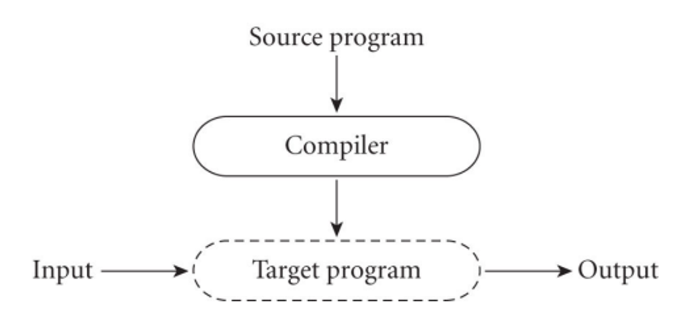

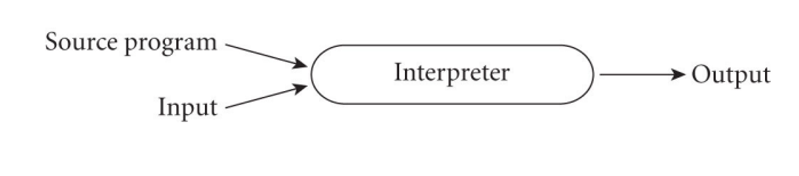

With interpreted languages on the other hand, we have an interpreter throughout the program’s runtime translating each instruction into bytecode as it goes along

With compilation, we get better performance since we don’t have the bloat of an interpreter, but interpretation gives us greater flexibility and better diagnostics

- For example, Prolog can write new pieces and execute them on the fly

These aren’t mutually exclusive, however; you can have a system where we compile and then interpret

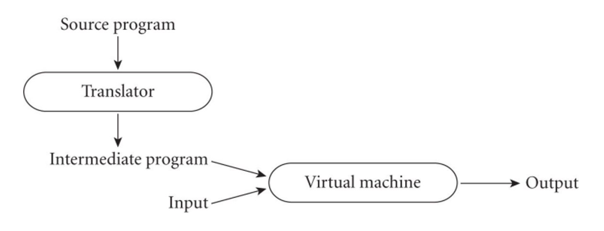

To put things more specifically, compilation is translation from one language into another, with full analysis of the meaning of the input

This entails semantic understanding of what is being processed, while pre-processing simply removes comments and white space while grouping characters into tokens, expanding abbreviations and maybe identifying loops or subroutines

- Preprocessors are more common for interpreted languages, but they also exist in C/C++

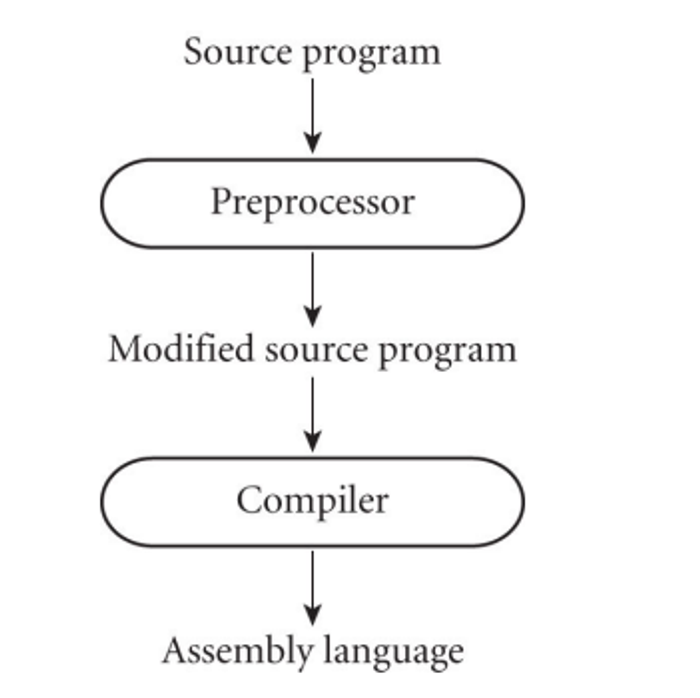

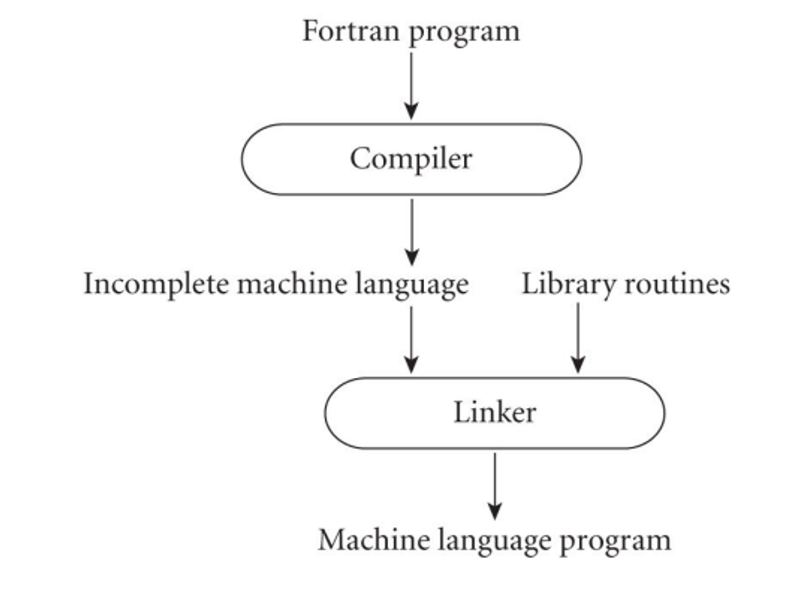

We can also use a linker to merge libraries of subroutines (ex. math functions like log) into the final program

We can also compile languages that are considered ‘interpreted’ since interpretation/compilation is actually a property of implementation

The compiler, in this case, will generate code that makes assumptions and runs very fast if the assumptions are valid

- If they aren’t valid, we can dynamically check with an interpreter

Another more modern way of approaching things is Just-In-Time (JIT) compilation, where we delay compilation until the last second

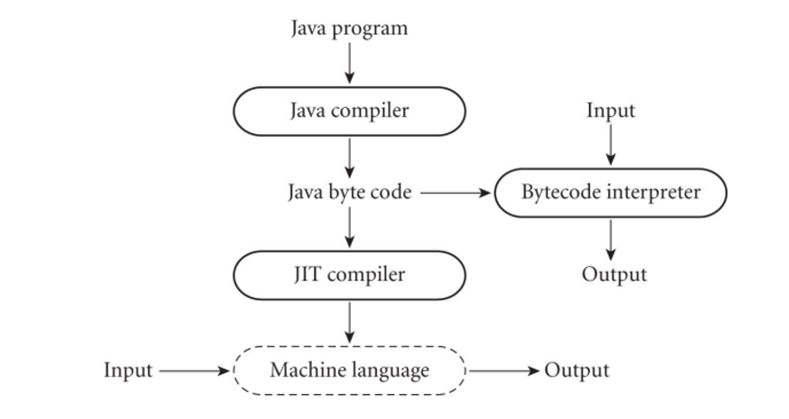

Some more unconventional compilers include text formatters that compile high-level document (Latex) and query language processors that translate into primitive operations on files (SQL)

- There’s also tools in IDEs that are separate from this, including debuggers, version management and profilers for performance analysis

**Compilation/Interpretation Phases**

Compilation is handled in several steps

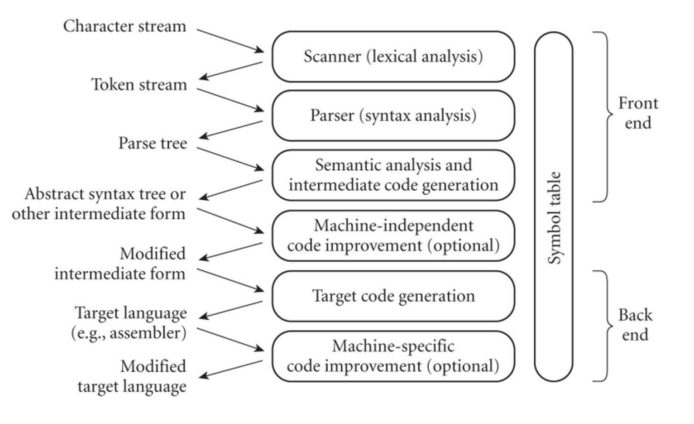

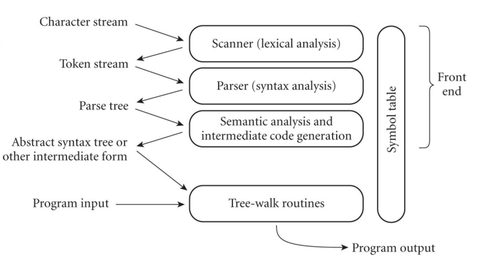

For interpretation, things are cut short a little bit

In the scanner, we divide the program into token, which are the smallest meaningful units, saving time since char-by-char is very slow

- This is done using a deterministic finite automata (DFA)


## Scanning

**C Program (computes GCD):**

```c
int main() {
    int i = getint(), j = getint();
    while (i != j) {
        if (i > j) i = i - j;
        else j = j - i;
    }
    putint(i);
}
```

**Input – sequence of characters:**
```
‘i’, ‘n’, ‘t’, ‘ ’, ‘m’, ‘a’, ‘i’, ‘n’, ‘(’, ‘)’ ...
```

**Output – tokens:**
```
int, main, (, ), {, int, i, =, getint, (, ), ,, j, =, getint, (, ), ;, while, (, i, !=, j, ), {, if, (, i, >, j, ), i, =, i, -, j, ;, else, j, =, j, -, i, ;, }, putint, (, i, ), ;, }
```


On parsing, we check the syntax of the program to make sure the grammar is being adhered to, which is done via a pushdown automata (PDA)

This parsing organizes tokens into a parse tree as defined by a context free grammar (CFG)

## Parsing

**Example – while loop in C**

**Context-free grammar (part of):**

iteration-statement → while ( expression ) statement

statement → { block-item-list-opt }

block-item-list-opt → block-item-list \| ε

block-item-list → block-item
block-item-list → block-item-list block-item

block-item → declaration
block-item → statement

**Parse tree for GCD program**
- based on full context-free grammar

From here, our previous GCD example can be split up into a parse tree

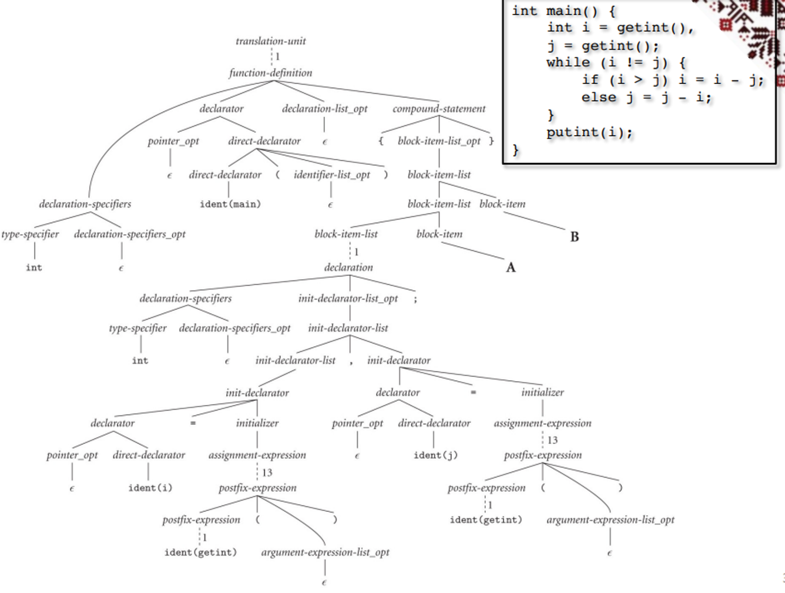

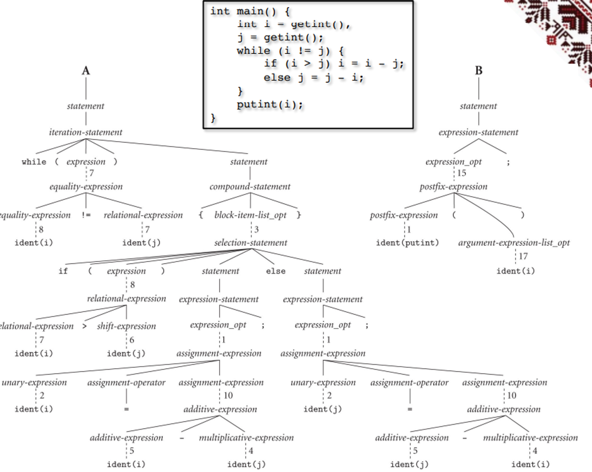

- You can go through the leaves left-first to read out the entire program

With semantic analysis, we discover the meaning in the program, detecting multiple occurrences of the same identifier and tracking the types of identifiers and expressions

From here, we can build and maintain a symbol table mapping each identifier to its information (type, scope, structure, etc.)

The compiler can only handle static semantic analysis, since dynamic semantics must be checked at run time

- These dynamic checks are pretty slow, so we need to make a trade off between safety and speed (this is what makes C so fast; dynamic checks are few and far in between)

This semantic analysis produces a syntax tree, removing some of the more “useless” internal nodes that are present in the parse tree and annotates the remaining nodes with attributes

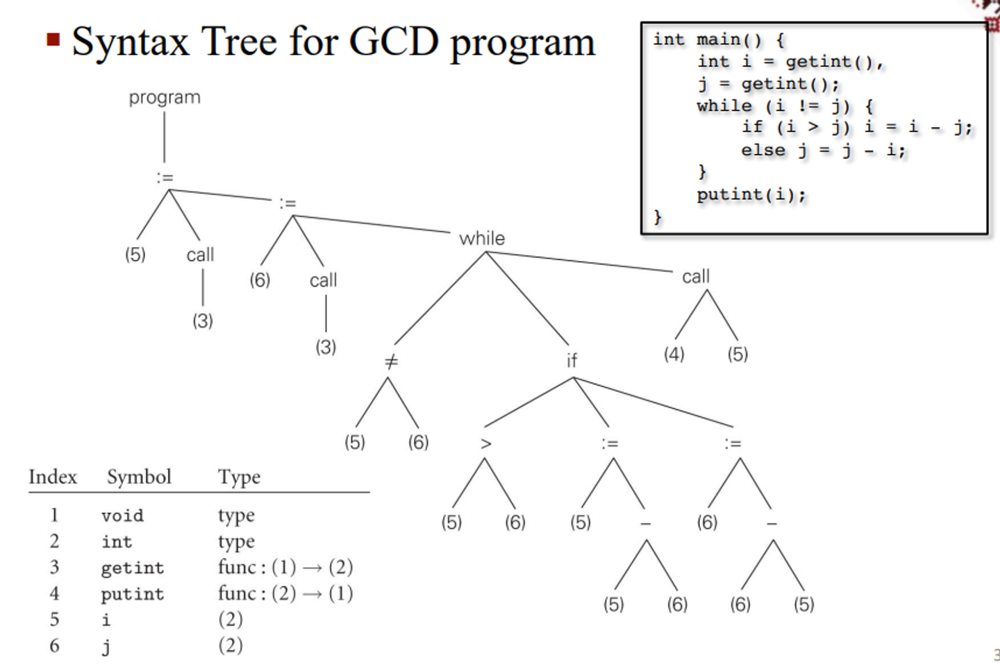

Finally, we have code generation which uses interpreters to run the syntax tree and target code generation which then produces assembly


**Assembly Code for GCD Program**

```assembly
pushl   %ebp                # \
movl    %esp, %ebp          # ) reserve space for local variables
subl    $16, %esp           # /
call    getint              # read
movl    %eax, -8(%ebp)      # store i
call    getint              # read
movl    %eax, -12(%ebp)     # store j

A: 
movl    -8(%ebp), %edi      # load i
movl    -12(%ebp), %ebx     # load j
cmpl    %ebx, %edi          # compare
je      D                   # jump if i == j

movl    -8(%ebp), %edi      # load i
movl    -12(%ebp), %ebx     # load j
cmpl    %ebx, %edi          # compare
jle     B                   # jump if i < j

movl    -8(%ebp), %edi      # load i
movl    -12(%ebp), %ebx     # load j
subl    %ebx, %edi          # i = i - j
movl    %edi, -8(%ebp)      # store i
jmp     C

B: 
movl    -12(%ebp), %edi     # load j
movl    -8(%ebp), %ebx      # load i
subl    %ebx, %edi          # j = j - i
movl    %edi, -12(%ebp)     # store j

C: 
jmp     A

D: 
movl    -8(%ebp), %ebx      # load i
push    %ebx                # push i (pass to putint)
call    putint              # write
addl    $4, %esp            # pop i
leave                       # deallocate space for local variables
mov     $0, %eax            # exit status for program
ret                         # return to operating system
```

**Corresponding C Program:**

```c
int main() {
    int i = getint(), j = getint();
    while (i != j) {
        if (i > j) i = i - j;
        else j = j - i;
    }
    putint(i);
}
```


This is a bit of a naive solution that can definitely be approved upon, so our final step is to find these optimizations to either do things faster or take less space

**Assembly Code Example**

```assembly
pushl   %ebp
movl    %esp, %ebp
pushl   %ebx
subl    $4, %esp
andl    $-16, %esp
call    getint
movl    %eax, %ebx
call    getint
cmpl    %eax, %ebx
je      C

A: 
cmpl    %eax, %ebx
jle     D
subl    %eax, %ebx

B: 
cmpl    %eax, %ebx
jne     A

C: 
movl    %ebx, (%esp)
call    putint
movl    -4(%ebp), %ebx
leave
ret

D: 
subl    %ebx, %eax
jmp     B
```