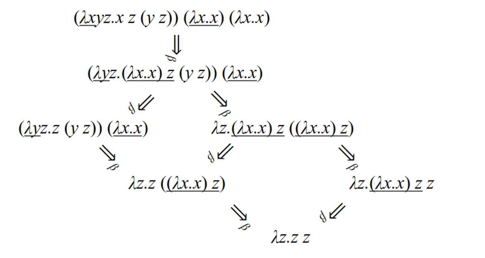

# Lambda Calculus

Lambda calculus is a system of logic to study computations with functions, where everything is a function

More specifically, it’s a system for representing functions abstractly, where $\lambda M.N$ is a function with parameters $M$ and body $N$

- Ex. $(\lambda x . x \ast x)$ maps $x$ to $x \ast x$
    - $(\lambda x . x \ast x) 4$ is the same but applied to 4


## Syntactic rules

- application is left-associative
  - $ x \, y \, z $ means $ (x \, y) \, z $

- application has higher precedence than abstraction
  - $ \lambda x . A \, B $ means $ \lambda x . (A \, B) $ (not $ (\lambda x . A) \, B $)

- consecutive abstractions:
  - $ \lambda x_1 x_2 \ldots x_n . e $ means $ \lambda x_1 . (\lambda x_2 . (\ldots (\lambda x_n . e) \ldots )) $

**Example:**

$ \lambda x y z . x \, z \, (y \, z) = (\lambda x . (\lambda y . (\lambda z . (x \, z) \, (y \, z)))) $


We can bind a variable to a value with $\lambda x.M$, which binds $x$ to $\lambda x.M$

- If $x$ is not bound, it’s free in $M$

We can use free(M) to fetch the set of free variables in $M$

- $free(x)=\{x\}$
- $free(MN)=free(M)\cup free(N)$
- $free(\lambda x.M)=free(M)-\{x\}$
- $bound(M)=\sim{free(M)}$

## Substitution

In order to compute with pure $\lambda$  terms, we can reduce the terms as simply as possible, prioritizing the right-hand side

We do this in a general form like so: $(\lambda x.M)N =_{\beta}\{N/x\}M$ or, put simply, subtitute N for x in M

For example, we can do the following

$$
(\lambda xy.x)uv =_{\beta} (\lambda y.u)v =_{\beta}u
$$

In order to do this accurately, we need to make sure that $\{N/x\}M$ does not bind any variables that were previously free, so we must make sure that $free(N) \cap bound(M)=\emptyset$

**Example**

- $ x $ is free
- $ y, z $ are bound

$ \lambda y . \lambda z . x \, z \, (y \, z) $


- If this doesn’t hold, we can simply rename with fresh variables until this is true

For example, let’s say we have the following expression

$$
(\lambda xy.xy)y
$$

We can expand this out like so

$$
(\lambda x.\lambda y.xy)y
$$

Now, if $y$ is local then we can simplify, but $y$  could be bound, so we must substitute

$$
(\lambda x.\lambda z.xz)y
$$

Now we can evaluate

$$
=_{\beta}\lambda z.yz
$$

Substitution comes with some more rules as well

### Substitution rules

- **In variables**: the same or different variable
  - $\{N/x\}x = N$
  - $\{N/x\}y = y, y \neq x$

- **In applications** – the substitution distributes
  - $\{N/x\}(P \, Q) = \{N/x\}P \, \{N/x\}Q$

- **In abstractions** – several cases
  - no free $ x $:
    - $\{N/x\}(\lambda x . P) = \lambda x . P$
  - no interaction – $ y $ is not free in $ N $:
    - $\{N/x\}(\lambda y . P) = \lambda y . \{N/x\}P$, $ y \neq x $, $ y \notin free(N) $
  - renaming – $ y $ is free in $ N $; $ y $ is renamed to $ z $ in $ P $:
    - $\{N/x\}(\lambda y . P) = \lambda z . \{N/x\}\{z/y\}P$,
    $ y \neq x $, $ y \in free(N) $, $ z \notin free(N) \cup free(P) $


You may have noticed a little subscript on our equals signs; this signifies beta-reduction, which applies an abstraction to an argument

There’s also alpha-conversions, which renames formal parameters

- **α-conversion** – renaming the formal parameters
  - $\lambda x . M \Rightarrow_{\alpha} \lambda y . \{y/x\}M, y \notin free(M)$

- **β-reduction** – applying an abstraction to an argument
  - $(\lambda x . M) N \Rightarrow_{\beta} \{N/x\} M$

We can combine these to reduce more complex statements

**Example**

$$
(\lambda x y z . x \, z \, (y \, z)) \, (\lambda x . x) \, (\lambda x . x)
\Rightarrow_{\alpha} (\lambda x y z . x \, z \, (y \, z)) \, (\lambda u . u) \, (\lambda x . x)
\Rightarrow_{\alpha} (\lambda x y z . x \, z \, (y \, z)) \, (\lambda u . u) \, (\lambda v . v)
\Rightarrow_{\beta} (\lambda y z . (\lambda u . u) \, z \, (y \, z)) \, (\lambda v . v)
\Rightarrow_{\beta} (\lambda y z . z \, (y \, z)) \, (\lambda v . v)
\Rightarrow_{\beta} \lambda z . ((\lambda v . v) \, z)
\Rightarrow_{\beta} \lambda z . z
$$


Another example:

**Example**

$$
(\lambda f g h . f \, g \, (h \, h)) \, (\lambda x y . x) \, h \, (\lambda x . x \, x)
\Rightarrow_{\beta} (\lambda g h . (\lambda x y . x) \, g \, (h \, h)) \, h \, (\lambda x . x \, x)
\Rightarrow_{\alpha} (\lambda g k . (\lambda x y . x) \, g \, (k \, k)) \, h \, (\lambda x . x \, x)
\Rightarrow_{\beta} (\lambda k . (\lambda x y . x) \, h \, (k \, k)) \, (\lambda x . x \, x)
\Rightarrow_{\beta} (\lambda x y . x) \, h \, ((\lambda x . x \, x) \, (\lambda x . x \, x))
\Rightarrow_{\beta} (\lambda y . h) \, ((\lambda x . x \, x) \, (\lambda x . x \, x))
\Rightarrow_{\beta} h
$$


Now, of course, there’s many ways to go about this (in line 2, we could’ve applied $\lambda xy.x$ to $g$, but it’s usually best to go from the outside in)

- Both methods work, however

## Normal Form

Once we get to a form that can’t be beta-reduced, we call this normal form, like $\lambda x.x.x$

There’s many ways to get to this form, but if it exists, you will find it eventually



Note that some reductions go into an infinite loop and thus can’t be reduced

$$
(\lambda x.x.x)(\lambda x.x.x) \Rightarrow_{\beta}(\lambda x.x.x)(\lambda x.x.x)
$$

The question becomes this: is there only one normal form? Yes!

The theorem goes that for all pure $\lambda$-terms $M,P,Q$, if $M$ can be reduced to $P$ and can be reduced to $Q$, $P$ and $Q$ can both be reduced to $R$, so overall $M$ reduces to $R$

This essentially states that normal forms, when they exist, are unique, which makes functional programming possible in the first place

- Think about it: if we had multiple normal forms, the computer will have no idea which form to pick!

### Strategies

In order to reduce, we can either call by value (applicative order - parameters are evaluated then passed) or call by name (normal order - parameters are passed unevaluated)

Call-by-value: this might never reduce…

**Example**

$$
(\lambda y . h) ((\lambda x . x \, x) (\lambda x . x \, x))
\Rightarrow_{\beta} (\lambda y . h) ((\lambda x . x \, x) (\lambda x . x \, x))
\Rightarrow_{\beta} (\lambda y . h) ((\lambda x . x \, x) (\lambda x . x \, x))
\Rightarrow_{\beta} \ldots
$$

**Example**
Call-by-name: now we can reduce!

$$
(\lambda y . h) ((\lambda x . x \, x) (\lambda x . x \, x)) \Rightarrow_{\beta} h
$$


### In Application

Most programming languages will have boolean values true and false, but we can hack together a way to implement this

$$
T =\lambda x.\lambda y.x \\
F =\lambda x.\lambda y.y
$$

With this, we can form a way to pick a value from a pair

**Example**

$$
((T \, P) \, Q) \Rightarrow_{\beta} (((\lambda x . \lambda y . x) \, P) \, Q) \Rightarrow_{\beta} ((\lambda y . P) \, Q) \Rightarrow_{\beta} P
$$

$$
((F \, P) \, Q) \Rightarrow_{\beta} (((\lambda x . \lambda y . y) \, P) \, Q) \Rightarrow_{\beta} ((\lambda y . y) \, Q) \Rightarrow_{\beta} Q
$$

From here, we can create boolean functions which form our logic gates

## Boolean functions

- $ \text{not} \equiv \lambda x . ((x \, F) \, T) $
- $ \text{and} \equiv \lambda x . \lambda y . ((x \, y) \, F) $
- $ \text{or} \equiv \lambda x . \lambda y . ((x \, T) \, y) $

**Interpretation is consistent with predicate logic:**

$$
\text{not} \, T \Rightarrow_{\beta} (\lambda x . ((x \, F) \, T) \, T \Rightarrow_{\beta} ((T \, F) \, T) \Rightarrow_{\beta} F
$$

$$
\text{not} \, F \Rightarrow_{\beta} (\lambda x . ((x \, F) \, T) \, F \Rightarrow_{\beta} ((F \, F) \, T) \Rightarrow_{\beta} T
$$


Now we’re starting to form something special: a language that we can use to do practical calculations!


## Integers

0 ≡ λf.λc.c\\
1 ≡ λf.λc.(f c)\\
2 ≡ λf.λc.(f (f c))\\
3 ≡ λf.λc.(f (f (f c)))\\
...\\
N ≡ λf.λc.(f (f ... (f c))...)  // N times

**Interpretation:**

- $ c $ is the zero element
- $ f $ is the successor function


Here, we use the successor model to build integers off of each other, so 1 is the successor of 0, 2 is the successor of 1, etc.

We can also perform computations like so

**Integers (cont’d), Example calculations:**

$$
(N \, a) = (\lambda f . \lambda c . (f \, (f \, ... (f \, c))...)) \, a \Rightarrow_{\beta} \lambda c . (a \, ... (a \, c)...) \quad \text{(N times)}
$$

$$
((N \, a) \, b) = (a \, (a \, ...(a \, b)...)) \quad \text{(N times)}
$$

### Integer operations

**Addition:**

$ + \equiv \lambda M . \lambda N . \lambda a . \lambda b . ((M \, a) ((N \, a) \, b)) $

$$
[M + N] = \lambda a . \lambda b . ((M \, a) ((N \, a) \, b)) \Rightarrow_{\beta}^* \lambda a . \lambda b . (a \, (a \, ...(a \, b)...) \quad \text{(M + N times)}
$$

**Multiplication:** 

$ \times \equiv \lambda M . \lambda N . \lambda a . (M \, (N \, a)) $

$$
[M \times N] = \lambda a . (M \, (N \, a)) \Rightarrow_{\beta}^* \lambda a . \lambda b . (a \, (a \, ...(a \, b)...) \quad \text{(M \times N times)}
$$

**Exponentiation:** 

$ \wedge \equiv \lambda M . \lambda N . (N \, M) $

$$
[M^N] = (N \, M) \Rightarrow_{\beta}^* \lambda a . \lambda b . (a \, (a \, ...(a \, b)...) \quad \text{(M^N times)}
$$


## Control flow

**if ≡ λc.λt.λe.c t e**

- Interpretation: $ c $ = condition, $ t $ = then, $ e $ = else

**Example**:

**if T 3 4**

$$
(\lambda c . \lambda t . \lambda e . c \, t \, e) (\lambda x . \lambda y . x) \, 3 \, 4
\Rightarrow_{\beta}^* (\lambda t . \lambda e . t) \, 3 \, 4
\Rightarrow_{\beta}^* 3
$$

**if F 3 4**

$$
(\lambda c . \lambda t . \lambda e . c \, t \, e) (\lambda x . \lambda y . y) \, 3 \, 4
\Rightarrow_{\beta}^* (\lambda t . \lambda e . e) \, 3 \, 4
\Rightarrow_{\beta}^* 4
$$


We can also model recursion, but this is where things get complicated

You see, in order to do recursion the naive way, we would have a recursive function on both the left hand side and right hand side, but substitution here, the definition just gets bigger for infinity

What we can do is just use beta-abstraction to abstract away the right hand side into its own function

## Recursion

- $ \text{gcd} = \lambda a . \lambda b . (\text{if} (\text{equal} \, a \, b) \, a \, (\text{if} (\text{greater} \, a \, b) (\text{gcd} (\text{minus} \, a \, b) \, b) (\text{gcd} (\text{minus} \, b \, a) \, a))) $

- This is not a definition because gcd appears in both sides
  - If we substitute this, the definition only gets bigger

- To obtain a real definition, we rewrite using $ \beta $-abstraction:
  - $ \text{gcd} = (\lambda g . \lambda a . \lambda b . (\text{if} (\text{equal} \, a \, b) \, a \, (\text{if} (\text{greater} \, a \, b) (g (\text{minus} \, a \, b) \, b) (g (\text{minus} \, b \, a) \, a)))) \text{gcd} $

- We obtain the equation:
  - $ \text{gcd} = f \, \text{gcd}, \text{ where} $
    - $ f = \lambda g . \lambda a . \lambda b . (\text{if} (\text{equal} \, a \, b) \, a \, (\text{if} (\text{greater} \, a \, b) (g (\text{minus} \, a \, b) \, b) (g (\text{minus} \, b \, a) \, a))) $

- gcd is a fixed point of $ f $


This is what we call the fixed point combinator, or Y-combinator, where if $Yf$ reduces to normal form, then $f(Yf)$ reduces to the same normal form

This is essentially a general form of what we had earlier

Applied to gcd, it can be used to abstract further

- We get then a good definition for gcd:

$$ \text{gcd} \equiv Y f = (\lambda h . (\lambda x . h \, (x \, x)) (\lambda x . h \, (x \, x))) (\lambda g . \lambda a . \lambda b . (\text{if} (\text{equal} \, a \, b) \, a \, (\text{if} (\text{greater} \, a \, b) (g (\text{minus} \, a \, b) \, b) (g (\text{minus} \, b \, a) \, a))) $$


- There’s a sample calculation in the slides, but it’s pretty long so I won’t include it here

operations for lists:

## Structures

- select_first ≡ λx.λy.x
- select_second ≡ λx.λy.y
- cons ≡ λa.λd.λx.x a d
- car ≡ λl.l select_first
- cdr ≡ λl.l select_second
- null? ≡ λl.l (λx.λy.F)


Here, cons is a list, car is the head, cdr is the tail and null checks for an empty list
```
cdr (cons A B)
≡ (λl.l select_second) (cons A B)
⇒ᵦ (cons A B) select_second
≡ ((λa.λd.λx.x a d) A B) select_second
⇒ᵦ* (λx.x A B) select_second
⇒ᵦ select_second A B
≡ (λx.λy.y) A B
⇒ᵦ* B
```


While languages like C++ operate imperatively and can be quite complex, functional languages like Scheme and Haskell are rooted in lambda calculus. Understanding lambda calculus allows you to write code more intuitively in these languages.

Although these languages do have their limitations, they offer intriguing insights and could lead to more practical applications in the future.
The key is to think abstractly. Mastering this concept empowers you to tackle any problem.