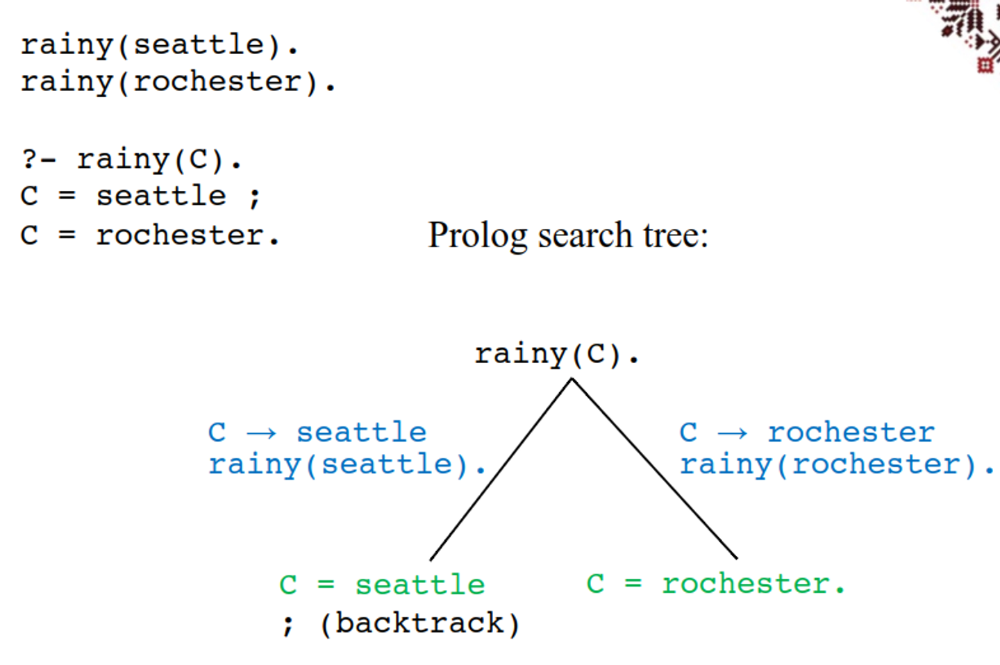
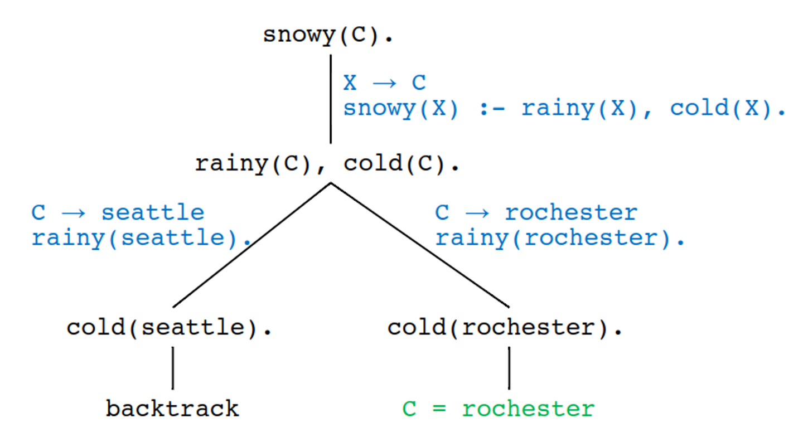

# Logic Programming


With logic programming, we take some axioms and compute deductions on them in order to prove some theorem

- **Axioms = Horn clauses**
  Q₁ ∧ Q₂ ∧ ... ∧ Qₖ → P
  or
  P ← Q₁ ∧ Q₂ ∧ ... ∧ Qₖ

- P is the head
- Q₁ ∧ Q₂ ∧ ... ∧ Qₖ is the body

- k ≥ 1: rule: if Q₁ and Q₂ and ... and Qₖ, then P
- k = 0: fact: P (also: if true, then P)

- The meaning is that if all Qᵢ's are true, then we can deduce P


## Prolog

Prolog is an imperative language running in the context of a database with some predefined clauses

These clauses are composed of terms

- **constants:**
  - **atoms:** id that starts with lower case: `foo`, `a`, `john`
  - **numbers:** 0, 2022

- **variables:** id that starts with upper case: `Foo`, `X`

- **structures:** functor (atom) and argument list (terms)
  - `student(john)`, `takes(X, cs3342)`
  - arguments can be constants, variables, (nested) structures

We can then recreate our logic stuff in this new language as such

term → atom | number | variable | struct\\
terms → term | term , terms\\
struct → atom ( terms )\\
fact → term .\\
rule → term :- terms .\\
query → ?- terms .

- **Rule:**
  P ← Q₁ ∧ Q₂ ∧ ... ∧ Qₖ
  - in Prolog:
    ```prolog
    P :- Q1, Q2, ..., Qk.
    ```

- **Fact (rule without right-hand side):**
  P (P ← true)
  - in Prolog:
    ```prolog
    P.
    ```

- **Query (rule without left-hand side)**
  Q₁ ∧ Q₂ ∧ ... ∧ Qₖ
  - in Prolog:
    ```prolog
    ?- Q1, Q2, ..., Qk.
    ```

- the negated query is also:
  ```prolog
  false ← Q₁ ∧ Q₂ ∧ ... ∧ Qₖ


These rules are implicitly universally quantified so you don’t need to add $\forall$ each time


- Example:
  ```prolog
  path(L, M) :- link(L, X), path(X, M).
  ```

  means:
  ```math
  ∀L,∀M,∀X (path(L, M) if (link(L, X) and path(X, M)))
  ```
  or
  ```math
  ∀L,∀M (path(L, M) if (∃X (link(L, X) and path(X, M))))
  ```

Queries are also implicitly existentially qualified

- Example:
  ```prolog
  ?- path(algol60, X), path(X, c).
  ```

  means
  ```math
  ∃X (path(algol60, X) and path(X, c))
  ```

To start a program, we can import some predefined clauses by setting a working directory and consulting a file

- Setting up working directory
  - Checking working directory:
    ```prolog
    ?- working_directory(X, X).
    X = (//).
    ```

  - Changing working directory:
    ```prolog
    ?- working_directory(_, '/Users/Lucian/Documents/4_myCourses/2021-2022/CS3342b_win2022/my_programs/Prolog').
    true.

    ?- working_directory(X, X).
    X = (_,'/Users/Lucian/Documents/4_myCourses/2021-2022/CS3342b_win2022/my_programs/Prolog').
    ```


- Facts and rules from a file:
  - reading the file `my_file.pl`
  - must be in the working directory
  ```prolog
  ?- consult(my_file).
  true.
  ```

From here, we can work with the file in the interpreter

- Example:
  ```prolog
  rainy(seattle).
  rainy(rochester).

  ?- rainy(C).
  C = seattle
  ```

  - Type ENTER if done
  - Type `;` if you want more solutions

  ```prolog
  C = seattle ;
  C = rochester.
  ```

- Example:
  ```prolog
  rainy(seattle).
  rainy(rochester).
  cold(rochester).
  snowy(X) :- rainy(X), cold(X).

  ?- snowy(C).
  C = rochester.
  ```


only one solution
### Lists

Much like Scheme, Prolog has its own way of implementing lists through a head and a tail

Here is the entire content in one markdown code block:


- `[a, b, c]` – list
- `[]` – empty list
- can use a `cons`-like predicate:
  ```prolog
  '[|]'(a, '[|]'(b, '[|]'(c, [])))
  ```
  means `[a, b, c]`

- `Head | Tail` notation: `[H|T]`
- `[a, b, c]` can be written as:
  ```prolog
  [a | [b, c]]
  [a, b | [c]]
  [a, b, c | []]
  ```

```prolog
?- [H|T] = [a, b, c].
H = a,
T = [b, c].

?- [H|T] = [[], c | [[a], b, [], b]].
H = [],
T = [c, [a], b, [], b].

?- [H|[X|T]] = [[], c | [[a], b, [], b]].
H = [],
X = c,
T = [[a], b, [], b].

?- [H1, H2|[X|T]] = [[], c | [[a], b, [], b]].
H1 = [],
H2 = c,
X = [a],
T = [b, [], b].
```

Doing things with the list is also pretty simple


```prolog
member(X, [X|_]).
member(X, [_|T]) :- member(X, T).
```

- `_` is a placeholder for a variable not needed anywhere else

- Adding an element to a list:
  ```prolog
  add(X, L, [X|L]).
  ?- add(a, [b,c], L).
  L = [a, b, c].
  ```

- Deleting an element from a list:
  ```prolog
  del(X, [X|T], T).
  del(X, [Y|T], [Y|T1]) :- del(X, T, T1).

  ?- del(a, [a, b, c, a, b, a, d, a], X).
  X = [b, c, a, b, a, d, a] ;
  X = [a, b, c, b, a, d, a] ;
  X = [a, b, c, a, b, d, a] ;
  X = [a, b, c, a, b, a, d] ;
  false.
  ```


- Appending two lists:
  ```prolog
  append([], Y, Y).
  append([H|X], Y, [H|Z]) :- append(X, Y, Z).
  ```

- Sublists:
  ```prolog
  sublist(S, L) :- append(_, L1, L), append(S, _, L1).
  ```

  As you may notice, we don’t really have a clear notion of input and output

  ```prolog
  ?- append([a, b, c], [d, e], L).
  L = [a, b, c, d, e].

  ?- append(X, [d, e], [a, b, c, d, e]).
  X = [a, b, c].

  ?- append([a, b, c], Y, [a, b, c, d, e]).
  Y = [d, e].
  ```


- Subset
  ```prolog
  subset([], S).
  subset([H|T], S) :- member(H, S), subset(T, S).
  ```

- Reversing a list
  ```prolog
  reverse([], []).
  reverse([H|T], R) :- reverse(T, R1), append(R1, [H], R).
  ```

- Permutations
  ```prolog
  permute([], []).
  permute([H|T], P) :- permute(T, P1), insert(H, P1, P).
  ```

### Unification

One concept that we should understand is unification

```prolog
path(L, L).
path(L, M) :- link(L, X), path(X, M).

?- path(fortran, cplusplus).
```

- *Unification* is a type of pattern matching:
  - `L` unifies with `fortran`
  - `M` unifies with `cplusplus`

This essentially defines our variables


- Unification rules:
  - a constant unifies with itself
  - two structures unify if and only if:
    - have the same functor
    - have the same arity
    - corresponding arguments unify recursively
  - a variable unifies with anything
    - if the other thing has a value, then the variable is instantiated
    - if the other thing is an uninstantiated variable, then the two variables are associated so that if either is given a value later, that value will be shared by both

From here, we can define equality

- Equality (`=`) is unifiability:
  - The goal `=(A, B)` succeeds iff `A` and `B` can be unified
  - `A = B` – syntactic sugar

- Example:
  ```prolog
  ?- a = a.
  true.

  ?- a = b.
  false.

  ?- foo(a,b) = foo(a,b).
  true.
  ```


### Arithmetic

We have our own ways of doing arithmetic as well

- arithmetic operators – predicates
  - `+(2,3)` - syntactic sugar `2+3`
  - `+(2,3)` is a two-argument structure; does not unify with 5
    ```prolog
    ?- 1+1 = 2.
    false.
    ```
  - `is`: predicate that unifies first arg. with value of second arg.
    ```prolog
    ?- is(X, 1+1).
    X = 2.

    ?- X is 1+1.
    X = 2.
    ```

### Substitution

- Substitution:
  - a function from variables to terms
  - Example: σ = {X → [a,b], Y → [a,b,c]}

  - Tσ – the result of applying the substitution σ to the term T
    - Xσ = U if X → U is in σ, X otherwise
    - (f(T₁, T₂,…,Tₙ))σ = f(T₁σ, T₂σ,…,Tₙσ)

- Example:
  - σ = {X → [a,b], Y → [a,b,c]}
  - Yσ = [a,b,c]
  - Zσ = Z
  - append([], Y, Y)σ = append([], [a,b,c], [a,b,c])

- A term U is an instance of T if U=Tσ, for some substitution σ
- Two terms T₁ and T₂ unify if T₁σ and T₂σ are identical, for some σ; σ is called a unifier of T₁ and T₂
- σ is the most general unifier of T₁ and T₂ if, for any other unifier δ, T₁δ is an instance of T₁σ

- Example: L = [a,b\|X]

- Unifiers:
  - σ₁ = {L → [a,b\|X₁], X → X₁}
  - σ₂ = {L → [a,b,c\|X₂], X → [c\|X₂]}
  - σ₃ = {L → [a,b,c,d\|X₃], X → [c,d\|X₃]}
- σ₁ is the most general unifier


### Control Order

Prolog satisfies queries through some order, using goal order (leftmost subgoal) followed by rule order (first applicable rule)

```
start with a query as the current goal
while (the current goal is nonempty) do
  choose the leftmost subgoal
  if (a rule applies to this subgoal) then
    select the first applicable rule not already used
    form a new current goal
  else
    if (at the root) then
      false
    else
      backtrack
true
```

With this, we can create a search tree to investigate what our program is doing



```prolog
rainy(seattle).
rainy(rochester).
cold(rochester).
snowy(X) :- rainy(X), cold(X).

?- snowy(C).
C = rochester.
```



We can also add some details to our control algorithm

```
start with a query as the current goal: G₁, G₂, ..., Gₖ (k ≥ 0)
while (k > 0) do     // the current goal is nonempty
  choose the leftmost subgoal G₁
  if (a rule applies to G₁) then
    select first applicable rule (not tried): A :- B₁,..., Bⱼ (j ≥ 0)
    let σ be the most general unifier of G₁ and A
    the current goal becomes: B₁σ,..., Bⱼσ, G₂σ, ..., Gₖσ
  else
    if (at the root) then
      false   // tried all possibilities
    else
      backtrack   // try something else
true   // all goals have been satisfied
```

```prolog
append([], Y, Y).
append([H|X], Y, [H|Z]) :- append(X, Y, Z).

prefix(P, L) :- append(P, _, L).
suffix(S, L) :- append(_, S, L).

?- suffix([a], L), prefix(L, [a, b, c]).
L = [a]   // that's the obvious solution

L = [a];   // if we ask for more solutions
           // we get an infinite computation
           // eventually aborting (out of stack)
```


```prolog
?- suffix([a], L), prefix(L, [a, b, c]).
L = [a];   // infinite computation
```

- why the infinite computation?
- consider the first subgoal only:
  ```prolog
  ?- suffix([a], L).
  L = [a];
  L = [_944, a];
  L = [_944, _956, a];
  L = [_944, _956, _968, a]; ...
  ```
- infinitely many solutions, none (but the first) satisfying the second subgoal
- control checks an infinite subtree with no solutions

  ```prolog
  append([], Y, Y).
  append([H|X], Y, [H|Z]) :- append(X, Y, Z).

  prefix(P, L) :- append(P, _, L).
  suffix(S, L) :- append(_, S, L).

  ?- suffix([b], L), prefix(L, [a, b, c]).
  L = [a, b]   // that's the obvious solution

  L = [a, b];   // if we ask for more solutions
                // again, infinite computation
  ```

### Goal Order

If we change the goal order around, we can avoid these infinite computation situations

- Changing the order of subgoals can change solutions:
  ```prolog
  ?- suffix([a], L), prefix(L, [a, b, c]).
  L = [a];   // infinite computation
  ```

- if we change the goal order, then no infinite computation:
  ```prolog
  ?- prefix(L, [a, b, c]), suffix([a], L).
  L = [a];
  false.
  ```

- The explanation is that the first subgoal now has finitely many solutions:
  ```prolog
  ?- prefix(L, [a, b, c]).
  L = [];
  L = [a];
  L = [a, b];
  L = [a, b, c];
  false.
  ```


### Rule Order

Rule order can also change solutions

- Changing the order of rules can change solutions:

  ```prolog
  append([], Y, Y).
  append([H|X], Y, [H|Z]) :- append(X, Y, Z).

  ?- append(X, [c], Z).
  X = [],
  Z = [c];
  X = [_576],
  Z = [_576, c];
  X = [_576, _588],
  Z = [_576, _588, c];
  X = [_576, _588, _600],
  Z = [_576, _588, _600, c]; ...
  ```

  ```prolog
  append([H|X], Y, [H|Z]) :- append(X, Y, Z).
  append([], Y, Y).

  ?- append(X, [c], Z).
  // infinite computation
  ```

### Cuts

If we want to improve efficiency through banning bcaktracking, we can use a cut, which is a zero-argument predicate


- General form of a cut:
  ```prolog
  P :- Q₁, Q₂,..., Qⱼ-₁, !, Qⱼ+₁,...,Qₖ.
  ```

- Meaning: the control backtracks past
  Qⱼ-₁, Qⱼ-₂,..., Q₁, P
  without considering any remaining rules for them

  ```prolog
  member(X, [X|_]).
  member(X, [_|T]) :- member(X, T).
  prime_candidate(X) :- member(X,Candidates),prime(X).
  ```

  - assume `prime(a)` is expensive to compute
  - if `a` is a member of `Candidates` many times, this is slow
  - solution:
    ```prolog
    member1(X, [X|_]) :- !.
    member1(X, [_|T]) :- member1(X, T).
    ```


```prolog
?- member(a, [a,b,c,a,d,a]).
true;
true;
true;
false.

?- member1(a, [a,b,c,a,d,a]).
true.
```

We can also use this as a form of negation

- `not` – negation
- Definition:
  ```prolog
  not(X) :- X, !, fail.
  not(_).
  ```

  - `fail` always fails
  - the first rule attempts to satisfy `X`
  - if `X` succeeds, then `!` succeeds as well, then `fail` fails and `!` will prevent backtracking
  - if `X` fails, then `not(X)` fails and, because the cut has not been reached, `not(_)` is tried and immediately succeeds


```prolog
?- X=2, not(X=1).
X = 2.

?- not(X=1), X=2.
false.
```