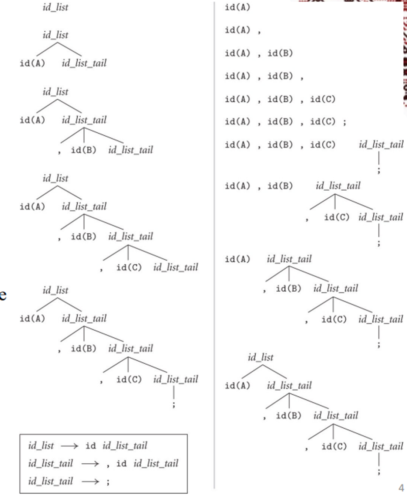
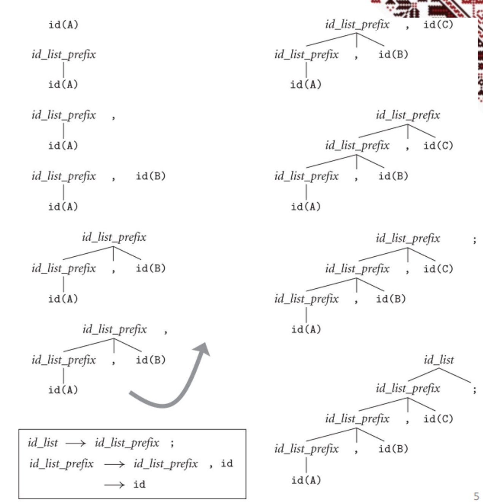
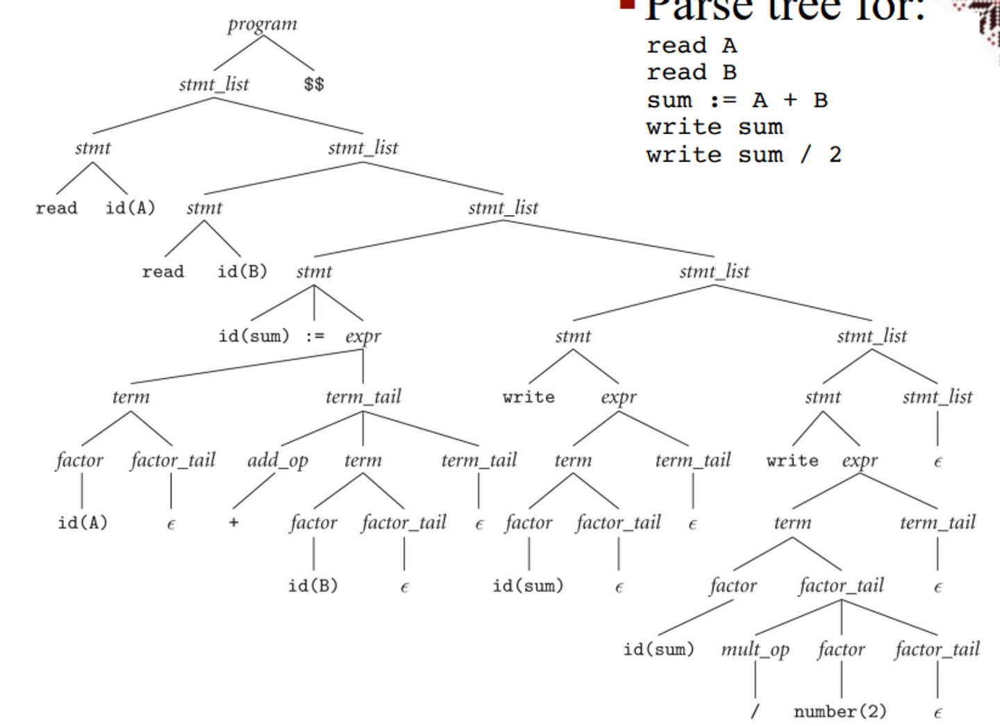
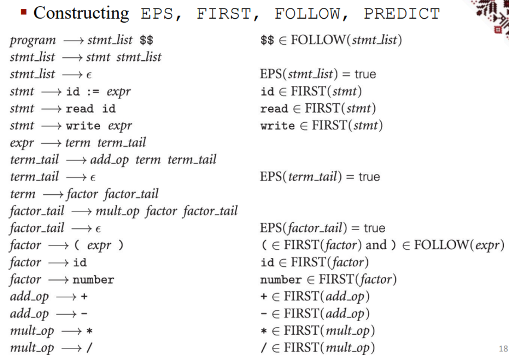
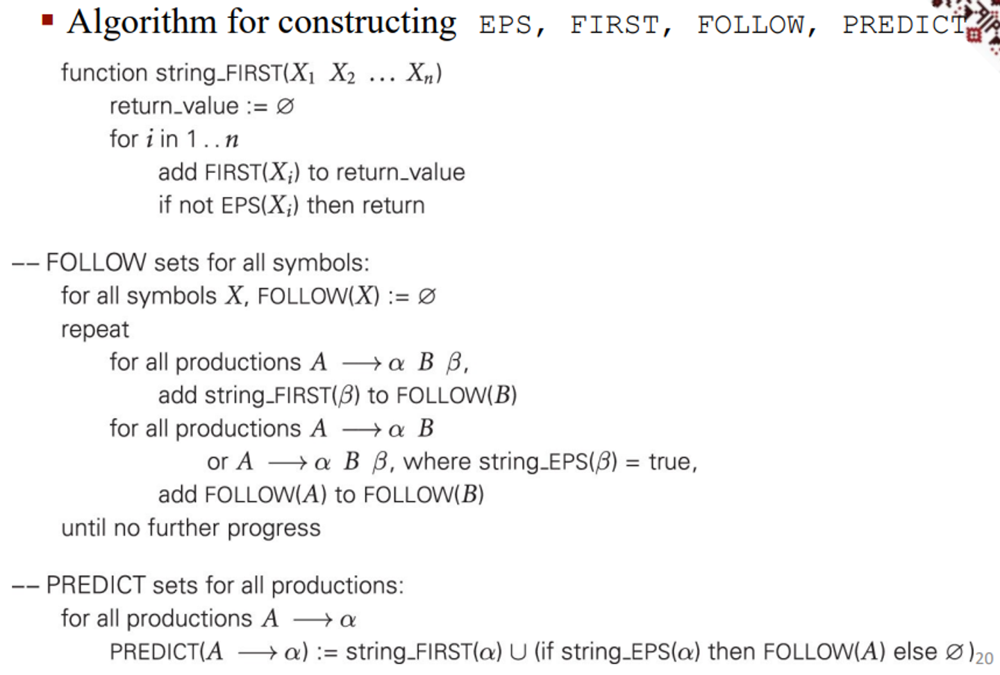
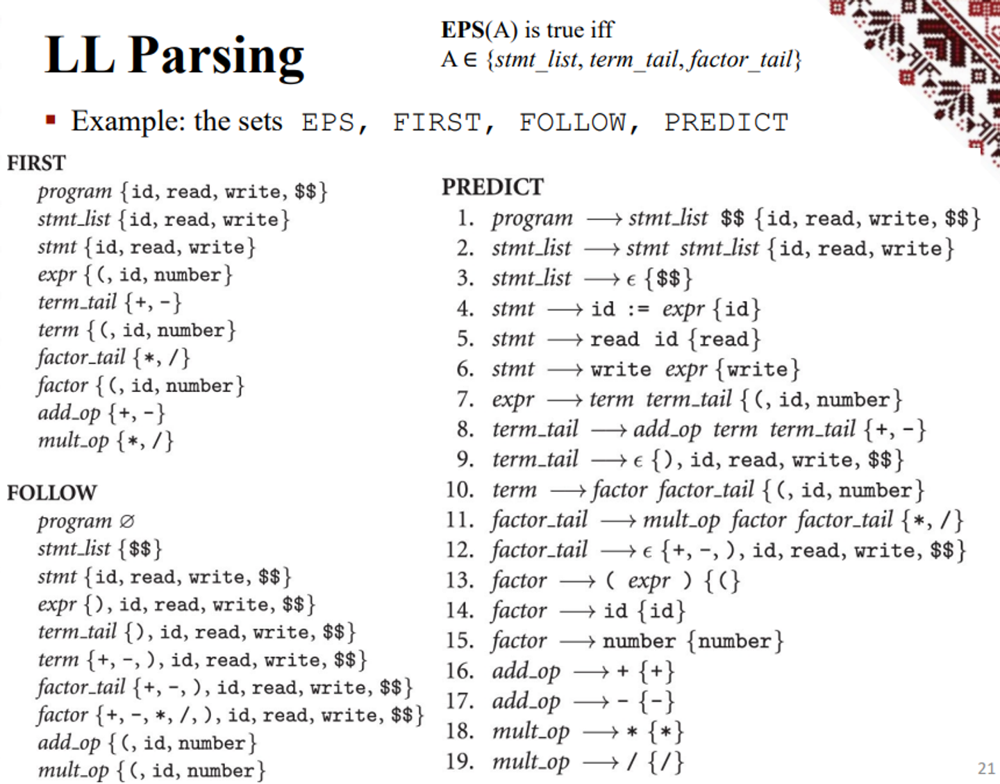

# Parsing

The entire compilation process is encapsulated in the parser, so it’s very important to know how they work

Once the scanner grabs the token, it assembles them into a syntax tree and passes the tree through the parser, which is a language identifier

- A CFG, by contrast, is a language generator

As you may have learned from 3331, we can use the CYK algorithm to recognize languages, but this is a disastrously slow $O(n^3)$, but we can use $O(n)$ algorithms LL (left to right, leftmost derivation) and LR (left to right, rightmost derivation) to make the process faster

| Class | Direction of scanning | Derivation discovered | Parse tree construction | Algorithm used |
|-------|------------------------|-----------------------|-------------------------|----------------|
| **LL** | left-to-right          | left-most             | top-down                | predictive     |
| **LR** | left-to-right          | right-most            | bottom-up               | shift-reduce   |


In a top-down construction, we make predictions based on the next token, but in a bottom-up construction, we reduce the right-hand side



Left is top-down, right is bottom-up, both are using A, B, C;

With the bottom-up approach, we can get better grammars which can’t be parsed top down

Taking the same line, we can use bottom-up processing to get a parse tree like so



No matter which approach we use, we need to account for look-ahead, the number of characters we look ahead being defined by k

The higher the k, the more powerful the compiler gets, but the more complicated it gets

- Because of this, almost all real compilers use LL(1) or LR(1)
- We can use LR(0) to define the prefix property, which states that no valid string is a prefix of another valid string

Taking an example from last week, we can see that the choice between LL and LR is largely dependent on what we’re trying to do

## LL(1) Grammar for Calculator Language

- Less intuitive: operands not on the same right-hand side
- Parsing is easier ($$ added to mark the end of the program)

```
program → stmt_list $$
stmt_list → stmt stmt_list | ε
stmt → id := expr | read id | write expr
expr → term term_tail
term_tail → add_op term term_tail | ε
term → factor fact_tail
fact_tail → mult_op fact fact_tail | ε
factor → ( expr ) | id | number
add_op → + | -
mult_op → * | /
```

### Compare with LR Grammar:
```
expr → term | expr add_op term
term → factor | term mult_op factor
factor → id | number | -factor | (expr)
add_op → + | -
mult_op → * | /
```

## Top-down Parsers

- By hand – recursive descent
- Table-driven

## LL-Parsing

An approach we can take with LL-parsing is a recursive descent parser, where we have one subroutine for each nonterminal

**Recursive Descent Parser**

- One subroutine for each nonterminal

**Example**
```
read A
read B
sum := A + B
write sum
write sum / 2
```
```
procedure match(expected)
  if input_token = expected then
    consume_input_token()
  else
    parse_error

-- this is the start routine:
procedure program()
  case input_token of
    id, read, write, $$ :
      stmt_list()
      match($$)
    otherwise
      parse_error

procedure stmt_list()
  case input_token of
    id, read, write :
      stmt()
      stmt_list()
    $$ :
      skip  -- epsilon production
    otherwise
      parse_error
```
```
procedure stmt()
    case input_token of
        id : match(id); match(:=); expr()
        read : match(read); match(id)
        write : match(write); expr()
        otherwise parse_error

procedure expr()
    case input_token of
        id, number, ( : term(); term_tail()
        otherwise parse_error

procedure term_tail()
    case input_token of
        +, - : add_op(); term(); term_tail()
        ), id, read, write, $$ : skip -- epsilon production
        otherwise parse_error

procedure term()
    case input_token of
        id, number, ( : factor(); factor_tail()
        otherwise parse_error

procedure factor_tail()
    case input_token of
        *, / : mult_op(); factor(); factor_tail()
        +, -, ), id, read, write, $$ : skip -- epsilon production
        otherwise parse_error

procedure factor()
    case input_token of
        id : match(id)
        number : match(number)
        ( : match(()); expr(); match())
        otherwise parse_error

procedure add_op()
    case input_token of
        + : match(+)
        - : match(-)
        otherwise parse_error

procedure mult_op()
    case input_token of
        * : match(*)
        / : match(/)
        otherwise parse_error
```
When we read this out, we get the following parse tree



Another option is a table-driven approach, where we repeatedly look up actions in a 2D table based on the current leftmost non-terminal and the current input token

The actions we can take include

- Matching a terminal
- Predicting a production
- Announcing a syntax error

We run this with a pushdown automaton (PDA) with the stack containing the starting symbol 


To build the table itself, we must build up a few functions

### How to build the table:

- **FIRST(α)** – tokens that can start an α
- **FOLLOW(A)** – tokens that can come after an A

**Definitions:**

- **EPS(α)** ≡ if α ⇒* ε then true else false
- **FIRST(α)** ≡ { c \| α ⇒* cβ }
- **FOLLOW(A)** ≡ { c \| S ⇒* αAcβ }
- **PREDICT(A → α)** ≡ FIRST(α) ∪ if EPS(α) then FOLLOW(A) else ∅

**Notes:**

- If a token belongs to the predict set of more than one production with the same left-hand side, then the grammar is not LL(1).
- **Compute**: pass over the grammar until nothing changes.
- Algorithm and examples on the next slides.




Fortunately, we can calculate this with a simple algorithm




With our example grammar, it looks something like this



## Common Problems

When creating a grammar that’s LL(1), we sometimes run into problems

The first problem is left-recursion, where $A \Rightarrow^+ A\alpha$ for some nonterminal $A$, the problem being that we can’t even parse it top-down

- Other types of recursion are fine

The way we solve this is by left-recursion elimination


Example – cannot be parsed top-down
```
id_list → id_list_prefix ;
id_list_prefix → id_list_prefix , id
id_list_prefix → id
```


Solved by left-recursion elimination
```
id_list → id id_list_tail
id_list_tail → , id id_list_tail
```
There’s also the issue of common prefixes, but we must keep in mind that eliminating left-recursion and common prefixes doesn’t make it LL; there’s infinitely many languages that are not LL that can be automatically transformed without problems

## Common Prefixes

**Example**
```
stmt → id := expr
stmt → id ( argument_list )
```

Solved by left-factoring

```
stmt → id stmt_list_tail
stmt_list_tail → := expr
stmt_list_tail → ( argument_list )
```

A real problem that DOES inhibit being LL is the dangling else problem

```
stmt → if cond then_clause else_clause | other_stmt
then_clause → then stmt
else_clause → else stmt | ε

if C₁ then if C₂ then S₁ else S₂
```

The issue with this is that it’s ambiguous, something that we can’t have when parsing in general

There’s two ways of solving this: the first is to make this unambiguous, which gives a good bottom-up grammar but will be impossible to do top-down
```
stmt → balanced_stmt | unbalanced_stmt
balanced_stmt → if cond then balanced_stmt else balanced_stmt
               | other_stmt
unbalanced_stmt → if cond then stmt
                 | if cond then balanced_stmt else unbalanced_stmt
```

The other way to handle this is an end marker, which adds an explicit ending to a statement
```
stmt → IF cond then_clause else_clause END | other_stmt
then_clause → THEN stmt_list
else_clause → ELSE stmt_list | ε
```

The issue with this is that we can have a bunch of ends bunched up, but this is a relatively easy fix


Problem with end markers: they tend to bunch up

```
if A = B then …
else if A = C then …
else if A = D then …
else if A = E then …
else …
end end end end
```

To avoid this: elsif
```
if A = B then …
elsif A = C then …
elsif A = D then …
elsif A = E then …
else …
end
```

You could also force an else for every if statement, but that’s a pain for any programmer using your language