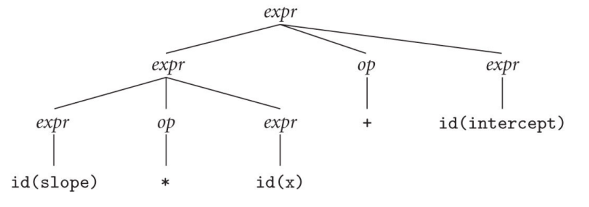
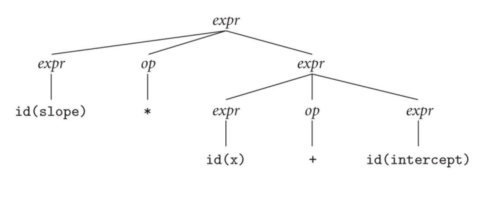
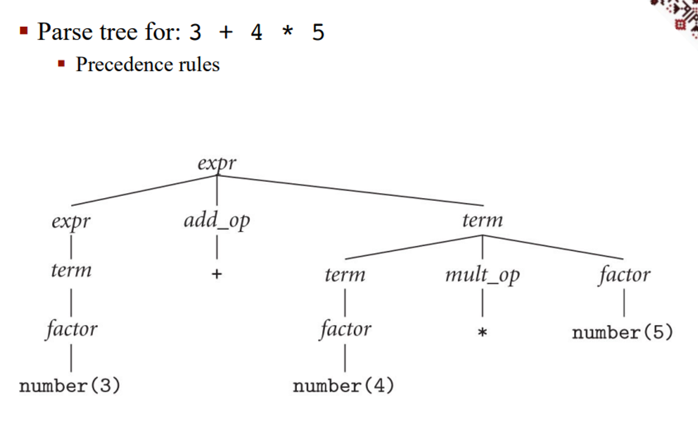
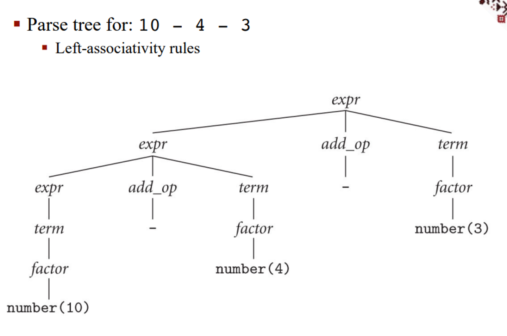
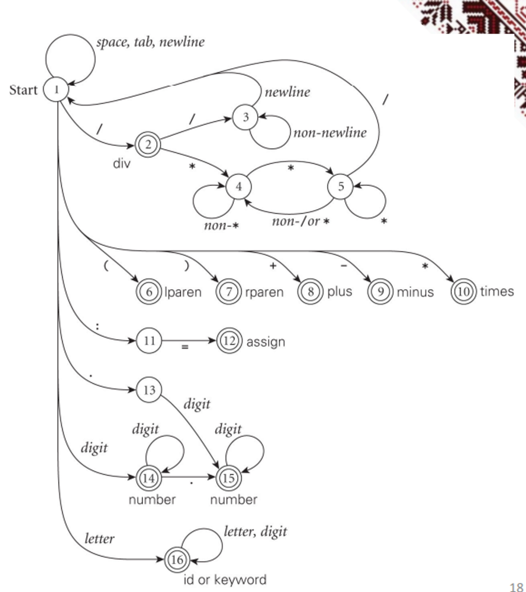
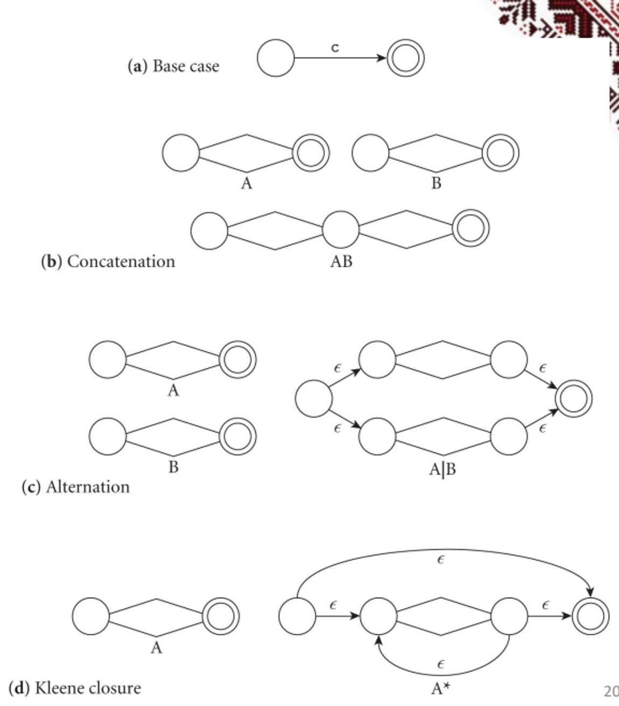
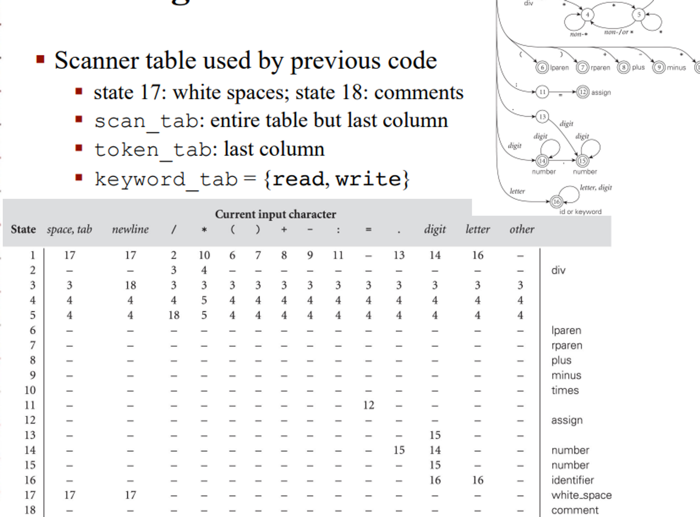

# Syntax

## Scanning

In order for code to run correctly, it must be both syntactically and semantically correct

Semantic correctness is hard to prove without running, but syntax is relatively easy and can be handled by the compiler

Checking syntax is split into two parts: scanning and parsing

In the scanning phase, we use regular expressions (regex) to define which tokens (shortest meaningful strings) are correct, while checking whatever tokens we come across with finite automata


- For 3342, some alternate notation is used for regex operations

- **$\varepsilon$** is a regular expression
- Any character **$a \in \Sigma$** is a regular expression
- For regular expressions **$\alpha$**, **$\beta$**, the following are regular expressions:
  - **$\alpha \beta$** - *concatenation* (concatenation symbol '·' is often omitted: **$\alpha \beta$**)
  - **$\alpha \mid \beta$** - *union* ('$\|$' = or) (sometimes denoted **$\alpha + \beta$**)
  - **$\alpha^\*$** - *Kleene star* (0 or more repetitions)
    - **$\alpha^+ = \alpha \alpha^*$** (1 or more repetitions)

For a more practical example, a regex for signed integers will look something like this

$$
(+|-|\epsilon)(0|1|2|3|4|5|6|7|8|9)^+
$$

We can also represent more complex expressions using variables and the “can be” symbol (denoted $\rightarrow)$

For example, we can define all numerical constants with the following system

$$
number \rightarrow integer |real \\
integer \rightarrow digit \space digit^* \\
real \rightarrow integer \space exponent |decimal(exponent|\epsilon) \\
decimal \rightarrow digit^*(.\space digit | digit \space .)digit^* \\
exponent \rightarrow (e|E)(+|-|\epsilon)integer \\
digit \rightarrow 0|1|2|3|4|5|6|7|8|9
$$

In practice, we can utilize regular languages in many programming languages and in Unix with the grep tool

- For a review of the grep tool, read the following (specifically the section on regex)


## Parsing

Once we’ve scanned all the tokens to make sure they’re correct, we can then specify the structure with parsing

Some of the main concerns with parsing are

- Upper vs lower case (treated differently in C and Python)
- Camel case (someIdentifier) vs underscore (some_identifier)
- Unicode (non-latin characters)
- White space (usually ignored, but it’s important for Python, Go and Swift)

We define what counts as syntactically correct with context-free grammars (CFGs)


As a practical example, we can define a CFG for arithmetic expressions

$$
expr \rightarrow \text{id}|\text{number}|-expr|(expr)|expr\space op \space expr \\
op \rightarrow +|-|*|/
$$

With this grammar, we can derive many expressions

For example, in order to derive something like slope * x + intercept, we can do the following

$$
expr \Rightarrow expr \space op \space expr \\
\Rightarrow expr \space op \space \text{id}\\
\Rightarrow expr \space + \space \text{id}\\
\Rightarrow expr \space op \space expr\space + \space \text{id}\\
\Rightarrow expr \space op \space \text{id}\space + \space \text{id}\\
\Rightarrow expr \space *\space \text{id}\space + \space \text{id}\\
\Rightarrow \text{id}\space *\space \text{id}\space + \space \text{id}
$$

- Note that we can’t derive the terms “slope”, “x” and “intercept”, so we simply derive “id”
- We call the steps in between **sentential form**

What is expressed above is a right-most derivation, where we handle right-most nonterminals first, but we can also use left-most derivation

$$
expr \Rightarrow expr \space op \space expr \\
\Rightarrow expr \space op \space expr \space op \space expr\\
\Rightarrow \text{id} \space op \space expr \space op \space expr\\
\Rightarrow \text{id} \space *\space expr \space op \space expr\\
\Rightarrow \text{id} \space *\space \text{id}\space op \space expr\\
\Rightarrow \text{id} \space *\space \text{id}\space +\space expr\\
\Rightarrow \text{id} \space *\space \text{id}\space +\space \text{id}
$$

The parse tree for this will be the following



And for the right-most derivation, we get this



Since we have two different parse trees for the same string, our grammar is considered ambiguous, which is a problem for parsers since computers generally don’t deal well with ambiguity

Optimally, we want unambiguous grammars to begin with so that we have one solution

For our original grammar, we can redefine it to make it unambiguous

$$
expr \rightarrow term|expr \space add\_op \space term \\
term \rightarrow factor |term \space mult\_op \space factor \\
factor \rightarrow \text{id}|\text{number}|-factor|(expr) \\
add\_op\rightarrow +|
- \\
mult\_op\rightarrow *|/
$$

This is good because it more accurately reflects the order in which we do math, with precedence for multiplication/division as well as left-associativity, meaning we break ties by handling the left side first

This makes sure that we don’t actually go right-left and screw up our math





## More on Scanning

In order to figure out how to do scanning, we should look at an example

- **assign** → `:=` (Algol style; C has `=`)
- **plus** → `+`
- **minus** → `-`
- **times** → `*`
- **div** → `/`
- **lparen** → `(`
- **rparen** → `)`
- **id** → `letter ( letter | digit )*` (except for `read` and `write`)
- **number** → `digit digit* | digit* ( . digit | digit . ) digit*`
- **comment** → `/* ( non-* | * non-/ )* *^+/`
  - `// (non-newline)* newline`


We can start with some ad-hoc scanner with a very simple sequence of if-else statements

- Skip any initial white space (spaces, tabs, and newlines)
- If `cur_char ∈ {'(', ')', '+', '-', '*'}`:
  - Return the corresponding single-character token
- If `cur_char = ':'`:
  - Read the next character
  - If it is `=` then return `assign` else announce an error
- If `cur_char = '/'`:
  - Peek at the next character
  - If it is `*` or `/`:
    - Read additional characters until `*/` or `newline` is seen, respectively
    - Jump back to the top of code
  - Else return `div`
- If `cur_char = '.'`:
  - Read the next character
  - If it is a digit:
    - Read any additional digits
    - Return `number`
  - Else announce an error
- If `cur_char` is a digit:
  - Read any additional digits and at most one decimal point
  - Return `number`
- If `cur_char` is a letter:
  - Read any additional letters and digits
  - Check to see whether the resulting string is `read` or `write`
    - If so then return the corresponding token
  - Else return `id`
- Else announce an error


This is a good start, but we can definitely do better





Using a DFA, we can add some structure to our scanner by directly using the regular expression to build a scanner, utilizing the property that all regular expressions can be converted to DFAs

We can use tools such as lex, flex or scagen to build these, but first, we build an NFA and convert it to a DFA

To go to an NFA, we have some general rules that we can apply based on what we see in the regular expression

After this, we can start to build the DFA and reduce the states


Scanners can be build ad-hoc as we’ve mentioned (fastest and most compact), through a semi-mechanical pure DFA (using nested case statements) or a table-driven DFA (automatic generation)

Example of a pure scanner

```
state := 1
loop
read cur_char
case state of
1: case cur_char of
' ', '\t', '\n': ...
'a' ... 'z': ...
'0' ... '9': ...
'>': ...
...
2: case cur_char of
...
:
n: case cur_char of
...
```


Table-driven scanner

- **state** = 0 .. *number_of_states*
- **token** = 0 .. *number_of_tokens*
- **scan_tab** : array [char, state] of record
  - **action** : (move, recognize, error)
  - **new_state** : state
- **token_tab** : array [state] of token
- **keyword_tab** : set of record
  - **k_image** : string
  - **k_token** : token

### Pseudocode

```markdown
tok : token
cur_char : char
remembered_chars : list of char
repeat
  cur_state : state := start_state
  image : string := null
  remembered_state : state := 0 -- none
  loop
    read cur_char
    case scan_tab[cur_char, cur_state].action of
      move:
        if token_tab[cur_state] ≠ 0 then
          -- this could be a final state
          remembered_state := cur_state
          remembered_chars := ε
        add cur_char to remembered_chars
        cur_state := scan_tab[cur_char, cur_state].new_state
      recognize:
        tok := token_tab[cur_state]
        unread cur_char -- push back into input stream
        exit inner loop
      error:
        if remembered_state ≠ 0 then
          tok := token_tab[remembered_state]
          unread remembered_chars
          remove remembered_chars from image
          exit inner loop
        else print error message and recover; probably start over
        append cur_char to image
    -- end inner loop
until tok ∉ {white_space, comment}
look image up in keyword_tab and replace tok with appropriate keyword if found
return (tok, image)
```


Table used by table-driven scanner




No matter what method we choose, we need to apply the longest-possible token rule, which states that we should return only when the next character can’t contribute to the current token

Sometimes we also need to look at more than one character to decide what we need to do

For example, in old versions of Fortran, we need look-ahead to distinguish between DO 5 I = 1,25 (meaning execute statements up to 5 for I from 1 to 25) and DO 5 I = 1.25 (assign 1.25 to the variable DO5I)

- This is what caused the loss of NASA’s Mariner 1

Sometimes there’s lexical errors, but in this case, we should skip forward to the next possible new token and restart the scanning algorithm, keeping track of the error we came across

This way, we can detect multiple such errors in one sweep instead of discovering them one at a time, which is especially useful in linters