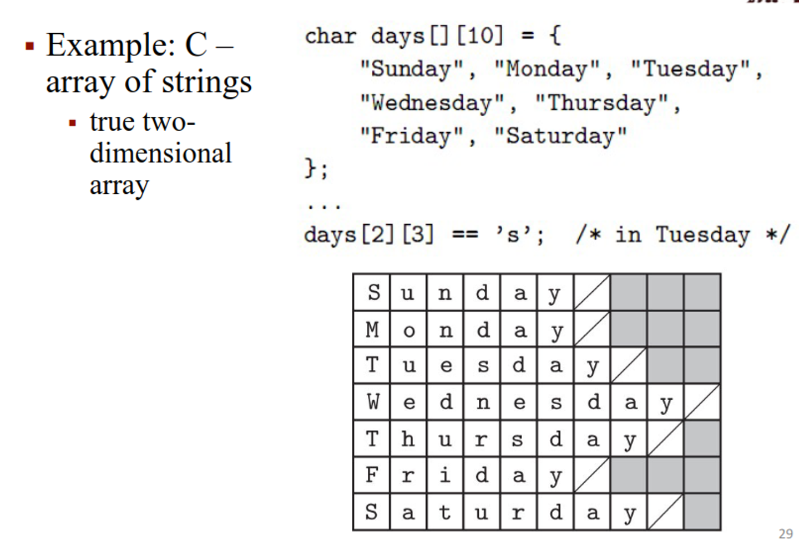

### Types


Having types provides explicit context for operations, whether that be knowing how to add primitives, how much space to allocate or knowing which constructor to use

Many of these types exist, including:

- Boolean (one byte or sometimes one bit)
- Character (one byte for ASCII, two bytes for unicode)
- Numeric (integers, reals, complex, rationals in Scheme)
- Discrete (anything countable)
- Scalar (aka simple type)
- Enum (group of custom elements in order, i.e. days of the week)
- Subrange (range of values)
- Composite (includes arrays, structs, sets, pointers, lists, files, etc.)

With these types comes a bunch of type operations, including

- Type equivalence (two types are the same)
- Type compatibility (a type can be used in a context)
- Type inference (deduce the type)
- Type clash (check for violation of type rules)

Languages are usually strongly typed, meaning they prohibit any operations on objects that don’t support said operation

This is further separated into statically typed (types decided at compile time for good performance) or dynamically typed (decided at run time for ease of programming)

### Equivalence

For checking equivalence, we can either use structural equivalence (checking if the components can be put together the same way, used in C) or name equivalence (use name only, where each definition is a new type; Java anc C# use this)

With structural equivalence, the format shouldn’t matter, and neither does order in most languages

However, this becomes a problem as we approach types that are clearly different but with the same attributes

```
type student = record
    name, address : string
    age : integer
type school = record
    name, address : string
    age : integer
x : student;
y : school;
…
x := y; -- is this an error?
```
- compiler says it’s okay
- programmer most likely says it’s an error


Name equivalence uses distinct definitions to define distinct types, infering that if a programmer took the time to write 2 separate definitions, they must be different

This becomes a problem when we incorporate aliases, like we do in C

```cpp
typedef old_type new_type
```

This begs the question: are these the same as the old type or different? We can divide the distinction into strict name equivalence or loose name equivalence

## Type conversion (cast): explicit conversion

r = (float) n;

## Type coercion: implicit conversion

- very useful
- weakens type security
- dynamically typed languages: very important
- statically typed languages: wide variety
  - C: arrays and pointers intermixed
  - C++: programmer-defined coercion to and from existing types to a new type (class)

Of course, we could always just convert the type, either by explicit conversion (casting) or implicit coercion (the default in dynamically typed languages, handled differently depening on the language in statically typed)

### Compatibility

This is more important than equivalence since it defines what operations we can do on a type

- This also includes argument types

We also need to infer what type is returned from an operation, so an int + int should give a int and float + float should give a float

- What about subranges? These are too complicated and are outside the scope of this course

### Inference

Types can also be inferred from context, like how C# uses var

## Type inference

- Declarations: type inferred from the context

**C#: var**
```
var i = 123;
// equiv. to:
int i = 123;

var map = new Dictionary<string, int>();
// equiv. to:
Dictionary<string, int> map = new Dictionary<string, int>();
```

Likewise, we can use the auto keyword in C++

**C++: auto**
```
auto reduce = [](list<int> L, int f(int, int), int s) {
    for (auto e : L) { s = f(e, s); }
    return s;
};

...

int sum = reduce(my_list, [](int a, int b){ return a + b; }, 0);
int prod = reduce(my_list, [](int a, int b){ return a * b; }, 1);

## The auto keyword allows to omit the type:

int (*reduce) (list<int>, int (*)(int, int), int)
    = [](list<int> L, int f(int, int), int s) {
        for (auto e : L) { s = f(e, s); }
        return s;
    };
```
C++ comes back again with decltype, which matches the type of an existing expression

## C++: decltype

- match the type of an existing expression
- the type of `sum` depends on the types of `A` and `B` under the coercion rules of C++
- both `int` gives `int`
- one is `double` gives `double`

```cpp
template <typename A, typename B>
...
    A a;
    B b;
    decltype(a + b) sum;
```
## Polymorphism

Polymorphism says that our code should be able to work with multiple types, given they have common characteristics

This includes:

- Parametric: takes a type as a parameter (generics in Java)
- Subtype polymorphism: we can give an object a subtype (usually in object-oriented languages)
- We can also have a combination of the two (container classes, List<T>, Stack<T>)

Like everything else we’ve seen, this is either implicit (Scheme) or explicit (C++, Java)

As an example, let’s look at some Ada code, where we include both overloading (we decide which function to use at runtime) and generics (we define a generic type and use that instead)
```
function min(x, y : integer)
    return integer is
begin
    if x < y then return x;
    else return y;
    end if;
end min;

function min(x, y : long_float)
    return long_float is
begin
    if x < y then return x;
    else return y;
    end if;
end min;

generic
    type T is private;
    with function "<"(x, y : T) return Boolean;
function min(x, y : T) return T;

function min(x, y : T) return T is
begin
    if x < y then return x;
    else return y;
    end if;
end min;

function int_min is new min(integer, "<");
function real_min is new min(long_float, "<");
function string_min is new min(string, "<");
function date_min is new min(date, date_precedes);
```

Likewise, in C++, we can use templates to define a parametric type
```
template<class item, int max_items = 100>
class queue {
    item items[max_items];
    int next_free, next_full, num_items;
public:
    queue() : next_free(0), next_full(0), num_items(0) { }
    
    bool enqueue(const item& it) {
        if (num_items == max_items) return false;
        ++num_items;
        items[next_free] = it;
        next_free = (next_free + 1) % max_items;
        return true;
    }

    bool dequeue(item* it) {
        if (num_items == 0) return false;
        --num_items;
        *it = items[next_full];
        next_full = (next_full + 1) % max_items;
        return true;
    }
};

...

queue<process> ready_list;
queue<int, 50> int_queue;
```

## Arrays

Arrays are the most important composite type, sematically being a map of index type → element type

The data inside is homogenous, with the index type usually being a discrete type, but this can be a non-discrete type as well (associative arrays, maps, dicts), but these are usually implemented using hash tables or search trees

Arrays are also dense, with most positions being non-zero

- We could have sparse arrays using linked structures, as we do with sparse matrices (these are actually pretty interesting so look them up on your own time)

We can use these arrays to take slices, like we do with matrices


These can either be allocated by static allocation (array that exists for the program’s life, known at compile time) stack allocation (array with a lifetime inside a subroutine, known at compile time) or heap/stack allocation (dynamically allocated arrays, allocated in the heap if the shape changes during runtime, else allocated on stack)

- When doing dynamically allocated arrays, we have a dope vector, which holds shape info at run time
```
void square(int n, double M[n][n]) {
    double T[n][n];
    for (int i = 0; i < n; i++) { // copy product to T
        for (int j = 0; j < n; j++) {
            double s = 0;
            for (int k = 0; k < n; k++)
                s += M[i][k] * M[k][j];
            T[i][j] = s;
        }
    }
    for (int i = 0; i < n; i++) { // copy T back to M
        for (int j = 0; j < n; j++)
            M[i][j] = T[i][j];
    }
}
```


The memory layout is represented as 2D to emphasize the cache effect, making any algorithm much faster

Most languages use row major order, while Fortran (being the stubborn rebel child that it is) uses column-major order


Arrays also need to be allocated in a certain way, either contiguous (consecutive location in memory and consecutive rows adjacent in memory) or row pointers (consecutive rows anywhere in memory, with some extra memory for pointers)

This should be very familiar if you know C (which you should)



We also need to calculate the address to access these elements, which gets increasing complicated as we scale up our arrays


We can calculate this faster with a few tricks


### Sets

Sets are an unordered collection of an arbitrary number of distinct values, each with a common type

These are usually implemented with charracteristic arrays, with one bit for each value, make for efficient bitwise operations

- This is the reason why we use NFAs for regex matching algorithms; we can do these types of bitwise operations very fast, which is useful for NFAs

For general implementation, we will use hash tables, trees, dictionaries, hashes, maps, etc.

- In Python and Swift, we have built-in sets
```
X = set(['a', 'b', 'c', 'd'])  # set constructor
Y = {'c', 'd', 'e', 'f'}       # set literal
U = X | Y                      # union
I = X & Y                      # intersection
D = X - Y                      # difference
O = X ^ Y                      # symmetric diff.
'c' in I                       # membership
```
### Pointers

Pointers are variables containing a reference to an object in memory, which is needed for a value model of variables, but not a reference model

- Note that these aren’t addresses, rather they are implemented as addresses

We can use these pointers to form recursive data types, with objects containing references to other objects, like in linked lists and trees


The problem with these is that we can have dangling references, where a pointer refers to an object that is deallocated in memory

The solution for this is garbage collection, where memory is automatically reclamed, which is slower than manual and difficult to implement, but is very convenient for programmers and essential for functional languages

- This is also increasingly popular in imperative languages, like Rust and Go

We can implement this with reference counts, where an object is considered not useful when no pointers to it exist, storing a reference count for each object

The problem with this is when we have circular lists, where it’s not referenced outside of itself, but each record has a reference count of 1


- This can be handled by smart pointers in C++

- unique_ptr
  - one object only

- shared_ptr
  - implements a reference count

- weak_ptr
  - does not affect counts; for, e.g., circular structures


We can also do tracing collection, such as in mark-and-sweep, where we

1. Mark the entire heap as useless
2. Mark as useful recursively starting from the outside heap
3. Move useless block from heap to free up

The problem is that step 2 requires a very large stack, which might not be possible

What we can do instead is pointer reversal, where we reverse pointers to go the other way around


We can also use stop-and-copy, where we copy useful data compactly from one half of the heap to the other

- This is…uncommon

### Lists

The list is essential for functional and logic programming, but are used also in imperative languages

These can either be homogenous or heterogenous, like in Scheme and Python

In Scheme, this is represented by ‘(…), with the quote being used to prevent evaluation

We can also use these for list comprehension, adapting from math set notation

For example, in Python, if we want a set of odd squares, we can do the following

```cpp
[i*i for i in range(1,100) if i % 2 == 1]
=>  [1,9,25,49,81,...]
```


